# 李宏毅老师机器学习课程笔记（深度学习）

## 1.机器学习的基本概念

### 1.1 含义：机器学习就是让机器具备找一个函式的能力

### 1.2 机器学习的三大类任务：

- 回归 （Regression）

- 分类 （Classification）

- 结构化 （Structred learning）：指的是输入和输出都是具有结构化的对象（数列、列表、树、边界框等）。

### 1.3 步骤：

- 定义函式（模型）
- 定义损失（函式的参数）：loss可以是负的，由自己定义的损失函数决定。
- 优化迭代（更新函式的参数）：
  - 更新的方向：即梯度的方向
  - 更新的步伐：由梯度的大小和学习率共同决定
  - 可能会出现局部最优和全局最优问题

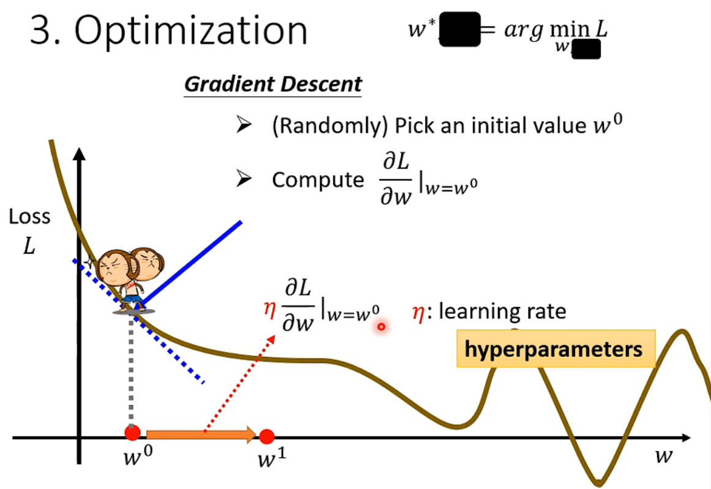

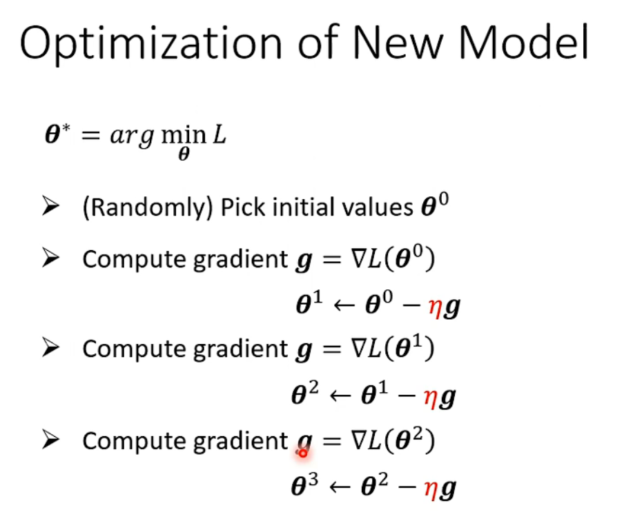

通过所有样本可以算出误差总和，然后求梯度反向传播。

​	平均绝对误差（MAE）： e = |y - y^^^ |

​	平均平方误差（MSE）：e = |y - y^^^ |^2^

### 1.4 如果使用的是线性模型，无法进一步优化，可能是因为线性模型太简单，无法表示复杂的情况。即模型的限制。

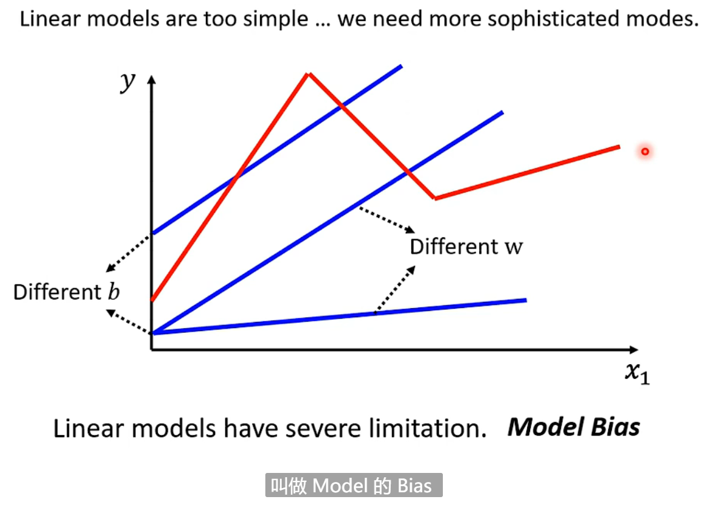

**解决方法：**添加非线性函数（即激活函数，如：sigmoid，relu【较好】）

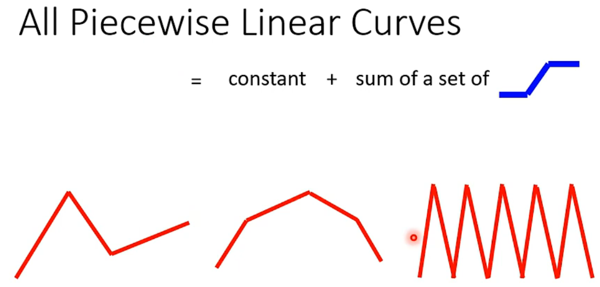

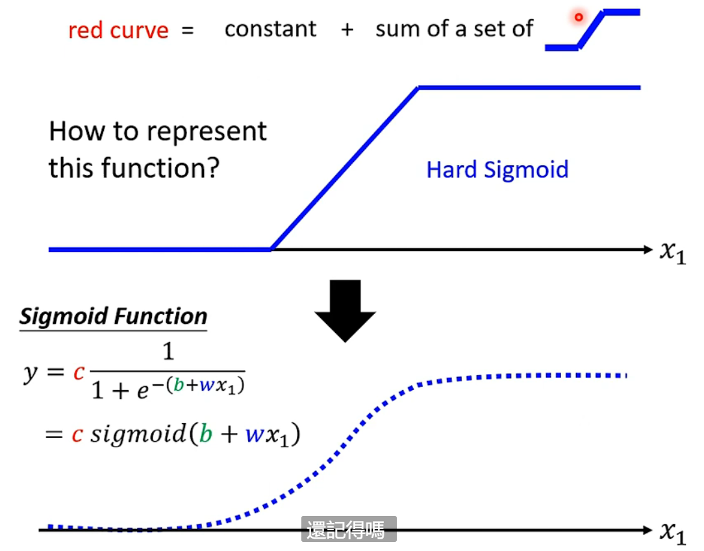

（注： 通过改变W, B可以得到不同的sigmoid函数，所以可以拟合不同的非线性函数）

### 1.5 实际优化迭代是每次选择一个**batch**更新参数

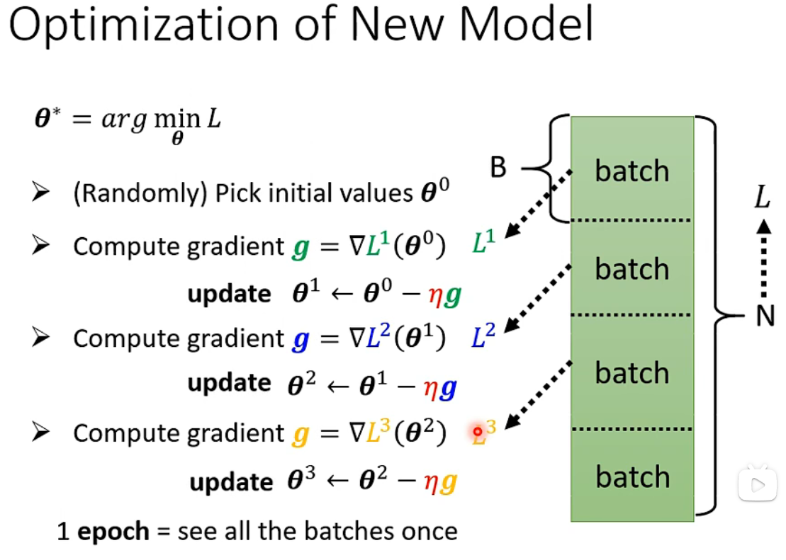

**过拟合（overfitting）：**在训练数据上较好，而在测试数据上较差。

## 2. Pytorch基础

### 2.1 Dataset & Dataloader

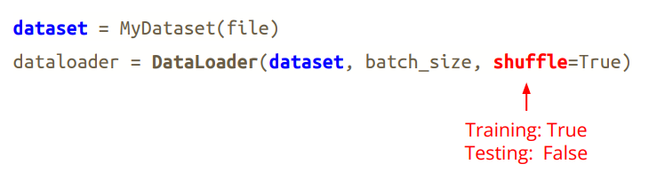

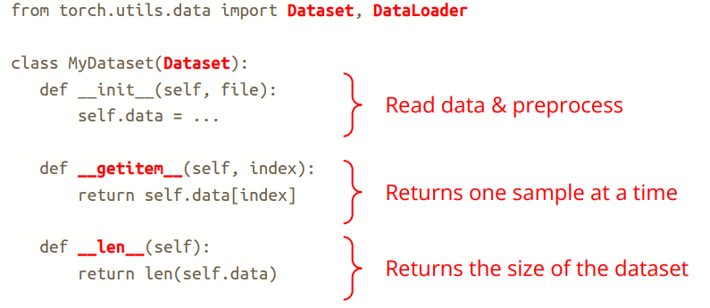

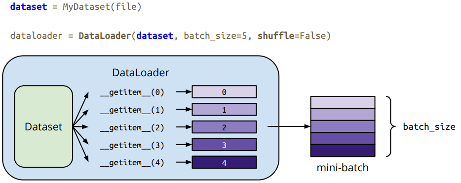

### 2.2 网络模型

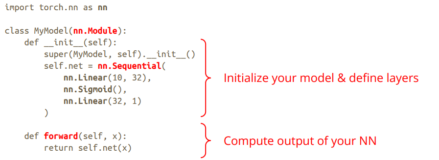

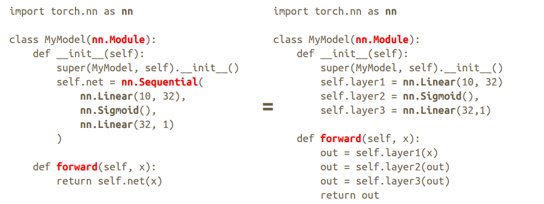

### 2.3 优化器

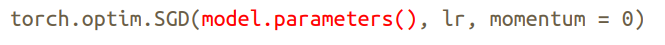

### 2.4 训练设置

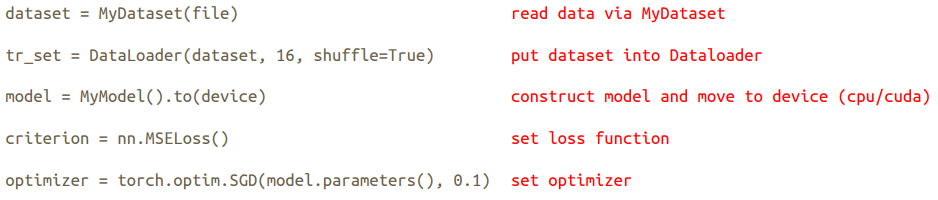

### 2.5 训练迭代

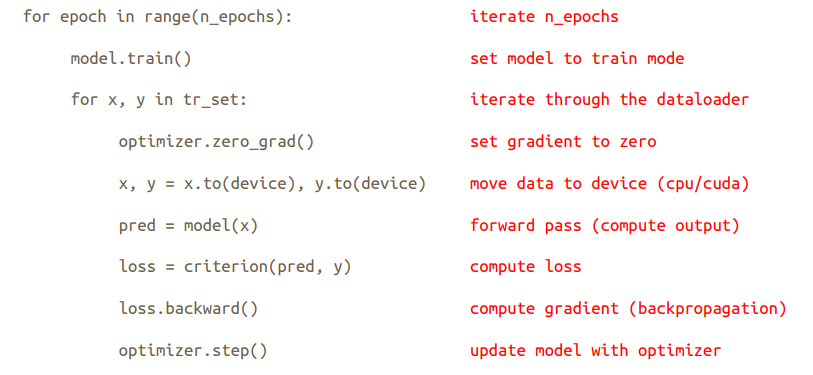

### 2.6 测试迭代

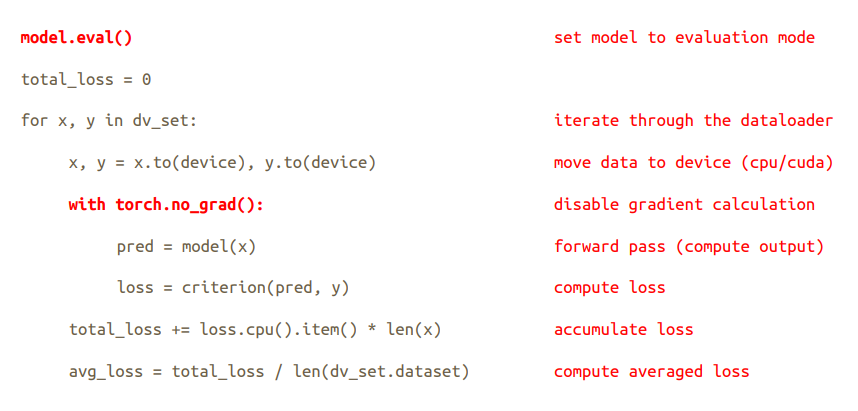

### 2.7 验证环节

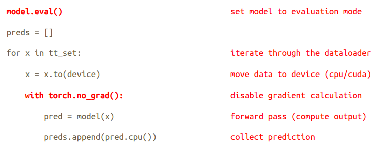

### 2.8 模型保存

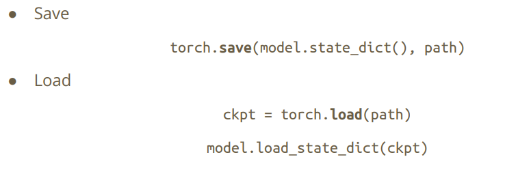

## 3. 作业

[利用DNN预测回归问题——预测COVID-19]([ML2022Spring-hw1 | Kaggle](https://www.kaggle.com/competitions/ml2022spring-hw1/overview))

