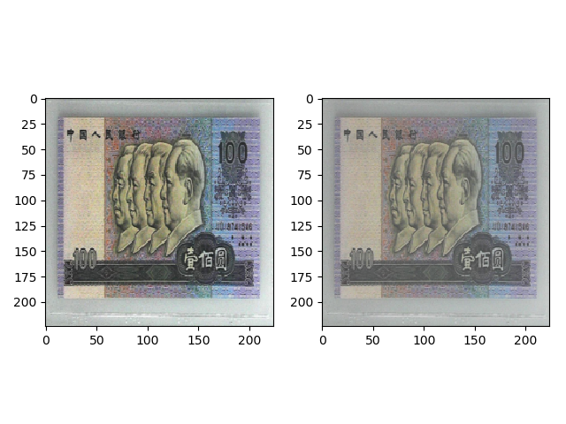
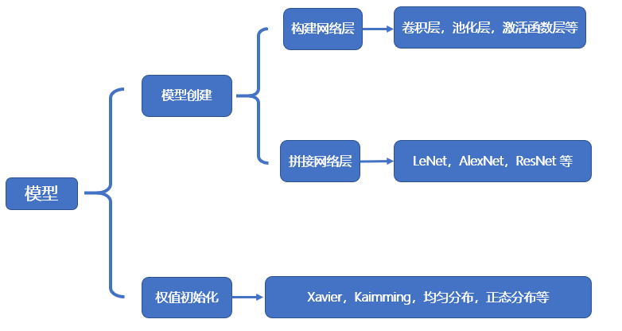
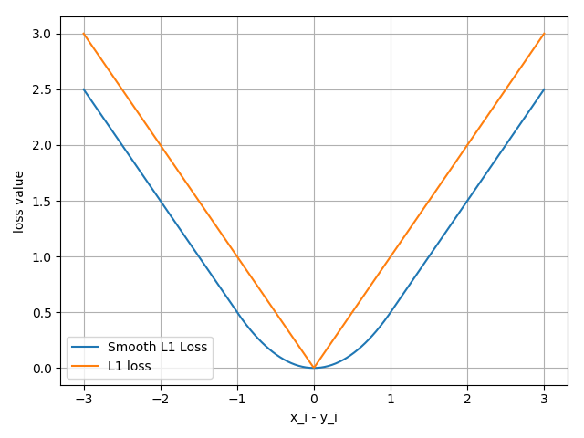
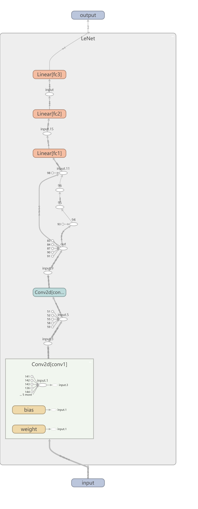
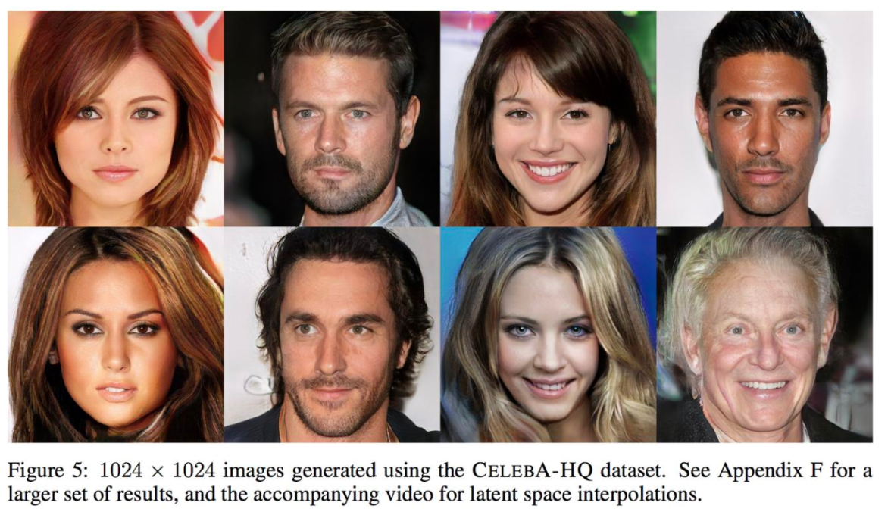
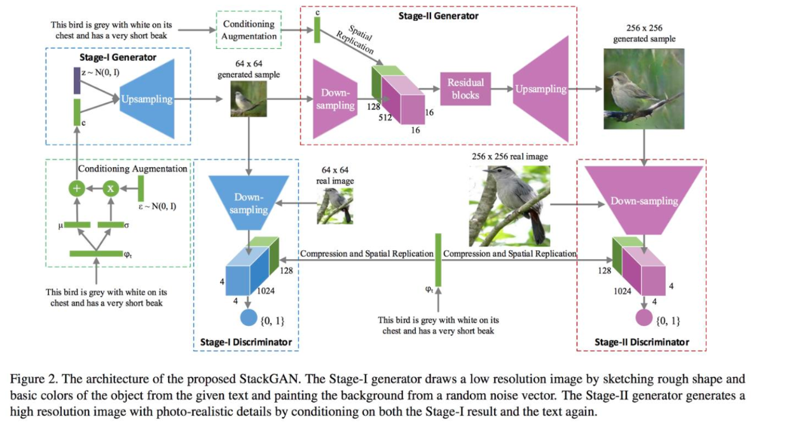
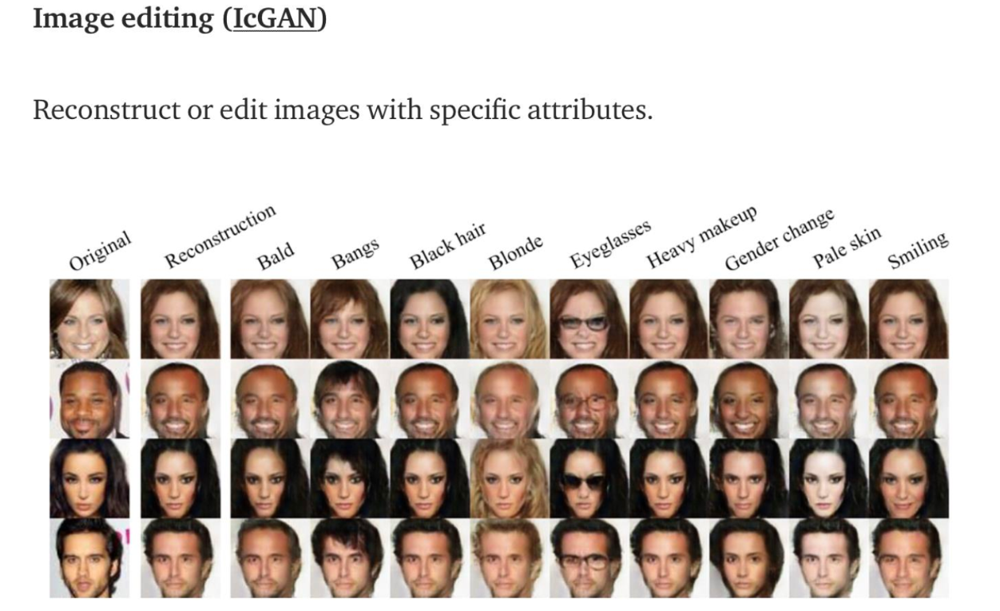

# 深度学习之PyTorch学习笔记

## 1. 基本概念

### 1.1 Tensor（张量）介绍

Tensor 中文为张量。张量的意思是一个多维数组，它是标量、向量、矩阵的高维扩展。

标量可以称为 0 维张量，向量可以称为 1 维张量，矩阵可以称为 2 维张量，RGB 图像可以表示 3 维张量。你可以把张量看作多维数组。


#### **Tensor 与 Variable**

==在 PyTorch 0.4.0 之前==，torch.autograd 包中存在 Variable 这种数据类型，主要是用于封装 Tensor，进行自动求导。Variable 主要包含下面几种属性。

- data: 被包装的 Tensor。
- grad: data 的梯度。
- grad_fn: 创建 Tensor 所使用的 Function，是自动求导的关键，因为根据所记录的函数才能计算出导数。
- requires_grad: 指示是否需要梯度，并不是所有的张量都需要计算梯度。
- is_leaf: 指示是否叶子节点(张量)，叶子节点的概念在计算图中会用到，后面详细介绍。

 

==在 PyTorch 0.4.0 之后==，Variable 并入了 Tensor。在之后版本的 Tensor 中，除了具有上面 Variable 的 5 个属性，还有另外 3 个属性。

- dtype: 张量的数据类型，如 torch.FloatTensor，torch.cuda.FloatTensor。
- shape: 张量的形状。如 (64, 3, 224, 224)
- device: 张量所在设备 (CPU/GPU)，GPU 是加速计算的关键

 

关于 dtype，PyTorch 提供了 **9 种数据类型**，共分为 **3 大类**：float (16-bit, 32-bit, 64-bit)、integer (unsigned-8-bit ,8-bit, 16-bit, 32-bit, 64-bit)、Boolean。模型参数和数据用的最多的类型是 float-32-bit。label 常用的类型是 integer-64-bit。


#### **Tensor 创建的方法**

##### **1. 直接创建 Tensor**

###### **① torch.tensor()**

```
torch.tensor(data, dtype=None, device=None, requires_grad=False, pin_memory=False)
```

- data: 数据，可以是 list，numpy
- dtype: 数据类型，默认与 data 的一致
- device: 所在设备，cuda/cpu
- requires_grad: 是否需要梯度
- pin_memory: 是否存于锁页内存

代码示例：

```python
arr = np.ones((3, 3))
print("ndarray的数据类型：", arr.dtype)
# 创建存放在 GPU 的数据
# t = torch.tensor(arr, device='cuda')
t= torch.tensor(arr)
print(t)
```

输出为：

```python
ndarray的数据类型： float64
tensor([[1., 1., 1.],
        [1., 1., 1.],
        [1., 1., 1.]], dtype=torch.float64)
```

###### **② torch.from_numpy(ndarray)**

从 numpy 创建 tensor。利用这个方法创建的 tensor 和原来的 ndarray **共享内存**，当修改其中一个数据，另外一个也会被改动。

 

代码示例：

```python
arr = np.array([[1, 2, 3], [4, 5, 6]])
t = torch.from_numpy(arr)

# 修改 array，tensor 也会被修改# print("\n修改arr")
# arr[0, 0] = 0# print("numpy array: ", arr)# print("tensor : ", t)
# 修改 tensor，array 也会被修改
print("\n修改tensor")
t[0, 0] = -1
print("numpy array: ", arr)
print("tensor : ", t)
```

输出为：

```python
修改tensor
numpy array:  [[-1  2  3]
 [ 4  5  6]]
tensor :  tensor([[-1,  2,  3],
        [ 4,  5,  6]], dtype=torch.int32)
```


------

**③ torch.empty(size)**

创建一个未初始化的Tensor

```python
import torch

x = torch.empty(5, 3)
print(x)
```


```python
tensor([[1.1348e-22, 7.8753e-43, 1.1348e-22],
        [7.8753e-43, 1.1344e-22, 7.8753e-43],
        [1.1344e-22, 7.8753e-43, 1.1343e-22],
        [7.8753e-43, 1.1343e-22, 7.8753e-43],
        [1.1348e-22, 7.8753e-43, 1.1348e-22]])
```


##### 2**. 根据数值创建 Tensor**

###### **① torch.zeros()**

```python
torch.zeros(*size, out=None, dtype=None, layout=torch.strided, device=None, requires_grad=False)
```

功能：根据 size 创建全 0 张量

- size: 张量的形状
- out: 输出的张量，如果指定了 out，那么`torch.zeros()`返回的张量和 out 指向的是同一个地址
- layout: 内存中布局形式，有 strided，sparse_coo 等。当是稀疏矩阵时，设置为 sparse_coo 可以减少内存占用。
- device: 所在设备，cuda/cpu
- requires_grad: 是否需要梯度

代码示例：

```python
out_t = torch.tensor([1])
# 这里制定了 out
t = torch.zeros((3, 3), out=out_t)
print(t, '\n', out_t)
# id 是取内存地址。最终 t 和 out_t 是同一个内存地址
print(id(t), id(out_t), id(t) == id(out_t))
```

输出是：

```python
tensor([[0, 0, 0],
        [0, 0, 0],
        [0, 0, 0]]) 
 tensor([[0, 0, 0],
        [0, 0, 0],
        [0, 0, 0]])
2984903203072 2984903203072 True
```

###### **② torch.zeros_like**

```python
torch.zeros_like(input, dtype=None, layout=None, device=None, requires_grad=False, memory_format=torch.preserve_format)
```

功能：根据 input 形状创建全 0 张量

- input: 创建与 input 同形状的全 0 张量
- dtype: 数据类型
- layout: 内存中布局形式，有 strided，sparse_coo 等。当是稀疏矩阵时，设置为 sparse_coo 可以减少内存占用。

同理还有全 1 张量的创建方法：`torch.ones()`，`torch.ones_like()`。

###### **③ torch.full()，torch.full_like()**

```python
torch.full(size, fill_value, out=None, dtype=None, layout=torch.strided, device=None, requires_grad=False)
```

功能：创建自定义数值的张量

- size: 张量的形状，如 (3,3)
- fill_value: 张量中每一个元素的值

代码示例：

```python
t = torch.full((3, 3), 1)
print(t)
```

输出为：

```python
tensor([[1., 1., 1.],
        [1., 1., 1.],
        [1., 1., 1.]])
```

###### **④ torch.arange()**

```python
torch.arange(start=0, end, step=1, out=None, dtype=None, layout=torch.strided, device=None, requires_grad=False)
```

功能：创建**等差**的 1 维张量。注意区间为[start, end)。

- start: 数列起始值
- end: 数列结束值，开区间，取不到结束值
- step: 数列公差，默认为 1

代码示例：

```python
t = torch.arange(2, 10, 2)
print(t)
```

输出为：

```python
tensor([2, 4, 6, 8])
```

###### **⑤ torch.linspace()**

```python
torch.linspace(start, end, steps=100, out=None, dtype=None, layout=torch.strided, device=None, requires_grad=False)
```

功能：创建均分的 1 维张量。数值区间为 [start, end]

- start: 数列起始值
- end: 数列结束值
- steps: 数列长度 (元素个数)

代码示例：

```python
# t = torch.linspace(2, 10, 5)
t = torch.linspace(2, 10, 6)
print(t)
```

输出为：

```python
tensor([ 2.0000,  3.6000,  5.2000,  6.8000,  8.4000, 10.0000])
```

###### ⑥ torch.logspace()

```python
torch.logspace(start, end, steps=100, base=10.0, out=None, dtype=None, layout=torch.strided, device=None, requires_grad=False)
```

功能：创建对数均分的 1 维张量。数值区间为 [start, end]，底为 base。

- start: 数列起始值
- end: 数列结束值
- steps: 数列长度 (元素个数)
- base: 对数函数的底，默认为 10

代码示例：

```python
# t = torch.logspace(2, 10, 5)
t = torch.logspace(2, 10, 6)
print(t)
```

输出为：

```python
tensor([ 2.0000,  3.6000,  5.2000,  6.8000,  8.4000, 10.0000])
```

###### ⑦ torch.eye()

```python
torch.eye(n, m=None, out=None, dtype=None, layout=torch.strided, device=None, requires_grad=False)
```

功能：创建单位对角矩阵( 2 维张量)，默认为方阵

- n: 矩阵行数。通常只设置 n，为方阵。
- m: 矩阵列数

##### 3**. 根据现有的 Tensor创建**

此方法会默认重用输入`Tensor`的一些属性，例如数据类型，除非自定义数据类型。

###### ①x.new_ones()

返回的tensor默认具有相同的torch.dtype和torch.device

```python
x = x.new_ones(5, 3, dtype=torch.float64)  # 返回的tensor默认具有相同的torch.dtype和torch.device
print(x)

x = torch.randn_like(x, dtype=torch.float) # 指定新的数据类型
print(x) Copy to clipboardErrorCopied
```

输出：

```python
tensor([[1., 1., 1.],
        [1., 1., 1.],
        [1., 1., 1.],
        [1., 1., 1.],
        [1., 1., 1.]], dtype=torch.float64)
tensor([[ 0.6035,  0.8110, -0.0451],
        [ 0.8797,  1.0482, -0.0445],
        [-0.7229,  2.8663, -0.5655],
        [ 0.1604, -0.0254,  1.0739],
        [ 2.2628, -0.9175, -0.2251]])Copy to clipboardErrorCopied
```

我们可以通过`shape`或者`size()`来获取`Tensor`的形状:

```python
print(x.size())
print(x.shape)Copy to clipboardErrorCopied
```

输出：

```python
torch.Size([5, 3])
torch.Size([5, 3])Copy to clipboardErrorCopied
```

> 注意：返回的torch.Size其实就是一个tuple, 支持所有tuple的操作。

还有很多函数可以创建`Tensor`，去翻翻官方API就知道了，下表给了一些常用的作参考。

| 函数                              | 功能                      |
| --------------------------------- | ------------------------- |
| Tensor(*sizes)                    | 基础构造函数              |
| tensor(data,)                     | 类似np.array的构造函数    |
| ones(*sizes)                      | 全1Tensor                 |
| zeros(*sizes)                     | 全0Tensor                 |
| eye(*sizes)                       | 对角线为1，其他为0        |
| arange(s,e,step)                  | 从s到e，步长为step        |
| linspace(s,e,steps)               | 从s到e，均匀切分成steps份 |
| rand/randn(*sizes)                | 均匀/标准分布             |
| normal(mean,std)/uniform(from,to) | 正态分布/均匀分布         |
| randperm(m)                       | 随机排列                  |

这些创建方法都可以在创建的时候指定数据类型dtype和存放device(cpu/gpu)。

##### 4. 根据概率创建 Tensor

###### ① torch.normal()

```
torch.normal(mean, std, *, generator=None, out=None)
```

功能：生成正态分布 (高斯分布)

- mean: 均值
- std: 标准差

有 4 种模式：

1. mean 为标量，std 为标量。这时需要设置 size。

   代码示例：

   ```python
   # mean：标量 std: 标量
   # 这里需要设置 size
   t_normal = torch.normal(0., 1., size=(4,))
   print(t_normal)
   ```

   输出为：

   ```python
   tensor([0.6614, 0.2669, 0.0617, 0.6213])
   ```

2. mean 为标量，std 为张量

3. mean 为张量，std 为标量

   代码示例：

   ```python
   # mean：张量 std: 标量
   mean = torch.arange(1, 5, dtype=torch.float)
   std = 1
   t_normal = torch.normal(mean, std)
   print("mean:{}\nstd:{}".format(mean, std))
   print(t_normal)
   ```

   输出为：

   ```python
   mean:tensor([1., 2., 3., 4.])
   std:1
   tensor([1.6614, 2.2669, 3.0617, 4.6213])
   ```

   这 4 个数采样分布的均值不同，但是方差都是 1。

4. mean 为张量，std 为张量

   代码示例：

   ```python
   # mean：张量 std: 张量
   mean = torch.arange(1, 5, dtype=torch.float)
   std = torch.arange(1, 5, dtype=torch.float)
   t_normal = torch.normal(mean, std)
   print("mean:{}\nstd:{}".format(mean, std))
   print(t_normal)
   ```

   输出为：

   ```python
   mean:tensor([1., 2., 3., 4.])
   std:tensor([1., 2., 3., 4.])
   tensor([1.6614, 2.5338, 3.1850, 6.4853])
   ```

   其中 1.6614 是从正态分布 $N(1,1)$ 中采样得到的，其他数字以此类推。

###### ② torch.randn() 和 torch.randn_like()

```python
torch.randn(*size, out=None, dtype=None, layout=torch.strided, device=None, requires_grad=False)
```

功能：生成标准正态分布。

- size: 张量的形状

###### ③ torch.rand() 和 torch.rand_like()

```python
torch.rand(*size, out=None, dtype=None, layout=torch.strided, device=None, requires_grad=False)
```

功能：在区间 [0, 1) 上生成均匀分布。

###### ④ torch.randint() 和 torch.randint_like()

```python
randint(low=0, high, size, *, generator=None, out=None,
dtype=None, layout=torch.strided, device=None, requires_grad=False)
```

功能：在区间 [low, high) 上生成整数均匀分布。

- size: 张量的形状

###### ⑤ torch.randperm()

```python
torch.randperm(n, out=None, dtype=torch.int64, layout=torch.strided, device=None, requires_grad=False)
```

功能：生成从 0 到 n-1 的随机排列。常用于生成索引。

- n: 张量的长度

###### ⑥ torch.bernoulli()

```python
torch.bernoulli(input, *, generator=None, out=None)
```

功能：以 input 为概率，生成伯努利分布 (0-1 分布，两点分布)

- input: 概率值

### 1.2 张量操作与线性回归

#### 张量的操作

##### 1. 拼接

###### ① torch.cat()

```python
torch.cat(tensors, dim=0, out=None)
```

功能：将张量按照 dim 维度进行拼接

- tensors: 张量序列
- dim: 要拼接的维度

代码示例：

```python
t = torch.ones((2, 3))
t_0 = torch.cat([t, t], dim=0)
t_1 = torch.cat([t, t], dim=1)
print("t_0:{} shape:{}\nt_1:{} shape:{}".format(t_0, t_0.shape, t_1, t_1.shape))
```

输出是：

```python
t_0:tensor([[1., 1., 1.],
        [1., 1., 1.],
        [1., 1., 1.],
        [1., 1., 1.]]) shape:torch.Size([4, 3])
t_1:tensor([[1., 1., 1., 1., 1., 1.],
        [1., 1., 1., 1., 1., 1.]]) shape:torch.Size([2, 6])
```

###### ② torch.stack()

```python
torch.stack(tensors, dim=0, out=None)
```

功能：将张量在**新创建**（无论有无都新建）的 dim 维度上进行拼接

- tensors: 张量序列
- dim: 要拼接的维度

代码示例：

```python
t = torch.ones((2, 3))
# dim =2
t_stack = torch.stack([t, t, t], dim=2)
print("\nt_stack:{}".format(t_stack))
print("\nt_stack.shape:{}".format(t_stack.shape))
# dim =0
t_stack = torch.stack([t, t, t], dim=0)
print("\nt_stack:{}".format(t_stack))
print("\nt_stack.shape:{}".format(t_stack.shape))
```

输出为：

```python
t_stack:tensor([[[1., 1., 1.],
         [1., 1., 1.],
         [1., 1., 1.]],

        [[1., 1., 1.],
         [1., 1., 1.],
         [1., 1., 1.]]])
t_stack.shape:torch.Size([2, 3, 3])

t_stack:tensor([[[1., 1., 1.],
         [1., 1., 1.]],

        [[1., 1., 1.],
         [1., 1., 1.]],

        [[1., 1., 1.],
         [1., 1., 1.]]])
t_stack.shape:torch.Size([3, 2, 3])
```

第一次指定拼接的维度 dim =2，结果的维度是 [2, 3, 3]。后面指定拼接的维度 dim =0，由于原来的 tensor 已经有了维度 0，因此会把tensor 往后移动一个维度变为 [1,2,3]，再拼接变为 [3,2,3]。

##### 2. 切分

###### ① torch.chunk()

```python
torch.chunk(input, chunks, dim=0)
```

功能：将张量按照维度 dim 进行平均切分。若不能整除，向上取整，则最后一份张量小于其他张量。

- input: 要切分的张量
- chunks: 要切分的份数
- dim: 要切分的维度

代码示例：

```python
a = torch.ones((2, 7))  # 7
list_of_tensors = torch.chunk(a, dim=1, chunks=3)   # 3
for idx, t in enumerate(list_of_tensors):
print("第{}个张量：{}, shape is {}".format(idx+1, t, t.shape))
```

输出为：

```python
第1个张量：tensor([[1., 1., 1.],
        [1., 1., 1.]]), shape is torch.Size([2, 3])
第2个张量：tensor([[1., 1., 1.],
        [1., 1., 1.]]), shape is torch.Size([2, 3])
第3个张量：tensor([[1.],
        [1.]]), shape is torch.Size([2, 1])
```

由于 7 不能整除 3，7/3 再向上取整是 3，因此前两个维度是 [2, 3]，所以最后一个切分的张量维度是 [2,1]。

###### ② torch.split()

```python
torch.split(tensor, split_size_or_sections, dim=0)
```

功能：将张量按照维度 dim 进行平均切分。可以指定每一个分量的切分长度。

- tensor: 要切分的张量
- split_size_or_sections: 为 int 时，表示每一份的长度，如果不能被整除，则最后一份张量小于其他张量；为 list 时，按照 list 元素作为每一个分量的长度切分。如果 list 元素之和不等于切分维度 (dim) 的值，就会报错。
- dim: 要切分的维度

代码示例：

```
t = torch.ones((2, 5))
list_of_tensors = torch.split(t, [2, 1, 2], dim=1)
for idx, t in enumerate(list_of_tensors):
print("第{}个张量：{}, shape is {}".format(idx+1, t, t.shape))
```

结果为：

```
第1个张量：tensor([[1., 1.],
        [1., 1.]]), shape is torch.Size([2, 2])
第2个张量：tensor([[1.],
        [1.]]), shape is torch.Size([2, 1])
第3个张量：tensor([[1., 1.],
        [1., 1.]]), shape is torch.Size([2, 2])
```

##### 3. 索引

我们还可以使用类似NumPy的索引操作来访问`Tensor`的一部分，需要注意的是：**索引出来的结果与原数据共享内存，也即修改一个，另一个会跟着修改。**

```python
y = x[0, :]
y += 1
print(y)
print(x[0, :]) # 源tensor也被改了Copy to clipboardErrorCopied
```

输出：

```
tensor([1.6035, 1.8110, 0.9549])
tensor([1.6035, 1.8110, 0.9549])
```

###### ① torch.index_select()

```python
torch.index_select(input, dim, index, out=None)
```

功能：在维度 dim 上，按照 index 索引取出数据拼接为张量返回。

- input: 要索引的张量
- dim: 要索引的维度
- index: 要索引数据的序号

代码示例：

```python
# 创建均匀分布
t = torch.randint(0, 9, size=(3, 3))
# 注意 idx 的 dtype 不能指定为 torch.float
idx = torch.tensor([0, 2], dtype=torch.long)
# 取出第 0 行和第 2 行
t_select = torch.index_select(t, dim=0, index=idx)
print("t:\n{}\nt_select:\n{}".format(t, t_select))
```

输出为：

```python
t:
tensor([[4, 5, 0],
        [5, 7, 1],
        [2, 5, 8]])
t_select:
tensor([[4, 5, 0],
        [2, 5, 8]])
```

###### ② torch.mask_select()

```python
torch.masked_select(input, mask, out=None)
```

功能：按照 mask 中的 True 进行索引拼接得到一维张量返回。

- 要索引的张量
- mask: 与 input 同形状的布尔类型张量

代码示例：

```python
t = torch.randint(0, 9, size=(3, 3))
mask = t.le(5)  # ge is mean greater than or equal/   gt: greater than  le  lt
# 取出大于 5 的数
t_select = torch.masked_select(t, mask)
print("t:\n{}\nmask:\n{}\nt_select:\n{} ".format(t, mask, t_select))
```

结果为：

```python
t:
tensor([[4, 5, 0],
        [5, 7, 1],
        [2, 5, 8]])
mask:
tensor([[ True,  True,  True],
        [ True, False,  True],
        [ True,  True, False]])
t_select:
tensor([4, 5, 0, 5, 1, 2, 5])
```

最后返回的是一维张量。

##### 4. 变换

###### ① torch.reshape()

```python
torch.reshape(input, shape)
```

功能：变换张量的形状。当张量在内存中是连续时，返回的张量和原来的张量共享数据内存，改变一个变量时，另一个变量也会被改变。

- input: 要变换的张量
- shape: 新张量的形状

代码示例：

```python
# 生成 0 到 8 的随机排列
t = torch.randperm(8)
# -1 表示这个维度是根据其他维度计算得出的
t_reshape = torch.reshape(t, (-1, 2, 2))
print("t:{}\nt_reshape:\n{}".format(t, t_reshape))
```

结果为：

```python
t:tensor([5, 4, 2, 6, 7, 3, 1, 0])
t_reshape:
tensor([[[5, 4],         
         [2, 6]],
        
         [[7, 3],         
         [1, 0]]])
```

在上面代码的基础上，修改原来的张量的一个元素，新张量也会被改变。

代码示例：

```python
# 修改张量 t 的第 0 个元素，张量 t_reshape 也会被改变
t[0] = 1024
print("t:{}\nt_reshape:\n{}".format(t, t_reshape))
print("t.data 内存地址:{}".format(id(t.data)))
print("t_reshape.data 内存地址:{}".format(id(t_reshape.data)))
```

结果为：

```python
t:tensor([1024,    4,    2,    6,    7,    3,    1,    0])
t_reshape:
tensor([[[1024,    4],         
		 [   2,    6]],
        
        [[   7,    3],         
         [   1,    0]]])
t.data 内存地址:2636803119936
t_reshape.data 内存地址:2636803119792
```

###### ② torch.transpose()

```python
torch.transpose(input, dim0, dim1)
```

功能：交换张量的两个维度。常用于图像的变换，比如把`c*h*w`变换为`h*w*c`。

- input: 要交换的变量
- dim0: 要交换的第一个维度
- dim1: 要交换的第二个维度

代码示例：

```python
#把 c * h * w 变换为 h * w * c
t = torch.rand((2, 3, 4))
t_transpose = torch.transpose(t, dim0=1, dim1=2)    # c*h*w     h*w*c
print("t shape:{}\nt_transpose shape: {}".format(t.shape, t_transpose.shape))
```

结果为：

```python
t shape:torch.Size([2, 3, 4])
t_transpose shape: torch.Size([2, 4, 3])
```

###### ③ torch.t()

功能：2 维张量**转置**，对于 2 维矩阵而言，等价于`torch.transpose(input, 0, 1)`。

###### ④ torch.squeeze()

```python
torch.squeeze(input, dim=None, out=None)
```

功能：压缩长度为 1 的维度。

- dim: 若为 None，则移除所有长度为 1 的维度；若指定维度，则当且仅当该维度长度为 1 时可以移除。

代码示例：

```python
# 维度 0 和 3 的长度是 1
t = torch.rand((1, 2, 3, 1))
# 可以移除维度 0 和 3
t_sq = torch.squeeze(t)
# 可以移除维度 0
t_0 = torch.squeeze(t, dim=0)
# 不能移除 1
t_1 = torch.squeeze(t, dim=1)
print("t.shape: {}".format(t.shape))
print("t_sq.shape: {}".format(t_sq.shape))
print("t_0.shape: {}".format(t_0.shape))
print("t_1.shape: {}".format(t_1.shape))
```

结果为：

```python
t.shape: torch.Size([1, 2, 3, 1])
t_sq.shape: torch.Size([2, 3])
t_0.shape: torch.Size([2, 3, 1])
t_1.shape: torch.Size([1, 2, 3, 1])
```

###### ⑤ torch.unsqueeze()

```python
torch.unsqueeze(input, dim)
```

功能：根据 dim 扩展维度，长度为 1。

###### ⑥ torch.view()

用`view()`来改变`Tensor`的形状：

```python
y = x.view(15)
z = x.view(-1, 5)  # -1所指的维度可以根据其他维度的值推出来
print(x.size(), y.size(), z.size())Copy to clipboardErrorCopied
```

输出：

```
torch.Size([5, 3]) torch.Size([15]) torch.Size([3, 5])Copy to clipboardErrorCopied
```

**注意`view()`返回的新`Tensor`与源`Tensor`虽然可能有不同的`size`，但是是共享`data`的，也即更改其中的一个，另外一个也会跟着改变。(顾名思义，view仅仅是改变了对这个张量的观察角度，内部数据并未改变)**

推荐先用`clone`创造一个副本然后再使用`view`。[参考此处](https://stackoverflow.com/questions/49643225/whats-the-difference-between-reshape-and-view-in-pytorch)

```python
x_cp = x.clone().view(15)
x -= 1
print(x)
print(x_cp)
```

使用`clone`还有一个好处是会被记录在计算图中，即==梯度回传到副本时也会传到源`Tensor`。==

###### ⑦ torch.item()

它可以将一个标量`Tensor`转换成一个Python number：

```python
x = torch.randn(1)
print(x)
print(x.item())
```

输出：

```
tensor([2.3466])
2.3466382026672363
```

[线性代数](http://tangshusen.me/Dive-into-DL-PyTorch/#/chapter02_prerequisite/2.2_tensor?id=线性代数)

另外，PyTorch还支持一些线性函数，这里提一下，免得用起来的时候自己造轮子，具体用法参考官方文档。如下表所示：

| 函数                              | 功能                              |
| --------------------------------- | --------------------------------- |
| trace                             | 对角线元素之和(矩阵的迹)          |
| diag                              | 对角线元素                        |
| triu/tril                         | 矩阵的上三角/下三角，可指定偏移量 |
| mm/bmm                            | 矩阵乘法，batch的矩阵乘法         |
| addmm/addbmm/addmv/addr/baddbmm.. | 矩阵运算                          |
| t                                 | 转置                              |
| dot/cross                         | 内积/外积                         |
| inverse                           | 求逆矩阵                          |
| svd                               | 奇异值分解                        |

PyTorch中的`Tensor`支持超过一百种操作，包括转置、索引、切片、数学运算、线性代数、随机数等等，可参考[官方文档](https://pytorch.org/docs/stable/tensors.html)。

##### 5. 张量的数学运算

主要分为 3 类：加减乘除，对数，指数，幂函数 和三角函数。

这里介绍一下常用的几种方法。

###### ① torch.add()

```python
torch.add(input, other, out=None)
torch.add(input, other, *, alpha=1, out=None)
```

功能：逐元素计算 input + alpha * other。因为在深度学习中经常用到先乘后加的操作。

- input: 第一个张量
- alpha: 乘项因子
- other: 第二个张量

###### ② torch.addcdiv()

```python
torch.addcdiv(input, tensor1, tensor2, *, value=1, out=None)
```

计算公式为：out $*{i}=\operatorname{input}*{i}+$ value $\times \frac{\text { tensor } 1*{i}}{\text { tensor } 2*{i}}$

###### ③ torch.addcmul()

```python
torch.addcmul(input, tensor1, tensor2, *, value=1, out=None)
```

计算公式为：out $*{i}=$ input $*{i}+$ value $\times$ tensor $1*{i} \times$ tensor $2*{i}$

##### 6 `Tensor`和NumPy相互转换

我们很容易用`numpy()`和`from_numpy()`将`Tensor`和NumPy中的数组相互转换。但是需要注意的一点是： **这两个函数所产生的的`Tensor`和NumPy中的数组共享相同的内存（所以他们之间的转换很快），改变其中一个时另一个也会改变！！！**

> 还有一个常用的将NumPy中的array转换成`Tensor`的方法就是`torch.tensor()`, 需要注意的是，此方法总是会进行数据拷贝（就会消耗更多的时间和空间），所以返回的`Tensor`和原来的数据不再共享内存。

###### `Tensor`转NumPy

使用`numpy()`将`Tensor`转换成NumPy数组:

```python
a = torch.ones(5)
b = a.numpy()
print(a, b)

a += 1
print(a, b)
b += 1
print(a, b)Copy to clipboardErrorCopied
```

输出：

```
tensor([1., 1., 1., 1., 1.]) [1. 1. 1. 1. 1.]
tensor([2., 2., 2., 2., 2.]) [2. 2. 2. 2. 2.]
tensor([3., 3., 3., 3., 3.]) [3. 3. 3. 3. 3.]Copy to clipboardErrorCopied
```

###### NumPy数组转`Tensor`

使用`from_numpy()`将NumPy数组转换成`Tensor`:

```python
import numpy as np
a = np.ones(5)
b = torch.from_numpy(a)
print(a, b)

a += 1
print(a, b)
b += 1
print(a, b)Copy to clipboardErrorCopied
```

输出：

```
[1. 1. 1. 1. 1.] tensor([1., 1., 1., 1., 1.], dtype=torch.float64)
[2. 2. 2. 2. 2.] tensor([2., 2., 2., 2., 2.], dtype=torch.float64)
[3. 3. 3. 3. 3.] tensor([3., 3., 3., 3., 3.], dtype=torch.float64)Copy to clipboardErrorCopied
```

所有在CPU上的`Tensor`（除了`CharTensor`）都支持与NumPy数组相互转换。

此外上面提到还有一个常用的方法就是直接用`torch.tensor()`将NumPy数组转换成`Tensor`，需要注意的是该方法总是会进行数据拷贝，返回的`Tensor`和原来的数据不再共享内存。

```python
c = torch.tensor(a)
a += 1
print(a, c)Copy to clipboardErrorCopied
```

输出

```
[4. 4. 4. 4. 4.] tensor([3., 3., 3., 3., 3.], dtype=torch.float64)
```

##### 线性回归

线性回归是分析一个变量 ($y$) 与另外一 (多) 个变量 ($x$) 之间的关系的方法。一般可以写成 $y=wx+b$。线性回归的目的就是求解参数$w, b$。

线性回归的求解可以分为 3 步：

1. 确定模型：$y=wx+b$
2. 选择损失函数，一般使用均方误差 MSE：$\frac{1}{m} \sum*{i=1}^{m}\left(y*{i}-\hat{y}*{i}\right)^{2}$。其中 $ \hat{y}*{i} $ 是预测值，$y$ 是真实值。
3. 使用梯度下降法求解梯度 (其中 $lr$ 是学习率)，并更新参数：
   - $w = w - lr * w.grad$
   - $b = b - lr * b.grad$

代码如下：

```python
import torch
import matplotlib.pyplot as plt
# 随机种子 设置随机种子后，是每次运行程序的输出结果都一样，而不是每次随机函数生成的结果一样：
torch.manual_seed(10)

lr = 0.05  # 学习率

# 创建训练数据
x = torch.rand(20, 1) * 10  # x data (tensor), shape=(20, 1) 数值位于[0, 10)
# torch.randn(20, 1) 用于添加噪声
y = 2*x + (5 + torch.randn(20, 1))  # y data (tensor), shape=(20, 1)

# 构建线性回归参数
w = torch.randn((1), requires_grad=True) # 设置梯度求解为 true
b = torch.zeros((1), requires_grad=True) # 设置梯度求解为 true

# 迭代训练 1000 次
for iteration in range(1000):
    
    # 前向传播，计算预测值    
    wx = torch.mul(w, x)    
    y_pred = torch.add(wx, b)
    
    # 计算 MSE loss    
    loss = (0.5 * (y - y_pred) ** 2).mean()
    
    # 反向传播    
    loss.backward()
    
    # 更新参数    
    b.data.sub_(lr * b.grad)    
    w.data.sub_(lr * w.grad)
    
    # 每次更新参数之后，都要清零张量的梯度    
    w.grad.zero_()    
    b.grad.zero_()
    
    # 绘图，每隔 20 次重新绘制直线    
    if iteration % 20 == 0:
        
        plt.scatter(x.data.numpy(), y.data.numpy())        
        plt.plot(x.data.numpy(), y_pred.data.numpy(), 'r-', lw=5)        
        plt.text(2, 20, 'Loss=%.4f' % loss.data.numpy(), fontdict={'size': 20, 'color':  'red'})        
        plt.xlim(1.5, 10)        
        plt.ylim(8, 28)        
        plt.title("Iteration: {}\nw: {} b: {}".format(iteration, w.data.numpy(), b.data.numpy()))        
        plt.pause(0.5)
        
        # 如果 MSE 小于 1，则停止训练        
        if loss.data.numpy() < 1:            
            break
```

训练的直线的可视化如下：

 

在 80 次的时候，Loss 已经小于 1 了，因此停止了训练。

### 1.3 计算图与动态图机制

#### 计算图

深度学习就是对张量进行一系列的操作，随着操作种类和数量的增多，会出现各种值得思考的问题。比如多个操作之间是否可以并行，如何协同底层的不同设备，如何避免冗余的操作，以实现最高效的计算效率，同时避免一些 bug。因此产生了计算图 (Computational Graph)。

**计算图是用来描述运算的有向无环图**，有两个主要元素：节点 (Node) 和边 (Edge)。节点表示数据，如向量、矩阵、张量。边表示运算，如加减乘除卷积等。

用计算图表示：$y=(x+w)*(w+1)$，如下所示：

 

可以看作， $y=a \times b$ ，其中 $a=x+w$，$b=w+1$。

#### 计算图与梯度求导

这里求 $y$ 对 $w$ 的导数。根复合函数的求导法则，可以得到如下过程。

$\begin{aligned} \frac{\partial y}{\partial w} &=\frac{\partial y}{\partial a} \frac{\partial a}{\partial w}+\frac{\partial y}{\partial b} \frac{\partial b}{\partial w} \ &=b  *1+a*  1 \ &=b+a \ &=(w+1)+(x+w) \ &=2  *w+x+1 \ &=2*  1+2+1=5\end{aligned}$

体现到计算图中，就是根节点 $y$ 到叶子节点 $w$ 有两条路径 `y -> a -> w`和`y ->b -> w`。根节点依次对每条路径的孩子节点求导，一直到叶子节点`w`，最后把每条路径的导数相加即可。

 

代码如下：

```python
import torch
w = torch.tensor([1.], requires_grad=True)
x = torch.tensor([2.], requires_grad=True)

# y=(x+w)*(w+1)
a = torch.add(w, x)     # retain_grad()
b = torch.add(w, 1)
y = torch.mul(a, b)

# y 求导
y.backward()

# 打印 w 的梯度，就是 y 对 w 的导数
print(w.grad)
```

结果为`tensor([5.])`。

我们回顾前面说过的 Tensor 中有一个属性`is_leaf`标记是否为叶子节点。

 

在上面的例子中，$x$ 和 $w$ 是叶子节点，其他所有节点都依赖于叶子节点。叶子节点的概念主要是为了节省内存，==在计算图中的一轮反向传播结束之后，非叶子节点的梯度是会被释放的。==

代码示例：

```python
# 查看叶子结点
print("is_leaf:\n", w.is_leaf, x.is_leaf, a.is_leaf, b.is_leaf, y.is_leaf)
# 查看梯度
print("gradient:\n", w.grad, x.grad, a.grad, b.grad, y.grad)
```

结果为：

```python
is_leaf:
 True True False False False
gradient:
 tensor([5.]) tensor([2.]) None None None
```

非叶子节点的梯度为空，如果在反向传播结束之后仍然需要保留非叶子节点的梯度，可以对节点使用`retain_grad()`方法。

而 Tensor 中的 **grad_fn 属性记录的是创建该张量时所用的方法** (函数)。而在反向传播求导梯度时需要用到该属性。

示例代码：

```python
# 查看梯度
print("w.grad_fn = ", w.grad_fn)
print("x.grad_fn = ", x.grad_fn)
print("a.grad_fn = ", a.grad_fn)
print("b.grad_fn = ", b.grad_fn)
print("y.grad_fn = ", y.grad_fn)
```

结果为

```python
w.grad_fn =  None
x.grad_fn =  None
a.grad_fn =  <AddBackward0 object at 0x000001D8DDD20588>
b.grad_fn =  <AddBackward0 object at 0x000001D8DDD20588>
y.grad_fn =  <MulBackward0 object at 0x000001D8DDD20588>
```

#### PyTorch 的动态图机制

PyTorch 采用的是**动态图**机制 (Dynamic Computational Graph)，而 Tensorflow 采用的是**静态图**机制 (Static Computational Graph)。

动态图是运算和搭建同时进行，也就是可以先计算前面的节点的值，再根据这些值搭建后面的计算图。优点是灵活，易调节，易调试。PyTorch 里的很多写法跟其他 Python 库的代码的使用方法是完全一致的，没有任何额外的学习成本。

静态图是先搭建图，然后再输入数据进行运算。优点是高效，因为静态计算是通过先定义后运行的方式，之后再次运行的时候就不再需要重新构建计算图，所以速度会比动态图更快。但是不灵活。TensorFlow 每次运行的时候图都是一样的，是不能够改变的，所以不能直接使用 Python 的 while 循环语句，需要使用辅助函数 tf.while_loop 写成 TensorFlow 内部的形式。

### 1.4 autograd 与逻辑回归

#### **自动求导 (autograd)**

在深度学习中，权值的更新是依赖于梯度的计算，因此梯度的计算是至关重要的。在 PyTorch 中，**只需要搭建好前向计算图，然后利用`torch.autograd`自动求导得到所有张量的梯度**。

##### **1. torch.autograd.backward()**

```python
torch.autograd.backward(tensors, grad_tensors=None, retain_graph=None, create_graph=False, grad_variables=None)
```

功能：自动求取梯度

- tensors: 用于求导的张量，如 loss。
- retain_graph: 保存计算图。PyTorch 采用动态图机制，默认每次反向传播之后都会释放计算图。这里设置为 True 可以不释放计算图。
- create_graph: 创建导数计算图，用于高阶求导。
- grad_tensors: 多梯度权重。当有多个 loss 混合需要计算梯度时，设置每个 loss 的权重。

###### **① retain_graph 参数**

代码示例

```python
w = torch.tensor([1.], requires_grad=True)
x = torch.tensor([2.], requires_grad=True)
# y=(x+w)*(w+1)
a = torch.add(w, x)
b = torch.add(w, 1)
y = torch.mul(a, b)

# 第一次执行梯度求导
y.backward()
print(w.grad)

# 第二次执行梯度求导，出错
y.backward()
```

其中`y.backward()`方法调用的是`torch.autograd.backward(self, gradient, retain_graph, create_graph)`。但是在第二次执行`y.backward()`时会出错。因为 PyTorch 默认是每次求取梯度之后不保存计算图的，因此第二次求导梯度时，计算图已经不存在了。在第一次求梯度时使用`y.backward(retain_graph=True)`即可。如下代码所示：

```python
    w = torch.tensor([1.], requires_grad=True)
    x = torch.tensor([2.], requires_grad=True)
    # y=(x+w)*(w+1)
    a = torch.add(w, x)
    b = torch.add(w, 1)
    y = torch.mul(a, b)

    # 第一次求导，设置 retain_graph=True，保留计算图
    y.backward(retain_graph=True)
    print(w.grad)
    
    # 第二次求导成功
    y.backward()
```

###### **② grad_tensors 参数**

代码示例：

```python
w = torch.tensor([1.], requires_grad=True)
x = torch.tensor([2.], requires_grad=True)

a = torch.add(w, x)
b = torch.add(w, 1)

y0 = torch.mul(a, b)    # y0 = (x+w) * (w+1)
y1 = torch.add(a, b)    # y1 = (x+w) + (w+1)    dy1/dw = 2

# 把两个 loss 拼接都到一起
loss = torch.cat([y0, y1], dim=0)       # [y0, y1]
# 设置两个 loss 的权重: y0 的权重是 1，y1 的权重是 2
grad_tensors = torch.tensor([1., 2.])

loss.backward(gradient=grad_tensors)    # gradient 传入 torch.autograd.backward()中的grad_tensors
# 最终的 w 的导数由两部分组成。∂y0/∂w * 1 + ∂y1/∂w * 2
print(w.grad)
```

结果为：

```python
tensor([9.])
```

该 loss 由两部分组成：$y*{0}$ 和 $y*{1}$。其中 $\frac{\partial y*{0}}{\partial w}=5$，$\frac{\partial y*{1}}{\partial w}=2$。而 grad_tensors 设置两个 loss 对 w 的权重分别为 1 和 2。因此最终 w 的梯度为：$\frac{\partial y*{0}}{\partial w} \times 1+ \frac{\partial y_{1}}{\partial w} \times 2=9$。

##### **2. torch.autograd.grad()**

```python
torch.autograd.grad(outputs, inputs, grad_outputs=None, retain_graph=None, create_graph=False, only_inputs=True, allow_unused=False)
```

功能：求取梯度。

- outputs: 用于求导的张量，如 loss
- inputs: 需要梯度的张量
- create_graph: 创建导数计算图，用于高阶求导
- retain_graph:保存计算图
- grad_outputs: 多梯度权重计算

`torch.autograd.grad()`的返回结果是一个 tunple，需要取出第 0 个元素才是真正的梯度。

下面使用`torch.autograd.grad()`求二阶导，在求一阶导时，需要设置 create_graph=True，让一阶导数 grad_1 也拥有计算图，然后再使用一阶导求取二阶导：

```python
x = torch.tensor([3.], requires_grad=True)
y = torch.pow(x, 2)     # y = x**2
# 如果需要求 2 阶导，需要设置 create_graph=True，让一阶导数 grad_1 也拥有计算图
grad_1 = torch.autograd.grad(y, x, create_graph=True)   # grad_1 = dy/dx = 2x = 2 * 3 = 6
print(grad_1)
# 这里求 2 阶导
grad_2 = torch.autograd.grad(grad_1[0], x)              # grad_2 = d(dy/dx)/dx = d(2x)/dx = 2
print(grad_2)
```

输出为：

```python
(tensor([6.], grad_fn=<MulBackward0>),)
(tensor([2.]),)
```

需要注意的 3 个点：

- 在每次反向传播求导时，计算的梯度不会自动清零。如果进行多次迭代计算梯度而没有清零，那么梯度会在前一次的基础上叠加。

  代码示例：

```python
w = torch.tensor([1.], requires_grad=True)
x = torch.tensor([2.], requires_grad=True)
# 进行 4 次反向传播求导，每次最后都没有清零
for i in range(4):
    a = torch.add(w, x)
    b = torch.add(w, 1)
    y = torch.mul(a, b)
    y.backward()
    print(w.grad)
```

结构如下：

```python
tensor([5.])
tensor([10.])
tensor([15.])
tensor([20.])
```

每一次的梯度都比上一次的梯度多 5，这是由于梯度不会自动清零。使用`w.grad.zero_()`将梯度清零。

```python
for i in range(4):
    a = torch.add(w, x)
    b = torch.add(w, 1)
    y = torch.mul(a, b)
    y.backward()
    print(w.grad)
    # 每次都把梯度清零
    # w.grad.zero_()
```

- 依赖于叶子节点的节点，requires_grad 属性默认为 True。
- ==叶子节点不可执行 inplace 操作。==

以加法来说，inplace 操作有`a += x`，`a.add_(x)`，改变后的值和原来的值内存地址是同一个。非inplace 操作有`a = a + x`，`a.add(x)`，改变后的值和原来的值内存地址不是同一个。

代码示例：

```python
print("非 inplace 操作")
a = torch.ones((1, ))
print(id(a), a)
# 非 inplace 操作，内存地址不一样
a = a + torch.ones((1, ))
print(id(a), a)

print("inplace 操作")
a = torch.ones((1, ))
print(id(a), a)
# inplace 操作，内存地址一样
a += torch.ones((1, ))
print(id(a), a)
```

结果为：

```python
非 inplace 操作
2404827089512 tensor([1.])
2404893170712 tensor([2.])
inplace 操作
2404827089512 tensor([1.])
2404827089512 tensor([2.])
```

==如果在反向传播之前 inplace 改变了叶子 的值，再执行 backward() 会报错==

```python
w = torch.tensor([1.], requires_grad=True)
x = torch.tensor([2.], requires_grad=True)
# y = (x + w) * (w + 1)
a = torch.add(w, x)
b = torch.add(w, 1)
y = torch.mul(a, b)
# 在反向传播之前 inplace 改变了 w 的值，再执行 backward() 会报错
w.add_(1)
y.backward()
```

这是因为在进行前向传播时，计算图中依赖于叶子节点的那些节点，会记录叶子节点的地址，在反向传播时就会利用叶子节点的地址所记录的值来计算梯度。比如在 $y=a \times b$ ，其中 $a=x+w$，$b=w+1$，$x$ 和 $w$ 是叶子节点。当求导 $\frac{\partial y}{\partial a} = b = w+1$，需要用到叶子节点 $w$。

#### **逻辑回归 (Logistic Regression)**

逻辑回归是线性的二分类模型。模型表达式 $y=f(z)=\frac{1}{1+e^{-z}}$，其中 $z=WX+b$。$f(z)$ 称为 sigmoid 函数，也被称为 Logistic 函数。函数曲线如下：(横坐标是 $z$，而 $z=WX+b$，纵坐标是 $y$)

 

分类原则如下：
$$
class=\left\{
		\begin{array}{ll}
		0, & 0.5>y\\ 
		1, & 0.5 \leq y\\
		\end{array}
		\right.
$$
当 $y<0.5$ 时，类别为 0；当 $0.5 \leq y$ 时，类别为 1。

其中 $z=WX+b$ 就是原来的线性回归的模型。从横坐标来看，当 $z<0$ 时，类别为 0；当 $0 \leq z$ 时，类别为 1，直接使用线性回归也可以进行分类。逻辑回归是在线性回归的基础上加入了一个 sigmoid 函数，这是为了更好地描述置信度，把输入映射到 (0,1) 区间中，符合概率取值。

逻辑回归也被称为对数几率回归 $\ln \frac{y}{1-y}=W X+b$，几率的表达式为：$\frac{y}{1-y}$，$y$ 表示正类别的概率，$1-y$ 表示另一个类别的概率。根据对数几率回归可以推导出逻辑回归表达式：
$$
\ln \frac{y}{1-y}=W X+b \\
\frac{y}{1-y}=e^{W X+b} \\
y=e^{W X+b}-y * e^{W X+b}\\
y\left(1+e^{W X+b}\right)=e^{W X+b}\\
y=\frac{e^{W X+b}}{1+e^{W X+b}}=\frac{1}{1+e^{-(W X+b)}}
$$

##### **PyTorch 实现逻辑回归**

 PyTorch 构建模型需要 5 大步骤：

- 数据：包括数据读取，数据清洗，进行数据划分和数据预处理，比如读取图片如何预处理及数据增强。
- 模型：包括构建模型模块，组织复杂网络，初始化网络参数，定义网络层。
- 损失函数：包括创建损失函数，设置损失函数超参数，根据不同任务选择合适的损失函数。
- 优化器：包括根据梯度使用某种优化器更新参数，管理模型参数，管理多个参数组实现不同学习率，调整学习率。
- 迭代训练：组织上面 4 个模块进行反复训练。包括观察训练效果，绘制 Loss/ Accuracy 曲线，用 TensorBoard 进行可视化分析。

代码示例：

```python
import torch
import torch.nn as nn
import matplotlib.pyplot as plt
import numpy as np
torch.manual_seed(10)

# ============================ step 1/5 生成数据 ============================
sample_nums = 100
mean_value = 1.7
bias = 1
n_data = torch.ones(sample_nums, 2)
# 使用正态分布随机生成样本，均值为张量，方差为标量
x0 = torch.normal(mean_value * n_data, 1) + bias      # 类别0 数据 shape=(100, 2)
# 生成对应标签
y0 = torch.zeros(sample_nums)                         # 类别0 标签 shape=(100, 1)
# 使用正态分布随机生成样本，均值为张量，方差为标量
x1 = torch.normal(-mean_value * n_data, 1) + bias     # 类别1 数据 shape=(100, 2)
# 生成对应标签
y1 = torch.ones(sample_nums)                          # 类别1 标签 shape=(100, 1)
train_x = torch.cat((x0, x1), 0)
train_y = torch.cat((y0, y1), 0)

# ============================ step 2/5 选择模型 ============================
class LR(nn.Module):
    def __init__(self):
        super(LR, self).__init__()
        self.features = nn.Linear(2, 1)
        self.sigmoid = nn.Sigmoid()

    def forward(self, x):
        x = self.features(x)
        x = self.sigmoid(x)
        return x

lr_net = LR()   # 实例化逻辑回归模型

# ============================ step 3/5 选择损失函数 ============================
loss_fn = nn.BCELoss()

# ============================ step 4/5 选择优化器   ============================
lr = 0.01  # 学习率
optimizer = torch.optim.SGD(lr_net.parameters(), lr=lr, momentum=0.9)

# ============================ step 5/5 模型训练 ============================
for iteration in range(1000):

    # 前向传播
    y_pred = lr_net(train_x)
    # 计算 loss  squeeze():压缩(移除)长度为 1 的维度。
    loss = loss_fn(y_pred.squeeze(), train_y)
    # 反向传播
    loss.backward()
    # 更新参数
    optimizer.step()
    # 清空梯度
    optimizer.zero_grad()
    # 绘图
    if iteration % 20 == 0:
        mask = y_pred.ge(0.5).float().squeeze()  # 以0.5为阈值进行分类
        correct = (mask == train_y).sum()  # 计算正确预测的样本个数
        acc = correct.item() / train_y.size(0)  # 计算分类准确率

        # 绘制散点图
        plt.scatter(x0.data.numpy()[:, 0], x0.data.numpy()[:, 1], c='r', label='class 0')
        plt.scatter(x1.data.numpy()[:, 0], x1.data.numpy()[:, 1], c='b', label='class 1')

        w0, w1 = lr_net.features.weight[0]
        w0, w1 = float(w0.item()), float(w1.item())
        plot_b = float(lr_net.features.bias[0].item())
        plot_x = np.arange(-6, 6, 0.1)
        plot_y = (-w0 * plot_x - plot_b) / w1

        plt.xlim(-5, 7)
        plt.ylim(-7, 7)
        plt.plot(plot_x, plot_y)

        plt.text(-5, 5, 'Loss=%.4f' % loss.data.numpy(), fontdict={'size': 20, 'color': 'red'})
        plt.title("Iteration: {}\nw0:{:.2f} w1:{:.2f} b: {:.2f} accuracy:{:.2%}".format(iteration, w0, w1, plot_b, acc))
        plt.legend()
        # 使上述代码产生效果
        plt.legend()
        # plt.savefig(str(iteration / 20)+".png")
        plt.show()
        plt.pause(0.5)
        # 如果准确率大于 99%，则停止训练
        if acc > 0.99:
            break
```

训练的分类直线的可视化如下：


## 2. 数据处理

### 2.1 DataLoader 与 DataSet

#### **人民币 二分类**

实现 1 元人民币和 100 元人民币的图片二分类。前面讲过 PyTorch 的五大模块：数据、模型、损失函数、优化器和迭代训练。

数据模块又可以细分为 4 个部分：

- 数据收集：样本和标签。
- 数据划分：训练集、验证集和测试集
- 数据读取：对应于PyTorch 的 DataLoader。其中 DataLoader 包括 Sampler 和 DataSet。Sampler 的功能是生成索引， DataSet 是根据生成的索引读取样本以及标签。
- 数据预处理：对应于 PyTorch 的 transforms


#### **DataLoader 与 DataSet**

##### **1. torch.utils.data.DataLoader()**

```python
torch.utils.data.DataLoader(dataset, 
                            batch_size=1, 	
                            shuffle=False, 
                            sampler=None, 
                            batch_sampler=None, 
                            num_workers=0, 
                            collate_fn=None, 
                            pin_memory=False, 
                            drop_last=False, timeout=0, 
                            worker_init_fn=None, 
                            multiprocessing_context=None)
```

功能：构建可迭代的数据装载器

- dataset: Dataset 类，决定数据从哪里读取以及如何读取
- batch_size: 批大小
- num_works: 是否多进程读取数据
- sheuffle: 每个 epoch 是否乱序
- drop_last: 当样本数不能被 batch_size 整除时，是否舍弃最后一批数据

**Epoch, Iteration, Batchsize**

- Epoch: 所有训练样本都已经输入到模型中，称为一个 Epoch
- Iteration: 一批样本输入到模型中，称为一个 Iteration
- Batch_size: 批大小，决定一个 iteration 有多少样本，也决定了一个 Epoch 有多少个 Iteration

假设样本总数有 80，设置 Batch_size 为 8，则共有 $80 \div 8=10$ 个 Iteration。这里 $1 Epoch = 10 Iteration$。

假设样本总数有 86，设置 Batchsize 为 8。如果`drop_last=True`则共有 10 个 Iteration；如果`drop_last=False`则共有 11 个 Iteration。

------

##### 2. torch.utils.data.Dataset

功能：==Dataset 是抽象类==，所有自定义的 Dataset 都需要继承该类，并且重写`__getitem()__`方法和`__len__()`方法 。

- `__getitem()__`方法的作用是接收一个索引，返回索引对应的样本和标签，这是我们自己需要实现的逻辑。
- `__len__()`方法是返回所有样本的数量。

数据读取包含 3 个方面

- 读取哪些数据：每个 Iteration 读取一个 Batch_size 大小的数据，每个 Iteration 应该读取哪些数据。
- 从哪里读取数据：如何找到硬盘中的数据，应该在哪里设置文件路径参数
- 如何读取数据：不同的文件需要使用不同的读取方法和库。

这里的路径结构如下，有两类人民币图片：1 元和 100 元，每一类各有 100 张图片。

- RMB_data
  - 1
  - 100

首先划分数据集为训练集、验证集和测试集，比例为 8:1:1。

数据划分好后的路径构造如下：

- rmb_split
  - train
    - 1
    - 100
  - valid
    - 1
    - 100
  - test
    - 1
    - 100

实现读取数据的 Dataset，编写一个`get_img_info()`方法，读取每一个图片的路径和对应的标签，组成一个元组，再把所有的元组作为 list 存放到`self.data_info`变量中，这里需要注意的是标签需要映射到 0 开始的整数: `rmb_label = {"1": 0, "100": 1}`。


```python
    @staticmethod
    def get_img_info(data_dir):
        data_info = list()
        # data_dir 是训练集、验证集或者测试集的路径
        for root, dirs, _ in os.walk(data_dir):
            # 遍历类别
            # dirs ['1', '100']
            for sub_dir in dirs:
                # 文件列表
                img_names = os.listdir(os.path.join(root, sub_dir))
                # 取出 jpg 结尾的文件
                img_names = list(filter(lambda x: x.endswith('.jpg'), img_names))
                # 遍历图片
                for i in range(len(img_names)):
                    img_name = img_names[i]
                    # 图片的绝对路径
                    path_img = os.path.join(root, sub_dir, img_name)
                    # 标签，这里需要映射为 0、1 两个类别
                    label = rmb_label[sub_dir]
                    # 保存在 data_info 变量中
                    data_info.append((path_img, int(label)))
        return data_info
```

然后在`Dataset` 的初始化函数中调用`get_img_info()`方法。

```python
    def __init__(self, data_dir, transform=None):
        """
        rmb面额分类任务的Dataset
        :param data_dir: str, 数据集所在路径
        :param transform: torch.transform，数据预处理
        """
        # data_info存储所有图片路径和标签，在DataLoader中通过index读取样本
        self.data_info = self.get_img_info(data_dir)
        self.transform = transform
```

然后在`__getitem__()`方法中根据`index` 读取`self.data_info`中路径对应的数据，并在这里做 transform 操作，返回的是样本和标签。

```python
    def __getitem__(self, index):
        # 通过 index 读取样本
        path_img, label = self.data_info[index]
        # 注意这里需要 convert('RGB')
        img = Image.open(path_img).convert('RGB')     # 0~255
        if self.transform is not None:
            img = self.transform(img)   # 在这里做transform，转为tensor等等
        # 返回是样本和标签
        return img, label
```

在`__len__()`方法中返回`self.data_info`的长度，即为所有样本的数量。

```python
    # 返回所有样本的数量
    def __len__(self):
        return len(self.data_info)
```

在`train_lenet.py`中，分 **5 步**构建模型。

- 第 1 步设置数据。首先定义训练集、验证集、测试集的路径，定义训练集和测试集的`transforms`。然后构建训练集和验证集的`RMBDataset`对象，把对应的路径和`transforms`传进去。再构建`DataLoder`，设置 batch_size，其中训练集设置`shuffle=True`，表示每个 Epoch 都打乱样本。

```python
# 构建MyDataset实例
train_data = RMBDataset(data_dir=train_dir, transform=train_transform)
valid_data = RMBDataset(data_dir=valid_dir, transform=valid_transform)

# 构建DataLoder
# 其中训练集设置 shuffle=True，表示每个 Epoch 都打乱样本
train_loader = DataLoader(dataset=train_data, batch_size=BATCH_SIZE, shuffle=True)
valid_loader = DataLoader(dataset=valid_data, batch_size=BATCH_SIZE)
```

- 第 2 步构建模型，这里采用经典的 Lenet 图片分类网络。

```python
net = LeNet(classes=2)
net.initialize_weights()
```

- 第 3 步设置损失函数，这里使用交叉熵损失函数。

```python
criterion = nn.CrossEntropyLoss()
```

- 第 4 步设置优化器。这里采用 SGD 优化器。

```python
# 选择优化器
optimizer = optim.SGD(net.parameters(), lr=LR, momentum=0.9)
# 设置学习率下降策略
scheduler = torch.optim.lr_scheduler.StepLR(optimizer, step_size=10, gamma=0.1)     
```

- 第 5 步迭代训练模型，在每一个 epoch 里面，需要遍历 train_loader 取出数据，每次取得数据是一个 batch_size 大小。这里又分为 4 步。

  - 第 1 步进行前向传播

  - 第 2 步进行反向传播求导

  - 第 3 步使用`optimizer`更新权重

  - 第 4 步统计训练情况。

    每一个 epoch 完成时都需要使用`scheduler`更新学习率，和计算验证集的准确率、loss。

```python
for epoch in range(MAX_EPOCH):

    loss_mean = 0.
    correct = 0.
    total = 0.

    net.train()
    # 遍历 train_loader 取数据
    for i, data in enumerate(train_loader):

        # forward
        inputs, labels = data
        outputs = net(inputs)

        # backward
        optimizer.zero_grad()  # 先将梯度归零
        loss = criterion(outputs, labels)
        loss.backward()  # 反向传播计算得到每个参数的梯度值

        # update weights(通过梯度下降执行一步参数更新)
        optimizer.step()

        # 统计分类情况
        _, predicted = torch.max(outputs.data, 1)
        total += labels.size(0)
        correct += (predicted == labels).squeeze().sum().numpy()

        # 打印训练信息
        loss_mean += loss.item()
        train_curve.append(loss.item())
        if (i+1) % log_interval == 0:
            loss_mean = loss_mean / log_interval
            print("Training:Epoch[{:0>3}/{:0>3}] Iteration[{:0>3}/{:0>3}] Loss: {:.4f} Acc:{:.2%}".format(
                epoch, MAX_EPOCH, i+1, len(train_loader), loss_mean, correct / total))
            loss_mean = 0.

    scheduler.step()  # 更新学习率
    # 每个 epoch 计算验证集得准确率和loss
    ...
    ...
```

我们可以看到每个 iteration，我们是从`train_loader`中取出数据的。

```python
def __iter__(self):
    if self.num_workers == 0:
        return _SingleProcessDataLoaderIter(self)
    else:
        return _MultiProcessingDataLoaderIter(self)
```

这里我们没有设置多进程，会执行`_SingleProcessDataLoaderIter`的方法。我们以`_SingleProcessDataLoaderIter`为例。在`_SingleProcessDataLoaderIter`里只有一个方法`_next_data()`，如下：

```python
def _next_data(self):
    index = self._next_index()  # may raise StopIteration
    data = self._dataset_fetcher.fetch(index)  # may raise StopIteration
    if self._pin_memory:
        data = _utils.pin_memory.pin_memory(data)
    return data
```

在该方法中，`self._next_index()`是获取一个 batch_size 大小的 index 列表，代码如下：

```python
def _next_index(self):
    return next(self._sampler_iter)  # may raise StopIteration
```

其中调用的`sampler`类的`__iter__()`方法返回 batch_size 大小的随机 index 列表。

```python
def __iter__(self):
    batch = []
    for idx in self.sampler:
        batch.append(idx)
        if len(batch) == self.batch_size:
            yield batch
            batch = []
    if len(batch) > 0 and not self.drop_last:
        yield batch
```

然后再返回看 `dataloader`的`_next_data()`方法：

```python
def _next_data(self):
    index = self._next_index()  # may raise StopIteration
    data = self._dataset_fetcher.fetch(index)  # may raise StopIteration
    if self._pin_memory:
        data = _utils.pin_memory.pin_memory(data)
    return data
```

在第二行中调用了`self._dataset_fetcher.fetch(index)`获取数据。这里会调用`_MapDatasetFetcher`中的`fetch()`函数：

```python
def fetch(self, possibly_batched_index):
    if self.auto_collation:
        data = [self.dataset[idx] for idx in possibly_batched_index]
    else:
        data = self.dataset[possibly_batched_index]
    return self.collate_fn(data)
```

这里调用了`self.dataset[idx]`，这个函数会调用`dataset.__getitem__()`方法获取具体的数据，所以`__getitem__()`方法是我们必须实现的。我们拿到的`data`是一个 list，每个元素是一个 tunple，每个 tunple 包括样本和标签。所以最后要使用`self.collate_fn(data)`把 data 转换为两个 list，第一个 元素 是样本的batch 形式，形状为 [16, 3, 32, 32] (16 是 batch size，[3, 32, 32] 是图片像素)；第二个元素是标签的 batch 形式，形状为 [16]。

所以在代码中，我们使用`inputs, labels = data`来接收数据。

PyTorch 数据读取流程图


首先在 for 循环中遍历`DataLoader`，然后根据是否采用多进程，决定使用单进程或者多进程的`DataLoaderIter`。在`DataLoaderIter`里调用`Sampler`生成`Index`的 list，再调用`DatasetFetcher`根据`index`获取数据。在`DatasetFetcher`里会调用`Dataset`的`__getitem__()`方法获取真正的数据。这里获取的数据是一个 list，其中每个元素是 (img, label) 的元组，再使用 `collate_fn()`函数整理成一个 list，里面包含两个元素，分别是 img 和 label 的`tenser`。

下图是我们的训练过程的 loss 曲线：


### 2.2 图片预处理transforms模块机制

#### **PyTorch 的数据增强**

我们在安装`PyTorch`时，还安装了`torchvision`，这是一个计算机视觉工具包。有 3 个主要的模块：

- `torchvision.transforms`:  里面包括常用的图像预处理方法
- `torchvision.datasets`: 里面包括常用数据集如 mnist、CIFAR-10、Image-Net 等
- `torchvision.models`: 里面包括常用的预训练好的模型，如 AlexNet、VGG、ResNet、GoogleNet 等

深度学习模型是由数据驱动的，数据的数量和分布对模型训练的结果起到决定性作用。所以我们需要对数据进行预处理和数据增强。下面是用数据增强，从一张图片经过各种变换生成 64 张图片，增加了数据的多样性，这可以提高模型的泛化能力。

 

常用的图像预处理方法有：

- 数据中心化
- 数据标准化
- 缩放
- 裁剪
- 旋转
- 翻转
- 填充
- 噪声添加
- 灰度变换
- 线性变换
- 仿射变换
- 亮度、饱和度以及对比度变换。

在人民币图片二分类实验中，我们对数据进行了一定的增强。

```python
# 设置训练集的数据增强和转化
train_transform = transforms.Compose([
    transforms.Resize((32, 32)),# 缩放
    transforms.RandomCrop(32, padding=4), #裁剪
    transforms.ToTensor(), # 转为张量，同时归一化
    transforms.Normalize(norm_mean, norm_std),# 标准化
])

# 设置验证集的数据增强和转化，不需要 RandomCrop
valid_transform = transforms.Compose([
    transforms.Resize((32, 32)),
    transforms.ToTensor(),
    transforms.Normalize(norm_mean, norm_std),
])
```

当我们需要多个`transforms`操作时，需要作为一个`list`放在`transforms.Compose`中。需要注意的是`transforms.ToTensor()`是把图片转换为张量，同时进行归一化操作，把每个通道 0~255 的值归一化为 0~1。在验证集的数据增强中，不再需要`transforms.RandomCrop()`操作。然后把这两个`transform`操作作为参数传给`Dataset`，在`Dataset`的`__getitem__()`方法中做图像增强。

```python
def __getitem__(self, index):
    # 通过 index 读取样本
    path_img, label = self.data_info[index]
    # 注意这里需要 convert('RGB')
    img = Image.open(path_img).convert('RGB')     # 0~255
    if self.transform is not None:
        img = self.transform(img)   # 在这里做transform，转为tensor等等
    # 返回是样本和标签
    return img, label
```

其中`self.transform(img)`会调用`Compose`的`__call__()`函数：

```python
def __call__(self, img):
    for t in self.transforms:
        img = t(img)
    return img
```

可以看到，这里是遍历`transforms`中的函数，按顺序应用到 img 中。

#### **transforms.Normalize**

```python
torchvision.transforms.Normalize(mean, std, inplace=False)
```

功能：逐 channel 地对图像进行标准化

output = ( input - mean ) / std

- mean: 各通道的均值
- std: 各通道的标准差
- inplace: 是否原地操作

该方法调用的是`F.normalize(tensor, self.mean, self.std, self.inplace)`

而`F.normalize()`方法如下：

```python
def normalize(tensor, mean, std, inplace=False):
    if not _is_tensor_image(tensor):
        raise TypeError('tensor is not a torch image.')

    if not inplace:
        tensor = tensor.clone()

    dtype = tensor.dtype
    mean = torch.as_tensor(mean, dtype=dtype, device=tensor.device)
    std = torch.as_tensor(std, dtype=dtype, device=tensor.device)
    tensor.sub_(mean[:, None, None]).div_(std[:, None, None])
    return tensor
```

首先判断是否为 tensor，如果不是 tensor 则抛出异常。然后根据`inplace`是否为 true 进行 clone，接着把mean 和 std 都转换为tensor (原本是 list)，最后减去均值除以方差：`tensor.sub_(mean[:, None, None]).div_(std[:, None, None])`

对数据进行均值为 0，标准差为 1 的标准化，可以加快模型的收敛。

在逻辑回归的实验中，我们的数据生成代码如下：

```python
sample_nums = 100
mean_value = 1.7
bias = 1
n_data = torch.ones(sample_nums, 2)
# 使用正态分布随机生成样本，均值为张量，方差为标量
x0 = torch.normal(mean_value * n_data, 1) + bias      # 类别0 数据 shape=(100, 2)
# 生成对应标签
y0 = torch.zeros(sample_nums)                         # 类别0 标签 shape=(100, 1)
# 使用正态分布随机生成样本，均值为张量，方差为标量
x1 = torch.normal(-mean_value * n_data, 1) + bias     # 类别1 数据 shape=(100, 2)
# 生成对应标签
y1 = torch.ones(sample_nums)                          # 类别1 标签 shape=(100, 1)
train_x = torch.cat((x0, x1), 0)
train_y = torch.cat((y0, y1), 0)
```

生成的数据均值是`mean_value+bias=1.7+1=2.7`，比较靠近 0 均值。模型在 380 次迭代时，准确率就超过了 99.5%。

如果我们把 bias 修改为 5。那么数据的均值变成了 6.7，偏离 0 均值较远，这时模型训练需要更多次才能收敛 (准确率达到 99.5%)。


### 2.3 二十二种 transforms 图片数据预处理方法

> 本章代码：[https://github.com/zhangxiann/PyTorch_Practice/blob/master/lesson2/transforms/](https://github.com/zhangxiann/PyTorch_Practice/blob/master/lesson2/transforms)

这篇主要分为几个部分介绍 transforms:

- 裁剪
- 旋转和翻转
- 图像变换
- transforms 方法操作
- 自定义 transforms 方法

最后是数据增强的实战：对人民币二分类实验进行数增强。

由于图片经过 transform 操作之后是 tensor，像素值在 0~1 之间，并且标准差和方差不是正常图片的。所以定义了`transform_invert()`方法。功能是对 tensor 进行反标准化操作，并且把 tensor 转换为 image，方便可视化。

我们主要修改的是`transforms.Compose`代码块中的内容，其中`transforms.Resize((224, 224))`是把图片缩放到 (224, 224) 大小 (下面的所有操作都是基于缩放之后的图片进行的)，然后再进行其他 transform 操作。

原图如下：

 经过缩放之后，图片如下：


#### **裁剪**

##### **1. transforms.CenterCrop**

```python
torchvision.transforms.CenterCrop(size)
```

功能：从图像中心裁剪图片

- size: 所需裁剪的图片尺寸

`transforms.CenterCrop(196)`的效果如下：

 

如果裁剪的 size 比原图大，那么会填充值为 0 的像素。`transforms.CenterCrop(512)`的效果如下：


##### **2. transforms.RandomCrop**

```python
torchvision.transforms.RandomCrop(size, padding=None, pad_if_needed=False, fill=0, padding_mode='constant')
```

功能：从图片中随机裁剪出尺寸为 size 的图片，如果有 padding，那么先进行 padding，再随机裁剪 size 大小的图片。

- size:
- padding: 设置填充大小
  - 当为 a 时，上下左右均填充 a 个像素
  - 当为 (a, b) 时，左右填充 a 个像素，上下填充 b 个像素
  - 当为 (a, b, c, d) 时，左上右下分别填充 a，b，c，d
- pad_if_need: 当图片小于设置的 size，是否填充
- padding_mode:
  - constant: 像素值由 fill 设定
  - edge: 像素值由图像边缘像素设定
  - reflect: 镜像填充，最后一个像素不镜像。([1,2,3,4] -> [3,2,1,2,3,4,3,2])
  - symmetric: 镜像填充，最后一个像素也镜像。([1,2,3,4] -> [2,1,1,2,3,4,4,4,3])
- fill: 当 padding_mode 为 constant 时，设置填充的像素值

`transforms.RandomCrop(224, padding=16)`的效果如下，这里的 padding 为 16，所以会先在 4 边进行 16 的padding，默认填充 0，然后随机裁剪出 (224,224) 大小的图片，这里裁剪了左上角的区域。

 `transforms.RandomCrop(224, padding=(16, 64))`的效果如下，首先在左右进行 16 的 padding，上下进行 64 的 padding，然后随机裁剪出 (224,224) 大小的图片。

 `transforms.RandomCrop(224, padding=16, fill=(255, 0, 0))`的效果如下，首先在上下左右进行 16 的 padding，填充值为 (255, 0, 0)，然后随机裁剪出 (224,224) 大小的图片。

 `transforms.RandomCrop(512, pad_if_needed=True)`的效果如下，设置`pad_if_needed=True`，图片小于设置的 size，用 (0,0,0) 填充。

 `transforms.RandomCrop(224, padding=64, padding_mode='edge')`的效果如下，首先在上下左右进行 64 的 padding，使用边缘像素填充，然后随机裁剪出 (224,224) 大小的图片。

 `transforms.RandomCrop(224, padding=64, padding_mode='reflect')`的效果如下，首先在上下左右进行 64 的 padding，使用镜像填充，然后随机裁剪出 (224,224) 大小的图片。

 `transforms.RandomCrop(1024, padding=1024, padding_mode='symmetric')`的效果如下，首先在上下左右进行 1024 的 padding，使用镜像填充，然后随机裁剪出 (1024， 1024) 大小的图片。


##### **3. transforms.RandomResizedCrop**

```python
torchvision.transforms.RandomResizedCrop(size, scale=(0.08, 1.0), ratio=(0.75, 1.3333333333333333), interpolation=2)
```

功能：随机大小、随机宽高比裁剪图片。首先根据 scale 的比例裁剪原图，然后根据 ratio 的长宽比再裁剪，最后使用插值法把图片变换为 size 大小。

- size: 裁剪的图片尺寸
- scale: 随机缩放面积比例，默认随机选取 (0.08, 1) 之间的一个数
- ratio: 随机长宽比，默认随机选取 ($\displaystyle\frac{3}{4}$, $\displaystyle\frac{4}{3}$ ) 之间的一个数。因为超过这个比例会有明显的失真
- interpolation: 当裁剪出来的图片小于 size 时，就要使用插值方法 resize
  - PIL.Image.NEAREST
  - PIL.Image.BILINEAR
  - PIL.Image.BICUBIC

`transforms.RandomResizedCrop(size=224, scale=(0.08, 1))`的效果如下，首先随机选择 (0.08, 1) 中 的一个比例缩放，然后随机裁剪出 (224， 224) 大小的图片。

 `transforms.RandomResizedCrop(size=224, scale=(0.5, 0.5))`的效果如下，首先缩放 0.5 倍，然后随机裁剪出 (224， 224) 大小的图片。


##### **4. transforms.FiveCrop(TenCrop)**

```python
torchvision.transforms.FiveCrop(size)
torchvision.transforms.TenCrop(size, vertical_flip=False)
```

功能：`FiveCrop`在图像的上下左右以及中心裁剪出尺寸为 size 的 5 张图片。`Tencrop`对这 5 张图片进行水平或者垂直镜像获得 10 张图片。

- size: 最后裁剪的图片尺寸
- vertical_flip: 是否垂直翻转

由于这两个方法返回的是 tuple，每个元素表示一个图片，我们还需要把这个 tuple 转换为一张图片的`tensor`。代码如下：

```python
transforms.FiveCrop(112),
transforms.Lambda(lambda crops: torch.stack([(transforms.ToTensor()(crop)) for crop in crops]))
```

并且把`transforms.Compose`中最后两行注释：

```python
# transforms.ToTensor(), # toTensor()接收的参数是 Image，由于上面已经进行了 toTensor(), 因此这里注释
# transforms.Normalize(norm_mean, norm_std), # 由于是 4 维的 Tensor，因此不能执行 Normalize() 方法
```

- `transforms.toTensor()`接收的参数是 Image，由于上面已经进行了 `toTensor()`。因此注释这一行。
- `transforms.Normalize()`方法接收的是 3 维的 tensor (在 `_is_tensor_image()`方法 里检查是否满足这一条件，不满足则报错)，而经过`transforms.FiveCrop`返回的是 4 维张量，因此注释这一行。

最后的 tensor 形状是 [ncrops, c, h, w]，图片可视化的代码也需要做修改：

```python
## 展示 FiveCrop 和 TenCrop 的图片
ncrops, c, h, w = img_tensor.shape
columns=2 # 两列
rows= math.ceil(ncrops/2) # 计算多少行
# 把每个 tensor ([c,h,w]) 转换为 image
for i in range(ncrops):
    img = transform_invert(img_tensor[i], train_transform)
    plt.subplot(rows, columns, i+1)
    plt.imshow(img)
plt.show()
```

5 张图片分别是左上角，右上角，左下角，右下角，中心。图片如下：

 `transforms.TenCrop`的操作同理，只是返回的是 10 张图片，在`transforms.FiveCrop`的基础上多了镜像。

#### **旋转和翻转**

##### **1. transforms.RandomHorizontalFlip(RandomVerticalFlip)**

功能：根据概率，在水平或者垂直方向翻转图片

- p: 翻转概率

`transforms.RandomHorizontalFlip(p=0.5)`，那么一半的图片会被水平翻转。

`transforms.RandomHorizontalFlip(p=1)`，那么所有图片会被水平翻转。

`transforms.RandomHorizontalFlip(p=1)`，水平翻转的效果如下。

 `transforms.RandomVerticalFlip(p=1)`，垂直翻转的效果如下。


##### **2. transforms.RandomRotation**

```python
torchvision.transforms.RandomRotation(degrees, resample=False, expand=False, center=None, fill=None)
```

功能：随机旋转图片

- degree: 旋转角度
  - 当为 a 时，在 (-a, a) 之间随机选择旋转角度
  - 当为 (a, b) 时，在 (a, b) 之间随机选择旋转角度
- resample: 重采样方法
- expand: 是否扩大矩形框，以保持原图信息。根据中心旋转点计算扩大后的图片。如果旋转点不是中心，即使设置 expand = True，还是会有部分信息丢失。
- center: 旋转点设置，是坐标，默认中心旋转。如设置左上角为：(0, 0)

`transforms.RandomRotation(90)`的效果如下，shape 为 (224, 224)，原来图片的 4 个角有部分信息丢失。

 `transforms.RandomRotation((90), expand=True)`的效果如下，，shape 大于 (224, 224)，具体的 shape 的大小会根据旋转角度和原图大小计算。原来图片的 4 个角都保留了下来。

 但是需要注意的是，如果设置 expand=True， batch size 大于 1，那么在一个 Batch 中，每张图片的 shape 都不一样了，会报错 `Sizes of tensors must match except in dimension 0`。所以如果 expand=True，那么还需要进行 resize 操作。

`transforms.RandomRotation(30, center=(0, 0))`，设置旋转点为左上角，效果如下。

 `transforms.RandomRotation(30, center=(0, 0), expand=True)`的效果如下，如果旋转点不是中心，即使设置 expand = True，还是会有部分信息丢失。


#### **图像变换**

##### **1. Pad**

```python
torchvision.transforms.Pad(padding, fill=0, padding_mode='constant')
```

功能：对图像边缘进行填充

- padding: 设置填充大小
  - 当为 a 时，上下左右均填充 a 个像素
  - 当为 (a, b) 时，左右填充 a 个像素，上下填充 b 个像素
  - 当为 (a, b, c, d) 时，左上右下分别填充 a，b，c，d
  - padding_mode: 填充模式，有 4 种模式，constant、edge、reflect、symmetric
  - fill: 当 padding_mode 为 constant 时，设置填充的像素值，(R, G, B) 或者 (Gray)

`transforms.Pad(padding=32, fill=(255, 0, 0), padding_mode='constant')`的效果如下，上下左右的 padding 为 16，填充为 (255, 0, 0)。

 `transforms.Pad(padding=(8, 64), fill=(255, 0, 0), padding_mode='constant')`的效果如下，左右的 padding 为 8，上下的 padding 为 64，填充为 (255, 0, 0)。

 `transforms.Pad(padding=(8, 16, 32, 64), fill=(255, 0, 0), padding_mode='constant')`的效果如下，左、上、右、下的 padding 分别为 8、16、32、64，填充为 (255, 0, 0)。

 `transforms.Pad(padding=(8, 16, 32, 64), fill=(255, 0, 0), padding_mode='symmetric')`的效果如下，镜像填充。这时`padding_mode`属性不是`constant`， fill 属性不再生效。


##### **2. torchvision.transforms.ColorJitter**

```python
torchvision.transforms.ColorJitter(brightness=0, contrast=0, saturation=0, hue=0)
```

功能：调整亮度、对比度、饱和度、色相。在照片的拍照过程中，可能会由于设备、光线问题，造成色彩上的偏差，因此需要调整这些属性，抵消这些因素带来的扰动。

- brightness: 亮度调整因子
- contrast: 对比度参数
- saturation: 饱和度参数
- brightness、contrast、saturation参数：当为 a 时，从 [max(0, 1-a), 1+a] 中随机选择；当为 (a, b) 时，从 [a, b] 中选择。
- hue: 色相参数
  - 当为 a 时，从 [-a, a] 中选择参数。其中 $0\le a \le 0.5$。
  - 当为 (a, b) 时，从 [a, b] 中选择参数。其中 $0 \le a \le b \le 0.5$。

`transforms.ColorJitter(brightness=0.5)`的效果如下。

 `transforms.ColorJitter(contrast=0.5)`的效果如下。

 `transforms.ColorJitter(saturation=0.5)`的效果如下。

 `transforms.ColorJitter(hue=0.3)`的效果如下。


##### **3. transforms.Grayscale(RandomGrayscale)**

```python
torchvision.transforms.Grayscale(num_output_channels=1)
```

功能：将图片转换为灰度图

- num_output_channels: 输出的通道数。只能设置为 1 或者 3 (如果在后面使用了`transforms.Normalize`，则要设置为 3，因为`transforms.Normalize`只能接收 3 通道的输入)

```python
torchvision.transforms.RandomGrayscale(p=0.1, num_output_channels=1)
```

- p: 概率值，图像被转换为灰度图的概率
- num_output_channels: 输出的通道数。只能设置为 1 或者 3

功能：根据一定概率将图片转换为灰度图

`transforms.Grayscale(num_output_channels=3)`的效果如下。


##### **4. transforms.RandomAffine**

```python
torchvision.transforms.RandomAffine(degrees, translate=None, scale=None, shear=None, resample=False, fillcolor=0)
```

功能：对图像进行仿射变换，仿射变换是 2 维的线性变换，由 5 种基本操作组成，分别是旋转、平移、缩放、错切和翻转。

- degree: 旋转角度设置
- translate: 平移区间设置，如 (a, b)，a 设置宽 (width)，b 设置高 (height)。图像在宽维度平移的区间为 $- img_width \times a < dx < img_width \times a$，高同理
- scale: 缩放比例，以面积为单位
- fillcolor: 填充颜色设置
- shear: 错切角度设置，有水平错切和垂直错切
  - 若为 a，则仅在 x 轴错切，在 (-a, a) 之间随机选择错切角度
  - 若为 (a, b)，x 轴在 (-a, a) 之间随机选择错切角度，y 轴在 (-b, b) 之间随机选择错切角度
  - 若为 (a, b, c, d)，x 轴在 (a, b) 之间随机选择错切角度，y 轴在 (c, d) 之间随机选择错切角度
- resample: 重采样方式，有 NEAREST、BILINEAR、BICUBIC。

`transforms.RandomAffine(degrees=30)`的效果如下，中心旋转 30 度。

 `transforms.RandomAffine(degrees=0, translate=(0.2, 0.2)`的效果如下，设置水平和垂直的平移比例都为 0.2。

 `transforms.RandomAffine(degrees=0, scale=(0.7, 0.7))`的效果如下，设置宽和高的缩放比例都为 0.7。

 `transforms.RandomAffine(degrees=0, shear=(0, 0, 0, 45))`的效果如下，在 x 轴上不错切，在 y 轴上随机选择 (0, 45) 之间的角度进行错切。

 `transforms.RandomAffine(degrees=0, shear=90, fillcolor=(255, 0, 0))`的效果如下。在 x 轴上随机选择 (-90, 90) 之间的角度进行错切，在 y 轴上不错切。


##### **5. transforms.RandomErasing**


```python
torchvision.transforms.RandomErasing(p=0.5, scale=(0.02, 0.33), ratio=(0.3, 3.3), value=0, inplace=False)
```

功能：对图像进行随机遮挡。这个操作接收的输入是 tensor。因此在此之前需要先执行`transforms.ToTensor()`。同时注释掉后面的`transforms.ToTensor()`。

- p: 概率值，执行该操作的概率
- scale: 遮挡区域的面积。如(a, b)，则会随机选择 (a, b) 中的一个遮挡比例
- ratio: 遮挡区域长宽比。如(a, b)，则会随机选择 (a, b) 中的一个长宽比
- value: 设置遮挡区域的像素值。(R, G, B) 或者 Gray，或者任意字符串。由于之前执行了`transforms.ToTensor()`，像素值归一化到了 0~1 之间，因此这里设置的 (R, G, B) 要除以 255

`transforms.RandomErasing(p=1, scale=(0.02, 0.33), ratio=(0.3, 3.3), value=(254/255, 0, 0))`的效果如下，从`scale=(0.02, 0.33)`中随机选择遮挡面积的比例，从`ratio=(0.3, 3.3)`中随机选择一个遮挡区域的长宽比，value 设置的 RGB 值需要归一化到 0~1 之间。

 `transforms.RandomErasing(p=1, scale=(0.02, 0.33), ratio=(0.3, 3.3), value='fads43')`的效果如下，value 设置任意的字符串，就会使用随机的值填充遮挡区域。


##### **6. transforms.Lambda**

自定义 transform 方法。在上面的`FiveCrop`中就用到了`transforms.Lambda`。

```python
transforms.FiveCrop(112, vertical_flip=False),
transforms.Lambda(lambda crops: torch.stack([(transforms.ToTensor()(crop)) for crop in crops]))
```

`transforms.FiveCrop`返回的是长度为 5 的 tuple，因此需要使用`transforms.Lambda` 把 tuple 转换为 4D 的 tensor。

#### **transforms 的操作**

##### **1. torchvision.transforms.RandomChoice**

```python
torchvision.transforms.RandomChoice([transforms1, transforms2, transforms3])
```

功能：从一系列 transforms 方法中随机选择一个

##### **2. transforms.RandomApply**

```python
torchvision.transforms.RandomApply([transforms1, transforms2, transforms3], p=0.5)
```

功能：根据概率执行一组 transforms 操作，要么全部执行，要么全部不执行。

##### **3. transforms.RandomOrder**

```python
transforms.RandomOrder([transforms1, transforms2, transforms3])
```

对一组 transforms 操作打乱顺序

#### **自定义 transforms**

自定义 transforms 有两个要素：仅接受一个参数，返回一个参数；注意上下游的输入与输出，上一个 transform 的输出是下一个 transform 的输入。

我们这里通过自定义 transforms 实现椒盐噪声。椒盐噪声又称为脉冲噪声，是一种随机出现的白点或者黑点，白点称为盐噪声，黑点称为椒噪声。

信噪比 (Signal-Noise Rate，SNR) 是衡量噪声的比例，图像中正常像素占全部像素的占比。

我们定义一个`AddPepperNoise`类，作为添加椒盐噪声的 transform。在构造函数中传入信噪比和概率，在`__call__()`函数中执行具体的逻辑，返回的是 image。

```python
import numpy as np
import random
from PIL import Image

# 自定义添加椒盐噪声的 transform
class AddPepperNoise(object):
    """增加椒盐噪声
    Args:
        snr （float）: Signal Noise Rate
        p (float): 概率值，依概率执行该操作
    """

    def __init__(self, snr, p=0.9):
        assert isinstance(snr, float) or (isinstance(p, float))
        self.snr = snr
        self.p = p

    # transform 会调用该方法
    def __call__(self, img):
        """
        Args:
            img (PIL Image): PIL Image
        Returns:
            PIL Image: PIL image.
        """
        # 如果随机概率小于 self.p，则执行 transform
        if random.uniform(0, 1) < self.p:
            # 把 image 转为 array
            img_ = np.array(img).copy()
            # 获得 shape
            h, w, c = img_.shape
            # 信噪比
            signal_pct = self.snr
            # 椒盐噪声的比例 = 1 -信噪比
            noise_pct = (1 - self.snr)
            # 选择的值为 (0, 1, 2)，每个取值的概率分别为 [signal_pct, noise_pct/2., noise_pct/2.]
            # 椒噪声和盐噪声分别占 noise_pct 的一半
            # 1 为盐噪声，2 为 椒噪声
            mask = np.random.choice((0, 1, 2), size=(h, w, 1), p=[signal_pct, noise_pct/2., noise_pct/2.])
            mask = np.repeat(mask, c, axis=2)
            img_[mask == 1] = 255   # 盐噪声
            img_[mask == 2] = 0     # 椒噪声
            # 再转换为 image
            return Image.fromarray(img_.astype('uint8')).convert('RGB')
        # 如果随机概率大于 seld.p，则直接返回原图
        else:
            return img
```

`AddPepperNoise(0.9, p=0.5)`的效果如下。

 

完整代码如下：

```python
# -*- coding: utf-8 -*-

import os
import numpy as np
import torch
import random
import math
import torchvision.transforms as transforms
from PIL import Image
from matplotlib import pyplot as plt
from enviroments import rmb_split_dir
from lesson2.transforms.addPepperNoise import AddPepperNoise
def set_seed(seed=1):
    random.seed(seed)
    np.random.seed(seed)
    torch.manual_seed(seed)
    torch.cuda.manual_seed(seed)

set_seed(1)  # 设置随机种子

# 参数设置
MAX_EPOCH = 10
BATCH_SIZE = 1
LR = 0.01
log_interval = 10
val_interval = 1
rmb_label = {"1": 0, "100": 1}

#对 tensor 进行反标准化操作，并且把 tensor 转换为 image，方便可视化。
def transform_invert(img_, transform_train):
    """
    将data 进行反transfrom操作
    :param img_: tensor
    :param transform_train: torchvision.transforms
    :return: PIL image
    """

    # 如果有标准化操作
    if 'Normalize' in str(transform_train):
        # 取出标准化的 transform
        norm_transform = list(filter(lambda x: isinstance(x, transforms.Normalize), transform_train.transforms))
        # 取出均值
        mean = torch.tensor(norm_transform[0].mean, dtype=img_.dtype, device=img_.device)
        # 取出标准差
        std = torch.tensor(norm_transform[0].std, dtype=img_.dtype, device=img_.device)
        # 乘以标准差，加上均值
        img_.mul_(std[:, None, None]).add_(mean[:, None, None])

    # 把 C*H*W 变为 H*W*C
    img_ = img_.transpose(0, 2).transpose(0, 1)  # C*H*W --> H*W*C
    # 把 0~1 的值变为 0~255
    img_ = np.array(img_) * 255

    # 如果是 RGB 图
    if img_.shape[2] == 3:
        img_ = Image.fromarray(img_.astype('uint8')).convert('RGB')
        # 如果是灰度图
    elif img_.shape[2] == 1:
        img_ = Image.fromarray(img_.astype('uint8').squeeze())
    else:
        raise Exception("Invalid img shape, expected 1 or 3 in axis 2, but got {}!".format(img_.shape[2]) )

    return img_


norm_mean = [0.485, 0.456, 0.406]
norm_std = [0.229, 0.224, 0.225]

train_transform = transforms.Compose([
    # 缩放到 (224, 224) 大小，会拉伸
    transforms.Resize((224, 224)),

    # 1 CenterCrop 中心裁剪
    # transforms.CenterCrop(512),     # 512
    # transforms.CenterCrop(196),     # 512

    # 2 RandomCrop
    # transforms.RandomCrop(224, padding=16),
    # transforms.RandomCrop(224, padding=(16, 64)),
    # transforms.RandomCrop(224, padding=16, fill=(255, 0, 0)),
    # transforms.RandomCrop(512, pad_if_needed=True),   # pad_if_needed=True
    # transforms.RandomCrop(224, padding=64, padding_mode='edge'),
    # transforms.RandomCrop(224, padding=64, padding_mode='reflect'),
    # transforms.RandomCrop(1024, padding=1024, padding_mode='symmetric'),

    # 3 RandomResizedCrop
    # transforms.RandomResizedCrop(size=224, scale=(0.08, 1)),
    # transforms.RandomResizedCrop(size=224, scale=(0.5, 0.5)),

    # 4 FiveCrop
    # transforms.FiveCrop(112),
    # 返回的是 tuple，因此需要转换为 tensor
    # transforms.Lambda(lambda crops: torch.stack([(transforms.ToTensor()(crop)) for crop in crops])),

    # 5 TenCrop
    # transforms.TenCrop(112, vertical_flip=False),
    # transforms.Lambda(lambda crops: torch.stack([(transforms.ToTensor()(crop)) for crop in crops])),

    # 1 Horizontal Flip
    # transforms.RandomHorizontalFlip(p=1),

    # 2 Vertical Flip
    # transforms.RandomVerticalFlip(p=1),

    # 3 RandomRotation
    # transforms.RandomRotation(90),
    # transforms.RandomRotation((90), expand=True),
    # transforms.RandomRotation(30, center=(0, 0)),
    # transforms.RandomRotation(30, center=(0, 0), expand=True),   # expand only for center rotation


    # 1 Pad
    # transforms.Pad(padding=32, fill=(255, 0, 0), padding_mode='constant'),
    # transforms.Pad(padding=(8, 64), fill=(255, 0, 0), padding_mode='constant'),
    # transforms.Pad(padding=(8, 16, 32, 64), fill=(255, 0, 0), padding_mode='constant'),
    # transforms.Pad(padding=(8, 16, 32, 64), fill=(255, 0, 0), padding_mode='symmetric'),

    # 2 ColorJitter
    # transforms.ColorJitter(brightness=0.5),
    # transforms.ColorJitter(contrast=0.5),
    # transforms.ColorJitter(saturation=0.5),
    # transforms.ColorJitter(hue=0.3),

    # 3 Grayscale
    # transforms.Grayscale(num_output_channels=3),

    # 4 Affine
    # transforms.RandomAffine(degrees=30),
    # transforms.RandomAffine(degrees=0, translate=(0.2, 0.2), fillcolor=(255, 0, 0)),
    # transforms.RandomAffine(degrees=0, scale=(0.7, 0.7)),
    # transforms.RandomAffine(degrees=0, shear=(0, 0, 0, 45)),
    # transforms.RandomAffine(degrees=0, shear=90, fillcolor=(255, 0, 0)),

    # 5 Erasing
    # transforms.ToTensor(),
    # transforms.RandomErasing(p=1, scale=(0.02, 0.33), ratio=(0.3, 3.3), value=(254/255, 0, 0)),
    # transforms.RandomErasing(p=1, scale=(0.02, 0.33), ratio=(0.3, 3.3), value='fads43'),

    # 1 RandomChoice
    # transforms.RandomChoice([transforms.RandomVerticalFlip(p=1), transforms.RandomHorizontalFlip(p=1)]),

    # 2 RandomApply
    # transforms.RandomApply([transforms.RandomAffine(degrees=0, shear=45, fillcolor=(255, 0, 0)),
    #                         transforms.Grayscale(num_output_channels=3)], p=0.5),
    # 3 RandomOrder
    # transforms.RandomOrder([transforms.RandomRotation(15),
    #                         transforms.Pad(padding=32),
    #                         transforms.RandomAffine(degrees=0, translate=(0.01, 0.1), scale=(0.9, 1.1))]),

    AddPepperNoise(0.9, p=0.5),
    transforms.ToTensor(),
    transforms.Normalize(norm_mean, norm_std),
])

path_img=os.path.join(rmb_split_dir, "train", "100","0A4DSPGE.jpg")
img = Image.open(path_img).convert('RGB')  # 0~255
img=transforms.Resize((224, 224))(img)
img_tensor = train_transform(img)


## 展示单张图片
# 这里把转换后的 tensor 再转换为图片
convert_img=transform_invert(img_tensor, train_transform)
plt.subplot(1, 2, 1)
plt.imshow(img)
plt.subplot(1, 2, 2)
plt.imshow(convert_img)
plt.show()
plt.pause(0.5)
plt.close()


## 展示 FiveCrop 和 TenCrop 的图片
# ncrops, c, h, w = img_tensor.shape
# columns=2 # 两列
# rows= math.ceil(ncrops/2) # 计算多少行
# # 把每个 tensor ([c,h,w]) 转换为 image
# for i in range(ncrops):
#     img = transform_invert(img_tensor[i], train_transform)
#     plt.subplot(rows, columns, i+1)
#     plt.imshow(img)
# plt.show()
```

#### **数据增强实战应用**

数据增强的原则是需要我们观察训练集和测试集之间的差异，然后应用有效的数增强，使得训练集和测试集更加接近。

比如下图中的数据集，训练集中的猫是居中，而测试集中的猫可能是偏左、偏上等位置的。这时可以使用平移来做训练集数据增强。

 

在下图的数据集中，训练集中白猫比较多，测试集中黑猫比较多，这时可以对训练集的数做色彩方面的增强。而猫的姿态各异，所以可从仿射变换上做数据增强。还可以采用遮挡、填充等数据增强。

 

我们在上个人民币二分类实验中，使用的是第四套人民币。但是在这个数据集上训练的模型不能够很准确地对第五套人民币进行分类。下图是 3 种图片的对比，第四套 1 元人民币和第五套 100 元人民币都比较偏红，因此容易把第五套 100 元人民币分类成 1 元人民币。

 而实际测试中，训练完的模型在第五套 100 元人民币上错误率高，第五套 100 元人民币分类成 1 元人民币。

 在 `transforms`中添加了灰度变换`transforms.RandomGrayscale(p=0.9)`，把所有图片变灰，减少整体颜色带来的偏差，准确率有所上升。

## 3. 模型的构建

### 3.1 模型创建步骤与 nn.Module


> 本章代码：https://github.com/zhangxiann/PyTorch_Practice/blob/master/lesson3/module_containers.py

这篇文章来看下 PyTorch 中网络模型的创建步骤。网络模型的内容如下，包括模型创建和权值初始化，这些内容都在`nn.Module`中有实现。



#### **网络模型的创建步骤**

创建模型有 2 个要素：**构建子模块**和**拼接子模块**。如 LeNet 里包含很多卷积层、池化层、全连接层，当我们构建好所有的子模块之后，按照一定的顺序拼接起来。

 这里以上一篇文章中 `lenet.py`的 LeNet 为例，继承`nn.Module`，必须实现`__init__()` 方法和`forward()`方法。其中`__init__()` 方法里创建子模块，在`forward()`方法里拼接子模块。

```python
class LeNet(nn.Module):
    # 子模块创建
    def __init__(self, classes):
        super(LeNet, self).__init__()
        '''
        torch.nn.Conv2d(in_channels, out_channels, kernel_size, stride=1,
        				padding=0, cdilation=1,groups=1, bias=True, 
        				padding_mode='zeros ')

        '''
        self.conv1 = nn.Conv2d(3, 6, 5)
        self.conv2 = nn.Conv2d(6, 16, 5)
        '''
        torch.nn.Linear(in_features, out_features, bias=True)
        '''
        self.fc1 = nn.Linear(16*5*5, 120)
        self.fc2 = nn.Linear(120, 84)
        self.fc3 = nn.Linear(84, classes)
    # 子模块拼接
    def forward(self, x):
        out = F.relu(self.conv1(x))
        '''
        paddle.nn.functional.max_pool2d(x, kernel_size, stride=None, 
        								padding=0, ceil_mode=False, 
        								return_mask=False, 
        								data_format='NCHW', 
        								name=None
        '''
        out = F.max_pool2d(out, 2)
        out = F.relu(self.conv2(out))
        out = F.max_pool2d(out, 2)
        '''
        torch.view(参数a,参数b,.....)
        其中参数a=3,参数b=2决定了将一维的tt1重构成3*2维的张量。
        torch.view(-1)或者torch.view(参数a,-1)。则-1参数是需要估算的。
        '''
        out = out.view(out.size(0), -1)
        out = F.relu(self.fc1(out))
        out = F.relu(self.fc2(out))
        out = self.fc3(out)
        return out
```

当我们调用`net = LeNet(classes=2)`创建模型时，会调用`__init__()`方法创建模型的子模块。

当我们在训练时调用`outputs = net(inputs)`时，会进入`module.py`的`call()`函数中：

```python
    def __call__(self, *input, **kwargs):
        for hook in self._forward_pre_hooks.values():
            result = hook(self, input)
            if result is not None:
                if not isinstance(result, tuple):
                    result = (result,)
                input = result
        if torch._C._get_tracing_state():
            result = self._slow_forward(*input, **kwargs)
        else:
            result = self.forward(*input, **kwargs)
        ...
        ...
        ...
```

最终会调用`result = self.forward(*input, **kwargs)`函数，该函数会进入模型的`forward()`函数中，进行前向传播。

在 `torch.nn`中包含 4 个模块，如下图所示。

 其中所有网络模型都是继承于`nn.Module`的，下面重点分析`nn.Module`模块。

#### **nn.Module**

`nn.Module` 有 8 个属性，都是`OrderDict`(有序字典)。在 LeNet 的`__init__()`方法中会调用父类`nn.Module`的`__init__()`方法，创建这 8 个属性。

```python
    def __init__(self):
        """
        Initializes internal Module state, shared by both nn.Module and ScriptModule.
        """
        torch._C._log_api_usage_once("python.nn_module")

        self.training = True
        self._parameters = OrderedDict()
        self._buffers = OrderedDict()
        self._backward_hooks = OrderedDict()
        self._forward_hooks = OrderedDict()
        self._forward_pre_hooks = OrderedDict()
        self._state_dict_hooks = OrderedDict()
        self._load_state_dict_pre_hooks = OrderedDict()
        self._modules = OrderedDict()
```

- _parameters 属性：存储管理 nn.Parameter 类型的参数
- _modules 属性：存储管理 nn.Module 类型的参数
- _buffers 属性：存储管理缓冲属性，如 BN 层中的 running_mean
- 5 个 ***_hooks 属性：存储管理钩子函数

其中比较重要的是`parameters`和`modules`属性。

在 LeNet 的`__init__()`中创建了 5 个子模块，`nn.Conv2d()`和`nn.Linear()`都是 继承于`nn.module`，也就是说一个 module 都是包含多个子 module 的。

```python
class LeNet(nn.Module):
    # 子模块创建
    def __init__(self, classes):
        super(LeNet, self).__init__()
        self.conv1 = nn.Conv2d(3, 6, 5)
        self.conv2 = nn.Conv2d(6, 16, 5)
        self.fc1 = nn.Linear(16*5*5, 120)
        self.fc2 = nn.Linear(120, 84)
        self.fc3 = nn.Linear(84, classes)
        ...
        ...
        ...
```

当调用`net = LeNet(classes=2)`创建模型后，`net`对象的 modules 属性就包含了这 5 个子网络模块。

 下面看下每个子模块是如何添加到 LeNet 的`_modules` 属性中的。以`self.conv1 = nn.Conv2d(3, 6, 5)`为例，当我们运行到这一行时，首先 Step Into 进入 `Conv2d`的构造，然后 Step Out。右键`Evaluate Expression`查看`nn.Conv2d(3, 6, 5)`的属性。

 上面说了`Conv2d`也是一个 module，里面的`_modules`属性为空，`_parameters`属性里包含了该卷积层的可学习参数，这些参数的类型是 Parameter，继承自 Tensor。

 此时只是完成了`nn.Conv2d(3, 6, 5)` module 的创建。还没有赋值给`self.conv1`。在`nn.Module`里有一个机制，会拦截所有的类属性赋值操作(`self.conv1`是类属性)，进入到`__setattr__()`函数中。我们再次 Step Into 就可以进入`__setattr__()`。

```python
    def __setattr__(self, name, value):
        def remove_from(*dicts):
            for d in dicts:
                if name in d:
                    del d[name]

        params = self.__dict__.get('_parameters')
        if isinstance(value, Parameter):
            if params is None:
                raise AttributeError(
                    "cannot assign parameters before Module.__init__() call")
            remove_from(self.__dict__, self._buffers, self._modules)
            self.register_parameter(name, value)
        elif params is not None and name in params:
            if value is not None:
                raise TypeError("cannot assign '{}' as parameter '{}' "
                                "(torch.nn.Parameter or None expected)"
                                .format(torch.typename(value), name))
            self.register_parameter(name, value)
        else:
            modules = self.__dict__.get('_modules')
            if isinstance(value, Module):
                if modules is None:
                    raise AttributeError(
                        "cannot assign module before Module.__init__() call")
                remove_from(self.__dict__, self._parameters, self._buffers)
                modules[name] = value
            elif modules is not None and name in modules:
                if value is not None:
                    raise TypeError("cannot assign '{}' as child module '{}' "
                                    "(torch.nn.Module or None expected)"
                                    .format(torch.typename(value), name))
                modules[name] = value
            ...
            ...
            ...
```

在这里判断 value 的类型是`Parameter`还是`Module`，存储到对应的有序字典中。

这里`nn.Conv2d(3, 6, 5)`的类型是`Module`，因此会执行`modules[name] = value`，key 是类属性的名字`conv1`，value 就是`nn.Conv2d(3, 6, 5)`。

**总结**

- 一个 module 里可包含多个子 module。比如 LeNet 是一个 Module，里面包括多个卷积层、池化层、全连接层等子 module
- 一个 module 相当于一个运算，必须实现 forward() 函数
- 每个 module 都有 8 个字典管理自己的属性

#### **模型容器**

除了上述的模块之外，还有一个重要的概念是模型容器 (Containers)，常用的容器有 3 个，这些容器都是继承自`nn.Module`。

- nn.Sequetial：按照顺序包装多个网络层
- nn.ModuleList：像 python 的 list 一样包装多个网络层，可以迭代
- nn.ModuleDict：像 python 的 dict一样包装多个网络层，通过 (key, value) 的方式为每个网络层指定名称。

##### **1. nn.Sequetial**

在传统的机器学习中，有一个步骤是特征工程，我们需要从数据中人为地提取特征，然后把特征输入到分类器中预测。在深度学习的时代，特征工程的概念被弱化了，特征提取和分类器这两步被融合到了一个神经网络中。在卷积神经网络中，前面的卷积层以及池化层可以认为是特征提取部分，而后面的全连接层可以认为是分类器部分。比如 LeNet 就可以分为**特征提取**和**分类器**两部分，这 2 部分都可以分别使用 `nn.Seuqtial` 来包装。

 代码如下：

```python
class LeNetSequetial(nn.Module):
    def __init__(self, classes):
        super(LeNet2, self).__init__()
        self.features = nn.Sequential(
            nn.Conv2d(3, 6, 5),
            nn.ReLU(),
            nn.AvgPool2d(2, 2),
            nn.Conv2d(6, 16, 5),
            nn.ReLU(),
            nn.AvgPool2d(2, 2)
        )
        self.classifier = nn.Sequential(
            nn.Linear(16*5*5, 120),
            nn.ReLU(),
            nn.Linear(120, 84),
            nn.ReLU(),
            nn.Linear(84, classes)
        )

    def forward(self, x):
        x = self.features(x)
        x = x.view(x.size()[0], -1)
        x = self.classifier(x)
        return x
```

在初始化时，`nn.Sequetial`会调用`__init__()`方法，将每一个子 module 添加到自身的`_modules`属性中。这里可以看到，我们传入的参数可以是一个 list，或者一个 OrderDict。如果是一个 OrderDict，那么则使用 OrderDict 里的 key，否则使用数字作为 key (OrderDict 的情况会在下面提及)。

```python
    def __init__(self, *args):
        super(Sequential, self).__init__()
        if len(args) == 1 and isinstance(args[0], OrderedDict):
            for key, module in args[0].items():
                self.add_module(key, module)
        else:
            for idx, module in enumerate(args):
                self.add_module(str(idx), module)
```

网络初始化完成后有两个子 `module`：`features`和`classifier`。

 

而`features`中的子 module 如下，每个网络层以序号作为 key：

 在进行前向传播时，会进入 LeNet 的`forward()`函数，首先调用第一个`Sequetial`容器：`self.features`，由于`self.features`也是一个 module，因此会调用`__call__()`函数，里面调用

`result = self.forward(*input, **kwargs)`，进入`nn.Seuqetial`的`forward()`函数，在这里依次调用所有的 module。

```python
    def forward(self, input):
        for module in self:
            input = module(input)
        return input
```

在上面可以看到在`nn.Sequetial`中，里面的每个子网络层 module 是使用序号来索引的，即使用数字来作为 key。一旦网络层增多，难以查找特定的网络层，这种情况可以使用 OrderDict (有序字典)。代码中使用

```python
class LeNetSequentialOrderDict(nn.Module):
    def __init__(self, classes):
        super(LeNetSequentialOrderDict, self).__init__()

        self.features = nn.Sequential(OrderedDict({
            'conv1': nn.Conv2d(3, 6, 5),
            'relu1': nn.ReLU(inplace=True),
            'pool1': nn.MaxPool2d(kernel_size=2, stride=2),

            'conv2': nn.Conv2d(6, 16, 5),
            'relu2': nn.ReLU(inplace=True),
            'pool2': nn.MaxPool2d(kernel_size=2, stride=2),
        }))

        self.classifier = nn.Sequential(OrderedDict({
            'fc1': nn.Linear(16*5*5, 120),
            'relu3': nn.ReLU(),

            'fc2': nn.Linear(120, 84),
            'relu4': nn.ReLU(inplace=True),

            'fc3': nn.Linear(84, classes),
        }))
        ...
        ...
        ...
```

**总结**

`nn.Sequetial`是`nn.Module`的容器，用于按顺序包装一组网络层，有以下两个特性。

- 顺序性：各网络层之间严格按照顺序构建，我们在构建网络时，一定要注意前后网络层之间输入和输出数据之间的形状是否匹配
- 自带`forward()`函数：在`nn.Sequetial`的`forward()`函数里通过 for 循环依次读取每个网络层，执行前向传播运算。这使得我们我们构建的模型更加简洁

##### **2. nn.ModuleList**

`nn.ModuleList`是`nn.Module`的容器，用于包装一组网络层，以迭代的方式调用网络层，主要有以下 3 个方法：

- append()：在 ModuleList 后面添加网络层
- extend()：拼接两个 ModuleList
- insert()：在 ModuleList 的指定位置中插入网络层

下面的代码通过列表生成式来循环迭代创建 20 个全连接层，非常方便，只是在 `forward()`函数中需要手动调用每个网络层。

```python
class ModuleList(nn.Module):
    def __init__(self):
        super(ModuleList, self).__init__()
        self.linears = nn.ModuleList([nn.Linear(10, 10) for i in range(20)])

    def forward(self, x):
        for i, linear in enumerate(self.linears):
            x = linear(x)
        return x


net = ModuleList()

print(net)

fake_data = torch.ones((10, 10))

output = net(fake_data)

print(output)
```

##### **3. nn.ModuleDict**

`nn.ModuleDict`是`nn.Module`的容器，用于包装一组网络层，以索引的方式调用网络层，主要有以下 5 个方法：

- clear()：清空  ModuleDict
- items()：返回可迭代的键值对 (key, value)
- keys()：返回字典的所有 key
- values()：返回字典的所有 value
- pop()：返回一对键值，并从字典中删除

下面的模型创建了两个`ModuleDict`：`self.choices`和`self.activations`，在前向传播时通过传入对应的 key 来执行对应的网络层。

```python
class ModuleDict(nn.Module):
    def __init__(self):
        super(ModuleDict, self).__init__()
        self.choices = nn.ModuleDict({
            'conv': nn.Conv2d(10, 10, 3),
            'pool': nn.MaxPool2d(3)
        })

        self.activations = nn.ModuleDict({
            'relu': nn.ReLU(),
            'prelu': nn.PReLU()
        })

    def forward(self, x, choice, act):
        x = self.choices[choice](x)
        x = self.activations[act](x)
        return x


net = ModuleDict()

fake_img = torch.randn((4, 10, 32, 32))

output = net(fake_img, 'conv', 'relu')
# output = net(fake_img, 'conv', 'prelu')
print(output)
```

##### **容器总结**

- nn.Sequetial：顺序性，各网络层之间严格按照顺序执行，常用于 block 构建，在前向传播时的代码调用变得简洁
- nn.ModuleList：迭代行，常用于大量重复网络构建，通过 for 循环实现重复构建
- nn.ModuleDict：索引性，常用于可选择的网络层

#### **PyTorch 中的 AlexNet**

AlexNet 是 Hinton 和他的学生等人在 2012 年提出的卷积神经网络，以高出第二名 10 多个百分点的准确率获得 ImageNet 分类任务冠军，从此卷积神经网络开始在世界上流行，是划时代的贡献。

AlexNet 特点如下：

- 采用 ReLU 替换饱和激活 函数，减轻梯度消失
- 采用 LRN (Local Response Normalization) 对数据进行局部归一化，减轻梯度消失
- 采用 Dropout 提高网络的鲁棒性，增加泛化能力
- 使用 Data Augmentation，包括 TenCrop 和一些色彩修改

AlexNet 的网络结构可以分为两部分：features 和 classifier。

 在`PyTorch`的计算机视觉库`torchvision.models`中的 AlexNet 的代码中，使用了`nn.Sequential`来封装网络层。

```python
class AlexNet(nn.Module):

    def __init__(self, num_classes=1000):
        super(AlexNet, self).__init__()
        self.features = nn.Sequential(
            nn.Conv2d(3, 64, kernel_size=11, stride=4, padding=2),
            nn.ReLU(inplace=True),
            nn.MaxPool2d(kernel_size=3, stride=2),
            nn.Conv2d(64, 192, kernel_size=5, padding=2),
            nn.ReLU(inplace=True),
            nn.MaxPool2d(kernel_size=3, stride=2),
            nn.Conv2d(192, 384, kernel_size=3, padding=1),
            nn.ReLU(inplace=True),
            nn.Conv2d(384, 256, kernel_size=3, padding=1),
            nn.ReLU(inplace=True),
            nn.Conv2d(256, 256, kernel_size=3, padding=1),
            nn.ReLU(inplace=True),
            nn.MaxPool2d(kernel_size=3, stride=2),
        )
        self.avgpool = nn.AdaptiveAvgPool2d((6, 6))
        self.classifier = nn.Sequential(
            nn.Dropout(),
            nn.Linear(256 * 6 * 6, 4096),
            nn.ReLU(inplace=True),
            nn.Dropout(),
            nn.Linear(4096, 4096),
            nn.ReLU(inplace=True),
            nn.Linear(4096, num_classes),
        )

    def forward(self, x):
        x = self.features(x)
        x = self.avgpool(x)
        x = torch.flatten(x, 1)
        x = self.classifier(x)
        return x
```

### 3.2 卷积层

> 本章代码：https://github.com/zhangxiann/PyTorch_Practice/blob/master/lesson3/nn_layers_convolution.py

这篇文章主要介绍了 PyTorch 中常用的卷积层，包括 3 个部分。

#### 1D/2D/3D 卷积

卷积有一维卷积、二维卷积、三维卷积。一般情况下，卷积核在几个维度上滑动，就是几维卷积。比如在图片上的卷积就是二维卷积。

##### 一维卷积


##### 二维卷积


##### 三维卷积


#### 二维卷积：nn.Conv2d()

```python
nn.Conv2d(self, in_channels, out_channels, kernel_size, stride=1,
                 padding=0, dilation=1, groups=1,
                 bias=True, padding_mode='zeros')
```

这个函数的功能是对多个二维信号进行二维卷积，主要参数如下：

- in_channels：输入通道数
- out_channels：输出通道数，等价于卷积核个数
- kernel_size：卷积核尺寸
- stride：步长
- padding：填充宽度，主要是为了调整输出的特征图大小，一般把 padding 设置合适的值后，保持输入和输出的图像尺寸不变。
- dilation：空洞卷积大小，默认为1，这时是标准卷积，常用于图像分割任务中，主要是为了提升感受野
- groups：分组卷积设置，主要是为了模型的轻量化，如在 ShuffleNet、MobileNet、SqueezeNet中用到
- bias：偏置

#### 卷积尺寸计算

##### 简化版卷积尺寸计算

这里不考虑空洞卷积，假设输入图片大小为 $ I \times I$，卷积核大小为 $k \times k$，stride 为 $s$，padding 的像素数为 $p$，图片经过卷积之后的尺寸 $ O $ 如下：

$O = \displaystyle\frac{I -k + 2 \times p}{s} +1$

下面例子的输入图片大小为 $5 \times 5$，卷积大小为 $3 \times 3$，stride 为 1，padding 为 0，所以输出图片大小为 $\displaystyle\frac{5 -3 + 2 \times 0}{1} +1 = 3$。


##### 完整版卷积尺寸计算

完整版卷积尺寸计算考虑了空洞卷积，假设输入图片大小为 $ I \times I$，卷积核大小为 $k \times k$，stride 为 $s$，padding 的像素数为 $p$，dilation 为 $d$，图片经过卷积之后的尺寸 $ O $ 如下：。

$O = \displaystyle\frac{I - d \times (k-1) + 2 \times p -1}{s} +1$

#### 卷积网络示例

这里使用 input*channel 为 3，output_channel 为 1 ，卷积核大小为 $3 \times 3$ 的卷积核**`nn.Conv2d(3, 1, 3)`**，使用`nn.init.xavier_normal*()`方法初始化网络的权值。代码如下

```python
import os
import torch.nn as nn
from PIL import Image
from torchvision import transforms
from matplotlib import pyplot as plt
from common_tools import transform_invert, set_seed

set_seed(3)  # 设置随机种子

# ================================= load img ==================================
path_img = os.path.join(os.path.dirname(os.path.abspath(__file__)), "imgs", "lena.png")
print(path_img)
img = Image.open(path_img).convert('RGB')  # 0~255

# convert to tensor
img_transform = transforms.Compose([transforms.ToTensor()])
img_tensor = img_transform(img)
# 添加 batch 维度
img_tensor.unsqueeze_(dim=0)    # C*H*W to B*C*H*W

# ================================= create convolution layer ==================================

# ================ 2d
flag = 1
# flag = 0
if flag:    
    conv_layer = nn.Conv2d(3, 1, 3)   # input:(i, o, size) weights:(o, i , h, w) 	 # 初始化卷积层权值    
    nn.init.xavier_normal_(conv_layer.weight.data)    
    # nn.init.xavier_uniform_(conv_layer.weight.data)    
    # calculation    
    img_conv = conv_layer(img_tensor)
    
# ================ transposed
# flag = 1
flag = 0
if flag:    
    conv_layer = nn.ConvTranspose2d(3, 1, 3, stride=2)   # input:(input_channel, output_channel, size)    
    # 初始化网络层的权值    
    nn.init.xavier_normal_(conv_layer.weight.data)
    
    # calculation    
    img_conv = conv_layer(img_tensor)
    
# ================================= visualization ==================================
print("卷积前尺寸:{}\n卷积后尺寸:{}".format(img_tensor.shape, img_conv.shape))
img_conv = transform_invert(img_conv[0, 0:1, ...], img_transform)
img_raw = transform_invert(img_tensor.squeeze(), img_transform)
plt.subplot(122).imshow(img_conv, cmap='gray')
plt.subplot(121).imshow(img_raw)
plt.show()
```

卷积前后的图片如下 (左边是原图片，右边是卷积后的图片)：

 

当改为使用`nn.init.xavier_uniform_()`方法初始化网络的权值时，卷积前后图片如下：

 

我们通过`conv_layer.weight.shape`查看卷积核的 shape 是`(1, 3, 3, 3)`，对应是`(output_channel, input_channel, kernel_size, kernel_size)`。所以第一个维度对应的是卷积核的个数，每个卷积核都是`(3,3,3)`。虽然每个卷积核都是 3 维的，执行的却是 2 维卷积。下面这个图展示了这个过程。

 也就是每个卷积核在 input_channel 维度再划分，这里 input_channel 为 3，那么这时每个卷积核的 shape 是`(3, 3)`。3 个卷积核在输入图像的每个 channel 上卷积后得到 3 个数，把这 3 个数相加，再加上 bias，得到最后的一个输出。


#### 转置卷积：nn.ConvTranspose()

转置卷积又称为反卷积 (Deconvolution) 和部分跨越卷积 (Fractionally strided Convolution)，用于对图像进行==上采样==。

正常卷积如下：

 

原始的图片尺寸为 $4 \times 4$，卷积核大小为 $3 \times 3$，$padding =0$，$stride = 1$。由于卷积操作可以通过矩阵运算来解决，因此原始图片可以看作 $16 \times 1$ 的矩阵 $I*{16 \times 1}$，卷积核可以看作 $4 \times 16$ 的矩阵$K*{4 \times 16}$，那么输出是 $K*{4 \times 16} \times I*{16 \times 1} = O_{4 \times 1}$ 。

转置卷积如下：

 原始的图片尺寸为 $2 \times 2$，卷积核大小为 $3 \times 3$，$padding =0$，$stride = 1$。由于卷积操作可以通过矩阵运算来解决，因此原始图片可以看作 $4 \times 1$ 的矩阵 $I*{4 \times 1}$，卷积核可以看作 $4 \times 16$ 的矩阵$K*{16 \times 4}$，那么输出是 $K*{16 \times 4} \times I*{4 \times 1} = O_{16 \times 1}$ 。

正常卷积和转置卷积矩阵的形状刚好是转置关系，因此称为转置卷积，但里面的权值不是一样的，卷积操作也是不可逆的。

PyTorch 中的转置卷积函数如下：

```python
nn.ConvTranspose2d(self, in_channels, out_channels, kernel_size, stride=1,
                 padding=0, output_padding=0, groups=1, bias=True,
                 dilation=1, padding_mode='zeros')
```

和普通卷积的参数基本相同，不再赘述。

##### 转置卷积尺寸计算

###### 简化版转置卷积尺寸计算

这里不考虑空洞卷积，假设输入图片大小为 $ I \times I$，卷积核大小为 $k \times k$，stride 为 $s$，padding 的像素数为 $p$，图片经过卷积之后的尺寸 $ O $ 如下，刚好和普通卷积的计算是相反的：

$O = (I-1) \times s + k$

###### 完整版简化版转置卷积尺寸计算

$O = (I-1) \times s - 2 \times p + d \times (k-1) + out_padding + 1$

转置卷积代码示例如下：

```python
import osimport torch.nn as nnfrom PIL import Imagefrom torchvision import transformsfrom matplotlib import pyplot as pltfrom common_tools import transform_invert, set_seed

set_seed(3)  # 设置随机种子
# ================================= load img ==================================
path_img = os.path.join(os.path.dirname(os.path.abspath(__file__)), "imgs", "lena.png")
print(path_img)
img = Image.open(path_img).convert('RGB')  # 0~255

# convert to tensor
img_transform = transforms.Compose([transforms.ToTensor()])
img_tensor = img_transform(img)# 添加 batch 维度img_tensor.unsqueeze_(dim=0)    # C*H*W to B*C*H*W

# ================================= create convolution layer ==================================

# ================ 2d
# flag = 1
flag = 0
if flag:    
    conv_layer = nn.Conv2d(3, 1, 3)   # input:(i, o, size) weights:(o, i , h, w)    # 初始化卷积层权值    
    nn.init.xavier_normal_(conv_layer.weight.data)    
    # nn.init.xavier_uniform_(conv_layer.weight.data)
    
    # calculation    
    img_conv = conv_layer(img_tensor)
    
# ================ transposed
flag = 1
# flag = 0
if flag:    
    conv_layer = nn.ConvTranspose2d(3, 1, 3, stride=2)   # input:(input_channel, output_channel, size)    
    # 初始化网络层的权值    
    nn.init.xavier_normal_(conv_layer.weight.data)
    
    # calculation    
    img_conv = conv_layer(img_tensor)
    
# ================================= visualization ==================================
print("卷积前尺寸:{}\n卷积后尺寸:{}".format(img_tensor.shape, img_conv.shape))
img_conv = transform_invert(img_conv[0, 0:1, ...], img_transform)
img_raw = transform_invert(img_tensor.squeeze(), img_transform)
plt.subplot(122).imshow(img_conv, cmap='gray')
plt.subplot(121).imshow(img_raw)
plt.show()
```

转置卷积前后图片显示如下，左边原图片的尺寸是 (512, 512)，右边转置卷积后的图片尺寸是 (1025, 1025)。

 转置卷积后的图片一般都会有棋盘效应，像一格一格的棋盘，这是转置卷积的通病。

关于棋盘效应的解释以及解决方法，推荐阅读[Deconvolution And Checkerboard Artifacts](http://distill.pub/2016/deconv-checkerboard/)。

### 3.3 池化层、线性层和激活函数层

> 本章代码：https://github.com/zhangxiann/PyTorch_Practice/blob/master/lesson3/nn_layers_others.py

这篇文章主要介绍了 PyTorch 中的池化层、线性层和激活函数层。

#### 池化层

池化的作用则体现在降采样：保留显著特征、降低特征维度，增大kernel的感受野。 另外一点值得注意：pooling也可以提供一些旋转不变性。 池化层可对提取到的特征信息进行降维，一方面使特征图变小，简化网络计算复杂度并在一定程度上避免过拟合的出现；一方面进行特征压缩，提取主要特征。

有最大池化和平均池化两张方式。

##### 最大池化：nn.MaxPool2d()

```python
nn.MaxPool2d(kernel_size, stride=None, padding=0, dilation=1, return_indices=False, ceil_mode=False)
```

这个函数的功能是进行 2 维的最大池化，主要参数如下：

- kernel_size：池化核尺寸
- stride：步长，通常与 kernel_size 一致
- padding：填充宽度，主要是为了调整输出的特征图大小，一般把 padding 设置合适的值后，保持输入和输出的图像尺寸不变。
- dilation：池化间隔大小，默认为1。常用于图像分割任务中，主要是为了提升感受野
- ceil_mode：默认为 False，尺寸向下取整。为 True 时，尺寸向上取整
- return_indices：为 True 时，返回最大池化所使用的像素的索引，这些记录的索引通常在反最大池化时使用，把小的特征图反池化到大的特征图时，每一个像素放在哪个位置。

下图 (a) 表示反池化，(b) 表示上采样，(c) 表示反卷积。

 

下面是最大池化的代码：

```python
import os
import torch
import torch.nn as nn
from torchvision import transforms
from matplotlib import pyplot as plt
from PIL import Image
from common_tools import transform_invert, set_seed

set_seed(1)  # 设置随机种子

# ================================= load img ==================================
path_img = os.path.join(os.path.dirname(os.path.abspath(__file__)), "imgs/lena.png")
img = Image.open(path_img).convert('RGB')  # 0~255

# convert to tensor
img_transform = transforms.Compose([transforms.ToTensor()])
img_tensor = img_transform(img)
img_tensor.unsqueeze_(dim=0)    # C*H*W to B*C*H*W

# ================================= create convolution layer ==================================

# ================ maxpool
flag = 1
# flag = 0
if flag:
    maxpool_layer = nn.MaxPool2d((2, 2), stride=(2, 2))   # input:(i, o, size) weights:(o, i , h, w)
    img_pool = maxpool_layer(img_tensor)

print("池化前尺寸:{}\n池化后尺寸:{}".format(img_tensor.shape, img_pool.shape))
img_pool = transform_invert(img_pool[0, 0:3, ...], img_transform)
img_raw = transform_invert(img_tensor.squeeze(), img_transform)
plt.subplot(122).imshow(img_pool)
plt.subplot(121).imshow(img_raw)
plt.show()
```

结果和展示的图片如下：

```python
池化前尺寸:torch.Size([1, 3, 512, 512])
池化后尺寸:torch.Size([1, 3, 256, 256])
```


##### 平均池化：nn.AvgPool2d()

```python
torch.nn.AvgPool2d(kernel_size, stride=None, padding=0, ceil_mode=False, count_include_pad=True, divisor_override=None)
```

这个函数的功能是进行 2 维的平均池化，主要参数如下：

- kernel_size：池化核尺寸
- stride：步长，通常与 kernel_size 一致
- padding：填充宽度，主要是为了调整输出的特征图大小，一般把 padding 设置合适的值后，保持输入和输出的图像尺寸不变。
- dilation：池化间隔大小，默认为1。常用于图像分割任务中，主要是为了提升感受野
- ceil_mode：默认为 False，尺寸向下取整。为 True 时，尺寸向上取整
- count_include_pad：在计算平均值时，是否把填充值考虑在内计算
- divisor_override：除法因子。在计算平均值时，分子是像素值的总和，分母默认是像素值的个数。如果设置了 divisor_override，把分母改为 divisor_override。

```python
img_tensor = torch.ones((1, 1, 4, 4))
avgpool_layer = nn.AvgPool2d((2, 2), stride=(2, 2))
img_pool = avgpool_layer(img_tensor)
print("raw_img:\n{}\npooling_img:\n{}".format(img_tensor, img_pool))
```

输出如下：

```python
raw_img:
tensor([[[[1., 1., 1., 1.],
          [1., 1., 1., 1.],
          [1., 1., 1., 1.],
          [1., 1., 1., 1.]]]])
pooling_img:
tensor([[[[1., 1.],
          [1., 1.]]]])
```

加上`divisor_override=3`后，输出如下：

```python
raw_img:
tensor([[[[1., 1., 1., 1.],
          [1., 1., 1., 1.],
          [1., 1., 1., 1.],
          [1., 1., 1., 1.]]]])
pooling_img:
tensor([[[[1.3333, 1.3333],
          [1.3333, 1.3333]]]])
```

##### 最大值反池化：nn.MaxUnpool2d()

```python
nn.MaxUnpool2d(kernel_size, stride=None, padding=0)
```

功能是对二维信号（图像）进行最大值反池化，主要参数如下：

- kernel_size：池化核尺寸
- stride：步长，通常与 kernel_size 一致
- padding：填充宽度

代码如下：

```python
# pooling
img_tensor = torch.randint(high=5, size=(1, 1, 4, 4), dtype=torch.float)
maxpool_layer = nn.MaxPool2d((2, 2), stride=(2, 2), return_indices=True)
img_pool, indices = maxpool_layer(img_tensor)

# unpooling
img_reconstruct = torch.randn_like(img_pool, dtype=torch.float)
maxunpool_layer = nn.MaxUnpool2d((2, 2), stride=(2, 2))
img_unpool = maxunpool_layer(img_reconstruct, indices)

print("raw_img:\n{}\nimg_pool:\n{}".format(img_tensor, img_pool))
print("img_reconstruct:\n{}\nimg_unpool:\n{}".format(img_reconstruct, img_unpool))
```

输出如下：

```python
raw_img:
tensor([[[[2., 0., 2., 2.],
          [4., 3., 4., 2.],
          [2., 3., 4., 4.],
          [4., 0., 2., 1.]]]])
img_pool:
tensor([[[[4., 4.],
          [4., 4.]]]])
img_reconstruct:
tensor([[[[ 1.7855,  0.1552],
          [-1.0922,  1.2695]]]])
img_unpool:
tensor([[[[ 0.0000,  0.0000,  0.0000,  0.0000],
          [ 1.7855,  0.0000,  0.1552,  0.0000],
          [ 0.0000,  0.0000,  1.2695,  0.0000],
          [-1.0922,  0.0000,  0.0000,  0.0000]]]])
```

#### 线性层

线性层又称为==全连接层==，其每个神经元与上一个层所有神经元相连，实现对前一层的线性组合或线性变换。

代码如下：

```python
inputs = torch.tensor([[1., 2, 3]])
linear_layer = nn.Linear(3, 4)
linear_layer.weight.data = torch.tensor([[1., 1., 1.],
[2., 2., 2.],
[3., 3., 3.],
[4., 4., 4.]])

linear_layer.bias.data.fill_(0.5)
output = linear_layer(inputs)
print(inputs, inputs.shape)
print(linear_layer.weight.data, linear_layer.weight.data.shape)
print(output, output.shape)
```

输出为：

```python
tensor([[1., 2., 3.]]) torch.Size([1, 3])
tensor([[1., 1., 1.],
        [2., 2., 2.],
        [3., 3., 3.],
        [4., 4., 4.]]) torch.Size([4, 3])
tensor([[ 6.5000, 12.5000, 18.5000, 24.5000]], grad_fn=<AddmmBackward>) torch.Size([1, 4])
```

#### 激活函数层

假设第一个隐藏层为：$H_{1}=X \times W_{1}$，第二个隐藏层为：$H_{2}=H_{1} \times W_{2}$，输出层为：
$$
\begin{aligned} \text { Out } \boldsymbol{p} \boldsymbol{u} \boldsymbol{t} 
        &=\boldsymbol{H}_{2} \times \boldsymbol{W}_{3}  \\
        &=\boldsymbol{H}_{1} \times \boldsymbol{W}_{2} \times \boldsymbol{W}_{3}  \\
        &=\boldsymbol{X} \times (\boldsymbol{W}_{1} \times \boldsymbol{W}_{2} \times \boldsymbol{W}_{3}) \\
        &=\boldsymbol{X} \times {W} \\
        \end{aligned}
$$
如果没有非线性变换，由于矩阵乘法的结合性，多个线性层的组合等价于一个线性层。

激活函数对特征进行非线性变换，赋予了多层神经网络具有深度的意义。下面介绍一些激活函数层。

##### 1. nn.Sigmoid

- 计算公式：$y=\frac{1}{1+e^{-x}}$
- 梯度公式：$y^{\prime}=y *(1-y)$
- 特性：
  - 输出值在(0,1)，符合概率
  - 导数范围是 [0, 0.25]，容易导致梯度消失
  - 输出为非 0 均值，破坏数据分布


##### 2. nn.tanh

- 计算公式：$y=\frac{\sin x}{\cos x}=\frac{e^{x}-e^{-x}}{e^{-}+e^{-x}}=\frac{2}{1+e^{-2 x}}+1$
- 梯度公式：$y^{\prime}=1-y^{2}$
- 特性：
  - 输出值在(-1, 1)，数据符合 0 均值
  - 导数范围是 (0,1)，容易导致梯度消失


##### 3. nn.ReLU(修正线性单元)

- 计算公式：$y=max(0, x)$
- 梯度公式：$y^{\prime}=\left\{\begin{array}{ll}1, & x>0 \\   \text {undefined, } & x=0 \\ 0, & x<0\end{array}\right.$
- 特性：
  - 输出值均为正数，负半轴的导数为 0，容易导致死神经元
  - 导数是 1，缓解梯度消失，但容易引发梯度爆炸

 

针对 RuLU 会导致死神经元的缺点，出现了下面 3 种改进的激活函数。


###### nn.LeakyReLU

- 有一个参数`negative_slope`：设置负半轴斜率

###### nn.PReLU

- 有一个参数`init`：设置初始斜率，这个斜率是可学习的

###### nn.RReLU

R 是 random 的意思，负半轴每次斜率都是随机取 [lower, upper] 之间的一个数

- lower：均匀分布下限
- upper：均匀分布上限

## 4 模型训练

### 4.1 权值初始化

> 本章代码：https://github.com/zhangxiann/PyTorch_Practice/blob/master/lesson4/grad_vanish_explod.py

在搭建好网络模型之后，一个重要的步骤就是对网络模型中的权值进行初始化。适当的权值初始化可以加快模型的收敛，而不恰当的权值初始化可能引发梯度消失或者梯度爆炸，最终导致模型无法收敛。下面分 3 部分介绍。

- 第一部分介绍不恰当的权值初始化是如何引发梯度消失与梯度爆炸的。
- 第二部分介绍常用的 Xavier 方法与 Kaiming 方法。
- 第三部分介绍 PyTorch 中的 10 种初始化方法。

#### 梯度消失与梯度爆炸

考虑一个 3 层的全连接网络。

$H_{1}=X \times W_{1}$，$H_{2}=H_{1} \times W_{2}$，$Out=H_{2} \times W_{3}$

 其中第 2 层的权重梯度如下：
$$
\begin{aligned} 
	\Delta \mathrm{W}{2} 
    &=\frac{\partial \mathrm{Loss}}{\partial \mathrm{W}_{2}} \\
    &=\frac{\partial \mathrm{Loss}}{\partial \mathrm{out}} \times \frac{\partial \mathrm{out}}{\partial \mathrm{H}_{2}} \times  \frac{\partial \mathrm{H}_{2}}{\partial \mathrm{w}_{2}} \\ 
    &=\frac{\partial \mathrm{Loss}}{\partial \mathrm{out}} \times \frac{\partial \mathrm{out}}{\partial \mathrm{H}_{2}} \times \mathrm{H}_{1} \end{aligned}
$$


所以$\Delta \mathrm{W}_{2}$依赖于前一层的输出$H_{1}$。如果$H_{1}$ 趋近于零，那么$\Delta \mathrm{W}_{2}$也接近于 0，造成梯度消失。如果$H_{1}$ 趋近于无穷大，那么$\Delta \mathrm{W}_{2}$也接近于无穷大，造成梯度爆炸。==要避免梯度爆炸或者梯度消失，就要严格控制网络层输出的数值范围。==

下面构建 100 层全连接网络，先不适用非线性激活函数，每层的权重初始化为服从$N(0,1)$的正态分布，输出数据使用随机初始化的数据。

```python
import torch
import torch.nn as nn
from common_tools import set_seed

set_seed(1)  # 设置随机种子


class MLP(nn.Module):
    def __init__(self, neural_num, layers):
        super(MLP, self).__init__()
        self.linears = nn.ModuleList([nn.Linear(neural_num, neural_num, bias=False) for i in range(layers)])
        self.neural_num = neural_num

    def forward(self, x):
        for (i, linear) in enumerate(self.linears):
            x = linear(x)
            
        return x

    def initialize(self):
        for m in self.modules():
            # 判断这一层是否为线性层，如果为线性层则初始化权值
            if isinstance(m, nn.Linear):
                nn.init.normal_(m.weight.data)    # normal: mean=0, std=1

layer_nums = 100
neural_nums = 256
batch_size = 16

net = MLP(neural_nums, layer_nums)
net.initialize()

inputs = torch.randn((batch_size, neural_nums))  # normal: mean=0, std=1

output = net(inputs)
print(output)
```

输出为：

```python
tensor([[nan, nan, nan,  ..., nan, nan, nan],
        [nan, nan, nan,  ..., nan, nan, nan],
        [nan, nan, nan,  ..., nan, nan, nan],
        ...,
        [nan, nan, nan,  ..., nan, nan, nan],
        [nan, nan, nan,  ..., nan, nan, nan],
        [nan, nan, nan,  ..., nan, nan, nan]], grad_fn=<MmBackward>)
```

也就是数据太大(梯度爆炸)或者太小(梯度消失)了。接下来我们在`forward()`函数中判断每一次前向传播的输出的标准差是否为 nan，如果是 nan 则停止前向传播。

```python
    def forward(self, x):
        for (i, linear) in enumerate(self.linears):
            x = linear(x)

            print("layer:{}, std:{}".format(i, x.std()))
            if torch.isnan(x.std()):
                print("output is nan in {} layers".format(i))
                break

        return x
```

输出如下：

```python
layer:0, std:15.959932327270508
layer:1, std:256.6237487792969
layer:2, std:4107.24560546875
.
.
.
layer:29, std:1.322983152787379e+36
layer:30, std:2.0786820453988485e+37
layer:31, std:nan
output is nan in 31 layers
```

可以看到每一层的标准差是越来越大的，并在在 31 层时超出了数据可以表示的范围。

下面推导为什么网络层输出的标准差越来越大。

首先给出 3 个公式：

- $E(X \times Y)=E(X) \times E(Y)$：两个相互独立的随机变量的乘积的期望等于它们的期望的乘积。
- $D(X)=E(X^{2}) - [E(X)]^{2}$：一个随机变量的方差等于它的平方的期望减去期望的平方
- $D(X+Y)=D(X)+D(Y)$：两个相互独立的随机变量之和的方差等于它们的方差的和。

可以推导出两个随机变量的乘积的方差如下：

$D(X \times Y)=E[(XY)^{2}] - [E(XY)]^{2}=D(X) \times D(Y) + D(X) \times [E(Y)]^{2} + D(Y) \times [E(X)]^{2}$

如果$E(X)=0$，$E(Y)=0$，那么$D(X \times Y)=D(X) \times D(Y)$

我们以输入层第一个神经元为例：

$\mathrm{H}*{11}=\sum*{i=0}^{n} X*{i} \times W*{1 i}$

其中输入 X 和权值 W 都是服从$N(0,1)$的正态分布，所以这个神经元的方差为：

$\begin{aligned} \mathbf{D}\left(\mathrm{H}_{1i}\right) &=\sum_{i=0}^{n} \boldsymbol{D}\left(X_{i}\right) \times \boldsymbol{D}\left(W_{1i}\right) \ &=n \times (1 \times 1) \ &=n \end{aligned}$

标准差为：$\operatorname{std}\left(\mathrm{H}_{1i}\right)=\sqrt{\mathbf{D}\left(\mathrm{H}_{1i}\right)}=\sqrt{n}$，所以每经过一个网络层，方差就会扩大 n 倍，标准差就会扩大$\sqrt{n}$倍，n 为每层神经元个数，直到超出数值表示范围。对比上面的代码可以看到，每层神经元个数为 256，输出数据的标准差为 1，所以第一个网络层输出的标准差为 16 左右，第二个网络层输出的标准差为 256 左右，以此类推，直到 31 层超出数据表示范围。可以把每层神经元个数改为 400，那么每层标准差扩大 20 倍左右。从$D(\mathrm{H}_{1i})=\sum_{i=0}^{n} D(X_{i}) \times D(W_{1i})$，可以看出，每一层网络输出的方差与神经元个数、输入数据的方差、权值方差有关，其中比较好改变的是权值的方差$D(W)$，所以$D(W)= \frac{1}{n}$，标准差为$std(W)=\sqrt\frac{1}{n}$。因此修改权值初始化代码为`nn.init.normal_(m.weight.data, std=np.sqrt(1/self.neural_num))`,结果如下：

```python
layer:0, std:0.9974957704544067
layer:1, std:1.0024365186691284
layer:2, std:1.002745509147644
.
.
.
layer:94, std:1.031973123550415
layer:95, std:1.0413124561309814
layer:96, std:1.0817031860351562
```

修改之后，没有出现梯度消失或者梯度爆炸的情况，每层神经元输出的方差均在 1 左右。通过恰当的权值初始化，可以保持权值在更新过程中维持在一定范围之内，不过过大，也不会过小。

上述是没有使用非线性变换的实验结果，如果在`forward()`中添加非线性变换`tanh`，每一层的输出方差还是会越来越小，会导致梯度消失。因此出现了 Xavier 初始化方法与 Kaiming 初始化方法。

#### Xavier 方法与 Kaiming 方法

##### Xavier 方法

Xavier 是 2010 年提出的，针对有非线性激活函数时的权值初始化方法，目标是保持数据的方差维持在 1 左右，主要针对饱和激活函数如 sigmoid 和 tanh 等。同时考虑前向传播和反向传播，需要满足两个等式：$\boldsymbol{n}_{\boldsymbol{i}} * \boldsymbol{D}(\boldsymbol{W})=\mathbf{1}$和$\boldsymbol{n}_{\boldsymbol{i+1}} * \boldsymbol{D}(\boldsymbol{W})=\mathbf{1}$，可得：$D(W)=\frac{2}{n_{i}+n_{i+1}}$。为了使 Xavier 方法初始化的权值服从均匀分布，假设$W$服从均匀分布$U[-a, a]$，那么方差 $D(W)=\frac{(-a-a)^{2}}{12}=\frac{(2 a)^{2}}{12}=\frac{a^{2}}{3}$，令$\frac{2}{n_{i}+n_{i+1}}=\frac{a^{2}}{3}$，解得：$\boldsymbol{a}=\frac{\sqrt{6}}{\sqrt{n_{i}+n_{i+1}}}$，所以$W$服从分布$U\left[-\frac{\sqrt{6}}{\sqrt{n_{i}+n-{i+1}}}, \frac{\sqrt{6}}{\sqrt{n_{i}+n_{i+1}}}\right]$

所以初始化方法改为：

```python
a = np.sqrt(6 / (self.neural_num + self.neural_num))
# 把 a 变换到 tanh，计算增益
tanh_gain = nn.init.calculate_gain('tanh')
a *= tanh_gain

nn.init.uniform_(m.weight.data, -a, a)
```

并且每一层的激活函数都使用 tanh，输出如下：

```python
layer:0, std:0.7571136355400085
layer:1, std:0.6924336552619934
layer:2, std:0.6677976846694946
.
.
.
layer:97, std:0.6426210403442383
layer:98, std:0.6407480835914612
layer:99, std:0.6442216038703918
```

可以看到每层输出的方差都维持在 0.6 左右。

PyTorch 也提供了 Xavier 初始化方法，可以直接调用：

```python
tanh_gain = nn.init.calculate_gain('tanh')
nn.init.xavier_uniform_(m.weight.data, gain=tanh_gain)
```

###### nn.init.calculate_gain()

上面的初始化方法都使用了`tanh_gain = nn.init.calculate_gain('tanh')`。

- nonlinearity：激活函数名称
- param：激活函数的参数，如 Leaky ReLU 的 negative_slop。

下面是计算标准差经过激活函数的变化尺度的代码。

```python
x = torch.randn(10000) 
out = torch.tanh(x)
gain = x.std() / out.std() 
print('gain:{}'.format(gain))

tanh_gain = nn.init.calculate_gain('tanh') 
print('tanh_gain in PyTorch:', tanh_gain)
```

输出如下：

```python
gain:1.5982500314712524 
tanh_gain in PyTorch: 1.6666666666666667
```

结果表示，原有数据分布的方差经过 tanh 之后，标准差会变小 1.6倍左右。

#### Kaiming 方法

虽然 Xavier 方法提出了针对饱和激活函数的权值初始化方法，但是 AlexNet 出现后，大量网络开始使用非饱和的激活函数如 ReLU 等，这时 Xavier 方法不再适用。2015 年针对 ReLU 及其变种等激活函数提出了 Kaiming 初始化方法。

针对 ReLU，方差应该满足：$\mathrm{D}(W)=\frac{2}{n_{i}}$；针对 ReLu 的变种，方差应该满足：$\mathrm{D}(W)=\frac{2}{\left(1+a^{2}\right) * n_{i}}$，a 表示负半轴的斜率，如 PReLU 方法，标准差满足$\operatorname{std}(W)=\sqrt{\frac{2}{\left(1+a^{2}\right) * n_{i}}}$。代码如下：`nn.init.normal(m.weight.data, std=np.sqrt(2 / self.neural*num))`，或者使用 PyTorch 提供的初始化方法：`nn.init.kaiming_normal(m.weight.data)`，同时把激活函数改为 ReLU。

#### 常用初始化方法

PyTorch 中提供了 10 中初始化方法

1. Xavier 均匀分布
2. Xavier 正态分布
3. Kaiming 均匀分布
4. Kaiming 正态分布
5. 均匀分布
6. 正态分布
7. 常数分布
8. 正交矩阵初始化
9. 单位矩阵初始化
10. 稀疏矩阵初始化

每种初始化方法都有它自己使用的场景，原则是保持每一层输出的方差不能太大，也不能太小。

### 4.2 损失函数

> 本章代码：
>
> - https://github.com/zhangxiann/PyTorch_Practice/blob/master/lesson4/loss_function_1.py
> - https://github.com/zhangxiann/PyTorch_Practice/blob/master/lesson4/loss_function_1.py

这篇文章主要介绍了损失函数的概念，以及 PyTorch 中提供的常用损失函数。

**损失函数**是衡量模型输出与真实标签之间的差异。我们还经常听到代价函数和目标函数，它们之间差异如下：

- 损失函数(Loss Function)是计算**一个**样本的模型输出与真实标签的差异

  Loss $=f\left(y^{\wedge}, y\right)$

- 代价函数(Cost Function)是计算**整个**样本集的模型输出与真实标签的差异，是所有样本损失函数的**平均值**

  $\cos t=\frac{1}{N} \sum_{i}^{N} f\left(y_{i}^{\wedge}, y_{i}\right)$

- 目标函数(Objective Function)就是代价函数加上正则项

在 PyTorch 中的损失函数也是继承于`nn.Module`，所以损失函数也可以看作网络层。

在逻辑回归的实验中，我使用了交叉熵损失函数`loss_fn = nn.BCELoss()`，$BCELoss$的继承关系：`nn.BCELoss() -> _WeightedLoss -> _Loss -> Module`。在计算具体的损失时`loss = loss_fn(y_pred.squeeze(), train_y)`，这里实际上在 Loss 中进行一次前向传播，最终调用`BCELoss()`的`forward()`函数`F.binary_cross_entropy(input, target, weight=self.weight, reduction=self.reduction)`。

下面介绍 PyTorch 提供的损失函数。注意在所有的损失函数中，==`size_average`和`reduce`参数都不再使用。==

#### nn.CrossEntropyLoss

```python
nn.CrossEntropyLoss(weight=None, size_average=None, ignore_index=-100, reduce=None, reduction='mean')
```

功能：把`nn.LogSoftmax()`和`nn.NLLLoss()`结合，计算交叉熵。`nn.LogSoftmax()`的作用是把输出值归一化到了 [0,1] 之间。

主要参数：

- weight：各类别的 loss 设置权值
- ignore_index：忽略某个类别的 loss 计算
- reduction：计算模式，可以为 none(逐个元素计算)，sum(所有元素求和，返回标量)，mean(加权平均，返回标量)

下面介绍熵的一些基本概念 ==log是以e为底==

- 自信息：$\mathrm{I}(x)=-\log [p(x)]$
- 信息熵就是求自信息的期望：$\mathrm{H}(\mathrm{P})=E_{x \sim p}[I(x)]=-\sum_{i}^{N} P\left(x_{i}\right) \log P\left(x_{i}\right)$
- 相对熵，也被称为 **KL 散度**，用于衡量两个分布的相似性(距离)：$\boldsymbol{D}_{K L}(\boldsymbol{P}, \boldsymbol{Q})=\boldsymbol{E}_{\boldsymbol{x} \sim p}\left[\log \frac{\boldsymbol{P}(\boldsymbol{x})}{Q(\boldsymbol{x})}\right]$。其中$P(X)$是真实分布，$Q(X)$是拟合的分布
- 交叉熵：$\mathrm{H}(\boldsymbol{P}, \boldsymbol{Q})=-\sum_{i=1}^{N} \boldsymbol{P}\left(\boldsymbol{x}_{i}\right) \log \boldsymbol{Q}\left(\boldsymbol{x}_{i}\right)$

相对熵展开可得：

$\begin{aligned} \boldsymbol{D}_{K L}(\boldsymbol{P}, \boldsymbol{Q}) &=\boldsymbol{E}_{\boldsymbol{x} \sim p}\left[\log \frac{P(x)}{Q(\boldsymbol{x})}\right] \\ &=\boldsymbol{E}_{\boldsymbol{x} \sim p}[\log P(\boldsymbol{x})-\log Q(\boldsymbol{x})] \\ &=\sum_{i=1}^{N} P\left(x_{i}\right)\left[\log P\left(\boldsymbol{x}_{i}\right)-\log Q\left(\boldsymbol{x}_{i}\right)\right] \\ &=\sum_{i=1}^{N} P\left(\boldsymbol{x}_{i}\right) \log P\left(\boldsymbol{x}_{i}\right)-\sum_{i=1}^{N} P\left(\boldsymbol{x}_{i}\right) \log \boldsymbol{Q}\left(\boldsymbol{x}_{i}\right) \\ &= H(P,Q) -H(P) \end{aligned}$

所以交叉熵 = 信息熵 + 相对熵，即$\mathrm{H}(\boldsymbol{P}, \boldsymbol{Q})=\boldsymbol{D}_{K \boldsymbol{L}}(\boldsymbol{P}, \boldsymbol{Q})+\mathrm{H}(\boldsymbol{P})$，又由于信息熵$H(P)$是固定的，因此优化交叉熵$H(P,Q)$等价于优化相对熵$D_{KL}(P,Q)$。

所以对于**每一个样本**的 Loss 计算公式为：

$\mathrm{H}(\boldsymbol{P}, \boldsymbol{Q})=-\sum_{i=1}^{N} \boldsymbol{P}\left(\boldsymbol{x}_{\boldsymbol{i}}\right) \log Q\left(\boldsymbol{x}_{\boldsymbol{i}}\right) = logQ(x_{i})$，因为$N=1$，$P(x_{i})=1$。

所以$\operatorname{loss}(x, \text { class })=-\log \left(\frac{\exp (x[\text { class }])}{\sum_{j} \exp (x[j])}\right)=-x[\text { class }]+\log \left(\sum_{j} \exp (x[j])\right)$。此处为softmax函数，其中j为类别数

如果有类别的权重，则$\operatorname{loss}(x, \text { class })=\operatorname{weight}[\text { class }]\left(-x[\text { class }]+\log \left(\sum_{j} \exp (x[j])\right)\right)$。

下面设有 3 个样本做 2 分类。inputs 的形状为 $3 \times 2$，表示每个样本有两个神经元输出两个分类。target 的形状为 $3 \times 1$，注意类别从 0 开始，类型为`torch.long`。

```python
import torch
import torch.nn as nn
import torch.nn.functional as F
import numpy as np

# fake data
inputs = torch.tensor([[1, 2], [1, 3], [1, 3]], dtype=torch.float)
target = torch.tensor([0, 1, 1], dtype=torch.long)

# def loss function
loss_f_none = nn.CrossEntropyLoss(weight=None, reduction='none')
loss_f_sum = nn.CrossEntropyLoss(weight=None, reduction='sum')
loss_f_mean = nn.CrossEntropyLoss(weight=None, reduction='mean')

# forward
loss_none = loss_f_none(inputs, target)
loss_sum = loss_f_sum(inputs, target)
loss_mean = loss_f_mean(inputs, target)

# view
print("Cross Entropy Loss:\n ", loss_none, loss_sum, loss_mean)
```

输出为：

```python
Cross Entropy Loss:
  tensor([1.3133, 0.1269, 0.1269]) tensor(1.5671) tensor(0.5224)
```

我们根据单个样本的 loss 计算公式$\operatorname{loss}(x, \text { class })=-\log \left(\frac{\exp (x[\text { class }])}{\sum_{j} \exp (x[j])}\right)=-x[\text { class }]+\log \left(\sum_{j} \exp (x[j])\right)$，可以使用以下代码来手动计算第一个样本的损失

```python
idx = 0

input_1 = inputs.detach().numpy()[idx]      # [1, 2]
target_1 = target.numpy()[idx]              # [0]

# 第一项 x[class] = input_1[0] = 1
x_class = input_1[target_1]

# 第二项
sigma_exp_x = np.sum(list(map(np.exp, input_1)))  # e+e^2
log_sigma_exp_x = np.log(sigma_exp_x)

# 输出loss
loss_1 = -x_class + log_sigma_exp_x

print("第一个样本loss为: ", loss_1)
```

结果为：1.3132617

下面继续看带有类别权重的损失计算，首先设置类别的权重向量`weights = torch.tensor([1, 2], dtype=torch.float)`，向量的元素个数等于类别的数量，然后在定义损失函数时把`weight`参数传进去。

输出为：

```python
weights:  tensor([1., 2.])
tensor([1.3133, 0.2539, 0.2539]) tensor(1.8210) tensor(0.3642)
```

权值总和为：$1+2+2=5$，所以加权平均的 loss 为：$1.8210\div5=0.3642$，通过手动计算的方式代码如下：

```python
weights = torch.tensor([1, 2], dtype=torch.float)
weights_all = np.sum(list(map(lambda x: weights.numpy()[x], target.numpy())))  # [0, 1, 1]  --> [1 2 2]
mean = 0
loss_f_none = nn.CrossEntropyLoss(reduction='none')
loss_none = loss_f_none(inputs, target)
loss_sep = loss_none.detach().numpy()
for i in range(target.shape[0]):

x_class = target.numpy()[i]
tmp = loss_sep[i] * (weights.numpy()[x_class] / weights_all)
mean += tmp

print(mean)
```

结果为 0.3641947731375694

#### nn.NLLLoss

```python
nn.NLLLoss(weight=None, size_average=None, ignore_index=-100, reduce=None, reduction='mean')
```

功能：实现负对数似然函数中的符号功能，最大似然函数

主要参数：

- weight：各类别的 loss 权值设置
- ignore_index：忽略某个类别
- reduction：计算模式，可以为 none(逐个元素计算)，sum(所有元素求和，返回标量)，mean(加权平均，返回标量)

每个样本的 loss 公式为：$nllloss=-weight*\sum_{n=1}^{N}y_n\log [p(x_n) = -weight*log[p(x)]$。还是使用上面的例子，第一个样本的输出为 [1,2]，类别为 0，则第一个样本的 loss 为 -1；第二个样本的输出为 [1,3]，类别为 1，则第二个样本的 loss 为 -3。

代码如下：

```python
weights = torch.tensor([1, 1], dtype=torch.float)

loss_f_none_w = nn.NLLLoss(weight=weights, reduction='none')
loss_f_sum = nn.NLLLoss(weight=weights, reduction='sum')
loss_f_mean = nn.NLLLoss(weight=weights, reduction='mean')

# forward
loss_none_w = loss_f_none_w(inputs, target)
loss_sum = loss_f_sum(inputs, target)
loss_mean = loss_f_mean(inputs, target)

# view
print("\nweights: ", weights)
print("NLL Loss", loss_none_w, loss_sum, loss_mean)
```

输出如下：

```python
weights:  tensor([1., 1.])
NLL Loss tensor([-1., -3., -3.]) tensor(-7.) tensor(-2.3333)
```

#### nn.BCELoss

```python
nn.BCELoss(weight=None, size_average=None, reduce=None, reduction='mean')
```

功能：计算二分类的交叉熵。需要注意的是：输出值区间为 [0,1]。

主要参数：

- weight：各类别的 loss 权值设置
- ignore_index：忽略某个类别
- reduction：计算模式，可以为 none(逐个元素计算)，sum(所有元素求和，返回标量)，mean(加权平均，返回标量)

计算公式为：$l_{n}=-w_{n}\left[y_{n} \cdot \log x_{n}+\left(1-y_{n}\right) \cdot \log \left(1-x_{n}\right)\right]$

使用这个函数有两个不同的地方：

- ==预测的标签需要经过 sigmoid 变换到 [0,1] 之间==。
- 真实的标签需要转换为 one hot 向量，类型为`torch.float`。

代码如下：

```python
inputs = torch.tensor([[1, 2], [2, 2], [3, 4], [4, 5]], dtype=torch.float)
target = torch.tensor([[1, 0], [1, 0], [0, 1], [0, 1]], dtype=torch.float)

target_bce = target

# itarget
inputs = torch.sigmoid(inputs)

weights = torch.tensor([1, 1], dtype=torch.float)

loss_f_none_w = nn.BCELoss(weight=weights, reduction='none')
loss_f_sum = nn.BCELoss(weight=weights, reduction='sum')
loss_f_mean = nn.BCELoss(weight=weights, reduction='mean')

# forward
loss_none_w = loss_f_none_w(inputs, target_bce)
loss_sum = loss_f_sum(inputs, target_bce)
loss_mean = loss_f_mean(inputs, target_bce)

# view
print("\nweights: ", weights)
print("BCE Loss", loss_none_w, loss_sum, loss_mean)
```

结果为：

```python
BCE Loss tensor([[0.3133, 2.1269],
        [0.1269, 2.1269],
        [3.0486, 0.0181],
        [4.0181, 0.0067]]) tensor(11.7856) tensor(1.4732)
```

第一个 loss 为 0，3133，手动计算的代码如下：

```python
# 涉及到梯度传播的tensor变量不能够直接numpy()转numpy
# 先用softmax转换到0-1的值
# x_i y_i的索引值要一一对应
x_i = inputs.detach().numpy()[idx, idx]   
'''
inputs.detach().numpy():
        [[0.7310586  0.880797  ]
         [0.880797   0.880797  ]
         [0.95257413 0.98201376]
         [0.98201376 0.9933072 ]]
'''
y_i = target.numpy()[idx, idx]              # 1.0

# loss
# l_i = -[ y_i * np.log(x_i) + (1-y_i) * np.log(1-y_i) ]      # np.log(0) = nan
l_i = -y_i * np.log(x_i) if y_i else -(1-y_i) * np.log(1-x_i)
```

#### nn.BCEWithLogitsLoss

```python
nn.BCEWithLogitsLoss(weight=None, size_average=None, reduce=None, reduction='mean', pos_weight=None)
```

功能：结合 sigmoid 与二分类交叉熵。需要注意的是，网络最后的输出不用经过 sigmoid 函数。这个 loss 出现的原因是有时网络模型最后一层输出不希望是归一化到 [0,1] 之间，但是在计算 loss 时又需要归一化到 [0,1] 之间。

计算公式为：$l_{n}=-w_{n}\left[y_{n} \cdot \log \sigma (x_{n})+\left(1-y_{n}\right) \cdot \log \left(1-\sigma (x_{n}\right)\right]$

主要参数：

- weight：各类别的 loss 权值设置
- pos_weight：**设置样本类别对应的神经元的输出的 loss 权值，正样本的权重**
- ignore_index：忽略某个类别
- reduction：计算模式，可以为 none(逐个元素计算)，sum(所有元素求和，返回标量)，mean(加权平均，返回标量)

代码如下：

```python
inputs = torch.tensor([[1, 2], [2, 2], [3, 4], [4, 5]], dtype=torch.float)
target = torch.tensor([[1, 0], [1, 0], [0, 1], [0, 1]], dtype=torch.float)

target_bce = target

# itarget
# inputs = torch.sigmoid(inputs)

weights = torch.tensor([1], dtype=torch.float)
pos_w = torch.tensor([3], dtype=torch.float)        # 3

# 此处多了一个参数  pos_weight=pos_w
loss_f_none_w = nn.BCEWithLogitsLoss(weight=weights, reduction='none', pos_weight=pos_w)
loss_f_sum = nn.BCEWithLogitsLoss(weight=weights, reduction='sum', pos_weight=pos_w)
loss_f_mean = nn.BCEWithLogitsLoss(weight=weights, reduction='mean', pos_weight=pos_w)

# forward
loss_none_w = loss_f_none_w(inputs, target_bce)
loss_sum = loss_f_sum(inputs, target_bce)
loss_mean = loss_f_mean(inputs, target_bce)

# view
print("\npos_weights: ", pos_w)
print(loss_none_w, loss_sum, loss_mean)
```

输出为

```python
pos_weights:  tensor([3.])
tensor([[0.9398, 2.1269],
        [0.3808, 2.1269],
        [3.0486, 0.0544],
        [4.0181, 0.0201]]) tensor(12.7158) tensor(1.5895)
```

与 BCELoss 进行对比

```python
BCE Loss tensor([[0.3133, 2.1269],
        [0.1269, 2.1269],
        [3.0486, 0.0181],
        [4.0181, 0.0067]]) tensor(11.7856) tensor(1.4732)
```

可以看到，样本类别对应的神经元的输出的 loss 都增加了 3 倍。

#### nn.L1Loss

```python
nn.L1Loss(size_average=None, reduce=None, reduction='mean')
```

功能：计算 inputs 与 target 之差的绝对值

主要参数：

- reduction：计算模式，可以为 none(逐个元素计算)，sum(所有元素求和，返回标量)，mean(加权平均，返回标量)

公式：$l_{n}=\left|x_{n}-y_{n}\right|$

#### nn.MSELoss

功能：计算 inputs 与 target 之差的平方

公式：$l_{n}=\left(x_{n}-y_{n}\right)^{2}$

主要参数：

- reduction：计算模式，可以为 none(逐个元素计算)，sum(所有元素求和，返回标量)，mean(加权平均，返回标量)

代码如下：

```python
inputs = torch.ones((2, 2))
target = torch.ones((2, 2)) * 3

loss_f = nn.L1Loss(reduction='none')
loss = loss_f(inputs, target)

print("input:{}\ntarget:{}\nL1 loss:{}".format(inputs, target, loss))

# ------------------------------------------------- 6 MSE loss ----------------------------------------------

loss_f_mse = nn.MSELoss(reduction='none')
loss_mse = loss_f_mse(inputs, target)

print("MSE loss:{}".format(loss_mse))
```

输出如下：

```python
input:tensor([[1., 1.],
        [1., 1.]])
target:tensor([[3., 3.],
        [3., 3.]])
L1 loss:tensor([[2., 2.],
        [2., 2.]])
MSE loss:tensor([[4., 4.],
        [4., 4.]])
```

#### nn.SmoothL1Loss

```python
nn.SmoothL1Loss(size_average=None, reduce=None, reduction='mean')
```

功能：平滑的 L1Loss

公式：$z_{i}=\left\{\begin{array}{ll}0.5\left(x_{i}-y_{i}\right)^{2}, & \text { if }\left|x_{i}-y_{i}\right|<1 \\ \left|x_{i}-y_{i}\right|-0.5, & \text { otherwise }\end{array}\right.$

下图中橙色曲线是 L1Loss，蓝色曲线是 Smooth L1Loss

 主要参数：

- reduction：计算模式，，可以为 none(逐个元素计算)，sum(所有元素求和，返回标量)，mean(加权平均，返回标量)

#### nn.PoissonNLLLoss

```python
nn.PoissonNLLLoss(log_input=True, full=False, size_average=None, eps=1e-08, reduce=None, reduction='mean')
```

功能：泊松分布的负对数似然损失函数

主要参数：

- log_input：输入是否为对数形式，决定计算公式
  - 当 log_input =  True，表示输入数据已经是经过对数运算之后的，loss(input, target) = exp(input) - target * input
  - 当 log_input =  False，，表示输入数据还没有取对数，loss(input, target) = input - target * log(input+eps)
- full：计算所有 loss，默认为 loss
- eps：修正项，避免 log(input) 为 nan

代码如下：

```python
inputs = torch.randn((2, 2))
target = torch.randn((2, 2))

loss_f = nn.PoissonNLLLoss(log_input=True, full=False, reduction='none')
loss = loss_f(inputs, target)
print("input:{}\ntarget:{}\nPoisson NLL loss:{}".format(inputs, target, loss))
```

输出如下：

```python
input:tensor([[0.6614, 0.2669],
        [0.0617, 0.6213]])
target:tensor([[-0.4519, -0.1661],
        [-1.5228,  0.3817]])
Poisson NLL loss:tensor([[2.2363, 1.3503],
        [1.1575, 1.6242]])
```

手动计算第一个 loss 的代码如下：

```python
idx = 0
loss_1 = torch.exp(inputs[idx, idx]) - target[idx, idx]*inputs[idx, idx]
print("第一个元素loss:", loss_1)
```

结果为：2.2363

#### nn.KLDivLoss

```python
nn.KLDivLoss(size_average=None, reduce=None, reduction='mean')
```

功能：计算 KLD(divergence)，KL 散度，相对熵

注意事项：需要提前将输入计算 log-probabilities，如通过`nn.logsoftmax()`

主要参数：

- reduction：计算模式，可以为 none(逐个元素计算)，sum(所有元素求和，返回标量)，mean(加权平均，返回标量)，batchmean(batchsize 维度求平均值)

公式：$\begin{aligned} D_{K L}(P | Q) &=E_{x-p}\left[\log \frac{P(x)}{Q(x)}\right] \\ &=E_{x-p}[\log P(x)-\log Q(x)] \\ &=\sum_{i=1}^{N} P\left(x_{i}\right)\left(\log P\left(x_{i}\right)-\log Q\left(x_{i}\right)\right) \end{aligned}$

对于每个样本来说，计算公式如下，其中$y_{n}$是真实值$P(x)$，$x_{n}$是经过对数运算之后的预测值$logQ(x)$。

$l_{n}=y_{n} \cdot\left(\log y_{n}-x_{n}\right)$

代码如下：

```python
inputs = torch.tensor([[0.5, 0.3, 0.2], [0.2, 0.3, 0.5]])
inputs_log = torch.log(inputs)
target = torch.tensor([[0.9, 0.05, 0.05], [0.1, 0.7, 0.2]], dtype=torch.float)

loss_f_none = nn.KLDivLoss(reduction='none')
loss_f_mean = nn.KLDivLoss(reduction='mean')
loss_f_bs_mean = nn.KLDivLoss(reduction='batchmean')

loss_none = loss_f_none(inputs, target)
loss_mean = loss_f_mean(inputs, target)
loss_bs_mean = loss_f_bs_mean(inputs, target)

print("loss_none:\n{}\nloss_mean:\n{}\nloss_bs_mean:\n{}".format(loss_none, loss_mean, loss_bs_mean))
```

输出如下：

```python
loss_none:
tensor([[-0.5448, -0.1648, -0.1598],
        [-0.2503, -0.4597, -0.4219]])
loss_mean:
-0.3335360586643219
loss_bs_mean:
-1.000608205795288
```

手动计算第一个 loss 的代码为：

```python
idx = 0
loss_1 = target[idx, idx] * (torch.log(target[idx, idx]) - inputs[idx, idx])
print("第一个元素loss:", loss_1)
```

结果为：-0.5448。

#### nn.MarginRankingLoss

```python
nn.MarginRankingLoss(margin=0.0, size_average=None, reduce=None, reduction='mean')
```

功能：计算两个向量之间的相似度，用于排序任务

特别说明：该方法计算 两组数据之间的差异，返回一个$n \times n$ 的 loss 矩阵

主要参数：

- margin：边界值，$x_{1}$与$x_{2}$之间的差异值
- reduction：计算模式，可以为 none(逐个元素计算)，sum(所有元素求和，返回标量)，mean(加权平均，返回标量)

计算公式：$\operatorname{loss}(x, y)=\max (0,-y(x 1-x 2)+\operatorname{margin})$，$y$的取值有 +1 和 -1。

- 当 $y=1$时，希望$x_{1} > x_{2}$，当$x_{1} > x_{2}$，不产生 loss
- 当 $y=-1$时，希望$x_{1} < x_{2}$，当$x_{1} < x_{2}$，不产生 loss

代码如下：

```python
x1 = torch.tensor([[1], [2], [3]], dtype=torch.float)
x2 = torch.tensor([[2], [2], [2]], dtype=torch.float)

target = torch.tensor([1, 1, -1], dtype=torch.float)

loss_f_none = nn.MarginRankingLoss(margin=0, reduction='none')

loss = loss_f_none(x1, x2, target)

print(loss)
```

输出为：

```python
tensor([[1., 1., 0.],
        [0., 0., 0.],
        [0., 0., 1.]])
```

第一行表示$x_{1}$中的第一个元素分别与$x_{2}$中的 3 个元素计算 loss，以此类推。

#### nn.MultiLabelMarginLoss

```python
nn.MultiLabelMarginLoss(size_average=None, reduce=None, reduction='mean')
```

功能：多标签边界损失函数

举例：4 分类任务，样本 x 属于 0 类和 3 类，那么标签为 [0, 3, -1, -1]，

主要参数：

- reduction：计算模式，，可以为 none(逐个元素计算)，sum(所有元素求和，返回标量)，mean(加权平均，返回标量)

计算公式：$\operatorname{loss}(x, y)=\sum_{i j} \frac{\max (0,1-(x[y[j]]-x[i]))}{x \cdot \operatorname{size}(0)}$，表示每个真实类别的神经元输出减去其他神经元的输出。

代码如下：

```python
x = torch.tensor([[0.1, 0.2, 0.4, 0.8]])
y = torch.tensor([[0, 3, -1, -1]], dtype=torch.long)

loss_f = nn.MultiLabelMarginLoss(reduction='none')

loss = loss_f(x, y)

print(loss)
```

输出为：

```python
0.8500
```

手动计算如下：

```python
x = x[0]
item_1 = (1-(x[0] - x[1])) + (1 - (x[0] - x[2]))    # [0]
item_2 = (1-(x[3] - x[1])) + (1 - (x[3] - x[2]))    # [3]

loss_h = (item_1 + item_2) / x.shape[0]

print(loss_h)
```

#### nn.SoftMarginLoss

```python
nn.SoftMarginLoss(size_average=None, reduce=None, reduction='mean')
```

功能：计算二分类的 logistic 损失

主要参数：

- reduction：计算模式，，可以为 none(逐个元素计算)，sum(所有元素求和，返回标量)，mean(加权平均，返回标量)

计算公式：$\operatorname{loss}(x, y)=\sum_{i} \frac{\log (1+\exp (-y[i] * x[i]))}{\text { x.nelement } 0}$

代码如下：

```python
inputs = torch.tensor([[0.3, 0.7], [0.5, 0.5]])
target = torch.tensor([[-1, 1], [1, -1]], dtype=torch.float)

loss_f = nn.SoftMarginLoss(reduction='none')
loss = loss_f(inputs, target)

print("SoftMargin: ", loss)
```

输出如下：

```python
SoftMargin:  tensor([[0.8544, 0.4032],
        [0.4741, 0.9741]])
```

手动计算第一个 loss 的代码如下：

```python
idx = 0
inputs_i = inputs[idx, idx]
target_i = target[idx, idx]

loss_h = np.log(1 + np.exp(-target_i * inputs_i))

print(loss_h)
```

结果为：0.8544

#### nn.MultiLabelSoftMarginLoss

```python
nn.MultiLabelSoftMarginLoss(weight=None, size_average=None, reduce=None, reduction='mean')
```

功能：SoftMarginLoss 的多标签版本

主要参数：

- weight：各类别的 loss 权值设置
- reduction：计算模式，，可以为 none(逐个元素计算)，sum(所有元素求和，返回标量)，mean(加权平均，返回标量)

计算公式：$\operatorname{loss}(x, y)=-\frac{1}{C}  *\sum_{i} y[i]*  \log \left((1+\exp (-x[i]))^{-1}\right)+(1-y[i]) * \log \left(\frac{\exp (-x[i])}{(1+\exp (-x[i]))}\right)$

代码如下

```python
inputs = torch.tensor([[0.3, 0.7, 0.8]])
target = torch.tensor([[0, 1, 1]], dtype=torch.float)

loss_f = nn.MultiLabelSoftMarginLoss(reduction='none')

loss = loss_f(inputs, target)

print("MultiLabel SoftMargin: ", loss)
```

输出为：

```python
MultiLabel SoftMargin:  tensor([0.5429])
```

手动计算的代码如下：

```python
x = torch.tensor([[0.1, 0.2, 0.7], [0.2, 0.5, 0.3]])
y = torch.tensor([1, 2], dtype=torch.long)

loss_f = nn.MultiMarginLoss(reduction='none')

loss = loss_f(x, y)

print("Multi Margin Loss: ", loss)
```

#### nn.MultiMarginLoss

```python
nn.MultiMarginLoss(p=1, margin=1.0, weight=None, size_average=None, reduce=None, reduction='mean')
```

功能：计算多分类的折页损失

主要参数：

- p：可以选择 1 或 2
- weight：各类别的 loss 权值设置
- margin：边界值
- reduction：计算模式，，可以为 none(逐个元素计算)，sum(所有元素求和，返回标量)，mean(加权平均，返回标量)

计算公式：$\operatorname{loss}(x, y)=\frac{\left.\sum_{i} \max (0, \operatorname{margin}-x[y]+x[i])\right)^{p}}{\quad \text { x.size }(0)}$，其中 y 表示真实标签对应的神经元输出，x 表示其他神经元的输出。

代码如下：

```python
x = torch.tensor([[0.1, 0.2, 0.7], [0.2, 0.5, 0.3]])
y = torch.tensor([1, 2], dtype=torch.long)

loss_f = nn.MultiMarginLoss(reduction='none')

loss = loss_f(x, y)

print("Multi Margin Loss: ", loss)
```

输出如下：

```python
Multi Margin Loss:  tensor([0.8000, 0.7000])
```

手动计算第一个 loss 的代码如下：

```python
x = x[0]
margin = 1

i_0 = margin - (x[1] - x[0])
# i_1 = margin - (x[1] - x[1])
i_2 = margin - (x[1] - x[2])

loss_h = (i_0 + i_2) / x.shape[0]

print(loss_h)
```

输出为：0.8000

#### nn.TripletMarginLoss

```python
nn.TripletMarginLoss(margin=1.0, p=2.0, eps=1e-06, swap=False, size_average=None, reduce=None, reduction='mean')
```

功能：计算三元组损失，人脸验证中常用

主要参数：

- p：范数的阶，默认为 2
- margin：边界值
- reduction：计算模式，，可以为 none(逐个元素计算)，sum(所有元素求和，返回标量)，mean(加权平均，返回标量)

计算公式：

$L(a, p, n)=\max \left\{d \left(a_{i}, p_{i} \right)-d \left(a_{i}, n_{i} \right)+\text { margin, } 0 \right.\} $，$d\left(x_{i}, y_{i}\right)=\left|\mathbf{x}_{i}-\mathbf{y}_{i}\right|*{p}$，其中$d(a_{i}, p_{i})$表示正样本对之间的距离(距离计算公式与 p 有关)，$d(a_{i}, n_{i})$表示负样本对之间的距离。表示正样本对之间的距离比负样本对之间的距离小 margin，就没有了 loss。

代码如下：

```python
anchor = torch.tensor([[1.]])
pos = torch.tensor([[2.]])
neg = torch.tensor([[0.5]])

loss_f = nn.TripletMarginLoss(margin=1.0, p=1)

loss = loss_f(anchor, pos, neg)

print("Triplet Margin Loss", loss)
```

输出如下：

```python
Triplet Margin Loss tensor(1.5000)
```

手动计算的代码如下：

```python
margin = 1
a, p, n = anchor[0], pos[0], neg[0]

d_ap = torch.abs(a-p)
d_an = torch.abs(a-n)

loss = d_ap - d_an + margin

print(loss)
```

#### nn.HingeEmbeddingLoss

```python
nn.HingeEmbeddingLoss(margin=1.0, size_average=None, reduce=None, reduction='mean')
```

功能：计算两个输入的相似性，常用于非线性 embedding 和半监督学习

特别注意：输入 x 应该为两个输入之差的绝对值

主要参数：

- margin：边界值
- reduction：计算模式，，可以为 none(逐个元素计算)，sum(所有元素求和，返回标量)，mean(加权平均，返回标量)

计算公式：$l_{n}=\left\{\begin{array}{ll}x_{n}, & \text { if } y_{n}=1 \\ \max \left(0, \Delta-x_{n}\right), & \text { if } y_{n}=-1\end{array} \right.$

代码如下：

```python
inputs = torch.tensor([[1., 0.8, 0.5]])
target = torch.tensor([[1, 1, -1]])

loss_f = nn.HingeEmbeddingLoss(margin=1, reduction='none')

loss = loss_f(inputs, target)

print("Hinge Embedding Loss", loss)
```

输出为：

```python
Hinge Embedding Loss tensor([[1.0000, 0.8000, 0.5000]])
```

手动计算第三个 loss 的代码如下：

```python
margin = 1.
loss = max(0, margin - inputs.numpy()[0, 2])
print(loss)
```

结果为 0.5

#### nn.CosineEmbeddingLoss

```python
torch.nn.CosineEmbeddingLoss(margin=0.0, size_average=None, reduce=None, reduction='mean')
```

功能：采用余弦相似度计算两个输入的相似性

主要参数：

- margin：边界值，可取值 [-1, 1]，推荐为 [0, 0.5]
- reduction：计算模式，，可以为 none(逐个元素计算)，sum(所有元素求和，返回标量)，mean(加权平均，返回标量)

计算公式：$\operatorname{loss}(x, y)=\left\{\begin{array}{ll}1-\cos \left(x*{1}, x*{2}\right), & \text { if } y=1 \\ \max \left(0, \cos \left(x*{1}, x*{2}\right)-\operatorname{margin}\right), & \text { if } y=-1\end{array}\right.$

其中$\cos (\theta)=\frac{A \cdot B}{|A||B|}=\frac{\sum_{i=1}^{n} A_{i} \times B_{i}}{\sqrt{\sum_{i=1}^{n}\left(A_{i}\right)^{2}} \times \sqrt{\sum_{i=1}^{n}\left(B_{i}\right)^{2}}}$

代码如下：

```python
x1 = torch.tensor([[0.3, 0.5, 0.7], [0.3, 0.5, 0.7]])
x2 = torch.tensor([[0.1, 0.3, 0.5], [0.1, 0.3, 0.5]])

target = torch.tensor([[1, -1]], dtype=torch.float)

loss_f = nn.CosineEmbeddingLoss(margin=0., reduction='none')

loss = loss_f(x1, x2, target)

print("Cosine Embedding Loss", loss)
```

输出如下：

```python
Cosine Embedding Loss tensor([[0.0167, 0.9833]])
```

手动计算第一个样本的 loss 的代码为：

```python
margin = 0.

def cosine(a, b):
numerator = torch.dot(a, b)
denominator = torch.norm(a, 2) * torch.norm(b, 2)
return float(numerator/denominator)

l_1 = 1 - (cosine(x1[0], x2[0]))

l_2 = max(0, cosine(x1[0], x2[0]))

print(l_1, l_2)
```

结果为：0.016662120819091797 0.9833378791809082

#### nn.CTCLoss

```python
nn.CTCLoss(blank=0, reduction='mean', zero_infinity=False)
```

功能：计算 CTC 损失，解决时序类数据的分类，全称为 Connectionist Temporal Classification

主要参数：

- blank：blank label
- zero_infinity：无穷大的值或梯度置 0
- reduction：计算模式，，可以为 none(逐个元素计算)，sum(所有元素求和，返回标量)，mean(加权平均，返回标量)

对时序方面研究比较少，不展开讲了。

### 4.3 优化器

> 本章代码：
>
> - https://github.com/zhangxiann/PyTorch_Practice/blob/master/lesson4/optimizer_methods.py
> - https://github.com/zhangxiann/PyTorch_Practice/blob/master/lesson4/momentum.py

这篇文章主要介绍了 PyTorch 中的优化器，包括 3 个部分：优化器的概念、optimizer 的属性、optimizer 的方法。

#### 优化器的概念

PyTorch 中的优化器是用于管理并更新模型中可学习参数的值，使得模型输出更加接近真实标签。

#### optimizer 的属性

PyTorch 中提供了 Optimizer 类，定义如下：

```python
class Optimizer(object):
    def __init__(self, params, defaults):        
        self.defaults = defaults
        self.state = defaultdict(dict)
        self.param_groups = []
```

主要有 3 个属性

- defaults：优化器的超参数，如 weight_decay，momentum
- state：参数的缓存，如 momentum 中需要用到前几次的梯度，就缓存在这个变量中
- param_groups：管理的参数组，是一个 list，其中每个元素是字典，包括 momentum、lr、weight_decay、params 等。
- _step_count：记录更新次数，在学习率调整中使用

#### optimizer 的方法

- zero_grad()：清空所管理参数的梯度。由于 PyTorch 的特性是张量的梯度不自动清零，因此每次反向传播之后都需要清空梯度。代码如下：

  ```python
  def zero_grad(self):
      r"""Clears the gradients of all optimized :class:`torch.Tensor` s."""
      for group in self.param_groups:
          for p in group['params']:
              if p.grad is not None:
                  p.grad.detach_()
                  p.grad.zero_()
  ```

- step()：执行一步梯度更新

- add_param_group()：添加参数组，主要代码如下：

  ```python
  def add_param_group(self, param_group):
      params = param_group['params']
      if isinstance(params, torch.Tensor):
          param_group['params'] = [params]
      ...
      self.param_groups.append(param_group)
  ```

- state_dict()：获取优化器当前状态信息字典

- load_state_dict()：加载状态信息字典，包括 state 、momentum_buffer 和 param_groups。主要用于模型的断点续训练。我们可以在每隔 50 个 epoch 就保存模型的 state_dict 到硬盘，在意外终止训练时，可以继续加载上次保存的状态，继续训练。代码如下：

  ```python
  def state_dict(self):
      r"""Returns the state of the optimizer as a :class:`dict`."""
      return {
      'state': packed_state,
      'param_groups': param_groups,
      }
  ```

下面是代码示例：

##### step()

张量 weight 的形状为$2 \times 2$，并设置梯度为 1，把 weight 传进优化器，学习率设置为 1，执行`optimizer.step()`更新梯度，==也就是所有的张量都减去 1==。

```python
weight = torch.randn((2, 2), requires_grad=True)
weight.grad = torch.ones((2, 2))

optimizer = optim.SGD([weight], lr=1)
print("weight before step:{}".format(weight.data))
optimizer.step()        # 修改lr=1, 0.1观察结果
print("weight after step:{}".format(weight.data))
```

输出为：

```python
weight before step:tensor([[0.6614, 0.2669],
        [0.0617, 0.6213]])
weight after step:tensor([[-0.3386, -0.7331],
        [-0.9383, -0.3787]])
```

##### zero_grad()

代码如下：

```python
print("weight before step:{}".format(weight.data))
optimizer.step()        # 修改lr=1 0.1观察结果
print("weight after step:{}".format(weight.data))

print("weight in optimizer:{}\nweight in weight:{}\n".format(id(optimizer.param_groups[0]['params'][0]), id(weight)))

print("weight.grad is {}\n".format(weight.grad))
optimizer.zero_grad()
print("after optimizer.zero_grad(), weight.grad is\n{}".format(weight.grad))
```

输出为：

```python
weight before step:tensor([[0.6614, 0.2669],
        [0.0617, 0.6213]])
weight after step:tensor([[-0.3386, -0.7331],
        [-0.9383, -0.3787]])
weight in optimizer:1932450477472
weight in weight:1932450477472
weight.grad is tensor([[1., 1.],
        [1., 1.]])
after optimizer.zero_grad(), weight.grad is
tensor([[0., 0.],
        [0., 0.]])
```

可以看到优化器的 param_groups 中存储的参数和 weight 的内存地址是一样的，所以优化器中保存的是参数的地址，而不是把参数复制到优化器中。

##### add_param_group()

向优化器中添加一组参数，代码如下：

```python
print("optimizer.param_groups is\n{}".format(optimizer.param_groups))
w2 = torch.randn((3, 3), requires_grad=True)
optimizer.add_param_group({"params": w2, 'lr': 0.0001})
print("optimizer.param_groups is\n{}".format(optimizer.param_groups))
```

输出如下：

```python
optimizer.param_groups is
[{'params': [tensor([[0.6614, 0.2669],
        [0.0617, 0.6213]], requires_grad=True)], 'lr': 1, 'momentum': 0, 'dampening': 0, 'weight_decay': 0, 'nesterov': False}]
optimizer.param_groups is
[{'params': [tensor([[0.6614, 0.2669],
        [0.0617, 0.6213]], requires_grad=True)], 'lr': 1, 'momentum': 0, 'dampening': 0, 'weight_decay': 0, 'nesterov': False}, {'params': [tensor([[-0.4519, -0.1661, -1.5228],
        [ 0.3817, -1.0276, -0.5631],
        [-0.8923, -0.0583, -0.1955]], requires_grad=True)], 'lr': 0.0001, 'momentum': 0, 'dampening': 0, 'weight_decay': 0, 'nesterov': False}]
```

##### state_dict()

首先进行 10 次反向传播更新，然后对比 state_dict 的变化。可以使用`torch.save()`把 state_dict 保存到 pkl 文件中。

```python
optimizer = optim.SGD([weight], lr=0.1, momentum=0.9)
opt_state_dict = optimizer.state_dict()

print("state_dict before step:\n", opt_state_dict)

for i in range(10):
optimizer.step()

print("state_dict after step:\n", optimizer.state_dict())

torch.save(optimizer.state_dict(), os.path.join(BASE_DIR, "optimizer_state_dict.pkl"))
```

输出为：

```python
state_dict before step:
 {'state': {}, 'param_groups': [{'lr': 0.1, 'momentum': 0.9, 'dampening': 0, 'weight_decay': 0, 'nesterov': False, 'params': [1976501036448]}]}
state_dict after step:
 {'state': {1976501036448: {'momentum_buffer': tensor([[6.5132, 6.5132],
        [6.5132, 6.5132]])}}, 'param_groups': [{'lr': 0.1, 'momentum': 0.9, 'dampening': 0, 'weight_decay': 0, 'nesterov': False, 'params': [1976501036448]}]}
```

经过反向传播后，state_dict 中的字典保存了`1976501036448`作为 key，这个 key 就是参数的内存地址。

##### load_state_dict()

上面保存了 state_dict 之后，可以先使用`torch.load()`把加载到内存中，然后再使用`load_state_dict()`加载到模型中，继续训练。代码如下：

```python
optimizer = optim.SGD([weight], lr=0.1, momentum=0.9)
state_dict = torch.load(os.path.join(BASE_DIR, "optimizer_state_dict.pkl"))
print("state_dict before load state:\n", optimizer.state_dict())

optimizer.load_state_dict(state_dict)
print("state_dict after load state:\n", optimizer.state_dict())
```

输出如下：

```python
state_dict before load state:
 {'state': {}, 'param_groups': [{'lr': 0.1, 'momentum': 0.9, 'dampening': 0, 'weight_decay': 0, 'nesterov': False, 'params': [2075286132128]}]}
state_dict after load state:
 {'state': {2075286132128: {'momentum_buffer': tensor([[6.5132, 6.5132],
        [6.5132, 6.5132]])}}, 'param_groups': [{'lr': 0.1, 'momentum': 0.9, 'dampening': 0, 'weight_decay': 0, 'nesterov': False, 'params': [2075286132128]}]}
```

##### 学习率

学习率是影响损失函数收敛的重要因素，控制了梯度下降更新的步伐。下面构造一个损失函数$y=(2x)^{2}$，$x$的初始值为 2，学习率设置为 1。

```python
iter_rec, loss_rec, x_rec = list(), list(), list()

lr = 0.01    # /1. /.5 /.2 /.1 /.125
max_iteration = 20   # /1. 4     /.5 4   /.2 20 200

for i in range(max_iteration):

y = func(x)
y.backward()

print("Iter:{}, X:{:8}, X.grad:{:8}, loss:{:10}".format(
i, x.detach().numpy()[0], x.grad.detach().numpy()[0], y.item()))

x_rec.append(x.item())

x.data.sub_(lr * x.grad)    # x -= lr * x.grad  数学表达式意义:  x = x - lr * x.grad    # 0.5 0.2 0.1 0.125
x.grad.zero_()

iter_rec.append(i)
loss_rec.append(y)

plt.subplot(121).plot(iter_rec, loss_rec, '-ro')
plt.xlabel("Iteration")
plt.ylabel("Loss value")

x_t = torch.linspace(-3, 3, 100)
y = func(x_t)
plt.subplot(122).plot(x_t.numpy(), y.numpy(), label="y = 4*x^2")
plt.grid()
y_rec = [func(torch.tensor(i)).item() for i in x_rec]
plt.subplot(122).plot(x_rec, y_rec, '-ro')
plt.legend()
plt.show()
```

结果如下：

 

损失函数没有减少，而是增大，这时因为学习率太大，无法收敛，把学习率设置为 0.01 后，结果如下；

 

从上面可以看出，适当的学习率可以加快模型的收敛。

下面的代码是试验 10 个不同的学习率 ，[0.01, 0.5] 之间线性选择 10 个学习率，并比较损失函数的收敛情况

```python
    iteration = 100
    num_lr = 10
    lr_min, lr_max = 0.01, 0.5  # .5 .3 .2

    lr_list = np.linspace(lr_min, lr_max, num=num_lr).tolist()
    loss_rec = [[] for l in range(len(lr_list))]
    iter_rec = list()

    for i, lr in enumerate(lr_list):
        x = torch.tensor([2.], requires_grad=True)
        for iter in range(iteration):

            y = func(x)
            y.backward()
            x.data.sub_(lr * x.grad)  # x.data -= lr * x.grad
            x.grad.zero_()

            loss_rec[i].append(y.item())

    for i, loss_r in enumerate(loss_rec):
        plt.plot(range(len(loss_r)), loss_r, label="LR: {}".format(lr_list[i]))
    plt.legend()
    plt.xlabel('Iterations')
    plt.ylabel('Loss value')
    plt.show()
```

结果如下：

 

上面的结果表示在学习率较大时，损失函数越来越大，模型不能收敛。把学习率区间改为 [0.01， 0.2] 之后，结果如下：

 

这个损失函数在学习率为 0.125 时最快收敛，学习率为 0.01 收敛最慢。但是不同模型的最佳学习率不一样，无法事先知道，一般把学习率设置为比较小的数就可以了。

##### momentum 动量

momentum 动量的更新方法，不仅考虑当前的梯度，还会结合前面的梯度。

momentum 来源于指数加权平均：$\mathrm{v}_{t}=\boldsymbol{\beta} * \boldsymbol{v}_{t-1}+(\mathbf{1}-\boldsymbol{\beta}) * \boldsymbol{\theta}_{t}$，其中$v_{t-1}$是上一个时刻的指数加权平均，$\theta_{t}$表示当前时刻的值，$\beta$是系数，一般小于 1。指数加权平均常用于时间序列求平均值。假设现在求得是 100 个时刻的指数加权平均，那么
$$
\boldsymbol{v}_{100} 
    =\boldsymbol{\beta} * \boldsymbol{v}_{99}+(\mathbf{1}-\boldsymbol{\beta})  *\boldsymbol{\theta}_{100} \\ 
    =(\mathbf{1}-\boldsymbol{\beta})*  \boldsymbol{\theta}_{100}+\boldsymbol{\beta} \left(\boldsymbol{\beta}  \boldsymbol{v}_{98}+(\mathbf{1}-\boldsymbol{\beta})  *\boldsymbol{\theta}_{99}\right) \\ 
    =(\mathbf{1}-\boldsymbol{\beta})*  \boldsymbol{\theta}_{100}+(\mathbf{1}-\boldsymbol{\beta})  \boldsymbol{\beta}  \boldsymbol{\theta}_{99}+\left(\boldsymbol{\beta}^{2} * \boldsymbol{v}_{98} \right) \\
    =\sum_{i}^{N}(\mathbf{1}-\boldsymbol{\beta})  \boldsymbol{\beta}^{i}  \boldsymbol{\theta}_{N-i}
$$
从上式可以看到，由于$\beta$小于1，越前面时刻的$\theta$，$\beta$的次方就越大，系数就越小。

$\beta$ 可以理解为记忆周期，$\beta$越小，记忆周期越短，$\beta$越大，记忆周期越长。==通常$\beta$设置为 0.9==，那么 $\frac{1}{1-\beta}=\frac{1}{1-0.9}=10$，表示更关注最近 10 天的数据。

下面代码展示了$\beta=0.9$的情况

```python
    weights = exp_w_func(beta, time_list)

    plt.plot(time_list, weights, '-ro', label="Beta: {}\ny = B^t * (1-B)".format(beta))
    plt.xlabel("time")
    plt.ylabel("weight")
    plt.legend()
    plt.title("exponentially weighted average")
    plt.show()

    print(np.sum(weights))
```

结果为：

 

下面代码展示了不同的$\beta$取值情况


```python
    beta_list = [0.98, 0.95, 0.9, 0.8]
    w_list = [exp_w_func(beta, time_list) for beta in beta_list]
    for i, w in enumerate(w_list):
        plt.plot(time_list, w, label="Beta: {}".format(beta_list[i]))
        plt.xlabel("time")
        plt.ylabel("weight")
    plt.legend()
    plt.show()
```

结果为：

 

$\beta$的值越大，记忆周期越长，就会更多考虑前面时刻的数值，因此越平缓。

在 PyTroch 中，momentum 的更新公式是：
$$
v_{i}=m * v_{i-1}+g\left(w_{i})\right.\\ w_{i+1}=w_{i}-l r * v_{i}
$$
其中$w_{i+1}$表示第$i+1$次更新的参数，lr 表示学习率，$v_{i}$表示更新量，$m$表示 momentum 系数，$g(w_{i})$表示$w*{i}$的梯度。展开表示如下：
$$
\begin{aligned} \boldsymbol{v}_{100} &=\boldsymbol{m} * \boldsymbol{v}_{99}+\boldsymbol{g}\left(\boldsymbol{w}_{100}\right) \\ &=\boldsymbol{g}\left(\boldsymbol{w}_{100}\right)+\boldsymbol{m} *\left(\boldsymbol{m}*  \boldsymbol{v}_{98}+\boldsymbol{g}\left(\boldsymbol{w}_{99}\right)\right) \\ &=\boldsymbol{g}\left(\boldsymbol{w}_{100}\right)+\boldsymbol{m} * \boldsymbol{g}\left(\boldsymbol{w}_{99}\right)+\boldsymbol{m}^{2}  *\boldsymbol{v}{98} \\ &=\boldsymbol{g}\left(\boldsymbol{w}{100}\right)+\boldsymbol{m}*  \boldsymbol{g}\left(\boldsymbol{w}_{99}\right)+\boldsymbol{m}^{2} * \boldsymbol{g}\left(\boldsymbol{w}_{98}\right)+\boldsymbol{m}^{3} * \boldsymbol{v}_{97} \end{aligned}
$$
下面的代码是构造一个损失函数$y=(2x)^{2}$，$x$的初始值为 2，记录每一次梯度下降并画图，学习率使用 0.01 和 0.03，不适用 momentum。

```python
    def func(x):
        return torch.pow(2*x, 2)    # y = (2x)^2 = 4*x^2        dy/dx = 8x

    iteration = 100
    m = 0     # .9 .63

    lr_list = [0.01, 0.03]

    momentum_list = list()
    loss_rec = [[] for l in range(len(lr_list))]
    iter_rec = list()

    for i, lr in enumerate(lr_list):
        x = torch.tensor([2.], requires_grad=True)

        momentum = 0. if lr == 0.03 else m
        momentum_list.append(momentum)

        optimizer = optim.SGD([x], lr=lr, momentum=momentum)

        for iter in range(iteration):

            y = func(x)
            y.backward()

            optimizer.step()
            optimizer.zero_grad()

            loss_rec[i].append(y.item())

    for i, loss_r in enumerate(loss_rec):
        plt.plot(range(len(loss_r)), loss_r, label="LR: {} M:{}".format(lr_list[i], momentum_list[i]))
    plt.legend()
    plt.xlabel('Iterations')
    plt.ylabel('Loss value')
    plt.show()
```

结果为：

 

可以看到学习率为 0.3 时收敛更快。然后我们把学习率为 0.1 时，设置 momentum 为 0.9，结果如下：


虽然设置了 momentum，但是震荡收敛，这是由于 momentum 的值太大，每一次都考虑上一次的比例太多，可以把 momentum 设置为 0.63 后，结果如下：

 

可以看到设置适当的 momentum 后，学习率 0.1 的情况下收敛更快了。

下面介绍 PyTroch 所提供的 10 种优化器。

### PyTroch 提供的 10 种优化器

#### optim.SGD

```python
optim.SGD(params, lr=<required parameter>, momentum=0, dampening=0, weight_decay=0, nesterov=False
```

随机梯度下降法

主要参数：

- params：管理的参数组
- lr：初始学习率
- momentum：动量系数$\beta$
- weight_decay：L2 正则化系数
- nesterov：是否采用 NAG

#### optim.Adagrad

自适应学习率梯度下降法

#### optim.RMSprop

Adagrad 的改进

#### optim.Adadelta

#### optim.Adam

RMSProp 集合 Momentum，这个是目前最常用的优化器，因为它可以使用较大的初始学习率。

#### optim.Adamax

Adam 增加学习率上限

#### optim.SparseAdam

稀疏版的 Adam

#### optim.ASGD

随机平均梯度下降

#### optim.Rprop

弹性反向传播，这种优化器通常是在所有样本都一起训练，也就是 batchsize 为全部样本时使用。

#### optim.LBFGS

BFGS 在内存上的改进

## 5 可视化与 Hook 

### 5.1 TensorBoard 介绍

> 本章代码：
>
> - https://github.com/zhangxiann/PyTorch_Practice/blob/master/lesson5/tensorboard_methods.py
> - https://github.com/zhangxiann/PyTorch_Practice/blob/master/lesson5/tensorboard_methods_2.py
> - https://github.com/zhangxiann/PyTorch_Practice/blob/master/lesson5/loss_acc_weights_grad.py

TensorBoard 是 TensorFlow 中强大的可视化工具，支持标量、文本、图像、音频、视频和 Embedding 等多种数据可视化。

在 PyTorch 中也可以使用 TensorBoard，具体是使用 TensorboardX 来调用 TensorBoard。除了安装 TensorboardX，还要安装 TensorFlow 和 TensorBoard，其中 TensorFlow 和 TensorBoard 需要一致。

TensorBoardX 可视化的流程需要首先编写 Python 代码把需要可视化的数据保存到 event file 文件中，然后再使用 TensorBoardX 读取 event file 展示到网页中。

下面的代码是一个保存 event file 的例子：

```python
import numpy as np
import matplotlib.pyplot as plt
from tensorboardX import SummaryWriter
from common_tools import set_seed
max_epoch = 100

writer = SummaryWriter(comment='test_comment', filename_suffix="test_suffix")

for x in range(max_epoch):

    writer.add_scalar('y=2x', x * 2, x)
    writer.add_scalar('y=pow_2_x', 2 ** x, x)

    writer.add_scalars('data/scalar_group', {"xsinx": x * np.sin(x),
                                             "xcosx": x * np.cos(x)}, x)

    writer.close()
```

上面具体保存的数据，我们先不关注，主要关注的是保存 event file 需要用到 SummaryWriter 类，这个类是用于保存数据的最重要的类，执行完后，会在当前文件夹生成一个`runs`的文件夹，里面保存的就是数据的 event file。

然后在命令行中输入`tensorboard --logdir=lesson5/runs`启动 tensorboard 服务，其中`lesson5/runs`是`runs`文件夹的路径。然后命令行会显示 tensorboard 的访问地址：

```python
TensorBoard 1.9.0 at http://LAPTOP-DPDNNJSU:6006 (Press CTRL+C to quit)
```

在浏览器中打开，显示如下：

 最上面的一栏显示的是数据类型，由于我们在代码中只记录了 scalar 类型的数据，因此只显示`SCALARS`。

右上角有一些功能设置

 

点击`INACTIVE`显示我们没有记录的数据类型。设置里可以设置刷新 tensorboard 的间隔，在模型训练时可以实时监控数据的变化。

左边的菜单栏如下，点击`Show data download links`可以展示每个图的下载按钮，如果一个图中有多个数据，需要选中需要下载的曲线，然后下载，格式有 `csv`和`json`可选。

 

第二个选项`Ignore outliers in chart scaling`可以设置是否忽略离群点，在`y_pow_2_x`中，数据的尺度达到了 $10^{18}$，勾选`Ignore outliers in chart scaling`后$y$轴的尺度下降到$10^{17}$。

 Soothing 是对图像进行平滑，下图中，颜色较淡的阴影部分才是真正的曲线数据，Smoothing 设置为了 0.6，进行了平滑才展示为颜色较深的线。

 

Smoothing 设置为 0，没有进行平滑，显示如下：


 Smoothing 设置为 1，则平滑后的线和$x$轴重合，显示如下：

 

`Horizontal Axis`表示横轴：`STEP`表示原始数据作为横轴，`RELATIVE`和`WALL`都是以时间作为横轴，单位是小时，`RELATIVE`是相对时间，`WALL`是绝对时间。

`runs`显示所有的 event file，可以选择展示某些 event file 的图像，其中正方形按钮是多选，圆形按钮是单选。

 

上面的搜索框可以根据 tags 来搜索数据对应的图像


#### SummaryWriter

```python
torch.utils.tensorboard.writer.SummaryWriter(log_dir=None, comment='', purge_step=None, max_queue=10, flush_secs=120, filename_suffix='')
```

功能：提供创建 event file 的高级接口

主要功能：

- log_dir：event file 输出文件夹，默认为`runs`文件夹
- comment：不指定 log_dir 时，`runs`文件夹里的子文件夹后缀
- filename_suffix：event_file 文件名后缀

代码如下：

```python
    log_dir = "./train_log/test_log_dir"
    writer = SummaryWriter(log_dir=log_dir, comment='_scalars', filename_suffix="12345678")
    # writer = SummaryWriter(comment='_scalars', filename_suffix="12345678")

    for x in range(100):
        writer.add_scalar('y=pow_2_x', 2 ** x, x)

    writer.close()
```

运行后会生成`train_log/test_log_dir`文件夹，里面的 event file 文件名后缀是`12345678`。

 

但是我们指定了`log_dir`，`comment`参数没有生效。如果想要`comment`参数生效，把`SummaryWriter`的初始化改为`writer = SummaryWriter(comment='_scalars', filename_suffix="12345678")`，生成的文件夹如下，`runs`里的子文件夹后缀是`_scalars`。


#### add_scalar

```python
add_scalar(tag, scalar_value, global_step=None, walltime=None)
```

功能：记录标量

- tag：图像的标签名，图的唯一标识
- scalar_value：要记录的标量，y 轴的数据
- global_step：x 轴的数据

#### add_scalars

上面的`add_scalar()`只能记录一条曲线的数据。但是我们在实际中可能需要在一张图中同时展示多条曲线，比如在训练模型时，经常需要同时查看训练集和测试集的 loss。这时我们可以使用`add_scalars()`方法

```python
add_scalars(main_tag, tag_scalar_dict, global_step=None, walltime=None)
```

- main_tag：该图的标签
- tag_scalar_dict：用字典的形式记录多个曲线。key 是变量的 tag，value 是变量的值

代码如下：

```python
    max_epoch = 100
    writer = SummaryWriter(comment='test_comment', filename_suffix="test_suffix")
    for x in range(max_epoch):
        writer.add_scalar('y=2x', x * 2, x)
        writer.add_scalar('y=pow_2_x', 2 ** x, x)
        writer.add_scalars('data/scalar_group', {"xsinx": x * np.sin(x),
                                                 "xcosx": x * np.cos(x)}, x)
    writer.close()
```

运行后生成 event file，然后使用 TensorBoard 来查看如下：

 每个图像下面都有 3 个按钮，中间的按钮是以对数形式展示 y 轴。如对`y=pow_2_x`曲线的 y 轴取对数展示如下，变成了直线。


#### add_histogram

```python
add_histogram(tag, values, global_step=None, bins='tensorflow', walltime=None, max_bins=None)
```

功能：统计直方图与多分位折线图

- tag：图像的标签名，图的唯一标识
- values：要统计的参数，通常统计权值、偏置或者梯度
- global_step：第几个子图
- bins：取直方图的 bins

下面的代码构造了均匀分布和正态分布，循环生成了 2 次，分别用`matplotlib`和 TensorBoard 进行画图。

```python
    writer = SummaryWriter(comment='test_comment', filename_suffix="test_suffix")
    for x in range(2):
        np.random.seed(x)
        data_union = np.arange(100)
        data_normal = np.random.normal(size=1000)
        writer.add_histogram('distribution union', data_union, x)
        writer.add_histogram('distribution normal', data_normal, x)
        plt.subplot(121).hist(data_union, label="union")
        plt.subplot(122).hist(data_normal, label="normal")
        plt.legend()
        plt.show()
    writer.close()
```

`matplotlib`画图显示如下：


 

TensorBoard 显示结果如下。

正态分布显示如下，每个子图分别对应一个 global_step：


 均匀分布显示如下，显示曲线的原因和`bins`参数设置有关，默认是`tensorflow`：

 

除此之外，还会得到`DISTRIBUTIONS`，这是多分位折线图，纵轴有 9 个折线，表示数据的分布区间，某个区间的颜色越深，表示这个区间的数所占比例越大。横轴是 global_step。这个图的作用是观察数方差的变化情况。显示如下：


#### 模型指标监控

下面使用 TensorBoard 来监控人民币二分类实验训练过程中的 loss、accuracy、weights 和 gradients 的变化情况。

首先定义一个`SummaryWriter`。

```python
writer = SummaryWriter(comment='test_your_comment', filename_suffix="_test_your_filename_suffix")
```

然后在每次训练中记录 loss 和 accuracy 的值

```python
# 记录数据，保存于event file
writer.add_scalars("Loss", {"Train": loss.item()}, iter_count)
writer.add_scalars("Accuracy", {"Train": correct / total}, iter_count)
```

并且在验证时记录所有验证集样本的 loss 和 accuracy 的均值

```python
# 记录数据，保存于event file
writer.add_scalars("Loss", {"Valid": np.mean(valid_curve)}, iter_count)
writer.add_scalars("Accuracy", {"Valid": correct / total}, iter_count)
```

并且在每个 epoch 中记录每一层权值以及权值的梯度。

```python
    # 每个epoch，记录梯度，权值
    for name, param in net.named_parameters():
        writer.add_histogram(name + '_grad', param.grad, epoch)
        writer.add_histogram(name + '_data', param, epoch)
```

在训练还没结束时，就可以启动 TensorBoard 可视化，Accuracy 的可视化如下，颜色较深的是训练集的 Accuracy，颜色较浅的是 验证集的样本：

 

Loss 的可视化如下，其中验证集的 Loss 是从第 10 个 epoch 才开始记录的，并且 验证集的 Loss 是所有验证集样本的 Loss 均值，所以曲线更加平滑；而训练集的 Loss 是 batch size 的数据，因此震荡幅度较大：

 

上面的 Loss 曲线图与使用`matplotlib`画的图不太一样，因为 TensorBoard 默认会进行 Smoothing，我们把 Smoothing 系数设置为 0 后，显示如下：

 

而记录权值以及权值梯度的 HISTOGRAMS 显示如下，记录了每一层的数据：

 

展开查看第一层的权值和梯度。

 

可以看到每一个 epoch 的梯度都是呈正态分布，说明权值分布比较好；梯度都是接近于 0，说明模型很快就收敛了。通常我们使用 TensorBoard 查看我们的网络参数在训练时的分布变化情况，如果分布很奇怪，并且 Loss 没有下降，这时需要考虑是什么原因改变了数据的分布较大的。如果前面网络层的梯度很小，后面网络层的梯度比较大，那么可能是梯度消失，因为后面网络层的较大梯度反向传播到前面网络层时已经变小了。如果前后网络层的梯度都很小，那么说明不是梯度消失，而是因为 Loss 很小，模型已经接近收敛。

#### add_image

```python
add_image(tag, img_tensor, global_step=None, walltime=None, dataformats='CHW')
```

功能：记录图像

- tag：图像的标签名，图像的唯一标识
- img_tensor：图像数据，需要注意尺度
- global_step：记录这是第几个子图
- dataformats：数据形式，取值有'CHW'，'HWC'，'HW'。如果像素值在 [0, 1] 之间，那么默认会乘以 255，放大到 [0, 255] 范围之间。如果有大于 1 的像素值，认为已经是 [0, 255] 范围，那么就不会放大。

代码如下：

```python
writer = SummaryWriter(comment='test_your_comment', filename_suffix="_test_your_filename_suffix")

# img 1     random
# 随机噪声的图片
fake_img = torch.randn(3, 512, 512)
writer.add_image("fake_img", fake_img, 1)
time.sleep(1)

# img 2     ones
# 像素值全为 1 的图片，会乘以 255，所以是白色的图片
fake_img = torch.ones(3, 512, 512)
time.sleep(1)
writer.add_image("fake_img", fake_img, 2)

# img 3     1.1
# 像素值全为 1.1 的图片，不会乘以 255，所以是黑色的图片
fake_img = torch.ones(3, 512, 512) * 1.1
time.sleep(1)
writer.add_image("fake_img", fake_img, 3)

# img 4     HW
fake_img = torch.rand(512, 512)
writer.add_image("fake_img", fake_img, 4, dataformats="HW")

# img 5     HWC
fake_img = torch.rand(512, 512, 3)
writer.add_image("fake_img", fake_img, 5, dataformats="HWC")

writer.close()
```

使用 TensorBoard 可视化如下：

 

图片上面的`step`可以选择第几张图片，如选择第 3 张图片，显示如下：


#### torchvision.utils.make_grid

上面虽然可以通过拖动显示每张图片，但实际中我们希望在网格中同时展示多张图片，可以用到`make_grid()`函数。

```python
torchvision.utils.make_grid(tensor: Union[torch.Tensor, List[torch.Tensor]], nrow: int = 8, padding: int = 2, normalize: bool = False, range: Optional[Tuple[int, int]] = None, scale_each: bool = False, pad_value: int = 0)
```

功能：制作网格图像

- tensor：图像数据，$B \times C \times H \times W$的形状
- nrow：行数(列数是自动计算的，为：$\frac{B}{nrow}$)
- padding：图像间距，单位是像素，默认为 2
- normalize：是否将像素值标准化到 [0, 255] 之间
- range：标准化范围，例如原图的像素值范围是 [-1000, 2000]，设置 range 为 [-600, 500]，那么会把小于 -600 的像素值变为 -600，那么会把大于 500 的像素值变为 500，然后标准化到 [0, 255] 之间
- scale_each：是否单张图维度标准化
- pad_value：间隔的像素值

下面的代码是人民币图片的网络可视化，batch_size 设置为 16，nrow 设置为 4，得到 4 行 4 列的网络图像

```python
writer = SummaryWriter(comment='test_your_comment', filename_suffix="_test_your_filename_suffix")

split_dir = os.path.join(enviroments.project_dir, "data", "rmb_split")
train_dir = os.path.join(split_dir, "train")
# train_dir = "path to your training data"
# 先把宽高缩放到 [32， 64] 之间，然后使用 toTensor 把 Image 转化为 tensor，并把像素值缩放到 [0, 1] 之间
transform_compose = transforms.Compose([transforms.Resize((32, 64)), transforms.ToTensor()])
train_data = RMBDataset(data_dir=train_dir, transform=transform_compose)
train_loader = DataLoader(dataset=train_data, batch_size=16, shuffle=True)
data_batch, label_batch = next(iter(train_loader))

img_grid = vutils.make_grid(data_batch, nrow=4, normalize=True, scale_each=True)
# img_grid = vutils.make_grid(data_batch, nrow=4, normalize=False, scale_each=False)
writer.add_image("input img", img_grid, 0)

writer.close()
```

TensorBoard 显示如下：


#### AlexNet 卷积核与特征图可视化

使用 TensorBoard 可视化 AlexNet 网络的前两层卷积核。其中每一层的卷积核都把输出的维度作为 global_step，包括两种可视化方式：一种是每个 (w, h) 维度作为灰度图，添加一个 c 的维度，形成 (b, c, h, w)，其中 b 是 输入的维度；另一种是把整个卷积核 reshape 到 c 是 3 的形状，再进行可视化。详细见如下代码：

```python
    writer = SummaryWriter(comment='test_your_comment', filename_suffix="_test_your_filename_suffix")

    alexnet = models.alexnet(pretrained=True)

    # 当前遍历到第几层网络的卷积核了
    kernel_num = -1
    # 最多显示两层网络的卷积核:第 0 层和第 1 层
    vis_max = 1

    # 获取网络的每一层
    for sub_module in alexnet.modules():
        # 判断这一层是否为 2 维卷积层
        if isinstance(sub_module, nn.Conv2d):
            kernel_num += 1
            # 如果当前层大于1，则停止记录权值
            if kernel_num > vis_max:
                break
            # 获取这一层的权值
            kernels = sub_module.weight
            # 权值的形状是 [c_out, c_int, k_w, k_h]
            c_out, c_int, k_w, k_h = tuple(kernels.shape)

            # 根据输出的每个维度进行可视化
            for o_idx in range(c_out):
                # 取出的数据形状是 (c_int, k_w, k_h)，对应 BHW; 需要扩展为 (c_int, 1, k_w, k_h)，对应 BCHW
                kernel_idx = kernels[o_idx, :, :, :].unsqueeze(1)   # make_grid需要 BCHW，这里拓展C维度
                # 注意 nrow 设置为 c_int，所以行数为 1。在 for 循环中每 添加一个，就会多一个 global_step
                kernel_grid = vutils.make_grid(kernel_idx, normalize=True, scale_each=True, nrow=c_int)
                writer.add_image('{}_Convlayer_split_in_channel'.format(kernel_num), kernel_grid, global_step=o_idx)
            # 因为 channe 为 3 时才能进行可视化，所以这里 reshape
            kernel_all = kernels.view(-1, 3, k_h, k_w)  #b, 3, h, w
            kernel_grid = vutils.make_grid(kernel_all, normalize=True, scale_each=True, nrow=8)  # c, h, w
            writer.add_image('{}_all'.format(kernel_num), kernel_grid, global_step=kernel_num+1)

            print("{}_convlayer shape:{}".format(kernel_num, tuple(kernels.shape)))

    writer.close()
```

使用 TensorBoard 可视化如下。

这是根据输出的维度分批展示第一层卷积核的可视化

 

这是根据输出的维度分批展示第二层卷积核的可视化

 

这是整个第一层卷积核的可视化

 

这是整个第二层卷积核的可视化

 

下面把 AlexNet 的第一个卷积层的输出进行可视化，首先对图片数据进行预处理(resize，标准化等操作)。由于在定义模型时，网络层通过nn.Sequential() 堆叠，保存在 features 变量中。因此通过 features 获取第一个卷积层。把图片输入卷积层得到输出，形状为 (1, 64, 55, 55)，需要转换为 (64, 1, 55, 55)，对应 (B, C, H, W)，nrow 设置为 8，最后进行可视化，代码如下：

```python
    writer = SummaryWriter(comment='test_your_comment', filename_suffix="_test_your_filename_suffix")

    # 数据
    path_img = "./lena.png"     # your path to image
    normMean = [0.49139968, 0.48215827, 0.44653124]
    normStd = [0.24703233, 0.24348505, 0.26158768]

    norm_transform = transforms.Normalize(normMean, normStd)
    img_transforms = transforms.Compose([
        transforms.Resize((224, 224)),
        transforms.ToTensor(),
        norm_transform
    ])

    img_pil = Image.open(path_img).convert('RGB')
    if img_transforms is not None:
        img_tensor = img_transforms(img_pil)
    img_tensor.unsqueeze_(0)    # chw --> bchw

    # 模型
    alexnet = models.alexnet(pretrained=True)

    # forward
    # 由于在定义模型时，网络层通过nn.Sequential() 堆叠，保存在 features 变量中。因此通过 features 获取第一个卷积层
    convlayer1 = alexnet.features[0]
    # 把图片输入第一个卷积层
    fmap_1 = convlayer1(img_tensor)

    # 预处理
    fmap_1.transpose_(0, 1)  # bchw=(1, 64, 55, 55) --> (64, 1, 55, 55)
    fmap_1_grid = vutils.make_grid(fmap_1, normalize=True, scale_each=True, nrow=8)

    writer.add_image('feature map in conv1', fmap_1_grid, global_step=322)
    writer.close()
```

使用 TensorBoard 可视化如下：


#### add_graph

```python
add_graph(model, input_to_model=None, verbose=False)
```

功能：可视化模型计算图

- model：模型，必须继承自 nn.Module
- input_to_model：输入给模型的数据，形状为 BCHW
- verbose：是否打印图结构信息

查看 LeNet 的计算图代码如下：

```python
    writer = SummaryWriter(comment='test_your_comment', filename_suffix="_test_your_filename_suffix")

    # 模型
    fake_img = torch.randn(1, 3, 32, 32)
    lenet = LeNet(classes=2)
    writer.add_graph(lenet, fake_img)
    writer.close()
```

使用 TensorBoard 可视化如下：



#### torchsummary

模型计算图的可视化还是比较复杂，不够清晰。而`torchsummary`能够查看模型的输入和输出的形状，可以更加清楚地输出模型的结构。

```python
torchsummary.summary(model, input_size, batch_size=-1, device="cuda")
```

功能：查看模型的信息，便于调试

- model：pytorch 模型，必须继承自 nn.Module
- input_size：模型输入 size，形状为 CHW
- batch_size：batch_size，默认为 -1，在展示模型每层输出的形状时显示的 batch_size
- device："cuda"或者"cpu"

查看 LeNet 的模型信息代码如下：

```python
    # 模型
    lenet = LeNet(classes=2)
    print(summary(lenet, (3, 32, 32), device="cpu"))
```

输出如下：

```python
----------------------------------------------------------------
        Layer (type)               Output Shape         Param #
================================================================
            Conv2d-1            [-1, 6, 28, 28]             456
            Conv2d-2           [-1, 16, 10, 10]           2,416
            Linear-3                  [-1, 120]          48,120
            Linear-4                   [-1, 84]          10,164
            Linear-5                    [-1, 2]             170
================================================================
Total params: 61,326
Trainable params: 61,326
Non-trainable params: 0
----------------------------------------------------------------
Input size (MB): 0.01
Forward/backward pass size (MB): 0.05
Params size (MB): 0.23
Estimated Total Size (MB): 0.30
----------------------------------------------------------------
None
```

上述信息分别有模型每层的输出形状，每层的参数数量，总的参数数量，以及模型大小等信息。

我们以第一层为例，第一层卷积核大小是 (6, 3, 5, 5)，每个卷积核还有一个偏置，因此$6 \times 3 \times 5 \times 5+6=456$。

### 5.2 Hook 函数与 CAM 算法

> 本章代码：
>
> - https://github.com/zhangxiann/PyTorch_Practice/blob/master/lesson5/hook_fmap_vis.py
> - https://github.com/zhangxiann/PyTorch_Practice/blob/master/lesson5/hook_methods.py
> - https://github.com/zhangxiann/PyTorch_Practice/blob/master/lesson5/weight_fmap_visualization.py

这篇文章主要介绍了如何使用 Hook 函数提取网络中的特征图进行可视化，和 CAM(class activation map, 类激活图)

#### Hook 函数概念

Hook 函数是在不改变主体的情况下，实现额外功能。由于 PyTorch 是基于动态图实现的，因此在一次迭代运算结束后，一些中间变量如非叶子节点的梯度和特征图，会被释放掉。在这种情况下想要提取和记录这些中间变量，就需要使用 Hook 函数。

PyTorch 提供了 4 种 Hook 函数。

##### torch.Tensor.register_hook(hook)

功能：注册一个反向传播 hook 函数，仅输入一个参数，为张量的梯度。

`hook`函数：

```python
hook(grad)
```

参数：

- grad：张量的梯度

代码如下：

```python
w = torch.tensor([1.], requires_grad=True)
x = torch.tensor([2.], requires_grad=True)
a = torch.add(w, x)
b = torch.add(w, 1)
y = torch.mul(a, b)

# 保存梯度的 list
a_grad = list()

# 定义 hook 函数，把梯度添加到 list 中
def grad_hook(grad):
    a_grad.append(grad)

# 一个张量注册 hook 函数
handle = a.register_hook(grad_hook)

y.backward()

# 查看梯度
print("gradient:", w.grad, x.grad, a.grad, b.grad, y.grad)
# 查看在 hook 函数里 list 记录的梯度
print("a_grad[0]: ", a_grad[0])
handle.remove()
```

结果如下：

```python
gradient: tensor([5.]) tensor([2.]) None None None
a_grad[0]:  tensor([2.])
```

在反向传播结束后，非叶子节点张量的梯度被清空了。而通过`hook`函数记录的梯度仍然可以查看。

`hook`函数里面可以修改梯度的值，无需返回也可以作为新的梯度赋值给原来的梯度。代码如下：

```python
w = torch.tensor([1.], requires_grad=True)
x = torch.tensor([2.], requires_grad=True)
a = torch.add(w, x)
b = torch.add(w, 1)
y = torch.mul(a, b)

a_grad = list()

def grad_hook(grad):
    grad *= 2
    return grad*3

handle = w.register_hook(grad_hook)

y.backward()

# 查看梯度
print("w.grad: ", w.grad)
handle.remove()
```

结果是：

```python
w.grad:  tensor([30.])
```

##### torch.nn.Module.register_forward_hook(hook)

功能：注册 module 的前向传播`hook`函数，可用于获取中间的 feature map。

`hook`函数：

```python
hook(module, input, output)
```

参数：

- module：当前网络层
- input：当前网络层输入数据
- output：当前网络层输出数据

下面代码执行的功能是 $3 \times 3$ 的卷积和 $2 \times 2$ 的池化。我们使用`register_forward_hook()`记录中间卷积层输入和输出的 feature map。


```python
    class Net(nn.Module):
        def __init__(self):
            super(Net, self).__init__()
            self.conv1 = nn.Conv2d(1, 2, 3)
            self.pool1 = nn.MaxPool2d(2, 2)

        def forward(self, x):
            x = self.conv1(x)
            x = self.pool1(x)
            return x

    def forward_hook(module, data_input, data_output):
        fmap_block.append(data_output)
        input_block.append(data_input)

    # 初始化网络
    net = Net()
    net.conv1.weight[0].detach().fill_(1)
    net.conv1.weight[1].detach().fill_(2)
    net.conv1.bias.data.detach().zero_()

    # 注册hook
    fmap_block = list()
    input_block = list()
    net.conv1.register_forward_hook(forward_hook)

    # inference
    fake_img = torch.ones((1, 1, 4, 4))   # batch size * channel * H * W
    output = net(fake_img)


    # 观察
    print("output shape: {}\noutput value: {}\n".format(output.shape, output))
    print("feature maps shape: {}\noutput value: {}\n".format(fmap_block[0].shape, fmap_block[0]))
    print("input shape: {}\ninput value: {}".format(input_block[0][0].shape, input_block[0]))
```

输出如下：

```python
output shape: torch.Size([1, 2, 1, 1])
output value: tensor([[[[ 9.]],
         [[18.]]]], grad_fn=<MaxPool2DWithIndicesBackward>)
feature maps shape: torch.Size([1, 2, 2, 2])
output value: tensor([[[[ 9.,  9.],
          [ 9.,  9.]],
         [[18., 18.],
          [18., 18.]]]], grad_fn=<ThnnConv2DBackward>)
input shape: torch.Size([1, 1, 4, 4])
input value: (tensor([[[[1., 1., 1., 1.],
          [1., 1., 1., 1.],
          [1., 1., 1., 1.],
          [1., 1., 1., 1.]]]]),)
```

##### torch.Tensor.register_forward_pre_hook()

功能：注册 module 的前向传播前的`hook`函数，可用于获取输入数据。

`hook`函数：

```python
hook(module, input)
```

参数：

- module：当前网络层
- input：当前网络层输入数据

##### torch.Tensor.register_backward_hook()

功能：注册 module 的反向传播的`hook`函数，可用于获取梯度。

`hook`函数：

```python
hook(module, grad_input, grad_output)
```

参数：

- module：当前网络层
- input：当前网络层输入的梯度数据
- output：当前网络层输出的梯度数据

代码如下：

```python
class Net(nn.Module):
    def __init__(self):
        super(Net, self).__init__()
        self.conv1 = nn.Conv2d(1, 2, 3)
        self.pool1 = nn.MaxPool2d(2, 2)

    def forward(self, x):
        x = self.conv1(x)
        x = self.pool1(x)
        return x

    def forward_hook(module, data_input, data_output):
        fmap_block.append(data_output)
        input_block.append(data_input)

    def forward_pre_hook(module, data_input):
        print("forward_pre_hook input:{}".format(data_input))

    def backward_hook(module, grad_input, grad_output):
        print("backward hook input:{}".format(grad_input))
        print("backward hook output:{}".format(grad_output))

# 初始化网络
net = Net()
net.conv1.weight[0].detach().fill_(1)
net.conv1.weight[1].detach().fill_(2)
net.conv1.bias.data.detach().zero_()

# 注册hook
fmap_block = list()
input_block = list()
net.conv1.register_forward_hook(forward_hook)
net.conv1.register_forward_pre_hook(forward_pre_hook)
net.conv1.register_backward_hook(backward_hook)

# inference
fake_img = torch.ones((1, 1, 4, 4))   # batch size * channel * H * W
output = net(fake_img)

loss_fnc = nn.L1Loss()
target = torch.randn_like(output)
loss = loss_fnc(target, output)
loss.backward()
```

输出如下：

```python
forward_pre_hook input:(tensor([[[[1., 1., 1., 1.],
          [1., 1., 1., 1.],
          [1., 1., 1., 1.],
          [1., 1., 1., 1.]]]]),)
backward hook input:(None, tensor([[[[0.5000, 0.5000, 0.5000],
          [0.5000, 0.5000, 0.5000],
          [0.5000, 0.5000, 0.5000]]],
        [[[0.5000, 0.5000, 0.5000],
          [0.5000, 0.5000, 0.5000],
          [0.5000, 0.5000, 0.5000]]]]), tensor([0.5000, 0.5000]))
backward hook output:(tensor([[[[0.5000, 0.0000],
          [0.0000, 0.0000]],
         [[0.5000, 0.0000],
          [0.0000, 0.0000]]]]),)
```

#### `hook`函数实现机制

`hook`函数实现的原理是在`module`的`__call()__`函数进行拦截，`__call()__`函数可以分为 4 个部分：

- 第 1 部分是实现 _forward_pre_hooks
- 第 2 部分是实现 forward 前向传播 
- 第 3 部分是实现 _forward_hooks  
- 第 4 部分是实现 _backward_hooks

由于卷积层也是一个`module`，因此可以记录`_forward_hooks`。

```python
    def __call__(self, *input, **kwargs):
        # 第 1 部分是实现 _forward_pre_hooks
        for hook in self._forward_pre_hooks.values():
            result = hook(self, input)
            if result is not None:
                if not isinstance(result, tuple):
                    result = (result,)
                input = result

        # 第 2 部分是实现 forward 前向传播       
        if torch._C._get_tracing_state():
            result = self._slow_forward(*input, **kwargs)
        else:
            result = self.forward(*input, **kwargs)

        # 第 3 部分是实现 _forward_hooks   
        for hook in self._forward_hooks.values():
            hook_result = hook(self, input, result)
            if hook_result is not None:
                result = hook_result

        # 第 4 部分是实现 _backward_hooks
        if len(self._backward_hooks) > 0:
            var = result
            while not isinstance(var, torch.Tensor):
                if isinstance(var, dict):
                    var = next((v for v in var.values() if isinstance(v, torch.Tensor)))
                else:
                    var = var[0]
            grad_fn = var.grad_fn
            if grad_fn is not None:
                for hook in self._backward_hooks.values():
                    wrapper = functools.partial(hook, self)
                    functools.update_wrapper(wrapper, hook)
                    grad_fn.register_hook(wrapper)
        return result
```

#### Hook 函数提取网络的特征图

下面通过`hook`函数获取 AlexNet 每个卷积层的所有卷积核参数，以形状作为 key，value 对应该层多个卷积核的 list。然后取出每层的第一个卷积核，形状是 [1, in_channle, h, w]，转换为 [in_channle, 1, h, w]，使用 TensorBoard 进行可视化，代码如下：

```python
    writer = SummaryWriter(comment='test_your_comment', filename_suffix="_test_your_filename_suffix")

    # 数据
    path_img = "imgs/lena.png"     # your path to image
    normMean = [0.49139968, 0.48215827, 0.44653124]
    normStd = [0.24703233, 0.24348505, 0.26158768]

    norm_transform = transforms.Normalize(normMean, normStd)
    img_transforms = transforms.Compose([
        transforms.Resize((224, 224)),
        transforms.ToTensor(),
        norm_transform
    ])

    img_pil = Image.open(path_img).convert('RGB')
    if img_transforms is not None:
        img_tensor = img_transforms(img_pil)
    img_tensor.unsqueeze_(0)    # chw --> bchw

    # 模型
    alexnet = models.alexnet(pretrained=True)

    # 注册hook
    fmap_dict = dict()
    for name, sub_module in alexnet.named_modules():

        if isinstance(sub_module, nn.Conv2d):
            key_name = str(sub_module.weight.shape)
            fmap_dict.setdefault(key_name, list())
            # 由于AlexNet 使用 nn.Sequantial 包装，所以 name 的形式是：features.0  features.1
            n1, n2 = name.split(".")

            def hook_func(m, i, o):
                key_name = str(m.weight.shape)
                fmap_dict[key_name].append(o)

            alexnet._modules[n1]._modules[n2].register_forward_hook(hook_func)

    # forward
    output = alexnet(img_tensor)

    # add image
    for layer_name, fmap_list in fmap_dict.items():
        fmap = fmap_list[0]# 取出第一个卷积核的参数
        fmap.transpose_(0, 1) # 把 BCHW 转换为 CBHW

        nrow = int(np.sqrt(fmap.shape[0]))
        fmap_grid = vutils.make_grid(fmap, normalize=True, scale_each=True, nrow=nrow)
        writer.add_image('feature map in {}'.format(layer_name), fmap_grid, global_step=322)
```

使用 TensorBoard 进行可视化如下：


#### CAM(class activation map, 类激活图)

暂未完成。列出两个参考文章。

- https://zhuanlan.zhihu.com/p/75894080
- https://zhuanlan.zhihu.com/p/72625162

## 6 正则化

### 6.1 weight decay 和 dropout

> 本章代码：
> - https://github.com/zhangxiann/PyTorch_Practice/blob/master/lesson6/L2_regularization.py
> - https://github.com/zhangxiann/PyTorch_Practice/blob/master/lesson6/dropout_layer.py
> - https://github.com/zhangxiann/PyTorch_Practice/blob/master/lesson6/dropout_regularization.py

这篇文章主要介绍了正则化与偏差-方差分解，以及 PyTorch 中的 L2 正则项--weight decay

#### Regularization

Regularization 中文是正则化，可以理解为一种减少方差的策略。

在机器学习中，误差可以分解为：偏差，方差与噪声之和。即误差=偏差+方差+噪声

- 偏差——度量了学习算法的期望预测与真实结果的偏离程度，即刻画了学习算法本身的拟合能力。


- 方差——度量了同样大小的训练集的变动所导致的学习性能的变化，即刻画了数据扰动所造成的影响。


- 噪声——则表达了在当前任务上学习任何算法所能达到的期望泛化误差的下界。


 

正则化方式有 L1 和 L2 正则项两种。其中 L2 正则项又被称为权值衰减(weight decay)。

当没有正则项时：$\boldsymbol{O} \boldsymbol{b} \boldsymbol{j}=\boldsymbol{L} \boldsymbol{o} \boldsymbol{s} \boldsymbol{s}$，$w_{i+1}=w_{i}-\frac{\partial o b j}{\partial w_{i}}=w_{i}-\frac{\partial L o s s}{\partial w_{i}}$。

当使用 L2 正则项时，$\boldsymbol{O} \boldsymbol{b} \boldsymbol{j}=\boldsymbol{L} \boldsymbol{o} \boldsymbol{s} \boldsymbol{s}+\frac{\lambda}{2}  *\sum_{i}^{N} \boldsymbol{w}_{i}^{2}$，$\begin{aligned} w_{i+1}=w_{i}-\frac{\partial o b j}{\partial w_{i}} &=w_{i}-\left(\frac{\partial L o s s}{\partial w_{i}}+\lambda*  w_{i}\right) =w_{i}(1-\lambda)-\frac{\partial L o s s}{\partial w_{i}} \end{aligned}$，其中$0 < \lambda < 1$，所以具有权值衰减的作用。

在 PyTorch 中，L2 正则项是在优化器中实现的，在构造优化器时可以传入 weight decay 参数，对应的是公式中的$\lambda $。

下面代码对比了没有 weight decay 的优化器和 weight decay 为 0.01 的优化器的训练情况，在线性回归的数据集上进行实验，模型使用 3 层的全连接网络，并使用 TensorBoard 可视化每层权值的变化情况。代码如下：

```python
import torch
import torch.nn as nn
import matplotlib.pyplot as plt
from common_tools import set_seed
from tensorboardX import SummaryWriter

set_seed(1)  # 设置随机种子
n_hidden = 200
max_iter = 2000
disp_interval = 200
lr_init = 0.01


# ============================ step 1/5 数据 ============================
def gen_data(num_data=10, x_range=(-1, 1)):

    w = 1.5
    train_x = torch.linspace(*x_range, num_data).unsqueeze_(1)
    train_y = w*train_x + torch.normal(0, 0.5, size=train_x.size())
    test_x = torch.linspace(*x_range, num_data).unsqueeze_(1)
    test_y = w*test_x + torch.normal(0, 0.3, size=test_x.size())

    return train_x, train_y, test_x, test_y


train_x, train_y, test_x, test_y = gen_data(x_range=(-1, 1))


# ============================ step 2/5 模型 ============================
class MLP(nn.Module):
    def __init__(self, neural_num):
        super(MLP, self).__init__()
        self.linears = nn.Sequential(
            nn.Linear(1, neural_num),
            nn.ReLU(inplace=True),
            nn.Linear(neural_num, neural_num),
            nn.ReLU(inplace=True),
            nn.Linear(neural_num, neural_num),
            nn.ReLU(inplace=True),
            nn.Linear(neural_num, 1),
        )

    def forward(self, x):
        return self.linears(x)


net_normal = MLP(neural_num=n_hidden)
net_weight_decay = MLP(neural_num=n_hidden)

# ============================ step 3/5 优化器 ============================
optim_normal = torch.optim.SGD(net_normal.parameters(), lr=lr_init, momentum=0.9)
optim_wdecay = torch.optim.SGD(net_weight_decay.parameters(), lr=lr_init, momentum=0.9, weight_decay=1e-2)

# ============================ step 4/5 损失函数 ============================
loss_func = torch.nn.MSELoss()

# ============================ step 5/5 迭代训练 ============================

writer = SummaryWriter(comment='_test_tensorboard', filename_suffix="12345678")
for epoch in range(max_iter):

    # forward
    pred_normal, pred_wdecay = net_normal(train_x), net_weight_decay(train_x)
    loss_normal, loss_wdecay = loss_func(pred_normal, train_y), loss_func(pred_wdecay, train_y)

    optim_normal.zero_grad()
    optim_wdecay.zero_grad()

    loss_normal.backward()
    loss_wdecay.backward()

    optim_normal.step()
    optim_wdecay.step()

    if (epoch+1) % disp_interval == 0:

        # 可视化
        for name, layer in net_normal.named_parameters():
            writer.add_histogram(name + '_grad_normal', layer.grad, epoch)
            writer.add_histogram(name + '_data_normal', layer, epoch)

        for name, layer in net_weight_decay.named_parameters():
            writer.add_histogram(name + '_grad_weight_decay', layer.grad, epoch)
            writer.add_histogram(name + '_data_weight_decay', layer, epoch)

        test_pred_normal, test_pred_wdecay = net_normal(test_x), net_weight_decay(test_x)

        # 绘图
        plt.scatter(train_x.data.numpy(), train_y.data.numpy(), c='blue', s=50, alpha=0.3, label='train')
        plt.scatter(test_x.data.numpy(), test_y.data.numpy(), c='red', s=50, alpha=0.3, label='test')
        plt.plot(test_x.data.numpy(), test_pred_normal.data.numpy(), 'r-', lw=3, label='no weight decay')
        plt.plot(test_x.data.numpy(), test_pred_wdecay.data.numpy(), 'b--', lw=3, label='weight decay')
        plt.text(-0.25, -1.5, 'no weight decay loss={:.6f}'.format(loss_normal.item()), fontdict={'size': 15, 'color': 'red'})
        plt.text(-0.25, -2, 'weight decay loss={:.6f}'.format(loss_wdecay.item()), fontdict={'size': 15, 'color': 'red'})

        plt.ylim((-2.5, 2.5))
        plt.legend(loc='upper left')
        plt.title("Epoch: {}".format(epoch+1))
        plt.show()
        plt.close()
```

训练 2000 个 epoch 后，模型如下：

 

可以看到使用了 weight decay 的模型虽然在训练集的 loss 更高，但是更加平滑，泛化能力更强。

下面是使用 Tensorboard 可视化的分析。首先查看不带 weight decay 的权值变化过程，第一层权值变化如下：

 

可以看到从开始到结束，权值的分布都没有什么变化。

然后查看带 weight decay 的权值变化过程，第一层权值变化如下：

 

可以看到，加上了 weight decay 后，随便训练次数的增加，权值的分布逐渐靠近 0 均值附近，这就是 L2 正则化的作用，约束权值尽量靠近 0。

第二层不带 weight decay 的权值变化如下：

 

第二层带 weight decay 的权值变化如下：


#### weight decay 在 优化器中的实现

由于 weight decay 在优化器的一个参数，因此在执行`optim_wdecay.step()`时，会计算 weight decay 后的梯度，具体代码如下：

```python
    def step(self, closure=None):
        """Performs a single optimization step.

        Arguments:
            closure (callable, optional): A closure that reevaluates the model
                and returns the loss.
        """
        loss = None
        if closure is not None:
            loss = closure()

        for group in self.param_groups:
            weight_decay = group['weight_decay']
            momentum = group['momentum']
            dampening = group['dampening']
            nesterov = group['nesterov']

            for p in group['params']:
                if p.grad is None:
                    continue
                d_p = p.grad.data
                if weight_decay != 0:
                    d_p.add_(weight_decay, p.data)
                    ...
                    ...
                    ...
                p.data.add_(-group['lr'], d_p)
```

可以看到：dp 是计算得到的梯度，如果 weight decay 不为 0，那么更新 $dp=dp+weight\_decay \times p.data$，对应公式：$\left(\frac{\partial L o s s}{\partial w_{i}}+\lambda * w_{i}\right)$。最后一行是根据梯度更新权值。

#### Dropout

Dropout 是另一种抑制过拟合的方法。在使用 dropout 时，数据尺度会发生变化，如果设置 dropout_prob =0.3，那么在训练时，数据尺度会变为原来的 70%；而在测试时，执行了 model.eval() 后，dropout 是关闭的，因此所有权重需要乘以 (1-dropout_prob)，把数据尺度也缩放到 70%。

PyTorch 中 Dropout 层如下，通常放在每个网路层的最前面：

```python
torch.nn.Dropout(p=0.5, inplace=False)
```

参数：

- p：被舍弃的概率，也叫失活概率

下面实验使用的依然是线性回归的例子，两个网络均是 3 层的全连接层，每层前面都设置 dropout，一个网络的 dropout 设置为 0，另一个网络的 dropout 设置为 0.5，并使用 TensorBoard 可视化每层权值的变化情况。代码如下：

```python
import torch
import torch.nn as nn
import matplotlib.pyplot as plt
from common_tools import set_seed
from tensorboardX import SummaryWriter

set_seed(1)  # 设置随机种子
n_hidden = 200
max_iter = 2000
disp_interval = 400
lr_init = 0.01


# ============================ step 1/5 数据 ============================
def gen_data(num_data=10, x_range=(-1, 1)):

    w = 1.5
    train_x = torch.linspace(*x_range, num_data).unsqueeze_(1)
    train_y = w*train_x + torch.normal(0, 0.5, size=train_x.size())
    test_x = torch.linspace(*x_range, num_data).unsqueeze_(1)
    test_y = w*test_x + torch.normal(0, 0.3, size=test_x.size())

    return train_x, train_y, test_x, test_y


train_x, train_y, test_x, test_y = gen_data(x_range=(-1, 1))


# ============================ step 2/5 模型 ============================
class MLP(nn.Module):
    def __init__(self, neural_num, d_prob=0.5):
        super(MLP, self).__init__()
        self.linears = nn.Sequential(

            nn.Linear(1, neural_num),
            nn.ReLU(inplace=True),

            nn.Dropout(d_prob),
            nn.Linear(neural_num, neural_num),
            nn.ReLU(inplace=True),

            nn.Dropout(d_prob),
            nn.Linear(neural_num, neural_num),
            nn.ReLU(inplace=True),

            nn.Dropout(d_prob),
            nn.Linear(neural_num, 1),
        )

    def forward(self, x):
        return self.linears(x)


net_prob_0 = MLP(neural_num=n_hidden, d_prob=0.)
net_prob_05 = MLP(neural_num=n_hidden, d_prob=0.5)

# ============================ step 3/5 优化器 ============================
optim_normal = torch.optim.SGD(net_prob_0.parameters(), lr=lr_init, momentum=0.9)
optim_reglar = torch.optim.SGD(net_prob_05.parameters(), lr=lr_init, momentum=0.9)

# ============================ step 4/5 损失函数 ============================
loss_func = torch.nn.MSELoss()

# ============================ step 5/5 迭代训练 ============================

writer = SummaryWriter(comment='_test_tensorboard', filename_suffix="12345678")
for epoch in range(max_iter):

    pred_normal, pred_wdecay = net_prob_0(train_x), net_prob_05(train_x)
    loss_normal, loss_wdecay = loss_func(pred_normal, train_y), loss_func(pred_wdecay, train_y)

    optim_normal.zero_grad()
    optim_reglar.zero_grad()

    loss_normal.backward()
    loss_wdecay.backward()

    optim_normal.step()
    optim_reglar.step()

    if (epoch+1) % disp_interval == 0:

        net_prob_0.eval()
        net_prob_05.eval()

        # 可视化
        for name, layer in net_prob_0.named_parameters():
            writer.add_histogram(name + '_grad_normal', layer.grad, epoch)
            writer.add_histogram(name + '_data_normal', layer, epoch)

        for name, layer in net_prob_05.named_parameters():
            writer.add_histogram(name + '_grad_regularization', layer.grad, epoch)
            writer.add_histogram(name + '_data_regularization', layer, epoch)

        test_pred_prob_0, test_pred_prob_05 = net_prob_0(test_x), net_prob_05(test_x)

        # 绘图
        plt.scatter(train_x.data.numpy(), train_y.data.numpy(), c='blue', s=50, alpha=0.3, label='train')
        plt.scatter(test_x.data.numpy(), test_y.data.numpy(), c='red', s=50, alpha=0.3, label='test')
        plt.plot(test_x.data.numpy(), test_pred_prob_0.data.numpy(), 'r-', lw=3, label='d_prob_0')
        plt.plot(test_x.data.numpy(), test_pred_prob_05.data.numpy(), 'b--', lw=3, label='d_prob_05')
        plt.text(-0.25, -1.5, 'd_prob_0 loss={:.8f}'.format(loss_normal.item()), fontdict={'size': 15, 'color': 'red'})
        plt.text(-0.25, -2, 'd_prob_05 loss={:.6f}'.format(loss_wdecay.item()), fontdict={'size': 15, 'color': 'red'})

        plt.ylim((-2.5, 2.5))
        plt.legend(loc='upper left')
        plt.title("Epoch: {}".format(epoch+1))
        plt.show()
        plt.close()

        net_prob_0.train()
        net_prob_05.train()
```

训练 2000 次后，模型的曲线如下：

 

我们使用 TensorBoard 查看第三层网络的权值变化情况。

dropout =0 的权值变化如下：

 

dropout =0.5 的权值变化如下：

 

可以看到，加了 dropout 之后，权值更加集中在 0 附近，使得神经元之间的依赖性不至于过大。

#### model.eval() 和 model.trian()

有些网络层在训练状态和测试状态是不一样的，如 dropout 层，在训练时 dropout 层是有效的，但是数据尺度会缩放，为了保持数据尺度不变，所有的权重需要除以 1-p。而在测试时 dropout 层是关闭的。因此在测试时需要先调用`model.eval()`设置各个网络层的的`training`属性为 False，在训练时需要先调用`model.train()`设置各个网络层的的`training`属性为 True。

下面是对比 dropout 层的在 eval 和 train 模式下的输出值。

首先构造一层全连接网络，输入是 10000 个神经元，输出是 1 个神经元，权值全设为 1，dropout 设置为 0.5。输入是全为 1 的向量。分别测试网络在 train 模式和 eval 模式下的输出，代码如下：

```python
import torch
import torch.nn as nn

class Net(nn.Module):
    def __init__(self, neural_num, d_prob=0.5):
        super(Net, self).__init__()

        self.linears = nn.Sequential(

            nn.Dropout(d_prob),
            nn.Linear(neural_num, 1, bias=False),
            nn.ReLU(inplace=True)
        )

    def forward(self, x):
        return self.linears(x)

input_num = 10000
x = torch.ones((input_num, ), dtype=torch.float32)

net = Net(input_num, d_prob=0.5)
net.linears[1].weight.detach().fill_(1.)

net.train()
y = net(x)
print("output in training mode", y)

net.eval()
y = net(x)
print("output in eval mode", y)
```

输出如下：

```python
output in training mode tensor([9868.], grad_fn=<ReluBackward1>)
output in eval mode tensor([10000.], grad_fn=<ReluBackward1>)
```

在训练时，由于 dropout 为 0.5，因此理论上输出值是 5000，而由于在训练时，dropout 层会把权值除以 1-p=0.5，也就是乘以 2，因此在 train 模式的输出是10000 附近的数(上下随机浮动是由于概率的不确定性引起的) 。而在 eval 模式下，关闭了 dropout，因此输出值是 10000。这种方式在训练时对权值进行缩放，在测试时就不用对权值进行缩放，加快了测试的速度。

### 6.2 Normalization

> 本章代码：
>
> - https://github.com/zhangxiann/PyTorch_Practice/blob/master/lesson6/bn_and_initialize.py
> - https://github.com/zhangxiann/PyTorch_Practice/blob/master/lesson6/bn_in_123_dim.py
> - https://github.com/zhangxiann/PyTorch_Practice/blob/master/lesson6/normallization_layers.py

这篇文章主要介绍了 Batch Normalization 的概念，以及 PyTorch 中的 1d/2d/3d Batch Normalization 实现。

#### Batch Normalization

称为批标准化。批是指一批数据，通常为 mini-batch；标准化是处理后的数据服从$N(0,1)$的正态分布。

批标准化的优点有如下：

- 可以使用更大的学习率，加速模型收敛
- 可以不用精心设计权值初始化
- 可以不用 dropout 或者较小的 dropout
- 可以不用 L2 或者较小的 weight decay
- 可以不用 LRN (local response normalization)

假设输入的 mini-batch 数据是$\mathcal{B}=\left\{x_{1 \dots m}\right.\}$，Batch Normalization 的可学习参数是$\gamma, \beta$，步骤如下：

- 求 mini-batch 的均值：$\mu*{\mathcal{B}} \leftarrow \frac{1}{m} \sum_{i=1}^{m} x_{i}$
- 求 mini-batch 的方差：$\sigma*{\mathcal{B}}^{2} \leftarrow \frac{1}{m} \sum_{i=1}\left(x_{i}-\mu*{\mathcal{B}}\right)^{2}$
- 标准化：$\widehat{x}_{i} \leftarrow \frac{x_{i}-\mu*{\mathcal{B}}}{\sqrt{\sigma*{B}^{2}+\epsilon}}$，其中$\epsilon$ 是防止分母为 0 的一个数
- affine transform(缩放和平移)：$y_{i} \leftarrow \gamma \widehat{x}_{i}+\beta \equiv \mathrm{B} \mathrm{N}_{\gamma, \beta}\left(x_{i}\right)$，这个操作可以增强模型的 capacity，也就是让模型自己判断是否要对数据进行标准化，进行多大程度的标准化。如果$\gamma= \sqrt{\sigma*{B}^{2}}$，$\beta=\mu*{\mathcal{B}}$，那么就实现了恒等映射。

Batch Normalization 的提出主要是为了解决 Internal Covariate Shift (ICS)。在训练过程中，数据需要经过多层的网络，如果数据在前向传播的过程中，尺度发生了变化，可能会导致梯度爆炸或者梯度消失，从而导致模型难以收敛。

Batch Normalization 层一般在激活函数前一层。

下面的代码打印一个网络的每个网络层的输出，在没有进行初始化时，数据尺度越来越小。

```python
import torch
import numpy as np
import torch.nn as nn
from common_tools import set_seed

set_seed(1)  # 设置随机种子


class MLP(nn.Module):
    def __init__(self, neural_num, layers=100):
        super(MLP, self).__init__()
        self.linears = nn.ModuleList([nn.Linear(neural_num, neural_num, bias=False) for i in range(layers)])
        self.bns = nn.ModuleList([nn.BatchNorm1d(neural_num) for i in range(layers)])
        self.neural_num = neural_num

    def forward(self, x):

        for (i, linear), bn in zip(enumerate(self.linears), self.bns):
            x = linear(x)
            # x = bn(x)
            x = torch.relu(x)

            if torch.isnan(x.std()):
                print("output is nan in {} layers".format(i))
                break

            print("layers:{}, std:{}".format(i, x.std().item()))

        return x

    def initialize(self):
        for m in self.modules():
            if isinstance(m, nn.Linear):

                # method 1
                # nn.init.normal_(m.weight.data, std=1)    # normal: mean=0, std=1

                # method 2 kaiming
                nn.init.kaiming_normal_(m.weight.data)


neural_nums = 256
layer_nums = 100
batch_size = 16

net = MLP(neural_nums, layer_nums)
# net.initialize()

inputs = torch.randn((batch_size, neural_nums))  # normal: mean=0, std=1

output = net(inputs)
print(output)
```

当使用`nn.init.kaiming_normal_()`初始化后，数据的标准差尺度稳定在 [0.6, 0.9]。

当我们不对网络层进行权值初始化，而是在每个激活函数层之前使用 bn 层，查看数据的标准差尺度稳定在 [0.58, 0.59]。因此 Batch Normalization 可以不用精心设计权值初始化。

下面以人民币二分类实验中的 LeNet 为例，添加 bn 层，对比不带 bn 层的网络和带 bn 层的网络的训练过程。

不带 bn 层的网络，并且使用 kaiming 初始化权值，训练过程如下：

 

可以看到训练过程中，训练集的 loss 在中间激增到 1.4，不够稳定。

带有 bn 层的 LeNet 定义如下：

```python
class LeNet_bn(nn.Module):
    def __init__(self, classes):
        super(LeNet_bn, self).__init__()
        self.conv1 = nn.Conv2d(3, 6, 5)
        self.bn1 = nn.BatchNorm2d(num_features=6)

        self.conv2 = nn.Conv2d(6, 16, 5)
        self.bn2 = nn.BatchNorm2d(num_features=16)

        self.fc1 = nn.Linear(16 * 5 * 5, 120)
        self.bn3 = nn.BatchNorm1d(num_features=120)

        self.fc2 = nn.Linear(120, 84)
        self.fc3 = nn.Linear(84, classes)

    def forward(self, x):
        out = self.conv1(x)
        out = self.bn1(out)
        out = F.relu(out)

        out = F.max_pool2d(out, 2)

        out = self.conv2(out)
        out = self.bn2(out)
        out = F.relu(out)

        out = F.max_pool2d(out, 2)

        out = out.view(out.size(0), -1)

        out = self.fc1(out)
        out = self.bn3(out)
        out = F.relu(out)

        out = F.relu(self.fc2(out))
        out = self.fc3(out)
        return out
```

带 bn 层的网络，并且不使用 kaiming 初始化权值，训练过程如下：

 

虽然训练过程中，训练集的 loss 也有激增，但只是增加到 0.4，非常稳定。

#### Batch Normalization in PyTorch

在 PyTorch 中，有 3 个 Batch Normalization 类

- nn.BatchNorm1d()，输入数据的形状是 $B \times C \times 1D\_feature$
- nn.BatchNorm2d()，输入数据的形状是 $B \times C \times 2D\_feature$
- nn.BatchNorm3d()，输入数据的形状是 $B \times C \times 3D\_feature$

以`nn.BatchNorm1d()`为例，如下：

```python
torch.nn.BatchNorm1d(num_features, eps=1e-05, momentum=0.1, affine=True, track_running_stats=True)
```

参数：

- num_features：一个样本的特征数量，这个参数最重要
- eps：在进行标准化操作时的分布修正项
- momentum：指数加权平均估计当前的均值和方差
- affine：是否需要 affine transform(二维坐标到二维坐标之间的线性变换)，默认为 True
- track_running_stats：True 为训练状态，此时均值和方差会根据每个 mini-batch 改变。False 为测试状态，此时均值和方差会固定

主要属性：

- runninng_mean：均值
- running_var：方差
- weight：affine transform 中的 $\gamma$
- bias：affine transform 中的 $\beta$

在训练时，均值和方差采用指数加权平均计算，也就是不仅考虑当前 mini-batch 的值均值和方差还考虑前面的 mini-batch 的均值和方差。

在测试时，均值方差固定为当前统计值。

所有的 bn 层都是根据**特征维度**计算上面 4 个属性，详情看下面例子。

##### nn.BatchNorm1d()

输入数据的形状是 $B \times C \times 1D\_feature$。在下面的例子中，数据的维度是：(3, 5, 1)，表示一个 mini-batch 有 3 个样本，每个样本有 5 个特征，每个特征的维度是 1。那么就会计算 5 个均值和方差，分别对应每个特征维度。momentum 设置为 0.3，第一次的均值和方差默认为 0 和 1。输入两次 mini-batch 的数据。

数据如下图：

 

代码如下所示：

```python
    batch_size = 3
    num_features = 5
    momentum = 0.3

    features_shape = (1)

    feature_map = torch.ones(features_shape)                                                    # 1D
    feature_maps = torch.stack([feature_map*(i+1) for i in range(num_features)], dim=0)         # 2D
    feature_maps_bs = torch.stack([feature_maps for i in range(batch_size)], dim=0)             # 3D
    print("input data:\n{} shape is {}".format(feature_maps_bs, feature_maps_bs.shape))

    bn = nn.BatchNorm1d(num_features=num_features, momentum=momentum)

    running_mean, running_var = 0, 1
    mean_t, var_t = 2, 0
    for i in range(2):
        outputs = bn(feature_maps_bs)

        print("\niteration:{}, running mean: {} ".format(i, bn.running_mean))
        print("iteration:{}, running var:{} ".format(i, bn.running_var))

        running_mean = (1 - momentum) * running_mean + momentum * mean_t
        running_var = (1 - momentum) * running_var + momentum * var_t

        print("iteration:{}, 第二个特征的running mean: {} ".format(i, running_mean))
        print("iteration:{}, 第二个特征的running var:{}".format(i, running_var))
```

输出为：

```python
input data:
tensor([[[1.],
         [2.],
         [3.],
         [4.],
         [5.]],
        [[1.],
         [2.],
         [3.],
         [4.],
         [5.]],
        [[1.],
         [2.],
         [3.],
         [4.],
         [5.]]]) shape is torch.Size([3, 5, 1])
iteration:0, running mean: tensor([0.3000, 0.6000, 0.9000, 1.2000, 1.5000]) 
iteration:0, running var:tensor([0.7000, 0.7000, 0.7000, 0.7000, 0.7000]) 
iteration:0, 第二个特征的running mean: 0.6 
iteration:0, 第二个特征的running var:0.7
iteration:1, running mean: tensor([0.5100, 1.0200, 1.5300, 2.0400, 2.5500]) 
iteration:1, running var:tensor([0.4900, 0.4900, 0.4900, 0.4900, 0.4900]) 
iteration:1, 第二个特征的running mean: 1.02 
iteration:1, 第二个特征的running var:0.48999999999999994
```

虽然两个 mini-batch 的数据是一样的，但是 bn 层的均值和方差却不一样。以第二个特征的均值计算为例，值都是 2。

- 第一次 bn 层的均值计算：$running\_mean =(1-momentum) \times pre\_running\_mean + momentum \times mean\_t \\ \ =(1-0.3) \times 0 + 0.3 \times 2 =0.6$
- 第二次 bn 层的均值计算：$running\_mean=(1-momentum) \times pre\_running\_mean + momentum \times mean\_t \\ \ =(1-0.3) \times 0.6 + 0.3 \times 2 =1.02$

网络还没进行前向传播之前，断点查看 bn 层的属性如下：


##### nn.BatchNorm2d()

输入数据的形状是 $B \times C \times 2D\_feature$。在下面的例子中，数据的维度是：(3, 3, 2, 2)，表示一个 mini-batch 有 3 个样本，每个样本有 3 个特征，每个特征的维度是 $ 2 \times 2$。那么就会计算 3 个均值和方差，分别对应每个特征维度。momentum 设置为 0.3，第一次的均值和方差默认为 0 和 1。输入两次 mini-batch 的数据。

数据如下图：

 

代码如下：

```python
    batch_size = 3
    num_features = 3
    momentum = 0.3

    features_shape = (2, 2)

    feature_map = torch.ones(features_shape)                                                    # 2D
    feature_maps = torch.stack([feature_map*(i+1) for i in range(num_features)], dim=0)         # 3D
    feature_maps_bs = torch.stack([feature_maps for i in range(batch_size)], dim=0)             # 4D

    # print("input data:\n{} shape is {}".format(feature_maps_bs, feature_maps_bs.shape))

    bn = nn.BatchNorm2d(num_features=num_features, momentum=momentum)

    running_mean, running_var = 0, 1

    for i in range(2):
        outputs = bn(feature_maps_bs)

        print("\niter:{}, running_mean: {}".format(i, bn.running_mean))
        print("iter:{}, running_var: {}".format(i, bn.running_var))

        print("iter:{}, weight: {}".format(i, bn.weight.data.numpy()))
        print("iter:{}, bias: {}".format(i, bn.bias.data.numpy()))
```

输出如下：

```python
iter:0, running_mean: tensor([0.3000, 0.6000, 0.9000])
iter:0, running_var: tensor([0.7000, 0.7000, 0.7000])
iter:0, weight: [1. 1. 1.]
iter:0, bias: [0. 0. 0.]
iter:1, running_mean: tensor([0.5100, 1.0200, 1.5300])
iter:1, running_var: tensor([0.4900, 0.4900, 0.4900])
iter:1, weight: [1. 1. 1.]
iter:1, bias: [0. 0. 0.]
```

##### nn.BatchNorm3d()

输入数据的形状是 $B \times C \times 3D\_feature$。在下面的例子中，数据的维度是：(3, 2, 2, 2, 3)，表示一个 mini-batch 有 3 个样本，每个样本有 2 个特征，每个特征的维度是 $2 \times 2 \times 3$。那么就会计算 2 个均值和方差，分别对应每个特征维度。momentum 设置为 0.3，第一次的均值和方差默认为 0 和 1。输入两次 mini-batch 的数据。

数据如下图：

 

代码如下：

```python
    batch_size = 3
    num_features = 3
    momentum = 0.3

    features_shape = (2, 2, 3)

    feature = torch.ones(features_shape)                                                # 3D
    feature_map = torch.stack([feature * (i + 1) for i in range(num_features)], dim=0)  # 4D
    feature_maps = torch.stack([feature_map for i in range(batch_size)], dim=0)         # 5D

    # print("input data:\n{} shape is {}".format(feature_maps, feature_maps.shape))

    bn = nn.BatchNorm3d(num_features=num_features, momentum=momentum)

    running_mean, running_var = 0, 1

    for i in range(2):
        outputs = bn(feature_maps)

        print("\niter:{}, running_mean.shape: {}".format(i, bn.running_mean.shape))
        print("iter:{}, running_var.shape: {}".format(i, bn.running_var.shape))

        print("iter:{}, weight.shape: {}".format(i, bn.weight.shape))
        print("iter:{}, bias.shape: {}".format(i, bn.bias.shape))
```

输出如下：

```python
iter:0, running_mean.shape: torch.Size([3])
iter:0, running_var.shape: torch.Size([3])
iter:0, weight.shape: torch.Size([3])
iter:0, bias.shape: torch.Size([3])
iter:1, running_mean.shape: torch.Size([3])
iter:1, running_var.shape: torch.Size([3])
iter:1, weight.shape: torch.Size([3])
iter:1, bias.shape: torch.Size([3])
```

#### Layer Normalization

提出的原因：Batch Normalization 不适用于**变长**的网络，如 RNN

思路：每个网络层计算均值和方差

注意事项：

- 不再有 running_mean 和 running_var
- $\gamma$ 和 $\beta$ 为逐样本的


```python
torch.nn.LayerNorm(normalized_shape, eps=1e-05, elementwise_affine=True)
```

参数：

- normalized_shape：该层特征的形状，可以取$C \times H \times W$、$H \times W$、$W$
- eps：标准化时的分母修正项
- elementwise_affine：是否需要逐个样本 affine transform

下面代码中，输入数据的形状是 $B \times C \times feature$，(8, 2, 3, 4)，表示一个 mini-batch 有 8 个样本，每个样本有 2 个特征，每个特征的维度是 $3 \times 4$。那么就会计算 8 个均值和方差，分别对应每个样本。

```python
    batch_size = 8
    num_features = 2

    features_shape = (3, 4)

    feature_map = torch.ones(features_shape)  # 2D
    feature_maps = torch.stack([feature_map * (i + 1) for i in range(num_features)], dim=0)  # 3D
    feature_maps_bs = torch.stack([feature_maps for i in range(batch_size)], dim=0)  # 4D

    # feature_maps_bs shape is [8, 6, 3, 4],  B * C * H * W
    # ln = nn.LayerNorm(feature_maps_bs.size()[1:], elementwise_affine=True)
    # ln = nn.LayerNorm(feature_maps_bs.size()[1:], elementwise_affine=False)
    # ln = nn.LayerNorm([6, 3, 4])
    ln = nn.LayerNorm([2, 3, 4])

    output = ln(feature_maps_bs)

    print("Layer Normalization")
    print(ln.weight.shape)
    print(feature_maps_bs[0, ...])
    print(output[0, ...])
```

输出如下：

```python
Layer Normalization
torch.Size([2, 3, 4])
tensor([[[1., 1., 1., 1.],
         [1., 1., 1., 1.],
         [1., 1., 1., 1.]],
        [[2., 2., 2., 2.],
         [2., 2., 2., 2.],
         [2., 2., 2., 2.]]])
tensor([[[-1.0000, -1.0000, -1.0000, -1.0000],
         [-1.0000, -1.0000, -1.0000, -1.0000],
         [-1.0000, -1.0000, -1.0000, -1.0000]],
        [[ 1.0000,  1.0000,  1.0000,  1.0000],
         [ 1.0000,  1.0000,  1.0000,  1.0000],
         [ 1.0000,  1.0000,  1.0000,  1.0000]]], grad_fn=<SelectBackward>)
```

Layer Normalization 可以设置 normalized_shape 为 (3, 4) 或者 (4)。

#### Instance Normalization

提出的原因：Batch Normalization 不适用于图像生成。因为在一个 mini-batch 中的图像有不同的风格，不能把这个 batch 里的数据都看作是同一类取标准化。

思路：逐个 instance 的 channel 计算均值和方差。也就是每个 feature map 计算一个均值和方差。

包括 InstanceNorm1d、InstanceNorm2d、InstanceNorm3d。

以`InstanceNorm1d`为例，定义如下：

```python
torch.nn.InstanceNorm1d(num_features, eps=1e-05, momentum=0.1, affine=False, track_running_stats=False)
```

参数：

- num_features：一个样本的特征数，这个参数最重要
- eps：分母修正项
- momentum：指数加权平均估计当前的的均值和方差
- affine：是否需要 affine transform
- track_running_stats：True 为训练状态，此时均值和方差会根据每个 mini-batch 改变。False 为测试状态，此时均值和方差会固定

下面代码中，输入数据的形状是 $B \times C \times 2D\_feature$，(3, 3, 2, 2)，表示一个 mini-batch 有 3 个样本，每个样本有 3 个特征，每个特征的维度是 $2 \times 2 $。那么就会计算 $3 \times 3 $ 个均值和方差，分别对应每个样本的每个特征。如下图所示：

 

下面是代码：

```python
    batch_size = 3
    num_features = 3
    momentum = 0.3

    features_shape = (2, 2)

    feature_map = torch.ones(features_shape)    # 2D
    feature_maps = torch.stack([feature_map * (i + 1) for i in range(num_features)], dim=0)  # 3D
    feature_maps_bs = torch.stack([feature_maps for i in range(batch_size)], dim=0)  # 4D

    print("Instance Normalization")
    print("input data:\n{} shape is {}".format(feature_maps_bs, feature_maps_bs.shape))

    instance_n = nn.InstanceNorm2d(num_features=num_features, momentum=momentum)

    for i in range(1):
        outputs = instance_n(feature_maps_bs)

        print(outputs)
```

输出如下：

```python
Instance Normalization
input data:
tensor([[[[1., 1.],
          [1., 1.]],
         [[2., 2.],
          [2., 2.]],
         [[3., 3.],
          [3., 3.]]],
        [[[1., 1.],
          [1., 1.]],
         [[2., 2.],
          [2., 2.]],
         [[3., 3.],
          [3., 3.]]],
        [[[1., 1.],
          [1., 1.]],
         [[2., 2.],
          [2., 2.]],
         [[3., 3.],
          [3., 3.]]]]) shape is torch.Size([3, 3, 2, 2])
tensor([[[[0., 0.],
          [0., 0.]],
         [[0., 0.],
          [0., 0.]],
         [[0., 0.],
          [0., 0.]]],
        [[[0., 0.],
          [0., 0.]],
         [[0., 0.],
          [0., 0.]],
         [[0., 0.],
          [0., 0.]]],
        [[[0., 0.],
          [0., 0.]],
         [[0., 0.],
          [0., 0.]],
         [[0., 0.],
          [0., 0.]]]])
```

#### Group Normalization

提出的原因：在小 batch 的样本中，Batch Normalization 估计的值不准。一般用在很大的模型中，这时 batch size 就很小。

思路：数据不够，通道来凑。 每个样本的特征分为几组，每组特征分别计算均值和方差。可以看作是 Layer Normalization 的基础上添加了特征分组。

注意事项：

- 不再有 running_mean 和 running_var
- $\gamma$ 和 $\beta$ 为逐通道的

定义如下：

```python
torch.nn.GroupNorm(num_groups, num_channels, eps=1e-05, affine=True)
```

参数：

- num_groups：特征的分组数量
- num_channels：特征数，通道数。注意 num_channels 要可以整除 num_groups
- eps：分母修正项
- affine：是否需要 affine transform

下面代码中，输入数据的形状是 $B \times C \times 2D\_feature$，(2, 4, 3, 3)，表示一个 mini-batch 有 2 个样本，每个样本有 4 个特征，每个特征的维度是 $3 \times 3 $。num_groups 设置为 2，那么就会计算 $2 \times (4 \div 2) $ 个均值和方差，分别对应每个样本的每个特征。

```python
    batch_size = 2
    num_features = 4
    num_groups = 2   
    features_shape = (2, 2)

    feature_map = torch.ones(features_shape)    # 2D
    feature_maps = torch.stack([feature_map * (i + 1) for i in range(num_features)], dim=0)  # 3D
    feature_maps_bs = torch.stack([feature_maps * (i + 1) for i in range(batch_size)], dim=0)  # 4D

    gn = nn.GroupNorm(num_groups, num_features)
    outputs = gn(feature_maps_bs)

    print("Group Normalization")
    print(gn.weight.shape)
    print(outputs[0])
```

输出如下：

```python
Group Normalization
torch.Size([4])
tensor([[[-1.0000, -1.0000],
         [-1.0000, -1.0000]],
        [[ 1.0000,  1.0000],
         [ 1.0000,  1.0000]],
        [[-1.0000, -1.0000],
         [-1.0000, -1.0000]],
        [[ 1.0000,  1.0000],
         [ 1.0000,  1.0000]]], grad_fn=<SelectBackward>)
```

## 7 模型其他操作

### 7.1 模型保存与加载

> 本章代码：
>
> - https://github.com/zhangxiann/PyTorch_Practice/blob/master/lesson7/model_save.py
> - https://github.com/zhangxiann/PyTorch_Practice/blob/master/lesson7/model_load.py
> - https://github.com/zhangxiann/PyTorch_Practice/blob/master/lesson7/checkpoint_resume.py
> - https://github.com/zhangxiann/PyTorch_Practice/blob/master/lesson7/save_checkpoint.py

这篇文章主要介绍了序列化与反序列化，以及 PyTorch 中的模型保存于加载的两种方式，模型的断点续训练。

#### 序列化与反序列化

模型在内存中是以对象的逻辑结构保存的，但是在硬盘中是以二进制流的方式保存的。

- 序列化是指将内存中的数据以二进制序列的方式保存到硬盘中。PyTorch 的模型保存就是序列化。
- 反序列化是指将硬盘中的二进制序列加载到内存中，得到模型的对象。PyTorch 的模型加载就是反序列化。

#### PyTorch 中的模型保存与加载

##### torch.save

```python
torch.save(obj, f, pickle_module, pickle_protocol=2, _use_new_zipfile_serialization=False)
```

主要参数：

- obj：保存的对象，可以是模型。也可以是 dict。因为一般在保存模型时，不仅要保存模型，还需要保存优化器、此时对应的 epoch 等参数。这时就可以用 dict 包装起来。 
- f：输出路径

其中模型保存还有两种方式：

###### 保存整个 Module

这种方法比较耗时，保存的文件大

```python
torch.save(net, path)
```

###### 只保存模型的参数

推荐这种方法，运行比较快，保存的文件比较小

```python
state_sict = net.state_dict()
torch.save(state_sict, path)
```

下面是保存 LeNet 的例子。在网络初始化中，把权值都设置为 2020，然后保存模型。

```python
import torch
import numpy as np
import torch.nn as nn
from common_tools import set_seed


class LeNet2(nn.Module):
    def __init__(self, classes):
        super(LeNet2, self).__init__()
        self.features = nn.Sequential(
            nn.Conv2d(3, 6, 5),
            nn.ReLU(),
            nn.MaxPool2d(2, 2),
            nn.Conv2d(6, 16, 5),
            nn.ReLU(),
            nn.MaxPool2d(2, 2)
        )
        self.classifier = nn.Sequential(
            nn.Linear(16*5*5, 120),
            nn.ReLU(),
            nn.Linear(120, 84),
            nn.ReLU(),
            nn.Linear(84, classes)
        )

    def forward(self, x):
        x = self.features(x)
        x = x.view(x.size()[0], -1)
        x = self.classifier(x)
        return x

    def initialize(self):
        for p in self.parameters():
            p.data.fill_(2020)


net = LeNet2(classes=2019)

# "训练"
print("训练前: ", net.features[0].weight[0, ...])
net.initialize()
print("训练后: ", net.features[0].weight[0, ...])

path_model = "./model.pkl"
path_state_dict = "./model_state_dict.pkl"

# 保存整个模型
torch.save(net, path_model)

# 保存模型参数
net_state_dict = net.state_dict()
torch.save(net_state_dict, path_state_dict)
```

运行完之后，文件夹中生成了`model.pkl`和`model_state_dict.pkl`，分别保存了整个网络和网络的参数

##### torch.load

```python
torch.load(f, map_location=None, pickle_module, **pickle_load_args)
```

主要参数：

- f：文件路径
- map_location：指定存在 CPU 或者 GPU。

加载模型也有两种方式

###### 加载整个 Module

如果保存的时候，保存的是整个模型，那么加载时就加载整个模型。这种方法不需要事先创建一个模型对象，也不用知道模型的结构，代码如下：

```python
path_model = "./model.pkl"
net_load = torch.load(path_model)
print(net_load)
```

输出如下：

```python
LeNet2(
  (features): Sequential(
    (0): Conv2d(3, 6, kernel_size=(5, 5), stride=(1, 1))
    (1): ReLU()
    (2): MaxPool2d(kernel_size=2, stride=2, padding=0, dilation=1, ceil_mode=False)
    (3): Conv2d(6, 16, kernel_size=(5, 5), stride=(1, 1))
    (4): ReLU()
    (5): MaxPool2d(kernel_size=2, stride=2, padding=0, dilation=1, ceil_mode=False)
  )
  (classifier): Sequential(
    (0): Linear(in_features=400, out_features=120, bias=True)
    (1): ReLU()
    (2): Linear(in_features=120, out_features=84, bias=True)
    (3): ReLU()
    (4): Linear(in_features=84, out_features=2019, bias=True)
  )
)
```

###### 只加载模型的参数

如果保存的时候，保存的是模型的参数，那么加载时就参数。这种方法需要事先创建一个模型对象，再使用模型的`load_state_dict()`方法把参数加载到模型中，代码如下：

```python
path_state_dict = "./model_state_dict.pkl"
state_dict_load = torch.load(path_state_dict)
net_new = LeNet2(classes=2019)

print("加载前: ", net_new.features[0].weight[0, ...])
net_new.load_state_dict(state_dict_load)
print("加载后: ", net_new.features[0].weight[0, ...])
```

#### 模型的断点续训练

在训练过程中，可能由于某种意外原因如断点等导致训练终止，这时需要重新开始训练。断点续连是在训练过程中每隔一定次数的 epoch 就保存**模型的参数和优化器的参数**，这样如果意外终止训练了，下次就可以重新加载最新的**模型参数和优化器的参数**，在这个基础上继续训练。

下面的代码中，每隔 5 个 epoch 就保存一次，保存的是一个 dict，包括模型参数、优化器的参数、epoch。然后在 epoch 大于 5 时，就`break`模拟训练意外终止。关键代码如下：

```python
    if (epoch+1) % checkpoint_interval == 0:

        checkpoint = {"model_state_dict": net.state_dict(),
                      "optimizer_state_dict": optimizer.state_dict(),
                      "epoch": epoch}
        path_checkpoint = "./checkpoint_{}_epoch.pkl".format(epoch)
        torch.save(checkpoint, path_checkpoint)
```

在 epoch 大于 5 时，就`break`模拟训练意外终止

```python
    if epoch > 5:
        print("训练意外中断...")
        break
```

断点续训练的恢复代码如下：

```python
path_checkpoint = "./checkpoint_4_epoch.pkl"
checkpoint = torch.load(path_checkpoint)

net.load_state_dict(checkpoint['model_state_dict'])

optimizer.load_state_dict(checkpoint['optimizer_state_dict'])

start_epoch = checkpoint['epoch']

scheduler.last_epoch = start_epoch
```

需要注意的是，还要设置`scheduler.last_epoch`参数为保存的 epoch。模型训练的起始 epoch 也要修改为保存的 epoch。

### 7.2 模型 Finetune

> 本章代码：https://github.com/zhangxiann/PyTorch_Practice/blob/master/lesson7/finetune_resnet18.py

这篇文章主要介绍了模型的 Finetune。

所谓finetune就是用别人训练好的模型，加上我们自己的数据，来训练新的模型。

迁移学习：把在 迁移源（source domain） 任务上的学习到的模型应用到 迁移目标（target domain）的任务。

Finetune 就是一种迁移学习的方法。比如做人脸识别，可以把 ImageNet 看作 source domain，人脸数据集看作 target domain。通常来说 source domain 要比 target domain 大得多。可以利用 ImageNet 训练好的网络应用到人脸识别中。

对于一个模型，通常可以分为前面的 feature extractor (卷积层)和后面的 classifier，在 Finetune 时，通常不改变 feature extractor 的权值，也就是冻结卷积层；并且改变最后一个全连接层的输出来适应目标任务，训练后面 classifier 的权值，这就是 Finetune。通常 target domain 的数据比较小，不足以训练全部参数，容易导致过拟合，因此不改变 feature extractor 的权值。

Finetune 步骤如下：

1. 获取预训练模型的参数
2. 使用`load_state_dict()`把参数加载到模型中
3. 修改输出层
4. 固定 feature extractor 的参数。这部分通常有 2 种做法：
   1. 固定卷积层的预训练参数。可以设置`requires_grad=False`或者`lr=0`
   2. 可以通过`params_group`给 feature extractor 设置一个较小的学习率

下面微调 ResNet18，用于蜜蜂和蚂蚁图片的二分类。训练集每类数据各 120 张，验证集每类数据各 70 张图片。

数据下载地址：http://download.pytorch.org/tutorial/hymenoptera_data.zip

预训练好的模型参数下载地址：http://download.pytorch.org/models/resnet18-5c106cde.pth

#### 不使用 Finetune

第一次我们首先不使用 Finetune，而是从零开始训练模型，这时只需要修改全连接层即可：

```python
# 首先拿到 fc 层的输入个数
num_ftrs = resnet18_ft.fc.in_features
# 然后构造新的 fc 层替换原来的 fc 层
resnet18_ft.fc = nn.Linear(num_ftrs, classes)
```

输出如下：

```python
use device :cpu
Training:Epoch[000/025] Iteration[010/016] Loss: 0.7192 Acc:47.50%
Valid:     Epoch[000/025] Iteration[010/010] Loss: 0.6885 Acc:51.63%
Training:Epoch[001/025] Iteration[010/016] Loss: 0.6568 Acc:60.62%
Valid:     Epoch[001/025] Iteration[010/010] Loss: 0.6360 Acc:59.48%
Training:Epoch[002/025] Iteration[010/016] Loss: 0.6411 Acc:60.62%
Valid:     Epoch[002/025] Iteration[010/010] Loss: 0.6191 Acc:66.01%
Training:Epoch[003/025] Iteration[010/016] Loss: 0.5765 Acc:71.25%
Valid:     Epoch[003/025] Iteration[010/010] Loss: 0.6179 Acc:67.32%
Training:Epoch[004/025] Iteration[010/016] Loss: 0.6074 Acc:67.50%
Valid:     Epoch[004/025] Iteration[010/010] Loss: 0.6251 Acc:62.75%
Training:Epoch[005/025] Iteration[010/016] Loss: 0.6177 Acc:58.75%
Valid:     Epoch[005/025] Iteration[010/010] Loss: 0.6541 Acc:64.71%
Training:Epoch[006/025] Iteration[010/016] Loss: 0.6103 Acc:65.62%
Valid:     Epoch[006/025] Iteration[010/010] Loss: 0.7100 Acc:60.78%
Training:Epoch[007/025] Iteration[010/016] Loss: 0.6560 Acc:60.62%
Valid:     Epoch[007/025] Iteration[010/010] Loss: 0.6019 Acc:67.32%
Training:Epoch[008/025] Iteration[010/016] Loss: 0.5454 Acc:70.62%
Valid:     Epoch[008/025] Iteration[010/010] Loss: 0.5761 Acc:71.90%
Training:Epoch[009/025] Iteration[010/016] Loss: 0.5499 Acc:71.25%
Valid:     Epoch[009/025] Iteration[010/010] Loss: 0.5598 Acc:71.90%
Training:Epoch[010/025] Iteration[010/016] Loss: 0.5466 Acc:69.38%
Valid:     Epoch[010/025] Iteration[010/010] Loss: 0.5535 Acc:70.59%
Training:Epoch[011/025] Iteration[010/016] Loss: 0.5310 Acc:68.12%
Valid:     Epoch[011/025] Iteration[010/010] Loss: 0.5700 Acc:70.59%
Training:Epoch[012/025] Iteration[010/016] Loss: 0.5024 Acc:72.50%
Valid:     Epoch[012/025] Iteration[010/010] Loss: 0.5537 Acc:71.90%
Training:Epoch[013/025] Iteration[010/016] Loss: 0.5542 Acc:71.25%
Valid:     Epoch[013/025] Iteration[010/010] Loss: 0.5836 Acc:71.90%
Training:Epoch[014/025] Iteration[010/016] Loss: 0.5458 Acc:71.88%
Valid:     Epoch[014/025] Iteration[010/010] Loss: 0.5714 Acc:71.24%
Training:Epoch[015/025] Iteration[010/016] Loss: 0.5331 Acc:72.50%
Valid:     Epoch[015/025] Iteration[010/010] Loss: 0.5613 Acc:73.20%
Training:Epoch[016/025] Iteration[010/016] Loss: 0.5296 Acc:71.25%
Valid:     Epoch[016/025] Iteration[010/010] Loss: 0.5646 Acc:71.24%
Training:Epoch[017/025] Iteration[010/016] Loss: 0.5039 Acc:75.00%
Valid:     Epoch[017/025] Iteration[010/010] Loss: 0.5643 Acc:71.24%
Training:Epoch[018/025] Iteration[010/016] Loss: 0.5351 Acc:73.75%
Valid:     Epoch[018/025] Iteration[010/010] Loss: 0.5745 Acc:71.24%
Training:Epoch[019/025] Iteration[010/016] Loss: 0.5441 Acc:69.38%
Valid:     Epoch[019/025] Iteration[010/010] Loss: 0.5703 Acc:71.90%
Training:Epoch[020/025] Iteration[010/016] Loss: 0.5582 Acc:69.38%
Valid:     Epoch[020/025] Iteration[010/010] Loss: 0.5759 Acc:71.90%
Training:Epoch[021/025] Iteration[010/016] Loss: 0.5219 Acc:73.75%
Valid:     Epoch[021/025] Iteration[010/010] Loss: 0.5689 Acc:72.55%
Training:Epoch[022/025] Iteration[010/016] Loss: 0.5670 Acc:70.62%
Valid:     Epoch[022/025] Iteration[010/010] Loss: 0.6052 Acc:69.28%
Training:Epoch[023/025] Iteration[010/016] Loss: 0.5725 Acc:65.62%
Valid:     Epoch[023/025] Iteration[010/010] Loss: 0.6047 Acc:68.63%
Training:Epoch[024/025] Iteration[010/016] Loss: 0.5761 Acc:66.25%
Valid:     Epoch[024/025] Iteration[010/010] Loss: 0.5923 Acc:70.59%
```

训练了 25 个 epoch 后的准确率为：70.59%。

训练的 loss 曲线如下：


#### 使用 Finetune

然后我们把下载的模型参数加载到模型中：

```python
path_pretrained_model = enviroments.resnet18_path
state_dict_load = torch.load(path_pretrained_model)
resnet18_ft.load_state_dict(state_dict_load)
```

#### 不冻结卷积层

这时我们不冻结卷积层，所有层都是用相同的学习率，输出如下：

```python
use device :cpu
Training:Epoch[000/025] Iteration[010/016] Loss: 0.6299 Acc:65.62%
Valid:     Epoch[000/025] Iteration[010/010] Loss: 0.3387 Acc:90.20%
Training:Epoch[001/025] Iteration[010/016] Loss: 0.3122 Acc:90.00%
Valid:     Epoch[001/025] Iteration[010/010] Loss: 0.2150 Acc:94.12%
Training:Epoch[002/025] Iteration[010/016] Loss: 0.2748 Acc:85.62%
Valid:     Epoch[002/025] Iteration[010/010] Loss: 0.2423 Acc:91.50%
Training:Epoch[003/025] Iteration[010/016] Loss: 0.1440 Acc:94.38%
Valid:     Epoch[003/025] Iteration[010/010] Loss: 0.1666 Acc:95.42%
Training:Epoch[004/025] Iteration[010/016] Loss: 0.1983 Acc:92.50%
Valid:     Epoch[004/025] Iteration[010/010] Loss: 0.1809 Acc:94.77%
Training:Epoch[005/025] Iteration[010/016] Loss: 0.1840 Acc:92.50%
Valid:     Epoch[005/025] Iteration[010/010] Loss: 0.2437 Acc:91.50%
Training:Epoch[006/025] Iteration[010/016] Loss: 0.1921 Acc:93.12%
Valid:     Epoch[006/025] Iteration[010/010] Loss: 0.2014 Acc:95.42%
Training:Epoch[007/025] Iteration[010/016] Loss: 0.1311 Acc:93.12%
Valid:     Epoch[007/025] Iteration[010/010] Loss: 0.1890 Acc:96.08%
Training:Epoch[008/025] Iteration[010/016] Loss: 0.1395 Acc:94.38%
Valid:     Epoch[008/025] Iteration[010/010] Loss: 0.1907 Acc:95.42%
Training:Epoch[009/025] Iteration[010/016] Loss: 0.1390 Acc:93.75%
Valid:     Epoch[009/025] Iteration[010/010] Loss: 0.1933 Acc:95.42%
Training:Epoch[010/025] Iteration[010/016] Loss: 0.1065 Acc:96.88%
Valid:     Epoch[010/025] Iteration[010/010] Loss: 0.1865 Acc:95.42%
Training:Epoch[011/025] Iteration[010/016] Loss: 0.0845 Acc:98.12%
Valid:     Epoch[011/025] Iteration[010/010] Loss: 0.1851 Acc:96.08%
Training:Epoch[012/025] Iteration[010/016] Loss: 0.1068 Acc:95.62%
Valid:     Epoch[012/025] Iteration[010/010] Loss: 0.1862 Acc:95.42%
Training:Epoch[013/025] Iteration[010/016] Loss: 0.0986 Acc:96.25%
Valid:     Epoch[013/025] Iteration[010/010] Loss: 0.1803 Acc:96.73%
Training:Epoch[014/025] Iteration[010/016] Loss: 0.1083 Acc:96.88%
Valid:     Epoch[014/025] Iteration[010/010] Loss: 0.1867 Acc:96.08%
Training:Epoch[015/025] Iteration[010/016] Loss: 0.0683 Acc:98.12%
Valid:     Epoch[015/025] Iteration[010/010] Loss: 0.1863 Acc:95.42%
Training:Epoch[016/025] Iteration[010/016] Loss: 0.1271 Acc:96.25%
Valid:     Epoch[016/025] Iteration[010/010] Loss: 0.1842 Acc:94.77%
Training:Epoch[017/025] Iteration[010/016] Loss: 0.0857 Acc:97.50%
Valid:     Epoch[017/025] Iteration[010/010] Loss: 0.1776 Acc:96.08%
Training:Epoch[018/025] Iteration[010/016] Loss: 0.1338 Acc:94.38%
Valid:     Epoch[018/025] Iteration[010/010] Loss: 0.1736 Acc:96.08%
Training:Epoch[019/025] Iteration[010/016] Loss: 0.1381 Acc:95.62%
Valid:     Epoch[019/025] Iteration[010/010] Loss: 0.1852 Acc:93.46%
Training:Epoch[020/025] Iteration[010/016] Loss: 0.0936 Acc:96.25%
Valid:     Epoch[020/025] Iteration[010/010] Loss: 0.1820 Acc:95.42%
Training:Epoch[021/025] Iteration[010/016] Loss: 0.1818 Acc:93.75%
Valid:     Epoch[021/025] Iteration[010/010] Loss: 0.1949 Acc:92.81%
Training:Epoch[022/025] Iteration[010/016] Loss: 0.1525 Acc:93.75%
Valid:     Epoch[022/025] Iteration[010/010] Loss: 0.1816 Acc:95.42%
Training:Epoch[023/025] Iteration[010/016] Loss: 0.1942 Acc:93.12%
Valid:     Epoch[023/025] Iteration[010/010] Loss: 0.1744 Acc:96.08%
Training:Epoch[024/025] Iteration[010/016] Loss: 0.1268 Acc:96.25%
Valid:     Epoch[024/025] Iteration[010/010] Loss: 0.1808 Acc:96.08%
```

训练了 25 个 epoch 后的准确率为：96.08%。

训练的 loss 曲线如下：


#### 冻结卷积层

##### 设置`requires_grad=False`

这里先冻结所有参数，然后再替换全连接层，相当于冻结了卷积层的参数：

```python
for param in resnet18_ft.parameters():
    param.requires_grad = False
    # 首先拿到 fc 层的输入个数
num_ftrs = resnet18_ft.fc.in_features
# 然后构造新的 fc 层替换原来的 fc 层
resnet18_ft.fc = nn.Linear(num_ftrs, classes)
```

这里不提供实验结果。

##### 设置学习率为 0

这里把卷积层的学习率设置为 0，需要在优化器里设置不同的学习率。首先获取全连接层参数的地址，然后使用 filter 过滤不属于全连接层的参数，也就是保留卷积层的参数；接着设置优化器的分组学习率，传入一个 list，包含 2 个元素，每个元素是字典，对应 2 个参数组。

```python
# 首先获取全连接层参数的地址
fc_params_id = list(map(id, resnet18_ft.fc.parameters()))     # 返回的是parameters的 内存地址
# 然后使用 filter 过滤不属于全连接层的参数，也就是保留卷积层的参数
base_params = filter(lambda p: id(p) not in fc_params_id, resnet18_ft.parameters())
# 设置优化器的分组学习率，传入一个 list，包含 2 个元素，每个元素是字典，对应 2 个参数组
optimizer = optim.SGD([{'params': base_params, 'lr': 0}, {'params': resnet18_ft.fc.parameters(), 'lr': LR}], momentum=0.9)
```

这里不提供实验结果。

#### 使用分组学习率

这里不冻结卷积层，而是对卷积层使用较小的学习率，对全连接层使用较大的学习率，需要在优化器里设置不同的学习率。首先获取全连接层参数的地址，然后使用 filter 过滤不属于全连接层的参数，也就是保留卷积层的参数；接着设置优化器的分组学习率，传入一个 list，包含 2 个元素，每个元素是字典，对应 2 个参数组。其中卷积层的学习率设置为 全连接层的 0.1 倍。

```python
# 首先获取全连接层参数的地址
fc_params_id = list(map(id, resnet18_ft.fc.parameters()))     # 返回的是parameters的 内存地址
# 然后使用 filter 过滤不属于全连接层的参数，也就是保留卷积层的参数
base_params = filter(lambda p: id(p) not in fc_params_id, resnet18_ft.parameters())
# 设置优化器的分组学习率，传入一个 list，包含 2 个元素，每个元素是字典，对应 2 个参数组
optimizer = optim.SGD([{'params': base_params, 'lr': LR*0.1}, {'params': resnet18_ft.fc.parameters(), 'lr': LR}], momentum=0.9)
```

这里不提供实验结果。

#### 使用 GPU 的 tips

PyTorch 模型使用 GPU，可以分为 3 步：

1. 首先获取 device：`device = torch.device("cuda" if torch.cuda.is_available() else "cpu")`
2. 把模型加载到 device：`model.to(device)`
3. 在 data_loader 取数据的循环中，把每个 mini-batch 的数据和 label 加载到 device：`inputs, labels = inputs.to(device), labels.to(device)`

### 7.3 使用 GPU 训练模型

> 本章代码：
>
> - https://github.com/zhangxiann/PyTorch_Practice/blob/master/lesson7/cuda_use.py
> - https://github.com/zhangxiann/PyTorch_Practice/blob/master/lesson7/multi_gpu.py

这篇文章主要介绍了 GPU 的使用。

在数据运算时，两个数据进行运算，那么它们必须同时存放在同一个设备，要么同时是 CPU，要么同时是 GPU。而且数据和模型都要在同一个设备上。数据和模型可以使用`to()`方法从一个设备转移到另一个设备。而数据的`to()`方法还可以转换数据类型。

- 从 CPU 到 GPU

  ```python
  device = torch.device("cuda")
  tensor = tensor.to(device)
  module.to(device)
  ```

- 从 GPU 到 CPU

  ```python
  device = torch.device(cpu)
  tensor = tensor.to("cpu")
  module.to("cpu")
  ```

  `tensor`和`module`的 `to()`方法的区别是：`tensor.to()`执行的不是 inplace 操作，因此需要赋值；`module.to()`执行的是 inplace 操作。

下面的代码是转换数据类型

```python
x = torch.ones((3,3))
x = x.to(torch.float64)
```

#### `tensor.to()` 和 `module.to()`

首先导入库，获取 GPU 的 device

```python
import torch
import torch.nn as nn
device = torch.device("cuda:0" if torch.cuda.is_available() else "cpu")
```

下面的代码是执行`Tensor`的`to()`方法

```python
x_cpu = torch.ones((3, 3))
print("x_cpu:\ndevice: {} is_cuda: {} id: {}".format(x_cpu.device, x_cpu.is_cuda, id(x_cpu)))
x_gpu = x_cpu.to(device)
print("x_gpu:\ndevice: {} is_cuda: {} id: {}".format(x_gpu.device, x_gpu.is_cuda, id(x_gpu)))
```

输出如下：

```python
x_cpu:
device: cpu is_cuda: False id: 1415020820304
x_gpu:
device: cpu is_cuda: True id: 2700061800153
```

可以看到`Tensor`的`to()`方法不是 inplace 操作，`x_cpu`和`x_gpu`的内存地址不一样。

下面代码执行的是`Module`的`to()`方法

```python
net = nn.Sequential(nn.Linear(3, 3))
print("\nid:{} is_cuda: {}".format(id(net), next(net.parameters()).is_cuda))
net.to(device)
print("\nid:{} is_cuda: {}".format(id(net), next(net.parameters()).is_cuda))
```

输出如下：

```python
id:2325748158192 is_cuda: False
id:2325748158192 is_cuda: True
```

可以看到`Module`的`to()`方法是 inplace 操作，内存地址一样。

#### `torch.cuda`常用方法

- torch.cuda.device_count()：返回当前可见可用的 GPU 数量
- torch.cuda.get_device_name()：获取 GPU 名称
- torch.cuda.manual_seed()：为当前 GPU 设置随机种子
- torch.cuda.manual_seed_all()：为所有可见 GPU 设置随机种子
- torch.cuda.set_device()：设置主 GPU 为哪一个物理 GPU，此方法不推荐使用
- os.environ.setdefault("CUDA_VISIBLE_DEVICES", "2", "3")：设置可见 GPU

在 PyTorch 中，有物理 GPU 可以逻辑 GPU 之分，可以设置它们之间的对应关系。

 

在上图中，如果执行了`os.environ.setdefault("CUDA_VISIBLE_DEVICES", "2", "3")`，那么可见 GPU 数量只有 2 个。对应关系如下：

| 逻辑 GPU | 物理 GPU |
| -------- | -------- |
| gpu0     | gpu2     |
| gpu1     | gpu3     |

如果执行了`os.environ.setdefault("CUDA_VISIBLE_DEVICES", "0", "3", "2")`，那么可见 GPU 数量只有 3 个。对应关系如下：

| 逻辑 GPU | 物理 GPU |
| -------- | -------- |
| gpu0     | gpu0     |
| gpu1     | gpu3     |
| gpu2     | gpu2     |

设置的原因是可能系统中有很多用户和任务在使用 GPU，设置 GPU 编号，可以合理分配 GPU。通常默认`gpu0`为主 GPU。主 GPU 的概念与多 GPU 的分发并行机制有关。

#### 多 GPU 的分发并行

```python
torch.nn.DataParallel(module, device_ids=None, output_device=None, dim=0)
```

功能：包装模型，实现分发并行机制。可以把数据平均分发到各个 GPU 上，每个 GPU 实际的数据量为 $\frac{batch\_size}{GPU 数量}$，实现并行计算。

主要参数：

- module：需要包装分发的模型
- device_ids：可分发的 GPU，默认分发到所有可见可用的 GPU
- output_device：结果输出设备

需要注意的是：使用 `DataParallel` 时，`device` 要指定某个 GPU 为 主 GPU，否则会报错：

```python
RuntimeError: module must have its parameters and buffers on device cuda:1 (device_ids[0]) but found one of them on device: cuda:2
```

这是因为，使用多 GPU 需要有一个主 GPU，来把每个 batch 的数据分发到每个 GPU，并从每个 GPU 收集计算好的结果。如果不指定主 GPU，那么数据就直接分发到每个 GPU，会造成有些数据在某个 GPU，而另一部分数据在其他 GPU，计算出错。

详情请参考 [[RuntimeError: module must have its parameters and buffers on device cuda:1 (device_ids[0\]) but found one of them on device: cuda:2](https://stackoverflow.com/questions/59249563/runtimeerror-module-must-have-its-parameters-and-buffers-on-device-cuda1-devi)]([RuntimeError: module must have its parameters and buffers on device cuda:1 (device_ids[0\]) but found one of them on device: cuda:2](https://stackoverflow.com/questions/59249563/runtimeerror-module-must-have-its-parameters-and-buffers-on-device-cuda1-devi))

下面的代码设置两个可见 GPU，batch_size 为 2，那么每个 GPU 每个 batch 拿到的数据数量为 8，在模型的前向传播中打印数据的数量。

```python
    # 设置 2 个可见 GPU
    gpu_list = [0,1]
    gpu_list_str = ','.join(map(str, gpu_list))
    os.environ.setdefault("CUDA_VISIBLE_DEVICES", gpu_list_str)
    # 这里注意，需要指定一个 GPU 作为主 GPU。
    # 否则会报错：module must have its parameters and buffers on device cuda:1 (device_ids[0]) but found one of them on device: cuda:2
    # 参考：https://stackoverflow.com/questions/59249563/runtimeerror-module-must-have-its-parameters-and-buffers-on-device-cuda1-devi
    device = torch.device("cuda:0" if torch.cuda.is_available() else "cpu")

    batch_size = 16

    # data
    inputs = torch.randn(batch_size, 3)
    labels = torch.randn(batch_size, 3)

    inputs, labels = inputs.to(device), labels.to(device)

    # model
    net = FooNet(neural_num=3, layers=3)
    net = nn.DataParallel(net)
    net.to(device)

    # training
    for epoch in range(1):
        outputs = net(inputs)
        print("model outputs.size: {}".format(outputs.size()))

    print("CUDA_VISIBLE_DEVICES :{}".format(os.environ["CUDA_VISIBLE_DEVICES"]))
    print("device_count :{}".format(torch.cuda.device_count()))
```

输出如下：

```python
batch size in forward: 8
model outputs.size: torch.Size([16, 3])
CUDA_VISIBLE_DEVICES :0,1
device_count :2
```

下面的代码是根据 GPU 剩余内存来排序。

```python
    def get_gpu_memory():
        import platform
        if 'Windows' != platform.system():
            import os
            os.system('nvidia-smi -q -d Memory | grep -A4 GPU | grep Free > tmp.txt')
            memory_gpu = [int(x.split()[2]) for x in open('tmp.txt', 'r').readlines()]
            os.system('rm tmp.txt')
        else:
            memory_gpu = False
            print("显存计算功能暂不支持windows操作系统")
        return memory_gpu


    gpu_memory = get_gpu_memory()
    if not gpu_memory:
        print("\ngpu free memory: {}".format(gpu_memory))
        gpu_list = np.argsort(gpu_memory)[::-1]

        gpu_list_str = ','.join(map(str, gpu_list))
        os.environ.setdefault("CUDA_VISIBLE_DEVICES", gpu_list_str)
        device = torch.device("cuda" if torch.cuda.is_available() else "cpu")
```

其中`nvidia-smi -q -d Memory`是查询所有 GPU 的内存信息，`-q`表示查询，`-d`是指定查询的内容。

`nvidia-smi -q -d Memory | grep -A4 GPU`是截取 GPU 开始的 4 行，如下：

```python
Attached GPUs                       : 2
GPU 00000000:1A:00.0
    FB Memory Usage
        Total                       : 24220 MiB
        Used                        : 845 MiB
        Free                        : 23375 MiB
--
GPU 00000000:68:00.0
    FB Memory Usage
        Total                       : 24217 MiB
        Used                        : 50 MiB
        Free                        : 24167 MiB
```

`nvidia-smi -q -d Memory | grep -A4 GPU | grep Free`是提取`Free`所在的行，也就是提取剩余内存的信息，如下：

```python
        Free                        : 23375 MiB
        Free                        : 24167 MiB
```

`nvidia-smi -q -d Memory | grep -A4 GPU | grep Free > tmp.txt`是把剩余内存的信息保存到`tmp.txt`中。

`[int(x.split()[2]) for x in open('tmp.txt', 'r').readlines()]`是用列表表达式对每行进行处理。

假设`x=" Free : 23375 MiB"`，那么`x.split()`默认以空格分割，结果是：

```python
['Free', ':', '23375', 'MiB']
```

`x.split()[2]`的结果是`23375`。

假设`gpu_memory=['5','9','3']`，`np.argsort(gpu_memory)`的结果是`array([2, 0, 1], dtype=int64)`，是从小到大取排好序后的索引。`np.argsort(gpu_memory)[::-1]`的结果是`array([1, 0, 2], dtype=int64)`，也就是把元素的顺序反过来。

在 Python 中，`list[<start>:<stop>:<step>]`表示从`start`到`stop`取出元素，间隔为`step`，`step=-1`表示从`stop`到`start`取出元素。`start`默认为第一个元素的位置，`stop`默认为最后一个元素的位置。

`','.join(map(str, gpu_list))`的结果是`'1,0,2'`。

最后`os.environ.setdefault("CUDA_VISIBLE_DEVICES", gpu_list_str)`就是根据 GPU 剩余内存从大到小设置对应关系，这样默认最大剩余内存的 GPU 为主 GPU。

#### 提高 GPU 的利用率

`nvidia-smi`命令查看可以 GPU 的利用率，如下图所示。

 

上面的截图中，有两张显卡（GPU)，其中**上半部分显示的是显卡的信息**，**下半部分显示的是每张显卡运行的进程**。可以看到编号为 0 的 GPU 运行的是 PID 为 14383 进程。`Memory Usage`表示显存的使用率，编号为 0 的 GPU 使用了 `16555 MB` 显存，显存的利用率大概是70% 左右。`Volatile GPU-Util`表示计算 GPU 实际运算能力的利用率，编号为 0 的 GPU 只有 27% 的使用率。

虽然使用 GPU 可以加速训练模型，但是如果GPU 的 `Memory Usage` 和 `Volatile GPU-Util` 太低，表示并没有充分利用 GPU。

因此，使用 GPU 训练模型，需要尽量提高 GPU 的 `Memory Usage` 和 `Volatile GPU-Util` 这两个指标，可以更进一步加速你的训练过程。

下面谈谈如何提高这两个指标。

##### Memory Usage

这个指标是由数据量主要是由模型大小，以及数据量的大小决定的。

模型大小是由网络的参数和网络结构决定的，模型越大，训练反而越慢。

我们主要调整的是每个 batch 训练的数据量的大小，也就是 **batch_size**。

在模型结构固定的情况下，尽量将`batch size`设置得比较大，充分利用 GPU 的内存。

##### Volatile GPU-Util

上面设置比较大的 `batch size`可以提高 GPU 的内存使用率，却不一定能提高 GPU 运算单元的使用率。

从前面可以看到，我们的数据首先读取到 CPU 中的，并在循环训练的时候，通过`tensor.to()`方法从 CPU 加载到 CPU 中，如下代码所示。

```python
# 遍历 train_loader 取数据
for i, data in enumerate(train_loader):
    inputs, labels = data
    inputs = inputs.to(device) # 把数据从 CPU 加载到 GPU
    labels = labels.to(device) # 把数据从 CPU 加载到 GPU
    .
    .
    .
```

如果`batch size`得比较大，那么在 `Dataset`和 `DataLoader` ，CPU 处理一个 batch 的数据就会很慢，这时你会发现`Volatile GPU-Util`的值会在 `0%，20%，70%，95%，0%` 之间不断变化。

> `nvidia-smi`命令查看可以 GPU 的利用率，但不能动态刷新显示。如果你想每隔一秒刷新显示 GPU 信息，可以使用`watch -n 1 nvidia-smi` 。

其实这是因为 GPU 处理数据非常快，而 CPU 处理数据较慢。GPU 每接收到一个 batch 的数据，使用率就跳到逐渐升高，处理完这个 batch 的数据后，使用率又逐渐降低，等到 CPU 把下一个 batch 的数据传过来。

解决方法是：设置 `Dataloader`的两个参数：

- num_workers：默认只使用一个 CPU 读取和处理数据。可以设置为 4、8、16 等参数。但线程数**并不是越大越好**。因为，多核处理需要把数据分发到每个 CPU，处理完成后需要从多个 CPU 收集数据，这个过程也是需要时间的。如果设置`num_workers`过大，分发和收集数据等操作占用了太多时间，反而会降低效率。
- pin_memory：如果内存较大，**建议设置为 True**。
  - 设置为 True，表示把数据直接映射到 GPU 的相关内存块上，省掉了一点数据传输时间。
  - 设置为 False，表示从 CPU 传入到缓存 RAM 里面，再给传输到 GPU 上。

#### GPU 相关的报错

##### 1. 报错一

如果模型是在 GPU 上保存的，在无 GPU 设备上加载模型时`torch.load(path_state_dict)`,会出现下面的报错：

```python
RuntimeError: Attempting to deserialize object on a CUDA device but torch.cuda.is_available() is False. If you are running on a CPU-only machine, please use torch.load with map_location=torch.device('cpu') to map your storages to the CPU.
```

可能的原因：gpu训练的模型保存后，在无gpu设备上无法直接加载。解决方法是设置`map_location="cpu"`：`torch.load(path_state_dict, map_location="cpu")`

##### 2. 报错二

如果模型经过`net = nn.DataParallel(net)`包装后，那么所有网络层的名称前面都会加上`module.`。保存模型后再次加载时没有使用`nn.DataParallel()`包装，就会加载失败，因为`state_dict`中参数的名称对应不上。

```python
Missing key(s) in state_dict: xxxxxxxxxx
Unexpected key(s) in state_dict:xxxxxxxxxx
```

解决方法是加载参数后，遍历 state_dict 的参数，如果名字是以`module.`开头，则去掉`module.`。代码如下：

```python
from collections import OrderedDict
new_state_dict = OrderedDict()
for k, v in state_dict.items():
    namekey = k[7:] if k.startswith('module.') else k
    new_state_dict[namekey] = v
```

然后再把参数加载到模型中。

## 8 实际应用

### 8.1 图像分类简述与 ResNet 源码分析

> 本章代码：https://github.com/zhangxiann/PyTorch_Practice/blob/master/lesson8/resnet_inference.py

这篇文章主要介绍了 图像分类的 inference，其中会着重介绍 `ResNet`。

#### **模型概览**

在`torchvision.model`中，有很多封装好的模型。

 

可以分类 3 类：

- 经典网络
  - alexnet
  - vgg
  - resnet
  - inception
  - densenet
  - googlenet
- 轻量化网络
  - squeezenet
  - mobilenet
  - shufflenetv2
- 自动神经结构搜索方法的网络
  - mnasnet

#### **ResNet18 使用**

以 `ResNet 18` 为例。

首先加载训练好的模型参数：

```python
resnet18 = models.resnet18()

# 修改全连接层的输出
num_ftrs = resnet18.fc.in_features
resnet18.fc = nn.Linear(num_ftrs, 2)

# 加载模型参数
checkpoint = torch.load(m_path)
resnet18.load_state_dict(checkpoint['model_state_dict'])
```

然后比较重要的是把模型放到 GPU 上，并且转换到`eval`模式：

```python
resnet18.to(device)
resnet18.eval()
```

在预测（inference） 时，主要流程如下：

- 代码要放在`with torch.no_grad():`下。`torch.no_grad()`会关闭反向传播，可以减少内存、加快速度。

- 根据路径读取图片，把图片转换为 tensor，然后使用`unsqueeze_(0)`方法把形状扩大为$B \times C \times H \times W$，再把 tensor 放到 GPU 上 。

- 模型的输出数据`outputs`的形状是$1 \times 2$，表示 `batch_size` 为 1，分类数量为 2。`torch.max(outputs,0)`是返回`outputs`中**每一列**最大的元素和索引，`torch.max(outputs,1)`是返回`outputs`中**每一行**最大的元素和索引。

  这里使用`_, pred_int = torch.max(outputs.data, 1)`返回最大元素的索引，然后根据索引获得 label：`pred_str = classes[int(pred_int)]`。

关键代码如下：

```python
    with torch.no_grad():
        for idx, img_name in enumerate(img_names):

            path_img = os.path.join(img_dir, img_name)

            # step 1/4 : path --> img
            img_rgb = Image.open(path_img).convert('RGB')

            # step 2/4 : img --> tensor
            img_tensor = img_transform(img_rgb, inference_transform)
            img_tensor.unsqueeze_(0)
            img_tensor = img_tensor.to(device)

            # step 3/4 : tensor --> vector
            outputs = resnet18(img_tensor)

            # step 4/4 : get label
            _, pred_int = torch.max(outputs.data, 1)
            pred_str = classes[int(pred_int)]
```

全部代码如下所示：

```python
import os
import time
import torch.nn as nn
import torch
import torchvision.transforms as transforms
from PIL import Image
from matplotlib import pyplot as plt
import torchvision.models as models
import enviroments
BASE_DIR = os.path.dirname(os.path.abspath(__file__))
# device = torch.device("cuda" if torch.cuda.is_available() else "cpu")
device = torch.device("cpu")

# config
vis = True
# vis = False
vis_row = 4

norm_mean = [0.485, 0.456, 0.406]
norm_std = [0.229, 0.224, 0.225]

inference_transform = transforms.Compose([
    transforms.Resize(256),
    transforms.CenterCrop(224),
    transforms.ToTensor(),
    transforms.Normalize(norm_mean, norm_std),
])

classes = ["ants", "bees"]


def img_transform(img_rgb, transform=None):
    """
    将数据转换为模型读取的形式
    :param img_rgb: PIL Image
    :param transform: torchvision.transform
    :return: tensor
    """

    if transform is None:
        raise ValueError("找不到transform！必须有transform对img进行处理")

    img_t = transform(img_rgb)
    return img_t


def get_img_name(img_dir, format="jpg"):
    """
    获取文件夹下format格式的文件名
    :param img_dir: str
    :param format: str
    :return: list
    """
    file_names = os.listdir(img_dir)
    # 使用 list(filter(lambda())) 筛选出 jpg 后缀的文件
    img_names = list(filter(lambda x: x.endswith(format), file_names))

    if len(img_names) < 1:
        raise ValueError("{}下找不到{}格式数据".format(img_dir, format))
    return img_names


def get_model(m_path, vis_model=False):

    resnet18 = models.resnet18()

    # 修改全连接层的输出
    num_ftrs = resnet18.fc.in_features
    resnet18.fc = nn.Linear(num_ftrs, 2)

    # 加载模型参数
    checkpoint = torch.load(m_path)
    resnet18.load_state_dict(checkpoint['model_state_dict'])


    if vis_model:
        from torchsummary import summary
        summary(resnet18, input_size=(3, 224, 224), device="cpu")

    return resnet18


if __name__ == "__main__":

    img_dir = os.path.join(enviroments.hymenoptera_data_dir,"val/bees")
    model_path = "./checkpoint_14_epoch.pkl"
    time_total = 0
    img_list, img_pred = list(), list()

    # 1. data
    img_names = get_img_name(img_dir)
    num_img = len(img_names)

    # 2. model
    resnet18 = get_model(model_path, True)
    resnet18.to(device)
    resnet18.eval()

    with torch.no_grad():
        for idx, img_name in enumerate(img_names):

            path_img = os.path.join(img_dir, img_name)

            # step 1/4 : path --> img
            img_rgb = Image.open(path_img).convert('RGB')

            # step 2/4 : img --> tensor
            img_tensor = img_transform(img_rgb, inference_transform)
            img_tensor.unsqueeze_(0)
            img_tensor = img_tensor.to(device)

            # step 3/4 : tensor --> vector
            time_tic = time.time()
            outputs = resnet18(img_tensor)
            time_toc = time.time()

            # step 4/4 : visualization
            _, pred_int = torch.max(outputs.data, 1)
            pred_str = classes[int(pred_int)]

            if vis:
                img_list.append(img_rgb)
                img_pred.append(pred_str)

                if (idx+1) % (vis_row*vis_row) == 0 or num_img == idx+1:
                    for i in range(len(img_list)):
                        plt.subplot(vis_row, vis_row, i+1).imshow(img_list[i])
                        plt.title("predict:{}".format(img_pred[i]))
                    plt.show()
                    plt.close()
                    img_list, img_pred = list(), list()

            time_s = time_toc-time_tic
            time_total += time_s

            print('{:d}/{:d}: {} {:.3f}s '.format(idx + 1, num_img, img_name, time_s))

    print("\ndevice:{} total time:{:.1f}s mean:{:.3f}s".
          format(device, time_total, time_total/num_img))
    if torch.cuda.is_available():
        print("GPU name:{}".format(torch.cuda.get_device_name()))
```

总结一下 inference 阶段需要注意的事项：

- 确保 model 处于 eval 状态，而非 trainning 状态
- 设置 torch.no_grad()，减少内存消耗，加快运算速度
- 数据预处理需要保持一致，比如 RGB 或者 BGR

#### **残差连接**

以 ResNet 为例：

 

一个残差块有2条路径$F(x)$和$x$，$F(x)$路径拟合残差，不妨称之为残差路径；$x$路径为`identity mapping`恒等映射，称之为`shortcut`。图中的⊕为`element-wise addition`，要求参与运算的$F(x)$和$x$的尺寸要相同。

`shortcut` 路径大致可以分成2种，取决于残差路径是否改变了`feature map`数量和尺寸。

- 一种是将输入`x`原封不动地输出。
- 另一种则需要经过$1×1$卷积来升维或者降采样，主要作用是将输出与$F(x)$路径的输出保持`shape`一致，对网络性能的提升并不明显。

两种结构如下图所示：

 

`ResNet` 中，使用了上面 2 种 `shortcut`。

#### **网络结构**

ResNet 有很多变种，包括 `ResNet 18`、`ResNet 34`、`ResNet 50`、`ResNet 101`、`ResNet 152`，网络结构对比如下：

 `ResNet` 的各个变种，数据处理大致流程如下：

- 输入的图片形状是$3 \times 224 \times 224$。
- 图片经过 `conv1` 层，输出图片大小为 $ 64 \times 112 \times 112$。
- 图片经过 `max pool` 层，输出图片大小为 $ 64 \times 56 \times 56 $。
- 图片经过 `conv2` 层，输出图片大小为 $ 64 \times 56 \times 56$。**（注意，图片经过这个** **`layer`** **, 大小是不变的）**
- 图片经过 `conv3` 层，输出图片大小为 $ 128 \times 28 \times 28$。
- 图片经过 `conv4` 层，输出图片大小为 $ 256 \times 14 \times 14$。
- 图片经过 `conv5` 层，输出图片大小为 $ 512 \times 7 \times 7$。
- 图片经过 `avg pool` 层，输出大小为 $ 512 \times 1 \times 1$。
- 图片经过 `fc` 层，输出维度为 $ num\_classes$，表示每个分类的 `logits`。

下面，我们称每个 `conv` 层为一个 `layer`（第一个 `conv` 层就是一个卷积层，因此第一个 `conv` 层除外）。

其中 `ResNet 18`、`ResNet 34` 的每个 `layer` 由多个 `BasicBlock` 组成，只是每个 `layer` 里堆叠的 `BasicBlock` 数量不一样。

而 `ResNet 50`、`ResNet 101`、`ResNet 152` 的每个 `layer` 由多个 `Bottleneck` 组成，只是每个 `layer` 里堆叠的 `Bottleneck` 数量不一样。

#### **源码分析**

我们来看看各个 `ResNet` 的源码，首先从构造函数开始。

##### **构造函数**

###### **ResNet 18**

`resnet18` 的构造函数如下。

`[2, 2, 2, 2]` 表示有 4 个 `layer`，每个 layer 中有 2 个 `BasicBlock`。

`conv1`为 1 层，`conv2`、`conv3`、`conv4`、`conv5`均为 4 层（每个 `layer` 有 2 个 `BasicBlock`，每个 `BasicBlock` 有 2 个卷积层），总共为 16 层，最后一层全连接层，$总层数 = 1+ 4 \times 4 + 1 = 18$，依此类推。

```python
def resnet18(pretrained=False, progress=True, **kwargs):
    r"""ResNet-18 model from
    `"Deep Residual Learning for Image Recognition" <https://arxiv.org/pdf/1512.03385.pdf>`_

    Args:
        pretrained (bool): If True, returns a model pre-trained on ImageNet
        progress (bool): If True, displays a progress bar of the download to stderr
    """
    return _resnet('resnet18', BasicBlock, [2, 2, 2, 2], pretrained, progress,
                   **kwargs)
```

###### **ResNet 34**

`resnet 34` 的构造函数如下。

`[3, 4, 6, 3]` 表示有 4 个 `layer`，每个 `layer` 的 `BasicBlock` 数量分别为 3, 4, 6, 3。

```python
def resnet34(pretrained=False, progress=True, **kwargs):
    r"""ResNet-34 model from
    `"Deep Residual Learning for Image Recognition" <https://arxiv.org/pdf/1512.03385.pdf>`_

    Args:
        pretrained (bool): If True, returns a model pre-trained on ImageNet
        progress (bool): If True, displays a progress bar of the download to stderr
    """
    return _resnet('resnet34', BasicBlock, [3, 4, 6, 3], pretrained, progress,
                   **kwargs)
```

###### **ResNet 50**

`resnet 50` 的构造函数如下。

`[3, 4, 6, 3]` 表示有 4 个 `layer`，每个 `layer` 的 `Bottleneck` 数量分别为 3, 4, 6, 3。

```python
def resnet50(pretrained=False, progress=True, **kwargs):
    r"""ResNet-50 model from
    `"Deep Residual Learning for Image Recognition" <https://arxiv.org/pdf/1512.03385.pdf>`_

    Args:
        pretrained (bool): If True, returns a model pre-trained on ImageNet
        progress (bool): If True, displays a progress bar of the download to stderr
    """
    return _resnet('resnet50', Bottleneck, [3, 4, 6, 3], pretrained, progress,
                   **kwargs)
```

依此类推，`ResNet 101` 和 `ResNet 152` 也是由多个 `layer` 组成的。

###### **_resnet()**

上面所有的构造函数中，都调用了 `_resnet()` 方法来创建网络，下面来看看 `_resnet()` 方法。

```python
def _resnet(arch, block, layers, pretrained, progress, **kwargs):
    model = ResNet(block, layers, **kwargs)
    # 加载预训练好的模型参数
    if pretrained:
        state_dict = load_state_dict_from_url(model_urls[arch],
                                              progress=progress)
        model.load_state_dict(state_dict)
    return model
```

可以看到，在 `_resnet()` 方法中，又调用了 `ResNet()` 方法创建模型，然后加载训练好的模型参数。

###### **ResNet()**

首先来看 `ResNet()` 方法的构造函数。

**构造函数**

构造函数的重要参数如下：

- block：每个 `layer` 里面使用的 `block`，可以是 `BasicBlock` `Bottleneck`。
- num_classes：分类数量，用于构建最后的全连接层。
- layers：一个 list，表示每个 `layer` 中 `block` 的数量。

构造函数的主要流程如下：

- 判断是否传入 `norm_layer`，没有传入，则使用 `BatchNorm2d`。

- 判断是否传入空洞卷积参数 `replace_stride_with_dilation`，如果不指定，则赋值为 `[False, False, False]`，表示不使用空洞卷积。

- 读取分组卷积的参数 `groups`，`width_per_group`。

- 然后真正开始构造网络。

- `conv1` 层的结构是 `Conv2d -> norm_layer -> ReLU`。

  ```python
  self.conv1 = nn.Conv2d(3, self.inplanes, kernel_size=7, stride=2, padding=3, bias=False)
  self.bn1 = norm_layer(self.inplanes)  # inplanes为通道数
  self.relu = nn.ReLU(inplace=True)
  ```

- `conv2` 层的代码如下，对应于 `layer1`，这个 `layer` 的参数没有指定 `stride`，默认 `stride=1`，因此这个 `layer` 不会改变图片大小：

  ```python
  self.layer1 = self._make_layer(block, 64, layers[0])
  ```

- `conv3` 层的代码如下，对应于 `layer2`（注意这个 `layer` 指定 `stride=2`，会降采样，详情看下面 `_make_layer` 的讲解）：

  ```python
  self.layer2 = self._make_layer(block, 128, layers[1], stride=2, dilate=replace_stride_with_dilation[0])
  ```

- `conv4` 层的代码如下，对应于 `layer3`（注意这个 `layer` 指定 `stride=2`，会降采样，详情看下面 `_make_layer` 的讲解）：

  ```python
  self.layer3 = self._make_layer(block, 256, layers[2], stride=2,
  dilate=replace_stride_with_dilation[1])
  ```

- `conv5` 层的代码如下，对应于 `layer4`（注意这个 `layer` 指定 `stride=2`，会降采样，详情看下面 `_make_layer` 的讲解）：

  ```python
  self.layer4 = self._make_layer(block, 512, layers[3], stride=2,
  dilate=replace_stride_with_dilation[2])
  ```

- 接着是 `AdaptiveAvgPool2d` 层和 `fc` 层。

- 最后是网络参数的初始：

  - 卷积层采用 `kaiming_normal_()` 初始化方法。
  - `bn` 层和 `GroupNorm` 层初始化为 `weight=1`，`bias=0`。
  - 其中每个 `BasicBlock` 和 `Bottleneck` 的最后一层 `bn` 的 `weight=0`，可以提升准确率 0.2~0.3%。

完整的构造函数代码如下：

```python
    def __init__(self, block, layers, num_classes=1000, zero_init_residual=False,
                 groups=1, width_per_group=64, replace_stride_with_dilation=None,
                 norm_layer=None):
        super(ResNet, self).__init__()
        # 使用 bn 层
        if norm_layer is None:
            norm_layer = nn.BatchNorm2d
        self._norm_layer = norm_layer

        self.inplanes = 64
        self.dilation = 1
        if replace_stride_with_dilation is None:
            # each element in the tuple indicates if we should replace
            # the 2x2 stride with a dilated convolution instead
            replace_stride_with_dilation = [False, False, False]
        if len(replace_stride_with_dilation) != 3:
            raise ValueError("replace_stride_with_dilation should be None "
                             "or a 3-element tuple, got {}".format(replace_stride_with_dilation))
        self.groups = groups
        self.base_width = width_per_group
        # 对应于 conv1
        self.conv1 = nn.Conv2d(3, self.inplanes, kernel_size=7, stride=2, padding=3,
                               bias=False)
        self.bn1 = norm_layer(self.inplanes)
        self.relu = nn.ReLU(inplace=True)
        # 对应于 conv2
        self.maxpool = nn.MaxPool2d(kernel_size=3, stride=2, padding=1)
        self.layer1 = self._make_layer(block, 64, layers[0])
        # 对应于 conv3
        self.layer2 = self._make_layer(block, 128, layers[1], stride=2,
                                       dilate=replace_stride_with_dilation[0])
        # 对应于 conv4
        self.layer3 = self._make_layer(block, 256, layers[2], stride=2,
                                       dilate=replace_stride_with_dilation[1])
        # 对应于 conv5
        self.layer4 = self._make_layer(block, 512, layers[3], stride=2,
                                       dilate=replace_stride_with_dilation[2])
        self.avgpool = nn.AdaptiveAvgPool2d((1, 1))
        self.fc = nn.Linear(512 * block.expansion, num_classes)

        for m in self.modules():
            if isinstance(m, nn.Conv2d):
                nn.init.kaiming_normal_(m.weight, mode='fan_out', nonlinearity='relu')
            elif isinstance(m, (nn.BatchNorm2d, nn.GroupNorm)):
                nn.init.constant_(m.weight, 1)
                nn.init.constant_(m.bias, 0)

        # Zero-initialize the last BN in each residual branch,
        # so that the residual branch starts with zeros, and each residual block behaves like an identity.
        # This improves the model by 0.2~0.3% according to https://arxiv.org/abs/1706.02677
        if zero_init_residual:
            for m in self.modules():
                if isinstance(m, Bottleneck):
                    nn.init.constant_(m.bn3.weight, 0)
                elif isinstance(m, BasicBlock):
                    nn.init.constant_(m.bn2.weight, 0)
```

**forward()**

在 `ResNet` 中，网络经过层层封装，因此`forward()` 方法非常简洁。

数据变换大致流程如下：

- 输入的图片形状是$3 \times 224 \times 224$。
- 图片经过 `conv1` 层，输出图片大小为 $ 64 \times 112 \times 112$。
- 图片经过 `max pool` 层，输出图片大小为 $ 64 \times 56 \times 56 $。
- 对于 `ResNet 18`、`ResNet 34` （使用 `BasicBlock`）：
  - 图片经过 `conv2` 层，对应于 `layer1`，输出图片大小为 $ 64 \times 56 \times 56$。**（注意，图片经过这个** **`layer`****, 大小是不变的）**
  - 图片经过 `conv3` 层，对应于 `layer2`，输出图片大小为 $ 128 \times 28 \times 28$。
  - 图片经过 `conv4` 层，对应于 `layer3`，输出图片大小为 $ 256 \times 14 \times 14$。
  - 图片经过 `conv5` 层，对应于 `layer4`，输出图片大小为 $ 512 \times 7 \times 7$。
  - 图片经过 `avg pool` 层，输出大小为 $ 512 \times 1 \times 1$。
- 对于 `ResNet 50`、`ResNet 101`、`ResNet 152`（使用 `Bottleneck`）：
  - 图片经过 `conv2` 层，对应于 `layer1`，输出图片大小为 $ 256 \times 56 \times 56$。**（注意，图片经过这个** **`layer`****, 大小是不变的）**
  - 图片经过 `conv3` 层，对应于 `layer2`，输出图片大小为 $ 512 \times 28 \times 28$。
  - 图片经过 `conv4` 层，对应于 `layer3`，输出图片大小为 $ 1024 \times 14 \times 14$。
  - 图片经过 `conv5` 层，对应于 `layer4`，输出图片大小为 $ 2048 \times 7 \times 7$。
  - 图片经过 `avg pool` 层，输出大小为 $ 2048 \times 1 \times 1$。
- 图片经过 `fc` 层，输出维度为 $ num_classes$，表示每个分类的 `logits`。

```python
    def _forward_impl(self, x):
        # See note [TorchScript super()]

        # conv1
        # x: [3, 224, 224] -> [64, 112, 112]
        x = self.conv1(x)
        x = self.bn1(x)
        x = self.relu(x)

        # conv2
        # x: [64, 112, 112] -> [64, 56, 56]
        x = self.maxpool(x)

        # x: [64, 56, 56] -> [64, 56, 56]
        # x 经过第一个 layer, 大小是不变的
        x = self.layer1(x)

        # conv3
        # x: [64, 56, 56] -> [128, 28, 28]
        x = self.layer2(x)

        # conv4
        # x: [128, 28, 28] -> [256, 14, 14]
        x = self.layer3(x)

        # conv5
        # x: [256, 14, 14] -> [512, 7, 7]
        x = self.layer4(x)

        # x: [512, 7, 7] -> [512, 1, 1]
        x = self.avgpool(x)
        x = torch.flatten(x, 1)
        x = self.fc(x)

        return x
```

在构造函数中可以看到，上面每个 `layer` 都是使用 `_make_layer()` 方法来创建层的，下面来看下 `_make_layer()` 方法。

**_make_layer()**

`_make_layer()`方法的参数如下：

- block：每个 `layer` 里面使用的 `block`，可以是 `BasicBlock`，`Bottleneck`。
- planes：输出的通道数
- blocks：一个整数，表示该层 `layer` 有多少个 `block`。
- stride：第一个 `block` 的卷积层的 `stride`，默认为 1。注意，只有在每个 `layer` 的第一个 `block` 的第一个卷积层使用该参数。
- dilate：是否使用空洞卷积。

主要流程如下：

- 判断空洞卷积，计算 `previous_dilation` 参数。
- 判断 `stride` 是否为 1，输入通道和输出通道是否相等。如果这两个条件都不成立，那么表明需要建立一个 1 X 1 的卷积层，来**改变通道数和改变图片大小**。具体是建立 `downsample` 层，包括 `conv1x1 -> norm_layer`。
- 建立第一个 `block`，把 `downsample` 传给 `block` 作为降采样的层，并且 `stride` 也使用传入的 `stride`（stride=2）。**后面我们会分析** **`downsample`** **层在** **`BasicBlock`** **和** **`Bottleneck`** **中，具体是怎么用的**。
- 改变通道数`self.inplanes = planes * block.expansion`。
  - 在 `BasicBlock` 里，`expansion=1`，因此这一步**不会改变通道数**。
  - 在 `Bottleneck` 里，`expansion=4`，因此这一步**会改变通道数**。
- 图片经过第一个 `block`后，就会改变通道数和图片大小。接下来 for 循环添加剩下的 `block`。从第 2 个 `block` 起，输入和输出通道数是相等的，因此就不用传入 `downsample` 和 `stride`（那么 `block` 的 `stride` 默认使用 1，下面我们会分析 `BasicBlock` 和 `Bottleneck` 的源码）。

```python
    def _make_layer(self, block, planes, blocks, stride=1, dilate=False):
        norm_layer = self._norm_layer
        downsample = None
        previous_dilation = self.dilation
        if dilate:
            self.dilation *= stride
            stride = 1
        # 首先判断 stride 是否为1，输入通道和输出通道是否相等。不相等则使用 1 X 1 的卷积改变大小和通道
        # 作为 downsample
        # 在 Resnet 中，每层 layer 传入的 stride =2
        if stride != 1 or self.inplanes != planes * block.expansion:
            downsample = nn.Sequential(
                conv1x1(self.inplanes, planes * block.expansion, stride),
                norm_layer(planes * block.expansion),
            )

        layers = []
        # 然后添加第一个 basic block，把 downsample 传给 BasicBlock 作为降采样的层。
        layers.append(block(self.inplanes, planes, stride, downsample, self.groups,
                            self.base_width, previous_dilation, norm_layer))
        # 修改输出的通道数            
        self.inplanes = planes * block.expansion
        # 继续添加这个 layer 里接下来的 BasicBlock
        for _ in range(1, blocks):
            layers.append(block(self.inplanes, planes, groups=self.groups,
                                base_width=self.base_width, dilation=self.dilation,
                                norm_layer=norm_layer))

        return nn.Sequential(*layers)
```

下面来看 `BasicBlock` 和 `Bottleneck` 的源码。

#### **BasicBlock**

##### **构造函数**

`BasicBlock` 构造函数的主要参数如下：

- inplanes：输入通道数。
- planes：输出通道数。
- stride：第一个卷积层的 `stride`。
- downsample：从 `layer` 中传入的 `downsample` 层。
- groups：分组卷积的分组数，使用 1
- base_width：每组卷积的通道数，使用 64
- dilation：空洞卷积，为1，表示不使用空洞卷积

主要流程如下：

- 首先判断是否传入了 `norm_layer` 层，如果没有，则使用 `BatchNorm2d`。
- 校验参数：`groups == 1`，`base_width == 64`，`dilation == 1`。也就是说，在 `BasicBlock` 中，不使用孔洞卷积和分组卷积。 
- 定义第 1 组 `conv3x3 -> norm_layer -> relu`，这里使用传入的 `stride` 和 `inplanes`。（**如果是** **`layer2`** **， ** **`layer3`** **，** **`layer4`**  **里的第一个** **`BasicBlock`** **，那么** **`stride=2`** **，这里会降采样和改变通道数**）。
- 定义第 2 组 `conv3x3 -> norm_layer -> relu`，这里不使用传入的 `stride` （默认为 1），输入通道数和输出通道数使用`planes`，也就是**不需要降采样和改变通道数**。

```python
class BasicBlock(nn.Module):
    expansion = 1
    __constants__ = ['downsample']

    def __init__(self, inplanes, planes, stride=1, downsample=None, groups=1,
                 base_width=64, dilation=1, norm_layer=None):
        super(BasicBlock, self).__init__()
        if norm_layer is None:
            norm_layer = nn.BatchNorm2d
        if groups != 1 or base_width != 64:
            raise ValueError('BasicBlock only supports groups=1 and base_width=64')
        if dilation > 1:
            raise NotImplementedError("Dilation > 1 not supported in BasicBlock")
        # Both self.conv1 and self.downsample layers downsample the input when stride != 1
        self.conv1 = conv3x3(inplanes, planes, stride)
        self.bn1 = norm_layer(planes)
        self.relu = nn.ReLU(inplace=True)
        self.conv2 = conv3x3(planes, planes)
        self.bn2 = norm_layer(planes)
        self.downsample = downsample
        self.stride = stride
```

##### **forward()**

`forward()` 方法的主要流程如下：

- `x` 赋值给 `identity`，用于后面的 `shortcut` 连接。
- `x` 经过第 1 组 `conv3x3 -> norm_layer -> relu`，如果是 `layer2` ，`layer3` ，`layer4` 里的第一个 `BasicBlock`，那么 `stride=2`，第一个卷积层会降采样。
- `x` 经过第 1 组 `conv3x3 -> norm_layer`，得到 `out`。
- 如果是 `layer2` ，`layer3` ，`layer4` 里的第一个 `BasicBlock`，那么 `downsample` 不为空，会经过 `downsample` 层，得到 `identity`。
- 最后将 `identity` 和 `out` 相加，经过 `relu` ，得到输出。

> 注意，2 个卷积层都需要经过 `relu` 层，但它们使用的是同一个 `relu` 层。

```python
    def forward(self, x):
        identity = x
        # 如果是 layer2，layer3，layer4 里的第一个 BasicBlock，第一个卷积层会降采样
        out = self.conv1(x)
        out = self.bn1(out)
        out = self.relu(out)

        out = self.conv2(out)
        out = self.bn2(out)

        if self.downsample is not None:
            identity = self.downsample(x)

        out += identity
        out = self.relu(out)

        return out
```

#### **Bottleneck**

##### **构造函数**

参数如下：

- inplanes：输入通道数。
- planes：输出通道数。
- stride：第一个卷积层的 `stride`。
- downsample：从 `layer` 中传入的 `downsample` 层。
- groups：分组卷积的分组数，使用 1
- base_width：每组卷积的通道数，使用 64
- dilation：空洞卷积，为1，表示不使用空洞卷积

主要流程如下：

- 首先判断是否传入了 `norm_layer` 层，如果没有，则使用 `BatchNorm2d`。
- 计算 `width`，等于传入的 `planes`，用于中间的 $ 3 \times 3 $ 卷积。 
- 定义第 1 组 `conv1x1 -> norm_layer`，这里不使用传入的 `stride`，使用 `width`，作用是进行降维，减少通道数。
- 定义第 2 组 `conv3x3 -> norm_layer`，这里使用传入的 `stride`，输入通道数和输出通道数使用`width`。（**如果是** **`layer2`** **，** **`layer3`**  **，** **`layer4`** **里的第一个** **`Bottleneck`** **，那么** **`stride=2`** **，这里会降采样**）。
- 定义第 3 组 `conv1x1 -> norm_layer`，这里不使用传入的 `stride`，使用 `planes * self.expansion`，作用是进行升维，增加通道数。

```python
class Bottleneck(nn.Module):
    expansion = 4
    __constants__ = ['downsample']

    def __init__(self, inplanes, planes, stride=1, downsample=None, groups=1,
                 base_width=64, dilation=1, norm_layer=None):
        super(Bottleneck, self).__init__()
        if norm_layer is None:
            norm_layer = nn.BatchNorm2d

        # base_width = 64
        # groups =1
        # width = planes
        width = int(planes * (base_width / 64.)) * groups
        # Both self.conv2 and self.downsample layers downsample the input when stride != 1
        # 1x1 的卷积是为了降维，减少通道数
        self.conv1 = conv1x1(inplanes, width)
        self.bn1 = norm_layer(width)
        # 3x3 的卷积是为了改变图片大小，不改变通道数
        self.conv2 = conv3x3(width, width, stride, groups, dilation)
        self.bn2 = norm_layer(width)
        # 1x1 的卷积是为了升维，增加通道数，增加到 planes * 4
        self.conv3 = conv1x1(width, planes * self.expansion)
        self.bn3 = norm_layer(planes * self.expansion)
        self.relu = nn.ReLU(inplace=True)
        self.downsample = downsample
        self.stride = stride
```

##### **forward()**

`forward()` 方法的主要流程如下：

- `x` 赋值给 `identity`，用于后面的 `shortcut` 连接。
- `x` 经过第 1 组 `conv1x1 -> norm_layer -> relu`，作用是进行降维，减少通道数。
- `x` 经过第 2 组 `conv3x3 -> norm_layer -> relu`。如果是 `layer2` ，`layer3` ，`layer4` 里的第一个 `Bottleneck`，那么 `stride=2`，第一个卷积层会降采样。
- `x` 经过第 1 组 `conv1x1 -> norm_layer -> relu`，作用是进行降维，减少通道数。
- 如果是 `layer2` ，`layer3` ，`layer4` 里的第一个 `Bottleneck`，那么 `downsample` 不为空，会经过 `downsample` 层，得到 `identity`。
- 最后将 `identity` 和 `out` 相加，经过 `relu` ，得到输出。

> 注意，3 个卷积层都需要经过 `relu` 层，但它们使用的是同一个 `relu` 层。

```python
    def forward(self, x):
        identity = x

        out = self.conv1(x)
        out = self.bn1(out)
        out = self.relu(out)

        out = self.conv2(out)
        out = self.bn2(out)
        out = self.relu(out)

        out = self.conv3(out)
        out = self.bn3(out)

        if self.downsample is not None:
            identity = self.downsample(x)

        out += identity
        out = self.relu(out)

        return out
```

#### **总结**

最后，总结一下。

- `BasicBlock`  中有 1 个 $3 \times 3 $卷积层，如果是 `layer` 的第一个 `BasicBlock`，那么第一个卷积层的 `stride=2`，作用是进行降采样。
- `Bottleneck`  中有 2 个 $1 \times 1 $卷积层， 1 个 $3 \times 3 $ 卷积层。先经过第 1 个 $1 \times 1 $卷积层，进行降维，然后经过 $3 \times 3 $卷积层（如果是 `layer` 的第一个 `Bottleneck`，那么 $3 \times 3 $ 卷积层的 `stride=2`，作用是进行降采样），最后经过 $1 \times 1 $卷积层，进行升维 。

##### **ResNet 18 图解**

###### **layer1**

下面是 `ResNet 18` ，使用的是 `BasicBlock` 的 `layer1`，特点是没有进行降采样，卷积层的 `stride = 1`，不会降采样。在进行 `shortcut` 连接时，也没有经过 `downsample` 层。


###### **layer2，layer3，layer4**

而 `layer2`，`layer3`，`layer4` 的结构图如下，每个 `layer` 包含 2 个 `BasicBlock`，但是第 1 个 `BasicBlock` 的第 1 个卷积层的 `stride = 2`，会进行降采样。**在进行** **`shortcut`** **连接时，会经过** **`downsample`** **层，进行降采样和降维**。


##### **ResNet 50 图解**

###### **layer1**

在 `layer1` 中，首先第一个 `Bottleneck` 只会进行升维，不会降采样。`shortcut` 连接前，会经过 `downsample` 层升维处理。第二个 `Bottleneck` 的 `shortcut` 连接不会经过 `downsample` 层。


###### **layer2，layer3，layer4**

而 `layer2`，`layer3`，`layer4` 的结构图如下，每个 `layer` 包含多个 `Bottleneck`，但是第 1 个 `Bottleneck` 的 $ 3 \times 3 $ 卷积层的 `stride = 2`，会进行降采样。**在进行** **`shortcut`** **连接时，会经过** **`downsample`** **层，进行降采样和降维**。


### 8.2 目标检测简介

> 本章代码：
>
> - https://github.com/zhangxiann/PyTorch_Practice/blob/master/lesson8/detection_demo.py
> - https://github.com/zhangxiann/PyTorch_Practice/blob/master/lesson8/fasterrcnn_demo.py

这篇文章主要介绍了目标检测。

目标检测是判断目标在图像中的位置，有两个要素：

- 分类：分类向量$P_{0}, P_{1}, P_{2}...$，shape 为$[N, c+1]$
- 回归：回归边界框$[x_{1}, x_{2}, y_{1}, y_{2}]$，shape 为$[n, 4]$

下面代码是加载预训练好的`FasterRCNN_ResNet50_fpn`，这个模型是在 COCO 模型上进行训练的，有 91 种类别。这里图片不再是`BCHW`的形状，而是一个`list`，每个元素是图片。输出也是一个 list，每个元素是一个 dict，每个 dict 包含三个元素：boxes、scores、labels，每个元素都是 list，因为一张图片中可能包含多个目标。接着是绘制框的代码，`scores`的某个元素小于某个阈值，则不绘制这个框。

```python
import os
import time
import torch.nn as nn
import torch
import numpy as np
import torchvision.transforms as transforms
import torchvision
from PIL import Image
from matplotlib import pyplot as plt

BASE_DIR = os.path.dirname(os.path.abspath(__file__))
device = torch.device("cuda" if torch.cuda.is_available() else "cpu")


# classes_coco
COCO_INSTANCE_CATEGORY_NAMES = [
    '__background__', 'person', 'bicycle', 'car', 'motorcycle', 'airplane', 'bus',
    'train', 'truck', 'boat', 'traffic light', 'fire hydrant', 'N/A', 'stop sign',
    'parking meter', 'bench', 'bird', 'cat', 'dog', 'horse', 'sheep', 'cow',
    'elephant', 'bear', 'zebra', 'giraffe', 'N/A', 'backpack', 'umbrella', 'N/A', 'N/A',
    'handbag', 'tie', 'suitcase', 'frisbee', 'skis', 'snowboard', 'sports ball',
    'kite', 'baseball bat', 'baseball glove', 'skateboard', 'surfboard', 'tennis racket',
    'bottle', 'N/A', 'wine glass', 'cup', 'fork', 'knife', 'spoon', 'bowl',
    'banana', 'apple', 'sandwich', 'orange', 'broccoli', 'carrot', 'hot dog', 'pizza',
    'donut', 'cake', 'chair', 'couch', 'potted plant', 'bed', 'N/A', 'dining table',
    'N/A', 'N/A', 'toilet', 'N/A', 'tv', 'laptop', 'mouse', 'remote', 'keyboard', 'cell phone',
    'microwave', 'oven', 'toaster', 'sink', 'refrigerator', 'N/A', 'book',
    'clock', 'vase', 'scissors', 'teddy bear', 'hair drier', 'toothbrush'
]


if __name__ == "__main__":

    path_img = os.path.join(BASE_DIR, "demo_img1.png")
    # path_img = os.path.join(BASE_DIR, "demo_img2.png")

    # config
    preprocess = transforms.Compose([
        transforms.ToTensor(),
    ])

    # 1. load data & model
    input_image = Image.open(path_img).convert("RGB")
    model = torchvision.models.detection.fasterrcnn_resnet50_fpn(pretrained=True)
    model.eval()

    # 2. preprocess
    img_chw = preprocess(input_image)

    # 3. to device
    if torch.cuda.is_available():
        img_chw = img_chw.to('cuda')
        model.to('cuda')

    # 4. forward
    # 这里图片不再是 BCHW 的形状，而是一个list，每个元素是图片
    input_list = [img_chw]
    with torch.no_grad():
        tic = time.time()
        print("input img tensor shape:{}".format(input_list[0].shape))
        output_list = model(input_list)
        # 输出也是一个 list，每个元素是一个 dict
        output_dict = output_list[0]
        print("pass: {:.3f}s".format(time.time() - tic))
        for k, v in output_dict.items():
            print("key:{}, value:{}".format(k, v))

    # 5. visualization
    out_boxes = output_dict["boxes"].cpu()
    out_scores = output_dict["scores"].cpu()
    out_labels = output_dict["labels"].cpu()

    fig, ax = plt.subplots(figsize=(12, 12))
    ax.imshow(input_image, aspect='equal')

    num_boxes = out_boxes.shape[0]
    # 这里最多绘制 40 个框
    max_vis = 40
    thres = 0.5

    for idx in range(0, min(num_boxes, max_vis)):

        score = out_scores[idx].numpy()
        bbox = out_boxes[idx].numpy()
        class_name = COCO_INSTANCE_CATEGORY_NAMES[out_labels[idx]]
        # 如果分数小于这个阈值，则不绘制
        if score < thres:
            continue

        ax.add_patch(plt.Rectangle((bbox[0], bbox[1]), bbox[2] - bbox[0], bbox[3] - bbox[1], fill=False,
                                   edgecolor='red', linewidth=3.5))
        ax.text(bbox[0], bbox[1] - 2, '{:s} {:.3f}'.format(class_name, score), bbox=dict(facecolor='blue', alpha=0.5),
                fontsize=14, color='white')
    plt.show()
    plt.close()


    # appendix
    classes_pascal_voc = ['__background__',
                       'aeroplane', 'bicycle', 'bird', 'boat',
                       'bottle', 'bus', 'car', 'cat', 'chair',
                       'cow', 'diningtable', 'dog', 'horse',
                       'motorbike', 'person', 'pottedplant',
                       'sheep', 'sofa', 'train', 'tvmonitor']

    # classes_coco
    COCO_INSTANCE_CATEGORY_NAMES = [
        '__background__', 'person', 'bicycle', 'car', 'motorcycle', 'airplane', 'bus',
        'train', 'truck', 'boat', 'traffic light', 'fire hydrant', 'N/A', 'stop sign',
        'parking meter', 'bench', 'bird', 'cat', 'dog', 'horse', 'sheep', 'cow',
        'elephant', 'bear', 'zebra', 'giraffe', 'N/A', 'backpack', 'umbrella', 'N/A', 'N/A',
        'handbag', 'tie', 'suitcase', 'frisbee', 'skis', 'snowboard', 'sports ball',
        'kite', 'baseball bat', 'baseball glove', 'skateboard', 'surfboard', 'tennis racket',
        'bottle', 'N/A', 'wine glass', 'cup', 'fork', 'knife', 'spoon', 'bowl',
        'banana', 'apple', 'sandwich', 'orange', 'broccoli', 'carrot', 'hot dog', 'pizza',
        'donut', 'cake', 'chair', 'couch', 'potted plant', 'bed', 'N/A', 'dining table',
        'N/A', 'N/A', 'toilet', 'N/A', 'tv', 'laptop', 'mouse', 'remote', 'keyboard', 'cell phone',
        'microwave', 'oven', 'toaster', 'sink', 'refrigerator', 'N/A', 'book',
        'clock', 'vase', 'scissors', 'teddy bear', 'hair drier', 'toothbrush'
    ]
```

输出如下：

 目标检测中难题之一是边界框的数量 $N$ 的确定。

传统的方法是滑动窗口策略，缺点是重复计算量大，窗口大小难以确定。

将全连接层改为卷积层，最后一层特征图的一个像素就对应着原图的一个区域，就可以使用利用卷积操作实现滑动窗口。

目标检测模型可以划分为 one-stage 和 two-stage。

one-stage 包括：

- YOLO
- SSD
- Retina-Net

two-stage 包括：

- RCNN
- SPPNet
- Fast RCNN
- Faster RCNN
- Pyramid Network

one-stage 的模型是直接把得到的特征图划分为多个网格，每个网格分别做分类和回归。

two-stage 的模型多了 proposal generation，输出 多个候选框，通常默认 2000 个候选框

在 Faster RCNN 中，proposal generation 是 RPN(Region Proposal Network)，会根据 feature map 生成数十万个候选框，通过 NMS 选出**前景概率最高**的 2000 个框。由于候选框的大小各异，通过 ROI pooling，得到**固定大小的输出**，channel 数量就是框的数量。ROI pooling 的特点是**输入特征图**尺寸不固定，但是**输出特征图**尺寸固定。最后经过全连接层得到回归和分类的输出。

`fasterrcnn_resnet50_fpn`会返回一个`FasterRCNN`，`FasterRCNN`继承于`GeneralizedRCNN`，`GeneralizedRCNN`的`forward()`函数中包括下面 3 个模块：

- backbone：`features = self.backbone(images.tensors)`

  在构建 backbone 时，会根据`backbone_name`选择对应的 backbone，这里使用 resnet50。

- rpn：`proposals, proposal_losses = self.rpn(images, features, targets)`

- roi_heads：`detections, detector_losses = self.roi_heads(features, proposals, images.image_sizes, targets)`

`GeneralizedRCNN`的`forward()`函数如下：

```python
    def forward(self, images, targets=None):
    ...
    ...
    ...
        features = self.backbone(images.tensors)
        if isinstance(features, torch.Tensor):
            features = OrderedDict([('0', features)])
        proposals, proposal_losses = self.rpn(images, features, targets)
        detections, detector_losses = self.roi_heads(features, proposals, images.image_sizes, targets)
        detections = self.transform.postprocess(detections, images.image_sizes, original_image_sizes)

        losses = {}
        losses.update(detector_losses)
        losses.update(proposal_losses)

        if torch.jit.is_scripting():
            if not self._has_warned:
                warnings.warn("RCNN always returns a (Losses, Detections) tuple in scripting")
                self._has_warned = True
            return (losses, detections)
        else:
            return self.eager_outputs(losses, detections)
```

`self.backbone(images.tensors)`返回的`features`是一个 dict，每个元素是一个 feature map，每个特征图的宽高是上一个特征图宽高的一半。

 

这 5 个 feature map 分别对应 ResNet 中的 5 个特征图

 

接下来进入 rpn 网络，rpn 网络代码如下。

```python
    def forward(self, images, features, targets=None):
    ...
    ...
    ...
        features = list(features.values())
        objectness, pred_bbox_deltas = self.head(features)
        anchors = self.anchor_generator(images, features)

        num_images = len(anchors)
        num_anchors_per_level = [o[0].numel() for o in objectness]
        objectness, pred_bbox_deltas = \
            concat_box_prediction_layers(objectness, pred_bbox_deltas)
        # apply pred_bbox_deltas to anchors to obtain the decoded proposals
        # note that we detach the deltas because Faster R-CNN do not backprop through
        # the proposals
        proposals = self.box_coder.decode(pred_bbox_deltas.detach(), anchors)
        proposals = proposals.view(num_images, -1, 4)
        boxes, scores = self.filter_proposals(proposals, objectness, images.image_sizes, num_anchors_per_level)
```

`self.head(features)`会调用`RPNHead`，返回的`objectness`和`pred_bbox_deltas`都是和`features`大小一样的 dict，只是 channel 数量不一样。`objectness`的 channel 数量是 3，表示特征图的一个像素点输出 3 个可能的框；`pred_bbox_deltas`的 channel 数量是 12，表示每个特征图的 3 个框的坐标的偏移量。

`self.anchor_generator(images, features)`的输出是`anchors`，形状是$242991 \times 4$，这是真正的框。

`self.filter_proposals()`对应的是 NMS，用于挑选出一部分框。

```python
    def filter_proposals(self, proposals, objectness, image_shapes, num_anchors_per_level):
        ...
        ...
        ...
        # select top_n boxes independently per level before applying nms
        top_n_idx = self._get_top_n_idx(objectness, num_anchors_per_level)

        image_range = torch.arange(num_images, device=device)
        batch_idx = image_range[:, None]

        objectness = objectness[batch_idx, top_n_idx]
        levels = levels[batch_idx, top_n_idx]
        proposals = proposals[batch_idx, top_n_idx]

        final_boxes = []
        final_scores = []
        for boxes, scores, lvl, img_shape in zip(proposals, objectness, levels, image_shapes):
            boxes = box_ops.clip_boxes_to_image(boxes, img_shape)
            keep = box_ops.remove_small_boxes(boxes, self.min_size)
            boxes, scores, lvl = boxes[keep], scores[keep], lvl[keep]
            # non-maximum suppression, independently done per level
            keep = box_ops.batched_nms(boxes, scores, lvl, self.nms_thresh)
            # keep only topk scoring predictions
            keep = keep[:self.post_nms_top_n()]
            boxes, scores = boxes[keep], scores[keep]
            final_boxes.append(boxes)
            final_scores.append(scores)
        return final_boxes, final_scores
```

其中`self._get_top_n_idx()`函数去取出概率最高的前 4000 个框的索引。最后的`for`循环是根据特征图的框还原为原图的框，并选出最前面的 1000 个框（训练时是 2000 个，测试时是 1000 个）。

然后回到`GeneralizedRCNN`的`forward()`函数里的`roi_heads()`，实际上是调用`RoIHeads`，`forward()`函数如下：

```python
    def forward(self, features, proposals, image_shapes, targets=None):
        ...
        ...
        ...
        box_features = self.box_roi_pool(features, proposals, image_shapes)
        box_features = self.box_head(box_features)
        class_logits, box_regression = self.box_predictor(box_features)
```

其中`box_roi_pool()`是调用`MultiScaleRoIAlign`把不同尺度的特征图池化到相同尺度，返回给`box_features`，形状是$[1000, 256, 7, 7]$，1000 表示有 1000 个框（在训练时会从2000个选出 512 个，测试时则全部选，所以是 1000）。`box_head()`是两个全连接层，返回的数形状是$[1000,1024]$，一个候选框使用一个 1024 的向量来表示。`box_predictor()`输出最终的分类和边界框，`class_logits`的形状是$[1000,91]$，`box_regression`的形状是$[1000,364]$，$364=91 \times 4$。

然后回到`GeneralizedRCNN`的`forward()`函数中，`transform.postprocess()`对输出进行后处理，将输出转换到原始图像的维度上。

下面总结一下 Faster RCNN 的主要组件：

1. backbone
2. rpn
3. filter_proposals(NMS)
4. rio_heads

下面的例子是使用 Faster RCNN 进行行人检测的 Finetune。数据集下载地址是https://www.cis.upenn.edu/~jshi/ped_html/，包括 70 张行人照片，345 个行人标签。

数据存放结构如下：

- PennFudanPed
  - Annotation：标注文件，为`txt`
  - PedMasks：不清楚，没用到
  - PNGImages：图片数据

在`Dataset`中，首先在构造函数中保存所有图片的文件名，后面用于查找对应的 txt 标签文件；在`__getitem__()`函数中根据 index 获得图片和 txt 文件，查找 txt 文件的每一行是否有数字，有数字的则是带有标签的行，处理得到 boxes 和 labels，最后构造 target，target 是一个 dict，包括 boxes 和 labels。

在构造 DataLoader 时，还要传入一个`collate_fn()`函数。这是因为在目标检测中，图片的宽高可能不一样，无法以 4D 张量的形式拼接一个 batch 的图片，因此这里使用 tuple 来拼接数据。

```python
    # 收集batch data的函数
    def collate_fn(batch):
        return tuple(zip(*batch))
```

collate*fn 的输入是 list，每个元素是 tuple；每个 tuple 是 Dataset 中的 `_getitem*()`返回的数据，包括`(image, target)`

举个例子：

```python
image=[1,2,3]
target=[4,5,6]
batch=list(zip(image,target))
print("batch:")
print(batch)
collate_result = tuple(zip(*batch))
print("collate_result:")
print(collate_result)
```

输出为：

```python
batch:
[(1, 4), (2, 5), (3, 6)]
collate_result:
((1, 2, 3), (4, 5, 6))
```

在代码中首先对**数据和标签**同时进行数据增强，因为对图片进行改变，框的位置也会变化，这里主要做了翻转图像和边界框的数据增强。

构建模型时，需要修改输出的类别为 2，一类是背景，一类是行人。

```python
model = torchvision.models.detection.fasterrcnn_resnet50_fpn(pretrained=True)
in_features = model.roi_heads.box_predictor.cls_score.in_features
model.roi_heads.box_predictor = FastRCNNPredictor(in_features, num_classes)
```

这里不用构造 Loss，因为在 Faster RCNN 中已经构建了 Loss。在训练时，需要把 image 和 target 的 tuple 转换为 list，再输入模型。模型返回的不是真正的标签，而是直接返回 Loss，所以我们可以直接利用这个 Loss 进行反向传播。

代码如下：

```python
import os
import time
import torch.nn as nn
import torch
import random
import numpy as np
import torchvision.transforms as transforms
import torchvision
from PIL import Image
import torch.nn.functional as F
from my_dataset import PennFudanDataset
from common_tools import set_seed
from torch.utils.data import DataLoader
from matplotlib import pyplot as plt
from torchvision.models.detection.faster_rcnn import FastRCNNPredictor
from torchvision.transforms import functional as F
import enviroments

set_seed(1)  # 设置随机种子

BASE_DIR = os.path.dirname(os.path.abspath(__file__))
device = torch.device("cuda" if torch.cuda.is_available() else "cpu")

# classes_coco
COCO_INSTANCE_CATEGORY_NAMES = [
    '__background__', 'person', 'bicycle', 'car', 'motorcycle', 'airplane', 'bus',
    'train', 'truck', 'boat', 'traffic light', 'fire hydrant', 'N/A', 'stop sign',
    'parking meter', 'bench', 'bird', 'cat', 'dog', 'horse', 'sheep', 'cow',
    'elephant', 'bear', 'zebra', 'giraffe', 'N/A', 'backpack', 'umbrella', 'N/A', 'N/A',
    'handbag', 'tie', 'suitcase', 'frisbee', 'skis', 'snowboard', 'sports ball',
    'kite', 'baseball bat', 'baseball glove', 'skateboard', 'surfboard', 'tennis racket',
    'bottle', 'N/A', 'wine glass', 'cup', 'fork', 'knife', 'spoon', 'bowl',
    'banana', 'apple', 'sandwich', 'orange', 'broccoli', 'carrot', 'hot dog', 'pizza',
    'donut', 'cake', 'chair', 'couch', 'potted plant', 'bed', 'N/A', 'dining table',
    'N/A', 'N/A', 'toilet', 'N/A', 'tv', 'laptop', 'mouse', 'remote', 'keyboard', 'cell phone',
    'microwave', 'oven', 'toaster', 'sink', 'refrigerator', 'N/A', 'book',
    'clock', 'vase', 'scissors', 'teddy bear', 'hair drier', 'toothbrush'
]


def vis_bbox(img, output, classes, max_vis=40, prob_thres=0.4):
    fig, ax = plt.subplots(figsize=(12, 12))
    ax.imshow(img, aspect='equal')

    out_boxes = output_dict["boxes"].cpu()
    out_scores = output_dict["scores"].cpu()
    out_labels = output_dict["labels"].cpu()

    num_boxes = out_boxes.shape[0]
    for idx in range(0, min(num_boxes, max_vis)):

        score = out_scores[idx].numpy()
        bbox = out_boxes[idx].numpy()
        class_name = classes[out_labels[idx]]

        if score < prob_thres:
            continue

        ax.add_patch(plt.Rectangle((bbox[0], bbox[1]), bbox[2] - bbox[0], bbox[3] - bbox[1], fill=False,
                                   edgecolor='red', linewidth=3.5))
        ax.text(bbox[0], bbox[1] - 2, '{:s} {:.3f}'.format(class_name, score), bbox=dict(facecolor='blue', alpha=0.5),
                fontsize=14, color='white')
    plt.show()
    plt.close()


class Compose(object):
    def __init__(self, transforms):
        self.transforms = transforms

    def __call__(self, image, target):
        for t in self.transforms:
            image, target = t(image, target)
        return image, target


class RandomHorizontalFlip(object):
    def __init__(self, prob):
        self.prob = prob

    def __call__(self, image, target):
        if random.random() < self.prob:
            height, width = image.shape[-2:]
            image = image.flip(-1)
            bbox = target["boxes"]
            bbox[:, [0, 2]] = width - bbox[:, [2, 0]]
            target["boxes"] = bbox
        return image, target


class ToTensor(object):
    def __call__(self, image, target):
        image = F.to_tensor(image)
        return image, target


if __name__ == "__main__":

    # config
    LR = 0.001
    num_classes = 2
    batch_size = 1
    start_epoch, max_epoch = 0, 5
    train_dir = enviroments.pennFudanPed_data_dir
    train_transform = Compose([ToTensor(), RandomHorizontalFlip(0.5)])

    # step 1: data
    train_set = PennFudanDataset(data_dir=train_dir, transforms=train_transform)

    # 收集batch data的函数
    def collate_fn(batch):
        return tuple(zip(*batch))

    train_loader = DataLoader(train_set, batch_size=batch_size, collate_fn=collate_fn)

    # step 2: model
    model = torchvision.models.detection.fasterrcnn_resnet50_fpn(pretrained=True)
    in_features = model.roi_heads.box_predictor.cls_score.in_features
    model.roi_heads.box_predictor = FastRCNNPredictor(in_features, num_classes) # replace the pre-trained head with a new one

    model.to(device)

    # step 3: loss
    # in lib/python3.6/site-packages/torchvision/models/detection/roi_heads.py
    # def fastrcnn_loss(class_logits, box_regression, labels, regression_targets)

    # step 4: optimizer scheduler
    params = [p for p in model.parameters() if p.requires_grad]
    optimizer = torch.optim.SGD(params, lr=LR, momentum=0.9, weight_decay=0.0005)
    lr_scheduler = torch.optim.lr_scheduler.StepLR(optimizer, step_size=10, gamma=0.1)

    # step 5: Iteration

    for epoch in range(start_epoch, max_epoch):

        model.train()
        for iter, (images, targets) in enumerate(train_loader):

            images = list(image.to(device) for image in images)
            targets = [{k: v.to(device) for k, v in t.items()} for t in targets]

            # if torch.cuda.is_available():
            #     images, targets = images.to(device), targets.to(device)

            loss_dict = model(images, targets)  # images is list; targets is [ dict["boxes":**, "labels":**], dict[] ]

            losses = sum(loss for loss in loss_dict.values())

            print("Training:Epoch[{:0>3}/{:0>3}] Iteration[{:0>3}/{:0>3}] Loss: {:.4f} ".format(
                epoch, max_epoch, iter + 1, len(train_loader), losses.item()))

            optimizer.zero_grad()
            losses.backward()
            optimizer.step()

        lr_scheduler.step()

    # test
    model.eval()

    # config
    vis_num = 5
    vis_dir = os.path.join(BASE_DIR, "..", "..", "data", "PennFudanPed", "PNGImages")
    img_names = list(filter(lambda x: x.endswith(".png"), os.listdir(vis_dir)))
    random.shuffle(img_names)
    preprocess = transforms.Compose([transforms.ToTensor(), ])

    for i in range(0, vis_num):

        path_img = os.path.join(vis_dir, img_names[i])
        # preprocess
        input_image = Image.open(path_img).convert("RGB")
        img_chw = preprocess(input_image)

        # to device
        if torch.cuda.is_available():
            img_chw = img_chw.to('cuda')
            model.to('cuda')

        # forward
        input_list = [img_chw]
        with torch.no_grad():
            tic = time.time()
            print("input img tensor shape:{}".format(input_list[0].shape))
            output_list = model(input_list)
            output_dict = output_list[0]
            print("pass: {:.3f}s".format(time.time() - tic))

        # visualization
        vis_bbox(input_image, output_dict, COCO_INSTANCE_CATEGORY_NAMES, max_vis=20, prob_thres=0.5)  # for 2 epoch for nms
```

### 8.3 GAN（生成对抗网络）简介

> 本章代码：
>
> - https://github.com/zhangxiann/PyTorch_Practice/blob/master/lesson8/gan_inference.py
> - https://github.com/zhangxiann/PyTorch_Practice/blob/master/lesson8/gan_demo.py

这篇文章主要介绍了生成对抗网络（Generative Adversarial Network），简称 GAN。

GAN 可以看作是一种可以生成特定分布数据的模型。

下面的代码是使用 Generator 来生成人脸图像，Generator 已经训练好保存在 pkl 文件中，只需要加载参数即可。由于模型是在多 GPU 的机器上训练的，因此加载参数后需要使用`remove_module()`函数来修改`state_dict`中的`key`。

```python
def remove_module(state_dict_g):
    # remove module.
    from collections import OrderedDict

    new_state_dict = OrderedDict()
    for k, v in state_dict_g.items():
        namekey = k[7:] if k.startswith('module.') else k
        new_state_dict[namekey] = v

    return new_state_dict
```

把随机的高斯噪声输入到模型中，就可以得到人脸输出，最后进行可视化。全部代码如下：

```python
import os
import torch.utils.data
import torchvision.transforms as transforms
import torchvision.utils as vutils
import numpy as np
import matplotlib.pyplot as plt
from common_tools import set_seed
from torch.utils.data import DataLoader
from my_dataset import CelebADataset
from dcgan import Discriminator, Generator
BASE_DIR = os.path.dirname(os.path.abspath(__file__))
device = torch.device("cuda" if torch.cuda.is_available() else "cpu")


def remove_module(state_dict_g):
    # remove module.
    from collections import OrderedDict

    new_state_dict = OrderedDict()
    for k, v in state_dict_g.items():
        namekey = k[7:] if k.startswith('module.') else k
        new_state_dict[namekey] = v

    return new_state_dict

set_seed(1)  # 设置随机种子

# config
path_checkpoint = os.path.join(BASE_DIR, "gan_checkpoint_14_epoch.pkl")
image_size = 64
num_img = 64
nc = 3
nz = 100
ngf = 128
ndf = 128

d_transforms = transforms.Compose([transforms.Resize(image_size),
                   transforms.CenterCrop(image_size),
                   transforms.ToTensor(),
                   transforms.Normalize((0.5, 0.5, 0.5), (0.5, 0.5, 0.5)),
               ])

# step 1: data
fixed_noise = torch.randn(num_img, nz, 1, 1, device=device)

flag = 0
# flag = 1
if flag:
    z_idx = 0
    single_noise = torch.randn(1, nz, 1, 1, device=device)
    for i in range(num_img):
        add_noise = single_noise
        add_noise = add_noise[0, z_idx, 0, 0] + i*0.01
        fixed_noise[i, ...] = add_noise

# step 2: model
net_g = Generator(nz=nz, ngf=ngf, nc=nc)
# net_d = Discriminator(nc=nc, ndf=ndf)
checkpoint = torch.load(path_checkpoint, map_location="cpu")

state_dict_g = checkpoint["g_model_state_dict"]
state_dict_g = remove_module(state_dict_g)
net_g.load_state_dict(state_dict_g)
net_g.to(device)
# net_d.load_state_dict(checkpoint["d_model_state_dict"])
# net_d.to(device)

# step3: inference
with torch.no_grad():
    fake_data = net_g(fixed_noise).detach().cpu()
img_grid = vutils.make_grid(fake_data, padding=2, normalize=True).numpy()
img_grid = np.transpose(img_grid, (1, 2, 0))
plt.imshow(img_grid)
plt.show()
```

输出如下：

 

下面对 GAN 的网络结构进行讲解

 

Generator 接受随机噪声$z$作为输入，输出生成的数据$G(z)$。Generator 的目标是==**让生成数据和真实数据的分布越接近**==。Discriminator 接收$G(z)$和随机选取的真实数据$x$，**目标是分类真实数据和生成数据**，属于 2 分类问题。Discriminator 的目标是把它们二者之间分开。这里体现了对抗的思想，也就是 Generator 要欺骗 Discriminator，而 Discriminator 要识别 Generator。

#### **GAN 的训练和监督学习训练模式的差异**

在监督学习的训练模式中，训练数经过模型得到输出值，然后使用损失函数计算输出值与标签之间的差异，根据差异值进行反向传播，更新模型的参数，如下图所示。

 在 GAN 的训练模式中，Generator 接收随机数得到输出值，目标是让输出值的分布与训练数据的分布接近，但是这里不是使用人为定义的损失函数来计算输出值与训练数据分布之间的差异，而是使用 Discriminator 来计算这个差异。需要注意的是这个差异不是单个数字上的差异，而是分布上的差异。如下图所示。


#### **GAN 的训练**

1. 首先固定 Generator，训练 Discriminator。

   - 输入：真实数据$x$，Generator 生成的数据$G(z)$
   - 输出：二分类概率

   从噪声分布中随机采样噪声$z$，经过 Generator 生成$G(z)$。$G(z)$和$x$输入到 Discriminator 得到$D(x)$和$D(G(z))$，损失函数为$\frac{1}{m} \sum_{i=1}^{m}\left[\log D\left(\boldsymbol{x}^{(i)}\right)+\log \left(1-D\left(G\left(\boldsymbol{z}^{(i)}\right)\right)\right)\right]$，这里是最大化损失函数，因此使用梯度上升法更新参数：$$\nabla*{\theta*{d}} \frac{1}{m} \sum_{i=1}^{m}\left[\log D\left(\boldsymbol{x}^{(i)}\right)+\log \left(1-D\left(G\left(\boldsymbol{z}^{(i)}\right)\right)\right)\right]$$。

2. 固定 Discriminator，训练 Generator。

   - 输入：随机噪声$z$
   - 输出：分类概率$D(G(z))$，目的是使$D(G(z))=1$

   从噪声分布中重新随机采样噪声$z$，经过 Generator 生成$G(z)$。$G(z)$输入到 Discriminator 得到$D(G(z))$，损失函数为$\frac{1}{m} \sum_{i=1}^{m} \log \left(1-D\left(G\left(z^{(i)}\right)\right)\right)$，这里是最小化损失函数，使用梯度下降法更新参数：$\nabla*{\theta*{g}} \frac{1}{m} \sum_{i=1}^{m} \log \left(1-D\left(G\left(z^{(i)}\right)\right)\right)$。

下面是 DCGAN 的例子，DC 的含义是 Deep Convolution，指 Generator 和 Discriminator 都是卷积神经网络。

Generator 的网络结构如下图左边，使用的是 transpose convolution，输入是 100 维的随机噪声$z$，形状是$(1,100,1,1)$，看作是 100 个 channel，每个特征图宽高是$1 \times 1$；输出是$(3,64,64)$的图片$G(z)$。

Generator 的网络结构如下图右边，使用的是 convolution，输入是$G(z)$或者真实图片$x$，输出是 2 分类概率。

 使用数据集来源于 CelebA 人脸数据：http://mmlab.ie.cuhk.edu.hk/projects/CelebA.html，有 22 万张人脸图片数据。

但是由于人脸在图片中的角度、位置、所占区域大小等都不一样。如下图所示。

 

需要对关键点检测算法对人脸在图片中的位置和大小等进行矫正。下图是矫正后的数据。

 

人脸矫正数据的下载地址：https://pan.baidu.com/s/1OhE_ITg3Je4ETECm74VfRA，提取码：yarv。

在对图片进行标准化时，经过`toTensor()`转换到$[0,1]$后，把`transforms.Normalize()`的均值和标准差均设置为 0.5，这样就把数据转换为到$[-1,1]$区间，因为$((0,1)-0.5)/0.5=(-1,1)$。

DCGAN 的定义如下：

```python
from collections import OrderedDict
import torch
import torch.nn as nn


class Generator(nn.Module):
    def __init__(self, nz=100, ngf=128, nc=3):
        super(Generator, self).__init__()
        self.main = nn.Sequential(
            # input is Z, going into a convolution
            nn.ConvTranspose2d(nz, ngf * 8, 4, 1, 0, bias=False),
            nn.BatchNorm2d(ngf * 8),
            nn.ReLU(True),
            # state size. (ngf*8) x 4 x 4
            nn.ConvTranspose2d(ngf * 8, ngf * 4, 4, 2, 1, bias=False),
            nn.BatchNorm2d(ngf * 4),
            nn.ReLU(True),
            # state size. (ngf*4) x 8 x 8
            nn.ConvTranspose2d(ngf * 4, ngf * 2, 4, 2, 1, bias=False),
            nn.BatchNorm2d(ngf * 2),
            nn.ReLU(True),
            # state size. (ngf*2) x 16 x 16
            nn.ConvTranspose2d(ngf * 2, ngf, 4, 2, 1, bias=False),
            nn.BatchNorm2d(ngf),
            nn.ReLU(True),
            # state size. (ngf) x 32 x 32
            nn.ConvTranspose2d(ngf, nc, 4, 2, 1, bias=False),
            nn.Tanh()
            # state size. (nc) x 64 x 64
        )

    def forward(self, input):
        return self.main(input)

    def initialize_weights(self, w_mean=0., w_std=0.02, b_mean=1, b_std=0.02):
        for m in self.modules():
            classname = m.__class__.__name__
            if classname.find('Conv') != -1:
                nn.init.normal_(m.weight.data, w_mean, w_std)
            elif classname.find('BatchNorm') != -1:
                nn.init.normal_(m.weight.data, b_mean, b_std)
                nn.init.constant_(m.bias.data, 0)


class Discriminator(nn.Module):
    def __init__(self, nc=3, ndf=128):
        super(Discriminator, self).__init__()
        self.main = nn.Sequential(
            # input is (nc) x 64 x 64
            nn.Conv2d(nc, ndf, 4, 2, 1, bias=False),
            nn.LeakyReLU(0.2, inplace=True),
            # state size. (ndf) x 32 x 32
            nn.Conv2d(ndf, ndf * 2, 4, 2, 1, bias=False),
            nn.BatchNorm2d(ndf * 2),
            nn.LeakyReLU(0.2, inplace=True),
            # state size. (ndf*2) x 16 x 16
            nn.Conv2d(ndf * 2, ndf * 4, 4, 2, 1, bias=False),
            nn.BatchNorm2d(ndf * 4),
            nn.LeakyReLU(0.2, inplace=True),
            # state size. (ndf*4) x 8 x 8
            nn.Conv2d(ndf * 4, ndf * 8, 4, 2, 1, bias=False),
            nn.BatchNorm2d(ndf * 8),
            nn.LeakyReLU(0.2, inplace=True),
            # state size. (ndf*8) x 4 x 4
            nn.Conv2d(ndf * 8, 1, 4, 1, 0, bias=False),
            nn.Sigmoid()
        )

    def forward(self, input):
        return self.main(input)

    def initialize_weights(self, w_mean=0., w_std=0.02, b_mean=1, b_std=0.02):
        for m in self.modules():
            classname = m.__class__.__name__
            if classname.find('Conv') != -1:
                nn.init.normal_(m.weight.data, w_mean, w_std)
            elif classname.find('BatchNorm') != -1:
                nn.init.normal_(m.weight.data, b_mean, b_std)
                nn.init.constant_(m.bias.data, 0)
```

其中`nz`是输入的通道数 100，`ngf`表示最后输出的图片宽高，这里设置为 64，会有一个倍数关系, `nc`是最后的输出通道数 3。

- **nc** - 输入图片的色彩通道，对彩色图片来说为 3
- **nz** - 生成器的输入z 的维度
- **ngf** - 生成器特征图的深度
- **ndf** - 判别器特征图的深度

在迭代训练时，首先根据 DataLoader 获得的真实数据的 batch size，构造真实的标签 1；

然后随机生成噪声，构造生成数据的标签 0。把噪声输入到 Generator 中，得到生成数据。

分别把生成数据和真实数据输入到 Discriminator，得到两个 Loss，分别求取梯度相加，然后使用 Discriminator 的优化器更新 Discriminator 的参数。

然后生成数据的标签改为 1，输入到 Generator，求取梯度，这次使用 Generator 的优化器更新 Generator 的参数。

这里只使用了 2000 张图片来训练 20 个 epoch，下图是每个 epoch 生成的数据的可视化。

效果不是很好，可以使用几个 trick 来提升生成图片的效果。

- 使用 22 万张图片
- `ngf`设置为 128
- 标签平滑：真实数据的标签设置为 0.9，生成数据的标签设置为 0.1

#### **GAN 的一些应用**

- 生成人的不同姿态

  

- CycleGAN：对一个风格的图片转换为另一个风格

  

- PixelDTGAN：通过一件衣服生成相近的衣服

  

- SRGAN：根据模糊图像生成超分辨率的图像

  

- Progressive GAN：生成高分辨率的人脸图像

  

- StackGAN：根据文字生成图片

  

- Context Encoders：补全图片中缺失的部分

  

- Pix2Pix：也属于图像风格迁移

  

- IcGAN：控制生成人脸的条件，如生成的人脸的头发颜色、是否戴眼镜等



### 8.4 手动实现 RNN

> 本章代码：https://github.com/zhangxiann/PyTorch_Practice/blob/master/lesson8/rnn_demo.py

这篇文章主要介绍了循环神经网络（Recurrent Neural Network），简称 RNN。

RNN 常用于处理不定长输入，常用于 NLP 以及时间序列的任务，这种数据一半具有前后关系。

RNN 网络结构如下：

 

上图的数据说明如下：

- $x_{t}$：时刻 t 的输入，$shape=(1,57)$，表示 `(batch_size, feature_dim)`。57 表示词向量的长度。
- $s_{t}$：时刻 t 的状态值，$shape=(1，128)$，表示**`(batch_size, hidden_dim)`**。这个状态值有两个作用：经过一个全连接层得到输出；输入到下一个时刻，影响下一个时刻的状态值。也称为**`hedden_state`**，隐藏层状态信息，记录过往时刻的信息。第一个时刻的$s_{t}$会初始化为全 0 的向量。
- $o_{t}$：时刻 t 的输出，$shape=(1,18)$，表示 `(batch_size, classes)`。
- $U$：linear 层输入$x_{t}$的权重参数，$shape=(57, 128)$，表示 `(feature_dim, hidden_dim)`
- $W$：linear 层状态值$s_{t-1}$的权重参数，$shape=(128,128)$，表示 `(hidden_dim, hidden_dim)`。
- $V$：linear 层状态值$s_{t}$的权重参数，$shape=(128,18)$，表示 `(hidden_dim, classes)`。

公式如下：

$s_{t}=f\left(x_{t} U+s_{t-1} W \right)$

$o_{t}=\operatorname{softmax}\left(s_{t} V \right)$

下面的例子是使用 RNN 实现人名分类：输入任意长度姓名（字符串），输出姓名来自哪个国家（18 分类任务）。数据来源于：http://download.pytorch.org/tutorial/data.zip

```python
# Chou(字符串) -> RNN -> Chinese(分类类别)
for string in [C,h,o,u]:
    # 首先把每个字母转换成 one-hot -> [0,0,...,1,...,0]
    y,h=model([0,0,...,1,...,0], h) # h 就是隐藏层的状态信息
```

这里没有使用 DataLoader 和 Dataset，而是手动构造了数据集的结构，训练数据使用 dict 存储，包括 18 个元素，每个元素是一个 list，存储了 18 个类别的名字列表。label 存放在一个 list 中。在迭代训练过程如下：

- 首先随机选择 label 和名字，名字转换为 one-hot 的张量，形状为$[length,1,57]$，其中`length`表示名字的长度，label 也转换为张量，形状为 1。
- 初始化隐藏层状态信息。
- 循环把名字中的每个字符的 one-hot 向量输入到 RNN 中。
- 最后得到 18 分类的 output。
- 这里没有使用优化器，而是手动进行反向传播更新参数值。

代码如下：

```python
from io import open
import glob
import unicodedata
import string
import math
import os
import time
import torch.nn as nn
import torch
import random
import matplotlib.pyplot as plt
import torch.utils.data
from common_tools import set_seed
import enviroments

set_seed(1)  # 设置随机种子
BASE_DIR = os.path.dirname(os.path.abspath(__file__))
# device = torch.device("cuda" if torch.cuda.is_available() else "cpu")
device = torch.device("cpu")


# Read a file and split into lines
def readLines(filename):
    lines = open(filename, encoding='utf-8').read().strip().split('\n')
    return [unicodeToAscii(line) for line in lines]


def unicodeToAscii(s):
    return ''.join(
        c for c in unicodedata.normalize('NFD', s)
        if unicodedata.category(c) != 'Mn'
        and c in all_letters)


# Find letter index from all_letters, e.g. "a" = 0
def letterToIndex(letter):
    return all_letters.find(letter)


# Just for demonstration, turn a letter into a <1 x n_letters> Tensor
def letterToTensor(letter):
    tensor = torch.zeros(1, n_letters)
    tensor[0][letterToIndex(letter)] = 1
    return tensor


# Turn a line into a <line_length x 1 x n_letters>,
# or an array of one-hot letter vectors
def lineToTensor(line):
    tensor = torch.zeros(len(line), 1, n_letters)
    for li, letter in enumerate(line):
        tensor[li][0][letterToIndex(letter)] = 1
    return tensor


def categoryFromOutput(output):
    top_n, top_i = output.topk(1)
    category_i = top_i[0].item()
    return all_categories[category_i], category_i


def randomChoice(l):
    return l[random.randint(0, len(l) - 1)]


def randomTrainingExample():
    category = randomChoice(all_categories)                 # 选类别
    line = randomChoice(category_lines[category])           # 选一个样本
    category_tensor = torch.tensor([all_categories.index(category)], dtype=torch.long)
    line_tensor = lineToTensor(line)    # str to one-hot
    return category, line, category_tensor, line_tensor


def timeSince(since):
    now = time.time()
    s = now - since
    m = math.floor(s / 60)
    s -= m * 60
    return '%dm %ds' % (m, s)


# Just return an output given a line
def evaluate(line_tensor):
    hidden = rnn.initHidden()

    for i in range(line_tensor.size()[0]):
        output, hidden = rnn(line_tensor[i], hidden)

    return output


def predict(input_line, n_predictions=3):
    print('\n> %s' % input_line)
    with torch.no_grad():
        output = evaluate(lineToTensor(input_line))

        # Get top N categories
        topv, topi = output.topk(n_predictions, 1, True)

        for i in range(n_predictions):
            value = topv[0][i].item()
            category_index = topi[0][i].item()
            print('(%.2f) %s' % (value, all_categories[category_index]))


def get_lr(iter, learning_rate):
    lr_iter = learning_rate if iter < n_iters else learning_rate*0.1
    return lr_iter

class RNN(nn.Module):
    def __init__(self, input_size, hidden_size, output_size):
        super(RNN, self).__init__()

        self.hidden_size = hidden_size

        self.u = nn.Linear(input_size, hidden_size)
        self.w = nn.Linear(hidden_size, hidden_size)
        self.v = nn.Linear(hidden_size, output_size)

        self.tanh = nn.Tanh()
        self.softmax = nn.LogSoftmax(dim=1)

    def forward(self, inputs, hidden):

        u_x = self.u(inputs)

        hidden = self.w(hidden)
        hidden = self.tanh(hidden + u_x)

        output = self.softmax(self.v(hidden))

        return output, hidden

    def initHidden(self):
        return torch.zeros(1, self.hidden_size)


def train(category_tensor, line_tensor):
    hidden = rnn.initHidden()

    rnn.zero_grad()

    line_tensor = line_tensor.to(device)
    hidden = hidden.to(device)
    category_tensor = category_tensor.to(device)

    for i in range(line_tensor.size()[0]):
        output, hidden = rnn(line_tensor[i], hidden)

    loss = criterion(output, category_tensor)
    loss.backward()

    # Add parameters' gradients to their values, multiplied by learning rate
    for p in rnn.parameters():
        p.data.add_(-learning_rate, p.grad.data)

    return output, loss.item()


if __name__ == "__main__":
    # config
    path_txt = os.path.join(enviroments.names,"*.txt")
    all_letters = string.ascii_letters + " .,;'"
    n_letters = len(all_letters)    # 52 + 5 字符总数
    print_every = 5000
    plot_every = 5000
    learning_rate = 0.005
    n_iters = 200000

    # step 1 data
    # Build the category_lines dictionary, a list of names per language
    category_lines = {}
    all_categories = []
    for filename in glob.glob(path_txt):
        category = os.path.splitext(os.path.basename(filename))[0]
        all_categories.append(category)
        lines = readLines(filename)
        category_lines[category] = lines

    n_categories = len(all_categories)

    # step 2 model
    n_hidden = 128
    # rnn = RNN(n_letters, n_hidden, n_categories)
    rnn = RNN(n_letters, n_hidden, n_categories)

    rnn.to(device)

    # step 3 loss
    criterion = nn.NLLLoss()

    # step 4 optimize by hand

    # step 5 iteration
    current_loss = 0
    all_losses = []
    start = time.time()
    for iter in range(1, n_iters + 1):
        # sample
        category, line, category_tensor, line_tensor = randomTrainingExample()

        # training
        output, loss = train(category_tensor, line_tensor)

        current_loss += loss

        # Print iter number, loss, name and guess
        if iter % print_every == 0:
            guess, guess_i = categoryFromOutput(output)
            correct = '✓' if guess == category else '✗ (%s)' % category
            print('Iter: {:<7} time: {:>8s} loss: {:.4f} name: {:>10s}  pred: {:>8s} label: {:>8s}'.format(
                iter, timeSince(start), loss, line, guess, correct))

        # Add current loss avg to list of losses
        if iter % plot_every == 0:
            all_losses.append(current_loss / plot_every)
            current_loss = 0
path_model = os.path.join(BASE_DIR, "rnn_state_dict.pkl")
torch.save(rnn.state_dict(), path_model)
plt.plot(all_losses)
plt.show()

predict('Yue Tingsong')
predict('Yue tingsong')
predict('yutingsong')

predict('test your name')
```

## 9 其他

### PyTorch 常见报错信息

这篇文章主要介绍了 PyTorch 中常见的报错信息。

请查看：https://shimo.im/docs/bdV4DBxQwUMLrfX5/

### 图神经网络 PyTorch Geometric 入门教程

#### 简介

Graph Neural Networks 简称 GNN，称为图神经网络，是深度学习中近年来一个比较受关注的领域。近年来 GNN 在学术界受到的关注越来越多，与之相关的论文数量呈上升趋势，GNN 通过对信息的传递，转换和聚合实现特征的提取，类似于传统的 CNN，只是 CNN 只能处理规则的输入，如图片等输入的高、宽和通道数都是固定的，而 GNN 可以处理不规则的输入，如点云等。 可查看[【GNN】万字长文带你入门 GCN](https://zhuanlan.zhihu.com/p/120311352)。

而 PyTorch Geometric Library (简称 PyG) 是一个基于 PyTorch 的图神经网络库，地址是：https://github.com/rusty1s/pytorch_geometric。它包含了很多 GNN 相关论文中的方法实现和常用数据集，并且提供了简单易用的接口来生成图，因此对于复现论文来说也是相当方便。用法大多数和 PyTorch 很相近，因此熟悉 PyTorch 的同学使用这个库可以很快上手。

#### torch_geometric.data.Data

节点和节点之间的边构成了图。所以在 PyG 中，如果你要构建图，那么需要两个要素：节点和边。PyG 提供了`torch_geometric.data.Data` (下面简称`Data`) 用于构建图，包括 5 个属性，每一个属性都不是必须的，可以为空。

- x: 用于存储每个节点的特征，形状是`[num_nodes, num_node_features]`。
- edge_index: 用于存储节点之间的边，形状是 `[2, num_edges]`。
- pos: 存储节点的坐标，形状是`[num_nodes, num_dimensions]`。
- y: 存储样本标签。如果是每个节点都有标签，那么形状是`[num_nodes, *]`；如果是整张图只有一个标签，那么形状是`[1, *]`。
- edge_attr: 存储边的特征。形状是`[num_edges, num_edge_features]`。

实际上，`Data`对象不仅仅限制于这些属性，我们可以通过`data.face`来扩展`Data`，以张量保存三维网格中三角形的连接性。

需要注意的的是，在`Data`里包含了样本的 label，这意味和 PyTorch 稍有不同。在`PyTorch`中，我们重写`Dataset`的`__getitem__()`，根据 index 返回对应的样本和 label。在 PyG 中，我们使用的不是这种写法，而是在`get()`函数中根据 index 返回`torch_geometric.data.Data`类型的数据，在`Data`里包含了数据和 label。

下面一个例子是未加权无向图 ( 未加权指边上没有权值 )，包括 3 个节点和 4 条边。

 

由于是无向图，因此有 4 条边：(0 -> 1), (1 -> 0), (1 -> 2), (2 -> 1)。每个节点都有自己的特征。上面这个图可以使用`torch_geometric.data.Data`来表示如下：

```python
import torch
from torch_geometric.data import Data
# 由于是无向图，因此有 4 条边：(0 -> 1), (1 -> 0), (1 -> 2), (2 -> 1)
edge_index = torch.tensor([[0, 1, 1, 2],
                           [1, 0, 2, 1]], dtype=torch.long)
# 节点的特征                           
x = torch.tensor([[-1], [0], [1]], dtype=torch.float)

data = Data(x=x, edge_index=edge_index)
```

注意`edge_index`中边的存储方式，有两个`list`，第 1 个`list`是边的起始点，第 2 个`list`是边的目标节点。注意与下面的存储方式的区别。

```python
import torch
from torch_geometric.data import Data

edge_index = torch.tensor([[0, 1],
                           [1, 0],
                           [1, 2],
                           [2, 1]], dtype=torch.long)
x = torch.tensor([[-1], [0], [1]], dtype=torch.float)

data = Data(x=x, edge_index=edge_index.t().contiguous())
```

这种情况`edge_index`需要先转置然后使用`contiguous()`方法。关于`contiguous()`函数的作用，查看 [PyTorch中的contiguous](https://zhuanlan.zhihu.com/p/64551412)。

最后再复习一遍，`Data`中最基本的 4 个属性是`x`、`edge_index`、`pos`、`y`，我们一般都需要这 4 个参数。

有了`Data`，我们可以创建自己的`Dataset`，读取并返回`Data`了。

#### Dataset 与 DataLoader

PyG 的 `Dataset`继承自`torch.utils.data.Dataset`，自带了很多图数据集，我们以`TUDataset`为例，通过以下代码就可以加载数据集，`root`参数设置数据下载的位置。通过索引可以访问每一个数据。

```python
from torch_geometric.datasets import TUDataset
dataset = TUDataset(root='/tmp/ENZYMES', name='ENZYMES')
data = dataset[0]
```

在一个图中，由`edge_index`和`edge_attr`可以决定所有节点的邻接矩阵。PyG 通过创建稀疏的对角邻接矩阵，并在节点维度中连接特征矩阵和 label 矩阵，实现了在 mini-batch 的并行化。PyG 允许在一个 mini-batch 中的每个`Data` (图) 使用不同数量的节点和边。


#### 自定义 Dataset

尽管 PyG 已经包含许多有用的数据集，我们也可以通过继承`torch_geometric.data.Dataset`使用自己的数据集。提供 2 种不同的`Dataset`：

- InMemoryDataset：使用这个`Dataset`会一次性把数据全部加载到内存中。
- Dataset: 使用这个`Dataset`每次加载一个数据到内存中，比较常用。

我们需要在自定义的`Dataset`的初始化方法中传入数据存放的路径，然后 PyG 会在这个路径下再划分 2 个文件夹：

- `raw_dir`: 存放原始数据的路径，一般是 csv、mat 等格式
- `processed_dir`: 存放处理后的数据，一般是 pt 格式 ( 由我们重写`process()`方法实现)。

在 PyTorch 中，是**没有这两个文件夹**的。下面来说明一下这两个文件夹在 PyG 中的实际意义和处理逻辑。

`torch_geometric.data.Dataset`继承自`torch.utils.data.Dataset`，在初始化方法 `__init__()`中，会调用`_download()`方法和`_process()`方法。

```python
def __init__(self, root=None, transform=None, pre_transform=None,
             pre_filter=None):
    super(Dataset, self).__init__()

    if isinstance(root, str):
        root = osp.expanduser(osp.normpath(root))

    self.root = root
    self.transform = transform
    self.pre_transform = pre_transform
    self.pre_filter = pre_filter
    self.__indices__ = None

    # 执行 self._download() 方法
    if 'download' in self.__class__.__dict__.keys():
        self._download()
    # 执行 self._process() 方法
    if 'process' in self.__class__.__dict__.keys():
        self._process()
```

`_download()`方法如下，首先检查`self.raw_paths`列表中的文件是否存在；如果存在，则返回；如果不存在，则调用`self.download()`方法下载文件。

```python
def _download(self):
    if files_exist(self.raw_paths):  # pragma: no cover
        return

    makedirs(self.raw_dir)
    self.download()
```

`_process()`方法如下，首先在`self.processed_dir`中有`pre_transform`，那么判断这个`pre_transform`和传进来的`pre_transform`是否一致，如果不一致，那么警告提示用户先删除`self.processed_dir`文件夹。`pre_filter`同理。

然后检查`self.processed_paths`列表中的文件是否存在；如果存在，则返回；如果不存在，则调用`self.process()`生成文件。

```python
def _process(self):
    f = osp.join(self.processed_dir, 'pre_transform.pt')
    if osp.exists(f) and torch.load(f) != __repr__(self.pre_transform):
        warnings.warn(
            'The `pre_transform` argument differs from the one used in '
            'the pre-processed version of this dataset. If you really '
            'want to make use of another pre-processing technique, make '
            'sure to delete `{}` first.'.format(self.processed_dir))
    f = osp.join(self.processed_dir, 'pre_filter.pt')
    if osp.exists(f) and torch.load(f) != __repr__(self.pre_filter):
        warnings.warn(
            'The `pre_filter` argument differs from the one used in the '
            'pre-processed version of this dataset. If you really want to '
            'make use of another pre-fitering technique, make sure to '
            'delete `{}` first.'.format(self.processed_dir))

    if files_exist(self.processed_paths):  # pragma: no cover
        return

    print('Processing...')

    makedirs(self.processed_dir)
    self.process()

    path = osp.join(self.processed_dir, 'pre_transform.pt')
    torch.save(__repr__(self.pre_transform), path)
    path = osp.join(self.processed_dir, 'pre_filter.pt')
    torch.save(__repr__(self.pre_filter), path)

    print('Done!')
```

**一般来说不用实现** **`downloand()`** **方法**。

如果你直接把处理好的 pt 文件放在了`self.processed_dir`中，那么也不用实现`process()`方法。

在 Pytorch 的`dataset`中，我们需要实现`__getitem__()`方法，根据`index`返回样本和标签。在这里`torch_geometric.data.Dataset`中，重写了`__getitem__()`方法，其中调用了`get()`方法获取数据。

```python
def __getitem__(self, idx):
    if isinstance(idx, int):
        data = self.get(self.indices()[idx])
        data = data if self.transform is None else self.transform(data)
        return data
    else:
        return self.index_select(idx)
```

我们需要实现的是`get()`方法，根据`index`返回`torch_geometric.data.Data`类型的数据。

`process()`方法存在的意义是原始的格式可能是 csv 或者 mat，在`process()`函数里可以转化为 pt 格式的文件，这样在`get()`方法中就可以直接使用`torch.load()`函数读取 pt 格式的文件，返回的是`torch_geometric.data.Data`类型的数据，而不用在`get()`方法做数据转换操作 (把其他格式的数据转换为 `torch_geometric.data.Data`类型的数据)。当然我们也可以提前把数据转换为 `torch_geometric.data.Data`类型，使用 pt 格式保存在`self.processed_dir`中。

#### DataLoader

通过`torch_geometric.data.DataLoader`可以方便地使用 mini-batch。

```python
from torch_geometric.datasets import TUDataset
from torch_geometric.data import DataLoader

dataset = TUDataset(root='/tmp/ENZYMES', name='ENZYMES', use_node_attr=True)
loader = DataLoader(dataset, batch_size=32, shuffle=True)

for batch in loader:
    # 对每一个 mini-batch 进行操作
    ...
```

`torch_geometric.data.Batch`继承自`torch_geometric.data.Data`，并且多了一个属性：`batch`。`batch`是一个列向量，它将每个元素映射到每个 mini-batch 中的相应图：

batch $=\left[\begin{array}{cccccccc}0 & \cdots & 0 & 1 & \cdots & n-2 & n-1 & \cdots & n-1\end{array}\right]^{\top}$

我们可以使用它分别为每个图的节点维度计算平均的节点特征：

```python
from torch_scatter import scatter_mean
from torch_geometric.datasets import TUDataset
from torch_geometric.data import DataLoader

dataset = TUDataset(root='/tmp/ENZYMES', name='ENZYMES', use_node_attr=True)
loader = DataLoader(dataset, batch_size=32, shuffle=True)

for data in loader:
    data
    #data: Batch(batch=[1082], edge_index=[2, 4066], x=[1082, 21], y=[32])

    x = scatter_mean(data.x, data.batch, dim=0)
    # x.size(): torch.Size([32, 21])
```

关于 batching 的流程细节，你可以点击[Pytorch Geometric Documentation](https://pytorch-geometric.readthedocs.io/en/latest/notes/batching.html)查看。关于`scatter`方法的说明，你可以查看[torch-scatter说明文档](https://pytorch-scatter.readthedocs.io/)。

#### Transforms

`transforms`在计算机视觉领域是一种很常见的数据增强。PyG 有自己的`transforms`，输入是`Data`类型，输出也是`Data`类型。可以使用`torch_geometric.transforms.Compose`封装一系列的`transforms`。我们以 ShapeNet 数据集 (包含 17000 个 point clouds，每个 point 分类为 16 个类别的其中一个) 为例，我们可以使用`transforms`从 point clouds 生成最近邻图：

```python
import torch_geometric.transforms as T
from torch_geometric.datasets import ShapeNet

dataset = ShapeNet(root='/tmp/ShapeNet', categories=['Airplane'],
                    pre_transform=T.KNNGraph(k=6))
# dataset[0]: Data(edge_index=[2, 15108], pos=[2518, 3], y=[2518])
```

还可以通过`transform`在一定范围内随机平移每个点，增加坐标上的扰动，做数据增强：

```python
import torch_geometric.transforms as T
from torch_geometric.datasets import ShapeNet

dataset = ShapeNet(root='/tmp/ShapeNet', categories=['Airplane'],
                    pre_transform=T.KNNGraph(k=6),
                    transform=T.RandomTranslate(0.01))
# dataset[0]: Data(edge_index=[2, 15108], pos=[2518, 3], y=[2518])
```

#### 模型训练

这里只是展示一个简单的 GCN 模型构造和训练过程，没有用到`Dataset`和`DataLoader`。

我们将使用一个简单的 GCN 层，并在 Cora 数据集上实验。有关 GCN 的更多内容，请查看 [关于 GCN 的理解](http://tkipf.github.io/graph-convolutional-networks/)。

我们首先加载数据集：

```python
from torch_geometric.datasets import Planetoid
dataset = Planetoid(root='/tmp/Cora', name='Cora')
```

然后定义 2 层的 GCN：

```python
import torch
import torch.nn.functional as F
from torch_geometric.nn import GCNConv

class Net(torch.nn.Module):
    def __init__(self):
        super(Net, self).__init__()
        self.conv1 = GCNConv(dataset.num_node_features, 16)
        self.conv2 = GCNConv(16, dataset.num_classes)

    def forward(self, data):
        x, edge_index = data.x, data.edge_index

        x = self.conv1(x, edge_index)
        x = F.relu(x)
        x = F.dropout(x, training=self.training)
        x = self.conv2(x, edge_index)

        return F.log_softmax(x, dim=1)
```

然后训练 200 个 epochs：

```python
device = torch.device('cuda' if torch.cuda.is_available() else 'cpu')
model = Net().to(device)
data = dataset[0].to(device)
optimizer = torch.optim.Adam(model.parameters(), lr=0.01, weight_decay=5e-4)

model.train()
for epoch in range(200):
    optimizer.zero_grad()
    out = model(data)
    loss = F.nll_loss(out[data.train_mask], data.y[data.train_mask])
    loss.backward()
    optimizer.step()
```

最后在测试集上验证了模型的准确率：

```python
model.eval()
_, pred = model(data).max(dim=1)
correct = float (pred[data.test_mask].eq(data.y[data.test_mask]).sum().item())
acc = correct / data.test_mask.sum().item()
print('Accuracy: {:.4f}'.format(acc))
```


## 10 知识蒸馏方面文献

### Papers

- [x] [Neural Network Ensembles](https://www.researchgate.net/publication/3191841_Neural_Network_Ensembles), L.K. Hansen, P. Salamon, 1990

- [ ] [Neural Network Ensembles, Cross Validation, and Active Learning](https://papers.nips.cc/paper/1001-neural-network-ensembles-cross-validation-and-active-learning.pdf), Andres Krogh, Jesper Vedelsby, 1995

- [ ] [Combining labeled and unlabeled data with co-training](https://www.cs.cmu.edu/~avrim/Papers/cotrain.pdf), A. Blum, T. Mitchell, 1998

- [ ] [Ensemble Methods in Machine Learning](http://web.engr.oregonstate.edu/~tgd/publications/mcs-ensembles.pdf), Thomas G. Dietterich, 2000

- [ ] [Model Compression](http://www.cs.cornell.edu/~caruana/compression.kdd06.pdf), Rich Caruana, 2006

- [ ] [Dark knowledge](http://www.ttic.edu/dl/dark14.pdf), Geoffrey Hinton, Oriol Vinyals, Jeff Dean, 2014

- [ ] [Learning with Pseudo-Ensembles](https://arxiv.org/pdf/1412.4864.pdf), Philip Bachman, Ouais Alsharif, Doina Precup, 2014

- [ ] [Distilling the Knowledge in a Neural Network](https://arxiv.org/pdf/1503.02531.pdf), Geoffrey Hinton, Oriol Vinyals, Jeff Dean, 2015

- [ ] [Cross Modal Distillation for Supervision Transfer](https://arxiv.org/pdf/1507.00448), Saurabh Gupta, Judy Hoffman, Jitendra Malik, 2015

- [ ] [Heterogeneous Knowledge Transfer in Video Emotion Recognition, Attribution and Summarization](https://arxiv.org/pdf/1511.04798), Baohan Xu, Yanwei Fu, Yu-Gang Jiang, Boyang Li, Leonid Sigal, 2015

- [ ] [Distilling Model Knowledge](https://arxiv.org/pdf/1510.02437.pdf), George Papamakarios, 2015

- [ ] [Unifying distillation and privileged information](https://arxiv.org/pdf/1511.03643), David Lopez-Paz, Léon Bottou, Bernhard Schölkopf, Vladimir Vapnik, 2015

- [ ] [Learning Using Privileged Information: Similarity Control and Knowledge Transfer](http://www.jmlr.org/papers/volume16/vapnik15b/vapnik15b.pdf), Vladimir Vapnik, Rauf Izmailov, 2015

- [ ] [Distillation as a Defense to Adversarial Perturbations against Deep Neural Networks](https://arxiv.org/pdf/1511.04508.pdf), Nicolas Papernot, Patrick McDaniel, Xi Wu, Somesh Jha, Ananthram Swami, 2016

- [ ] [Do deep convolutional nets really need to be deep and convolutional?](https://arxiv.org/pdf/1603.05691.pdf), Gregor Urban, Krzysztof J. Geras, Samira Ebrahimi Kahou, Ozlem Aslan, Shengjie Wang, Rich Caruana, Abdelrahman Mohamed, Matthai Philipose, Matt Richardson, 2016

- [ ] [Paying More Attention to Attention: Improving the Performance of Convolutional Neural Networks via Attention Transfer](https://arxiv.org/pdf/1612.03928), Sergey Zagoruyko, Nikos Komodakis, 2016

- [ ] [FitNets: Hints for Thin Deep Nets](https://arxiv.org/pdf/1412.6550), Adriana Romero, Nicolas Ballas, Samira Ebrahimi Kahou, Antoine Chassang, Carlo Gatta, Yoshua Bengio, 2015

- [ ] [Deep Model Compression: Distilling Knowledge from Noisy Teachers](https://arxiv.org/pdf/1610.09650), Bharat Bhusan Sau, Vineeth N. Balasubramanian, 2016

- [ ] [Knowledge Distillation for Small-footprint Highway Networks](https://arxiv.org/pdf/1608.00892), Liang Lu, Michelle Guo, Steve Renals, 2016

- [ ] [Sequence-Level Knowledge Distillation](https://arxiv.org/pdf/1606.07947), [deeplearning-papernotes](https://github.com/dennybritz/deeplearning-papernotes/blob/master/notes/seq-knowledge-distillation.md), Yoon Kim, Alexander M. Rush, 2016

- [ ] [MobileID: Face Model Compression by Distilling Knowledge from Neurons](http://personal.ie.cuhk.edu.hk/~pluo/pdf/aaai16-face-model-compression.pdf), Ping Luo, Zhenyao Zhu, Ziwei Liu, Xiaogang Wang and Xiaoou Tang, 2016

- [ ] [Recurrent Neural Network Training with Dark Knowledge Transfer](https://arxiv.org/pdf/1505.04630.pdf), Zhiyuan Tang, Dong Wang, Zhiyong Zhang, 2016

- [ ] [Adapting Models to Signal Degradation using Distillation](https://arxiv.org/abs/1604.00433), Jong-Chyi Su, Subhransu Maji,2016

- [ ] [Mean teachers are better role models: Weight-averaged consistency targets improve semi-supervised deep learning results](https://arxiv.org/pdf/1703.01780), Antti Tarvainen, Harri Valpola, 2017

- [ ] [Data-Free Knowledge Distillation For Deep Neural Networks](http://raphagl.com/research/replayed-distillation/), Raphael Gontijo Lopes, Stefano Fenu, 2017

- [ ] [Like What You Like: Knowledge Distill via Neuron Selectivity Transfer](https://arxiv.org/pdf/1707.01219), Zehao Huang, Naiyan Wang, 2017

- [ ] [Learning Loss for Knowledge Distillation with Conditional Adversarial Networks](https://arxiv.org/pdf/1709.00513), Zheng Xu, Yen-Chang Hsu, Jiawei Huang, 2017

- [ ] [DarkRank: Accelerating Deep Metric Learning via Cross Sample Similarities Transfer](https://arxiv.org/pdf/1707.01220), Yuntao Chen, Naiyan Wang, Zhaoxiang Zhang, 2017

- [ ] [Knowledge Projection for Deep Neural Networks](https://arxiv.org/pdf/1710.09505), Zhi Zhang, Guanghan Ning, Zhihai He, 2017

- [ ] [Moonshine: Distilling with Cheap Convolutions](https://arxiv.org/pdf/1711.02613), Elliot J. Crowley, Gavin Gray, Amos Storkey, 2017

- [ ] [Local Affine Approximators for Improving Knowledge Transfer](https://lld-workshop.github.io/papers/LLD_2017_paper_28.pdf), Suraj Srinivas and Francois Fleuret, 2017

- [ ] [Best of Both Worlds: Transferring Knowledge from Discriminative Learning to a Generative Visual Dialog Model](http://papers.nips.cc/paper/6635-best-of-both-worlds-transferring-knowledge-from-discriminative-learning-to-a-generative-visual-dialog-model.pdf), Jiasen Lu1, Anitha Kannan, Jianwei Yang, Devi Parikh, Dhruv Batra 2017

- [ ] [Learning Efficient Object Detection Models with Knowledge Distillation](http://papers.nips.cc/paper/6676-learning-efficient-object-detection-models-with-knowledge-distillation.pdf), Guobin Chen, Wongun Choi, Xiang Yu, Tony Han, Manmohan Chandraker, 2017

- [ ] [Model Distillation with Knowledge Transfer from Face Classification to Alignment and Verification](https://arxiv.org/pdf/1709.02929), Chong Wang, Xipeng Lan and Yangang Zhang, 2017

- [ ] [Learning Transferable Architectures for Scalable Image Recognition](https://arxiv.org/pdf/1707.07012.pdf), Barret Zoph, Vijay Vasudevan, Jonathon Shlens, Quoc V. Le, 2017

- [ ] [Revisiting knowledge transfer for training object class detectors](https://arxiv.org/pdf/1708.06128.pdf), Jasper Uijlings, Stefan Popov, Vittorio Ferrari, 2017

- [ ] [A Gift from Knowledge Distillation: Fast Optimization, Network Minimization and Transfer Learning](http://openaccess.thecvf.com/content_cvpr_2017/papers/Yim_A_Gift_From_CVPR_2017_paper.pdf), Junho Yim, Donggyu Joo, Jihoon Bae, Junmo Kim, 2017

- [ ] [Rocket Launching: A Universal and Efficient Framework for Training Well-performing Light Net](https://arxiv.org/pdf/1708.04106.pdf), Zihao Liu, Qi Liu, Tao Liu, Yanzhi Wang, Wujie Wen, 2017

- [ ] [Data Distillation: Towards Omni-Supervised Learning](https://arxiv.org/pdf/1712.04440.pdf), Ilija Radosavovic, Piotr Dollár, Ross Girshick, Georgia Gkioxari, Kaiming He, 2017

- [ ] [Parallel WaveNet:Fast High-Fidelity Speech Synthesis](https://arxiv.org/pdf/1711.10433.pdf), Aaron van den Oord, Yazhe Li, Igor Babuschkin, Karen Simonyan, Oriol Vinyals, Koray Kavukcuoglu, 2017

- [ ] [Learning from Noisy Labels with Distillation](https://arxiv.org/abs/1703.02391), Yuncheng Li, Jianchao Yang, Yale Song, Liangliang Cao, Jiebo Luo, Li-Jia Li, 2017

- [ ] [Deep Mutual Learning](https://arxiv.org/abs/1706.00384), Ying Zhang, Tao Xiang, Timothy M. Hospedales, Huchuan Lu, 2017

- [ ] [Interpreting Deep Classifiers by Visual Distillation of Dark Knowledge](https://arxiv.org/pdf/1803.04042.pdf), Kai Xu, Dae Hoon Park, Chang Yi, Charles Sutton, 2018

- [ ] [Efficient Neural Architecture Search via Parameters Sharing](https://arxiv.org/pdf/1802.03268), Hieu Pham, Melody Y. Guan, Barret Zoph, Quoc V. Le, Jeff Dean, 2018

- [ ] [Transparent Model Distillation](https://arxiv.org/pdf/1801.08640.pdf), Sarah Tan, Rich Caruana, Giles Hooker, Albert Gordo, 2018

- [ ] [Defensive Collaborative Multi-task Training - Defending against Adversarial Attack towards Deep Neural Networks](https://arxiv.org/pdf/1803.05123), Derek Wang, Chaoran Li, Sheng Wen, Yang Xiang, Wanlei Zhou, Surya Nepal, 2018

- [ ] [Deep Co-Training for Semi-Supervised Image Recognition](https://arxiv.org/pdf/1803.05984), Siyuan Qiao, Wei Shen, Zhishuai Zhang, Bo Wang, Alan Yuille, 2018

- [ ] [Feature Distillation: DNN-Oriented JPEG Compression Against Adversarial Examples](https://arxiv.org/pdf/1803.05787), Zihao Liu, Qi Liu, Tao Liu, Yanzhi Wang, Wujie Wen, 2018

- [ ] [Multimodal Recurrent Neural Networks with Information Transfer Layers for Indoor Scene Labeling](https://arxiv.org/pdf/1803.04687.pdf), Abrar H. Abdulnabi, Bing Shuai, Zhen Zuo, Lap-Pui Chau, Gang Wang, 2018

- [ ] [Born Again Neural Networks](https://arxiv.org/abs/1805.04770), Tommaso Furlanello, Zachary C. Lipton, Michael Tschannen, Laurent Itti, Anima Anandkumar, 2018

- [ ] [YASENN: Explaining Neural Networks via Partitioning Activation Sequences](https://arxiv.org/abs/1811.02783), Yaroslav Zharov, Denis Korzhenkov, Pavel Shvechikov, Alexander Tuzhilin, 2018

- [ ] [Knowledge Distillation with Adversarial Samples Supporting Decision Boundary](https://arxiv.org/abs/1805.05532), Byeongho Heo, Minsik Lee, Sangdoo Yun, Jin Young Choi, 2018

- [ ] [Knowledge Transfer via Distillation of Activation Boundaries Formed by Hidden Neurons](https://arxiv.org/abs/1811.03233), Byeongho Heo, Minsik Lee, Sangdoo Yun, Jin Young Choi, 2018

- [ ] [Self-supervised knowledge distillation using singular value decomposition](http://openaccess.thecvf.com/content_ECCV_2018/html/SEUNG_HYUN_LEE_Self-supervised_Knowledge_Distillation_ECCV_2018_paper.html), Seung Hyun Lee, Dae Ha Kim, Byung Cheol Song, 2018

- [ ] [Multi-Label Image Classification via Knowledge Distillation from Weakly-Supervised Detection](https://arxiv.org/abs/1809.05884), Yongcheng Liu, Lu Sheng, Jing Shao, Junjie Yan, Shiming Xiang, Chunhong Pan, 2018

- [ ] [Learning to Steer by Mimicking Features from Heterogeneous Auxiliary Networks](https://arxiv.org/abs/1811.02759), Yuenan Hou, Zheng Ma, Chunxiao Liu, Chen Change Loy, 2018

- [ ] [A Generalized Meta-loss function for regression and classification using privileged information](https://arxiv.org/abs/1811.06885), Amina Asif, Muhammad Dawood, Fayyaz ul Amir Afsar Minhas, 2018

- [ ] [Large scale distributed neural network training through online distillation](https://arxiv.org/abs/1804.03235), Rohan Anil, Gabriel Pereyra, Alexandre Passos, Robert Ormandi, George E. Dahl, Geoffrey E. Hinton, 2018

- [ ] [KDGAN: Knowledge Distillation with Generative Adversarial Networks](http://papers.nips.cc/paper/7358-kdgan-knowledge-distillation-with-generative-adversarial-networks), Xiaojie Wang, Rui Zhang, Yu Sun, Jianzhong Qi, 2018

- [ ] [Deep Face Recognition Model Compression via Knowledge Transfer and Distillation](https://arxiv.org/abs/1906.00619), Jayashree Karlekar, Jiashi Feng, Zi Sian Wong, Sugiri Pranata, 2019

- [ ] [Relational Knowledge Distillation](https://arxiv.org/abs/1904.05068), Wonpyo Park, Dongju Kim, Yan Lu, Minsu Cho, 2019

- [ ] [Graph-based Knowledge Distillation by Multi-head Attention Network](https://arxiv.org/abs/1907.02226), Seunghyun Lee, Byung Cheol Song, 2019

- [ ] [Knowledge Adaptation for Efficient Semantic Segmentation](https://arxiv.org/abs/1903.04688), Tong He, Chunhua Shen, Zhi Tian, Dong Gong, Changming Sun, Youliang Yan, 2019

- [ ] [Structured Knowledge Distillation for Semantic Segmentation](https://arxiv.org/abs/1903.04197), Yifan Liu, Ke Chen, Chris Liu, Zengchang Qin, Zhenbo Luo, Jingdong Wang, 2019

- [ ] [Fast Human Pose Estimation](https://arxiv.org/abs/1811.05419), Feng Zhang, Xiatian Zhu, Mao Ye, 2019

- [ ] [MEAL: Multi-Model Ensemble via Adversarial Learning](https://arxiv.org/abs/1812.02425), Zhiqiang Shen, Zhankui He, Xiangyang Xue, 2019

- [ ] [Learning Lightweight Lane Detection CNNs by Self Attention Distillation](https://arxiv.org/abs/1908.00821), Yuenan Hou, Zheng Ma, Chunxiao Liu, Chen Change Loy, 2019

- [ ] [Improved Knowledge Distillation via Teacher Assistant: Bridging the Gap Between Student and Teacher](https://arxiv.org/abs/1902.03393), Seyed-Iman Mirzadeh, Mehrdad Farajtabar, Ang Li, Hassan Ghasemzadeh, 2019

- [ ] [A Comprehensive Overhaul of Feature Distillation](https://arxiv.org/abs/1904.01866), Byeongho Heo, Jeesoo Kim, Sangdoo Yun, Hyojin Park, Nojun Kwak, Jin Young Choi, 2019

- [ ] [Contrastive Representation Distillation](https://arxiv.org/pdf/1910.10699.pdf), Yonglong Tian, Dilip Krishnan, Phillip Isola, 2019

- [ ] [Distillation-Based Training for Multi-Exit Architectures](http://openaccess.thecvf.com/content_ICCV_2019/papers/Phuong_Distillation-Based_Training_for_Multi-Exit_Architectures_ICCV_2019_paper.pdf), Mary Phuong, Christoph H. Lampert, Am Campus, 2019

- [ ] [Learning Metrics from Teachers: Compact Networks for Image Embedding](https://arxiv.org/abs/1904.03624), Lu Yu, Vacit Oguz Yazici, Xialei Liu, Joost van de Weijer, Yongmei Cheng, Arnau Ramisa, 2019

- [ ] [On the Efficacy of Knowledge Distillation](https://arxiv.org/abs/1910.01348), Jang Hyun Cho, Bharath Hariharan, 2019

- [ ] [Revisit Knowledge Distillation: a Teacher-free Framework](https://arxiv.org/abs/1909.11723), Li Yuan, Francis E.H.Tay, Guilin Li, Tao Wang, Jiashi Feng, 2019

- [ ] [Ensemble Distribution Distillation](https://arxiv.org/abs/1905.00076), Andrey Malinin, Bruno Mlodozeniec, Mark Gales, 2019

- [ ] [Improving Generalization and Robustness with Noisy Collaboration in Knowledge Distillation](https://arxiv.org/abs/1910.05057), Elahe Arani, Fahad Sarfraz, Bahram Zonooz, 2019

- [ ] [Self-training with Noisy Student improves ImageNet classification](https://arxiv.org/abs/1911.04252), Qizhe Xie, Eduard Hovy, Minh-Thang Luong, Quoc V. Le, 2019

- [ ] [Variational Student: Learning Compact and Sparser Networks in Knowledge Distillation Framework](https://arxiv.org/abs/1910.12061), Srinidhi Hegde, Ranjitha Prasad, Ramya Hebbalaguppe, Vishwajith Kumar, 2019

- [ ] [Preparing Lessons: Improve Knowledge Distillation with Better Supervision](https://arxiv.org/abs/1911.07471), Tiancheng Wen, Shenqi Lai, Xueming Qian, 2019

- [ ] [Positive-Unlabeled Compression on the Cloud](https://arxiv.org/abs/1909.09757), Yixing Xu, Yunhe Wang, Hanting Chen, Kai Han, Chunjing Xu, Dacheng Tao, Chang Xu, 2019

- [ ] [Variational Information Distillation for Knowledge Transfer](https://arxiv.org/abs/1904.05835), Sungsoo Ahn, Shell Xu Hu, Andreas Damianou, Neil D. Lawrence, Zhenwen Dai, 2019

- [ ] [Knowledge Distillation via Instance Relationship Graph](http://openaccess.thecvf.com/content_CVPR_2019/papers/Liu_Knowledge_Distillation_via_Instance_Relationship_Graph_CVPR_2019_paper.pdf), Yufan Liu, Jiajiong Cao, Bing Li, Chunfeng Yuan, Weiming Hu, Yangxi Li and Yunqiang Duan, 2019

- [ ] [Knowledge Distillation via Route Constrained Optimization](https://arxiv.org/abs/1904.09149), Xiao Jin, Baoyun Peng, Yichao Wu, Yu Liu, Jiaheng Liu, Ding Liang, Junjie Yan, Xiaolin Hu, 2019

- [ ] [Similarity-Preserving Knowledge Distillation](https://arxiv.org/abs/1907.09682), Frederick Tung, Greg Mori, 2019

- [ ] [Distilling Object Detectors with Fine-grained Feature Imitation](https://arxiv.org/abs/1906.03609), Tao Wang, Li Yuan, Xiaopeng Zhang, Jiashi Feng, 2019

- [ ] [Knowledge Squeezed Adversarial Network Compression](https://arxiv.org/abs/1904.05100), Shu Changyong, Li Peng, Xie Yuan, Qu Yanyun, Dai Longquan, Ma Lizhuang, 2019

- [ ] [Stagewise Knowledge Distillation](https://arxiv.org/abs/1911.06786), Akshay Kulkarni, Navid Panchi, Shital Chiddarwar, 2019

- [ ] [Knowledge Distillation from Internal Representations](https://arxiv.org/abs/1910.03723), Gustavo Aguilar, Yuan Ling, Yu Zhang, Benjamin Yao, Xing Fan, Edward Guo, 2019

- [ ] [Knowledge Flow: Improve Upon Your Teachers](https://arxiv.org/abs/1904.05878), Iou-Jen Liu, Jian Peng, Alexander G. Schwing, 2019

- [ ] [Graph Representation Learning via Multi-task Knowledge Distillation](https://arxiv.org/abs/1911.05700), Jiaqi Ma, Qiaozhu Mei, 2019

- [ ] [Deep geometric knowledge distillation with graphs](https://arxiv.org/abs/1911.03080), Carlos Lassance, Myriam Bontonou, Ghouthi Boukli Hacene, Vincent Gripon, Jian Tang, Antonio Ortega, 2019

- [ ] [Correlation Congruence for Knowledge Distillation](https://arxiv.org/abs/1904.01802), Baoyun Peng, Xiao Jin, Jiaheng Liu, Shunfeng Zhou, Yichao Wu, Yu Liu, Dongsheng Li, Zhaoning Zhang, 2019

- [ ] [Be Your Own Teacher: Improve the Performance of Convolutional Neural Networks via Self Distillation](https://arxiv.org/abs/1905.08094), Linfeng Zhang, Jiebo Song, Anni Gao, Jingwei Chen, Chenglong Bao, Kaisheng Ma, 2019

- [ ] [BAM! Born-Again Multi-Task Networks for Natural Language Understanding](https://arxiv.org/abs/1907.04829), Kevin Clark, Minh-Thang Luong, Urvashi Khandelwal, Christopher D. Manning, Quoc V. Le, 2019

- [ ] [Self-Knowledge Distillation in Natural Language Processing](https://arxiv.org/abs/1908.01851), Sangchul Hahn, Heeyoul Choi, 2019

- [ ] [Rethinking Data Augmentation: Self-Supervision and Self-Distillation](https://arxiv.org/abs/1910.05872), Hankook Lee, Sung Ju Hwang, Jinwoo Shin, 2019

- [ ] [MSD: Multi-Self-Distillation Learning via Multi-classifiers within Deep Neural Networks](https://arxiv.org/abs/1911.09418), Yunteng Luan, Hanyu Zhao, Zhi Yang, Yafei Dai, 2019

- [ ] [Efficient Video Classification Using Fewer Frames](https://arxiv.org/abs/1902.10640), Shweta Bhardwaj, Mukundhan Srinivasan, Mitesh M. Khapra, 2019

- [ ] [Retaining Privileged Information for Multi-Task Learning](http://web.mit.edu/lilehman/www/paper/LUPI_KDD2019.pdf), Fengyi Tang, Cao Xiao, Fei Wang, Jiayu Zhou, Li-Wei Lehman

- [ ] [Data-Free Learning of Student Networks](https://arxiv.org/pdf/1904.01186.pdf), Hanting Chen, Yunhe Wang, Chang Xu, Zhaohui Yang1, Chuanjian Liu, Boxin Shi, Chunjing Xu, Chao Xu, Qi Tian, 2019

- [ ] [Positive-Unlabeled Compression on the Cloud](https://arxiv.org/pdf/1909.09757.pdf), Yixing Xu, Yunhe Wang, Hanting Chen, Kai Han, Chunjing Xu, Dacheng Tao, Chang Xu, 2019

- [ ] [When Does Label Smoothing Help?](https://arxiv.org/pdf/1906.02629.pdf), Rafael Müller, Simon Kornblith, Geoffrey Hinton, 2019

- [ ] [TinyBERT: Distilling BERT for Natural Language Understanding](https://arxiv.org/pdf/1909.10351.pdf), Xiaoqi Jiao, Yichun Yin, Lifeng Shang, Xin Jiang, Xiao Chen, Linlin Li, Fang Wang, Qun Liu, 2019

- [ ] [The State of Knowledge Distillation for Classification](https://arxiv.org/abs/1912.10850), Fabian Ruffy, Karanbir Chahal, 2019

- [ ] [Distilling Task-Specific Knowledge from BERT into Simple Neural Networks](https://arxiv.org/abs/1903.12136), Raphael Tang, Yao Lu, Linqing Liu, Lili Mou, Olga Vechtomova, Jimmy Lin, 2019

- [ ] [Channel Distillation: Channel-Wise Attention for Knowledge Distillation](https://arxiv.org/abs/2006.01683), Zaida Zhou, Chaoran Zhuge, Xinwei Guan, Wen Liu, 2020

- [ ] [Residual Knowledge Distillation](https://arxiv.org/abs/2002.09168), Mengya Gao, Yujun Shen, Quanquan Li, Chen Change Loy, 2020

- [ ] [ResKD: Residual-Guided Knowledge Distillation](https://arxiv.org/abs/2006.04719), Xuewei Li, Songyuan Li, Bourahla Omar, Fei Wu, Xi Li, 2020

- [ ] [Dreaming to Distill: Data-free Knowledge Transfer via DeepInversion](https://arxiv.org/abs/1912.08795), Hongxu Yin, Pavlo Molchanov, Zhizhong Li, Jose M. Alvarez, Arun Mallya, Derek Hoiem, Niraj K. Jha, Jan Kautz, 2020

- [ ] [MEAL V2: Boosting Vanilla ResNet-50 to 80%+ Top-1 Accuracy on ImageNet without Tricks](https://arxiv.org/abs/2009.08453), Zhiqiang Shen, Marios Savvides, 2020

- [ ] [MGD: Matching Guided Distillation](https://arxiv.org/abs/2008.09958), Kaiyu Yue, Jiangfan Deng, Feng Zhou, 2020

- [ ] [Reducing the Teacher-Student Gap via Spherical Knowledge Disitllation](https://arxiv.org/abs/2010.07485), Jia Guo, Minghao Chen, Yao Hu, Chen Zhu, Xiaofei He, Deng Cai, 2020

- [ ] [Regularizing Class-wise Predictions via Self-knowledge Distillation](https://arxiv.org/abs/2003.13964), Sukmin Yun, Jongjin Park, Kimin Lee, Jinwoo Shin, 2020