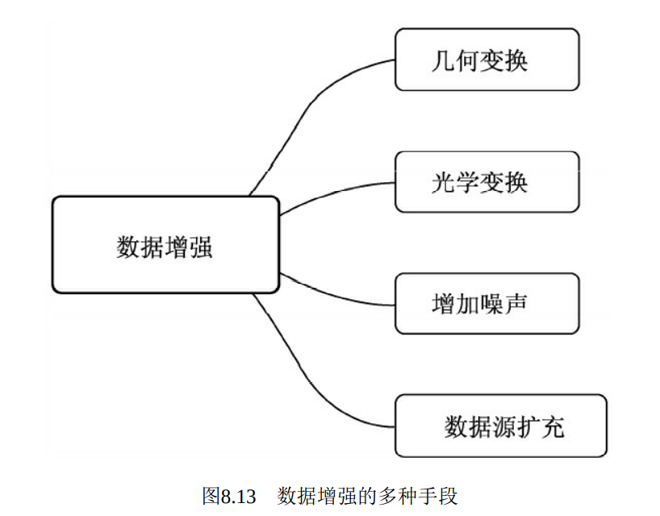

# 深度学习笔记

## 一、PyTorch基础教程

### 1. 张量数据

8WEMIQ5.png)

**如何表示String**

两种表示方法： one_hot 与 Embedding

one_hot: [0, 1, 0, 0, ...]

Embedding: 有编码器如Word2vec等

**数据类型**


``` py 
randn(2, 3)  # 随机初始化2行3列的数据
isinstance(a, b)  # a是否为b
data = data.cuda  # 将数据放置在GPU上  x.cuda()会返回一个GPU上的引用
torch.tensor(1.)
torch.tensor(1.3)  # 1.3是0维，但是[1.3]是1维，长度为1的Tensor

data = np.ones(2)
torch.from_numpy(data)  # 先从numpy中创建数组，然后转换为Tensor。从numpy中导入的float其实是double类型
# tensor是接收现成的数据，Tensor是接收数据的维度（shape），也可接收现成的数据
# numel指tensor占用内存的数量
```

增强学习一般使用double，其他一般使用float


### 2. 随机初始化

1）**rand/rand_like, randint**

- [0, 1]

- [min, max)

- *_like :  接收的参数不再是shape，而是tensor 

  ```py
  a = torch.rand(3, 3)
  torch.rand_like(a)
  torch.randint(1, 10, [3, 3])  # (min, max, shape)
  ```

2）**randn**

服从正态分布N（0，1）

```py
torch.randn(3,3)

# arange是不包含右边界的
```

3）**full**

```py
torch.full([2, 3], 7)   # 将全部都赋值为7
```

4）**arange/range**

```py
torch.arange(0, 10)  # [0,10) 的等差数列 
torch.range(0, 10)  # 不建议使用
```

5）**linspace/logspace**

```py
torch.linspace(0, 10, steps=4)  # [0, 10] 等分分割
torch.logspace(0, -1, steps=10)  # 0 => -1 等差数列，然后得到的为指数，底数为10。即：10^x
```

6）**ones/zeros/eye**

```py
torch.ones(3, 3)   # 将全部都赋值为1
torch.zeros(3, 3)   # 将全部都赋值为0
torch.eye(3, 4)   # 将对角线填为1，其余均为0
```

7）**randperm**

随机打散，同random.shuffle

```py
torch.randperm(2)
```


### 3. 索引与切片

```py
# 0:28:2   [0, 28)隔一个取
# 即 strat：end：step
# ... 代表任意多的维度，自动推断  如：a[...].shape  =>  torch.Size([4, 3, 28, 28])


# 取出大于0.5的元素
x = torch.randn(3, 4)
mask = x.ge(0.5)  # 大于等于0.5的改为1，其余为0
torch.masked_select(x, mask)
```


### 4. 维度变换

数据的存储/维度顺序非常重要，需要时刻记住！

数据的维度顺序必须和存储顺序一致！

- view/reshape
- squeeze/unsqueeze  挤压与展开  
  - +：在之前插入维度
  -  -：在之后插入维度

- expand/repeat

  仅限于1 扩展为 N，不能是2,3，...。  -1表示维度不变

  - expand：扩展（推荐，执行速度快，节约内存）。即改变shape，没有增加数据，仅在有需要的时候才复制数据。
  - repeat：扩展且复制数据。

- permute

  ```py
  b.permute(0,2,3,1)  # 自动调用transpose，使其进行维度变换。  bchw =>  bhwc
  ```

==注：[b，h，w，c]是numpy存储图片的格式==


## 二、PyTorch进阶教程

### 1. Broadcasting

expand + copy


==大维度随意，小维度指定==

### 2. 合并与分割

1）合并

- cat

  ```py
  torch.cat([a,b],dim=0)  # 将a，b的第0个维度进行合并
  ```

  

==注：只能是concat的维不一样，其它的必须保持一致==

- stack

  ```py
  torch.stack([a,b],dim=2)  # 合成，创建一个新的维度
  
  torch.cat([a1,a2] ,dim=2).shape  # torch.Size([4，3，32，32])
  torch.stack([a1,a2],dim=2).shape  # torch. Size([4,3，2，16，32])  多了一个维度
  
  a=torch.rand (32,8)'
  b=torch.rand (32,8)
  torch.stack([a,b],dim=0).shape  # torch.Size([2，32，8])
  ```

2）拆分

- split

  通过长度拆分

  I6G.png)

- chunk

  按照数量来拆分

  


### 3. 数学运算

- add/minus/multiply/divide

  ```py
  torch.add 等价于 +
  torch.sub 等价于 -
  torch.mul 等价于 *
  torch.div 等价于 /
  // 表示整除
  ```

- matmul

  ```py
  只取后面的2维进行运算，前面的保持不变
  
  矩阵相乘：torch.matmul（推荐使用）  或者  @
  
  元素相乘：*
  ```
  
- pow

  ```py
  a.pow(2)  # 等价于 a**2  
  ```

- sqrt/rsqrt

  ```py
  a.sqrt(2)  # 开方  a**0.5
  a.rsqrt()  # 平方根的倒数
  ```

- round

  ```py
  torch.log(a)  # 取自然对数 默认为e的对数
  a.floor()  # 向下取整 3.14=>3
  a.ceil()  # 向上取整 3.14=>4
  a.trunc()  # 裁剪取整数部分 3.14=>3
  a.frac()  # 裁剪取小数部分 3.14=>0.14
  a.round()  # 四舍五入
  ```

- clamp

  裁剪，梯度裁剪 gradient clipping

  ```py
  grad = torch.rand(2,3)*15
  grad.clamp(10)  # 将小于10的元素全部改为10
  ```


### 4. 属性统计

- norm：范数

  ```py
  a.norm(1)  # 1范数
  a.norm(1, dim=1)  # 在维度1上取1范数
  ```

- mean sum

  `mean=sum/prod(size)`

- prod

- max, min, argmin, argmax

  ```py
  max 不仅返回最大值，同时也会返回最大值的索引
  
  argmin, argmax 是返回的索引，是先打平为dim=1的时候的索引
  给定维度：
  a.argmax(dim=1)  # 在一维上最大值的索引
  ```


- kthvalue, topk

  ```py
  a.topk(3, dim=1)  # 返回一维度上前3大的值与索引
  当设置largest=False的时候，返回的是前n小的值与索引，如：a.topk(3, dim=1, largest=False) 
  
  kthvalue 即，第k个值
  a.kthvalue(8,dim=1)  # 第8小的值与索引，也就是第n-8大
  ```

- keepdim

  ```py
  keepdim=True  返回值的维度与原来的保持一致
  ```

- compare

  


### 5. 高阶操作

1. where

   ```py
   torch.where(condition, x, y)            # condition为判断来源的根据，x,y为来源
   ```

2. gather

   ```py
   torch.gather(input, dim, index, out=None)  # 搜集，查表的过程
   ```

   


## 三、随机梯度下降

### 1. 什么是梯度

所有偏微分组成的向量，向量的方向代表了当前函数增长的方向，向量的长度代表了增长的速率。


### 2. 常见函数的梯度


### 3.激活函数与Loss的梯度

#### 3.1 激活函数

1. ==sigmoid函数==：


2. ==tanh函数==


3. ==relu函数==


#### 3.2 Loss及其梯度

1. 均方差（Mean Squared Error, MSE）：

   

梯度：


- 使用pytorch自动求导：


- 使用backward求导：


小结：


**用于分类更常见的激活函数：**

X.png)


### 4. 感知机

==单层：==


==多层：==


### 5. 链式法则


即复合函数求导


### 6. ==反向传播算法==

更加高速！


## 四、神经网络与全连接层

### 1. Logistic Regression

### 2. 交叉熵

### 3. 多分类问题

### 4. 全连接层

### 5. 激活函数与GPU加速

GPU加速：

```py
device = torch.device('cuda:0')
net = MLP().to(device)
optimizer = optim.SGD(net.parameters(), lr=learning_rate)
criteon = nn.CrossEntropyLoss().to(device)
```

### 6. Visdom可视化

- tensorboardX: pip install tensorboardX

  会把数据写到文件中去，会占用大量空间

- vistom: 

  安装：pip install visdom

  运行前开启服务：python -m visdom.server

  vistom查看：http://localhost:8097/

  效率高，更推荐


## 五、过拟合与欠拟合

### 1. 交叉验证

### 2. Regularization

### 3. 动量与学习率衰减

### 4. Early Stopping, Dropout

dropout会减少噪声，更加平滑


## 六、卷积神经网络CNN

### 1. 什么是卷积

局部相关性

### 2. 卷积神经网络


### 3. 池化层与采样

Z2E.png)

### 4. Batch Norm

### 5. 经典卷积网络

- AlexNet

- VGGNet

- GoogleNet

  

## 七、CIFAR10与ResNet实战

### 1. 深度残差网络

ResNet、Inception

### 2. nn.Module模块

### 3. 数据增强

针对有限的数据进行优化

- flip 
- rotate 
- crop part：裁剪
- noise：添加噪声

### 4. CIFAR10数据集

stride对于数据维度的降低十分有效

stride=2    减半

stride=3    减为1/3

forward()  前向处理

## 八、深度学习经典框架

### 1. 两阶经典检测器 Faster RCNN

- RCNN算法

  步骤：`1. 候选区域生成。采用Region Proposal提取候选区域`

  ​			`2. CMM特征提取`

  ​			`3. SVM分类器`

  ​			`4. 位置精修`

- Fast RCNN

  `训练的步骤可以实现端到端`

  ​        Selective Search需要消耗2~3秒，而特征提取仅需要0.2秒，因此这种区域生成方法限制了Fast RCNN算法的发挥空间

- Faster RCNN

  ==recall：**召回率**==
  
  

### 2. 单阶多层检测器 SSD


- 光学变换
  - 色相、亮度调整：随机加一个数
  - 对比度与饱和度：随机乘一个数
  - 有一半的概率对比度在另外两者之前，另一半概率则是对比度在另外两者之后。
  - ==光学变换==的最后一项是添加随机的光照噪声，具体做法是随机交换RGB三个通道的值
- 几何变换
  - 随机扩展--->随机裁剪--->图像镜像--->固定缩放--->去均值处理

==注意：==

random.randint(2)返回小于2的整数，即0或者1.
所以当x=1的时候，返回“aaa”。
当x=0的时候，返回“bbb”。

```python
random.randint(2)返回小于2的整数，即0或者1.
所以当x=1的时候，返回“aaa”。
当x=0的时候，返回“bbb”。
```

ceil_mode: 计算输出的shape的时候，如果ceil_mode的值为True，那么则用天花板模式，否则用地板模式。
					所以ceil模式就是会把不足square_size的边给保留下来，单独另算


- 匹配与损失求解

  - 对priorbox赋予正负标签，确定真实物体标签
  - 计算框的定位损失（正样本）
  - 进行难样本挖掘，筛选出数量是正样本3倍的负样本
  - 计算类别损失

- 定位损失的计算

  - SSD使用了 s**moothL10**函数作为定位损失函数，并且只对**正样本**计算。

- 难样本挖掘（只针对于负样本）

  1.是保证正、负样本的比例来实现样本均衡

  2.具体做法是在 计算出所有负样本的损失后进行排序，选取损失较大的那一部分进行计 算，舍弃剩下的负样本，数量为正样本的3倍。

  - 过滤掉正样本
  - 将负样本的损失 排序
  - 计算正样本的数量
  - 得到负样本的数量
  - 根据损失 大小得到留下的负样本索引

- 类别损失计算

  使用了交叉熵损失函数，并且正、负样本全部参与计算。

### 3. 单阶经典检测器 YOLO

#### 1. 无锚框预测：YOLO v1

创造性地 使用一阶结构完成了物体检测任务，直接预测物体的类别与位置，没有 RPN网络，也没有类似于Anchor的预选框，因此速度很快。


#### 2. 依赖锚框：YOLO v2

相比于YOLO v1改善：

- 网络结构

  提出了一个全新的网络结构，称之为DarkNet。增加了一个Passthrough层。

  使用了BN层，其具体位置是在每一个卷积 之后，激活函数LeakyReLU之前。

  

  

- 先验框的设计

  - 聚类提取先验框尺度（只需要设定预选框的数量）
  - 优化偏移公式

- 训练技巧

  - 多尺度训练

  - 多阶段训练（预训练）

    

#### 4. 多尺度与特征融合：YOLO v3

YOLO v3主要改进了网络结构、网络特征及后续计算三 个部分

- 网络结构

  DarkNet-53：DBL-->代表卷积、BN及Leaky ReLU三层的结合

  

  ==注意：==YOLO v3的速度并没有之前的版本快，而是在保证 实时性的前提下追求检测的精度。如果追求速度，YOLO v3提供了一个 更轻量化的网络tiny-DarkNet，在模型大小与速度上，实现了 SOTA（State of the Art）的效果。


==**知识蒸馏**：==通常来讲，大的模型拥有更强的拟合与泛化能力，而小模型的拟合能力较弱，并且容易出现过拟合。因此，我们可以使用大的模型指导小模型的训练，保留大模型的有效信息，实现知识的蒸馏。





==**多尺度问题**==


==注意：**如果爆显存错误的话，减少batch的大小**==


随机选图片

```py
import os, random, shutil


def moveFile(fileDir, tarDir):
    pathDir = os.listdir(fileDir)  # 取图片的原始路径
    filenumber = len(pathDir)
    rate = 0.08  # 自定义抽取图片的比例，比方说100张抽10张，那就是0.1
    picknumber = int(filenumber * rate)  # 按照rate比例从文件夹中取一定数量图片
    sample = random.sample(pathDir, picknumber)  # 随机选取picknumber数量的样本图片
    print(sample)
    print(len(sample))
    for name in sample:
        shutil.move(fileDir + name, tarDir + name)


if __name__ == '__main__':
    fileDir = "G:/wyh/myval/JPEGImages/"  # 源图片文件夹路径
    tarDir = "G:/wyh/mytrain/Annotations/"  # 移动到新的文件夹路径
    moveFile(fileDir, tarDir)

```


批量修改文件后缀名

- 新建  rename.bat

- 打开新建的记事本文件在里面输入 ren *.gif  *.jpg 下面内容

  输入格式Ren 空格 星号 点 需要修改的文件后缀名  空格星号 点需要改成的文件后缀名


## 关于深度学习的网络模型相关

filter（滤波器）的最大的特点是其深度与输入层的深度是一致的

输出层的深度是滤波器的个数。

每一个filter遍历输入层会产生一个深度的输出层，那么n个输出层就会产生n个深度的输出层（也就是输出层的深度）。


yolov4模型中的SPP（Spatial Pyramid Pooling，空间金字塔池化）：

```python
目的：增加网络的感受野。实现是对layer107进行 5x5、9x9、13x13 的最大池化，分别得到layer 108，layer 110和layer 112，完成池化后，将layer 107，layer 108，layer 110和layer 112进行concatenete，连接成一个特征图layer 114并通过 1x1 降维到512个通道。
```
​	==**SPP尺寸不变的原因**==

```python
#SPP
class SPPNet(nn.Module):
    def __init__(self):
        super(SPPNet,self).__init__()
    def forward(self,x):
        # max_pool2d的第一个参数为：输入，第二个为pool_size，第三个为移动步长，第四个为填充。
        # 即：max_pool2d(input, size, stride, padding)
        # 输出尺寸的计算公式为：N = （ Input - Size + 2P）/ Stride + 1
        x1=F.max_pool2d(x,5,1,2)
        x2=F.max_pool2d(x,9,1,4)
        x3=F.max_pool2d(x,13,1,6)
        x=t.cat([x1,x2,x3,x],dim=1)
        return x
```

==**上采样（upsample）的计算**==：

```python
CBM：是yolov4网络结构中的最小组件，由Conv+BN+Mish激活函数组成
CSP1 = CBM + 1个残差unit + CBM -> Concat(with CBM)
```

batch_normalize（BN层）：批处理归一化

padding：对原始图像进行填充

stride：卷积核的步长

size：卷积核的大小，降低图像的宽度和高度

activation：激活函数

卷积的计算：

​		若输入数据维度为WxW，填充值P，size为F，步长stride为S，输出数据维度为NxN，则有如下计算公式：
​	**N = （ W - F + 2P）/ S + 1**


yolov4.cfg 理解

```python
[net]
# Testing # 测试时，batch和subdivisions设置为1,否则可能出错。
#batch=1 # 大一些可以减小训练震荡及训练时NAN的出现。
#subdivisions=1 # 必须为为8的倍数，显存吃紧可以设成32或64。
# Training
batch=64 # 训练过程中将64张图一次性加载进内存，前向传播后将64张图的loss累加求平均，再一次性后向传播更新权重。
subdivisions=16 # 一个batch分16次完成前向传播，即每次计算4张。
width=608 # 网络输入的宽。
height=608 # 网络输入的高。
channels=3 # 网络输入的通道数。
momentum=0.949 # 动量梯度下降优化方法中的动量参数，更新的时候在一定程度上保留之前更新的方向。
decay=0.0005 # 权重衰减正则项，用于防止过拟合。
angle=0 # 数据增强参数，通过旋转角度来生成更多训练样本。
saturation = 1.5 # 数据增强参数，通过调整饱和度来生成更多训练样本。
exposure = 1.5 # 数据增强参数，通过调整曝光量来生成更多训练样本。
hue=.1 # 数据增强参数，通过调整色调来生成更多训练样本。
learning_rate=0.001 # 学习率。
burn_in=1000 # 在迭代次数小于burn_in时，学习率的更新为一种方式，大于burn_in时，采用policy的更新方式。
max_batches = 500500 #训练迭代次数，跑完一个batch为一次，一般为类别数*2000，训练样本少或train from scratch可适当增加。
policy=steps # 学习率调整的策略。
steps=400000,450000 # 动态调整学习率，steps可以取max_batches的0.8~0.9。
scales=.1,.1 # 迭代到steps(1)次时，学习率衰减十倍，steps(2)次时，学习率又会在前一个学习率的基础上衰减十倍。
#cutmix=1 # cutmix数据增强，将一部分区域cut掉但不填充0像素而是随机填充训练集中的其他数据的区域像素值，分类结果按一定的比例分配。
mosaic=1 # 马赛克数据增强，取四张图，随机缩放、随机裁剪、随机排布的方式拼接，详见上述代码分析。

[convolutional]
batch_normalize=1 # 是否进行BN。
filters=32 # 卷积核个数，也就是该层的输出通道数。
size=3 # 卷积核大小。
stride=1 # 卷积步长。
pad=1 # pad边缘补像素。
activation=mish # 网络层激活函数，yolo-v4只在Backbone中采用了mish，网络后面仍采用Leaky_relu。

# CSP1 = CBM + 1个残差unit + CBM -> Concat(with CBM)，见总图。
[convolutional] # CBM层，直接与7层后的route层连接，形成总图中CSPX下方支路。
batch_normalize=1
filters=64
size=1
stride=1
pad=1
activation=mish

[route] # 得到前面第2层的输出，即CSP开始位置，构建如图所示的CSP第一支路。
layers = -2

[convolutional] # CBM层。
batch_normalize=1
filters=64
size=1
stride=1
pad=1
activation=mish

# Residual Block
[convolutional] # CBM层。
batch_normalize=1
filters=32
size=1
stride=1
pad=1
activation=mish

[convolutional] # CBM层。
batch_normalize=1
filters=64
size=3
stride=1
pad=1
activation=mish

[shortcut] # add前面第3层的输出，Residual Block结束。
from=-3
activation=linear

[convolutional] # CBM层。
batch_normalize=1
filters=64
size=1
stride=1
pad=1
activation=mish

[route] # Concat上一个CBM层与前面第7层(CBM)的输出。
layers = -1,-7

### CBL*3 ###
[convolutional]
batch_normalize=1
filters=512
size=1
stride=1
pad=1
activation=leaky # 不再使用Mish。

[convolutional]
batch_normalize=1
size=3
stride=1
pad=1
filters=1024
activation=leaky

[convolutional]
batch_normalize=1
filters=512
size=1
stride=1
pad=1
activation=leaky

### SPP-最大池化的方式进行多尺度融合 ###
[maxpool] # 5*5。
stride=1
size=5

[route]
layers=-2

[maxpool] # 9*9。
stride=1
size=9

[route]
layers=-4

[maxpool] # 13*13。
stride=1
size=13

[route] # Concat。
layers=-1,-3,-5,-6
### End SPP ###

### CBL*3 ###
[convolutional]
batch_normalize=1
filters=512
size=1
stride=1
pad=1
activation=leaky # 不再使用Mish。

[convolutional]
batch_normalize=1
size=3
stride=1
pad=1
filters=1024
activation=leaky

[convolutional]
batch_normalize=1
filters=512
size=1
stride=1
pad=1
activation=leaky

### CBL ###
[convolutional]
batch_normalize=1
filters=256
size=1
stride=1
pad=1
activation=leaky

### 上采样 ###
[upsample]
stride=2

[route]
layers = 85 # 获取Backbone中CBM+CSP8+CBM模块的输出，85从net以外的层开始计数，从0开始索引。

[convolutional] # 增加CBL支路。
batch_normalize=1 
filters=256
size=1
stride=1
pad=1
activation=leaky

[route] # Concat。
layers = -1, -3

### CBL*5 ###
[convolutional]
batch_normalize=1
filters=256
size=1
stride=1
pad=1
activation=leaky

[convolutional]
batch_normalize=1
size=3
stride=1
pad=1
filters=512
activation=leaky

[convolutional]
batch_normalize=1
filters=256
size=1
stride=1
pad=1
activation=leaky

[convolutional]
batch_normalize=1
size=3
stride=1
pad=1
filters=512
activation=leaky

[convolutional]
batch_normalize=1
filters=256
size=1
stride=1
pad=1
activation=leaky

### CBL ###
[convolutional]
batch_normalize=1
filters=128
size=1
stride=1
pad=1
activation=leaky

### 上采样 ###
[upsample]
stride=2

[route]
layers = 54 # 获取Backbone中CBM*2+CSP1+CBM*2+CSP2+CBM*2+CSP8+CBM模块的输出，54从net以外的层开始计数，从0开始索引。

### CBL ###
[convolutional]
batch_normalize=1
filters=128
size=1
stride=1
pad=1
activation=leaky

[route] # Concat。
layers = -1, -3

### CBL*5 ###
[convolutional]
batch_normalize=1
filters=128
size=1
stride=1
pad=1
activation=leaky

[convolutional]
batch_normalize=1
size=3
stride=1
pad=1
filters=256
activation=leaky

[convolutional]
batch_normalize=1
filters=128
size=1
stride=1
pad=1
activation=leaky

[convolutional]
batch_normalize=1
size=3
stride=1
pad=1
filters=256
activation=leaky

[convolutional]
batch_normalize=1
filters=128
size=1
stride=1
pad=1
activation=leaky

### Prediction ###
### CBL ###
[convolutional]
batch_normalize=1
size=3
stride=1
pad=1
filters=256
activation=leaky

### conv ###
[convolutional]
size=1
stride=1
pad=1
filters=255
activation=linear
[yolo] # 76*76*255，对应最小的anchor box。
mask = 0,1,2 # 当前属于第几个预选框。
# coco数据集默认值，可通过detector calc_anchors，利用k-means计算样本anchors，但要根据每个anchor的大小(是否超过60*60或30*30)更改mask对应的索引(第一个yolo层对应小尺寸；第二个对应中等大小；第三个对应大尺寸)及上一个conv层的filters。
anchors = 12, 16, 19, 36, 40, 28, 36, 75, 76, 55, 72, 146, 142, 110, 192, 243, 459, 401
classes=80 # 网络需要识别的物体种类数。
num=9 # 预选框的个数，即anchors总数。
jitter=.3 # 通过抖动增加噪声来抑制过拟合。
ignore_thresh = .7
truth_thresh = 1
scale_x_y = 1.2
iou_thresh=0.213
cls_normalizer=1.0
iou_normalizer=0.07
iou_loss=ciou # CIOU损失函数，考虑目标框回归函数的重叠面积、中心点距离及长宽比。
nms_kind=greedynms
beta_nms=0.6
max_delta=5
 
[route]
layers = -4 # 获取Neck第一层的输出。
### 构建第二分支 ###
### CBL ###
[convolutional]
batch_normalize=1
size=3
stride=2
pad=1
filters=256
activation=leaky
[route] # Concat。
layers = -1, -16
### CBL*5 ###
[convolutional]
batch_normalize=1
filters=256
size=1
stride=1
pad=1
activation=leaky
[convolutional]
batch_normalize=1
size=3
stride=1
pad=1
filters=512
activation=leaky
[convolutional]
batch_normalize=1
filters=256
size=1
stride=1
pad=1
activation=leaky
[convolutional]
batch_normalize=1
size=3
stride=1
pad=1
filters=512
activation=leaky
[convolutional]
batch_normalize=1
filters=256
size=1
stride=1
pad=1
activation=leaky
### CBL ###
[convolutional]
batch_normalize=1
size=3
stride=1
pad=1
filters=512
activation=leaky
### conv ###
[convolutional]
size=1
stride=1
pad=1
filters=255
activation=linear

[yolo] # 38*38*255，对应中等的anchor box。
mask = 3,4,5
anchors = 12, 16, 19, 36, 40, 28, 36, 75, 76, 55, 72, 146, 142, 110, 192, 243, 459, 401
classes=80
num=9
jitter=.3
ignore_thresh = .7
truth_thresh = 1
scale_x_y = 1.1
iou_thresh=0.213
cls_normalizer=1.0
iou_normalizer=0.07
iou_loss=ciou
nms_kind=greedynms
beta_nms=0.6
max_delta=5

[route] # 获取Neck第二层的输出。
layers = -4
### 构建第三分支 ###
### CBL ###
[convolutional]
batch_normalize=1
size=3
stride=2
pad=1
filters=512
activation=leaky
[route] # Concat。
layers = -1, -37
### CBL*5 ###
[convolutional]
batch_normalize=1
filters=512
size=1
stride=1
pad=1
activation=leaky
[convolutional]
batch_normalize=1
size=3
stride=1
pad=1
filters=1024
activation=leaky
[convolutional]
batch_normalize=1
filters=512
size=1
stride=1
pad=1
activation=leaky
[convolutional]
batch_normalize=1
size=3
stride=1
pad=1
filters=1024
activation=leaky
[convolutional]
batch_normalize=1
filters=512
size=1
stride=1
pad=1
activation=leaky
### CBL ###
[convolutional]
batch_normalize=1
size=3
stride=1
pad=1
filters=1024
activation=leaky
### conv ###
[convolutional]
size=1
stride=1
pad=1
filters=255
activation=linear

[yolo] # 19*19*255，对应最大的anchor box。
mask = 6,7,8
anchors = 12, 16, 19, 36, 40, 28, 36, 75, 76, 55, 72, 146, 142, 110, 192, 243, 459, 401
classes=80
num=9
jitter=.3
ignore_thresh = .7
truth_thresh = 1
random=1
scale_x_y = 1.05
iou_thresh=0.213
cls_normalizer=1.0
iou_normalizer=0.07
iou_loss=ciou
nms_kind=greedynms
beta_nms=0.6
max_delta=5
```


