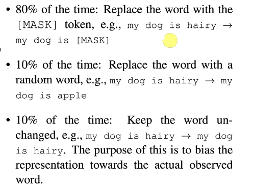
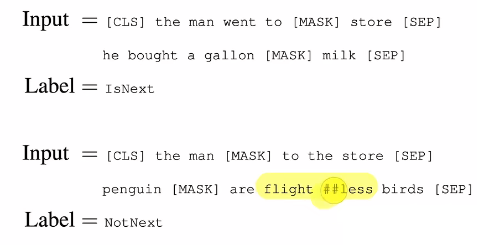

# BERT 阅读随记

前人的工作：

​		ELMo虽然是双向的，但是用的是RNN

​		GPT虽然是单向的，但是用的是Transfomer

**BERT就是两者的结合：采用双向的transformer**

（无法做机器翻译！）

---------

## 创新点

1. 在NLP模型上采用预训练。（BERT不是第一个提出使用这个方法在nlp上，只是让预训练在nlp领域火了）

   - 使用预训练在做特征表示的时候有两种方法：
     1. 基于微调的：GPT

     2. 基于特征的：ELMo（也是双向的）

2. 采用双向的transformer

   - 之前的语言模型都是单向的，具有一定的局限性

   - 采用带掩码的语言模型，类似于中间挖空，根据两边的信息填空。

## 第一个任务 带掩码的语言模型

### 一、主要步骤

1. 预训练：在一个没有标号的数据集上训练的

2. 微调：BERT模型权重采用在预训练中得到的权重值，然后所有的权重在微调的时候都会参与训练

### 二、输入、输出

​		对于下游任务，有些是处理一个句子，有些是处理两个句子。因此为了使BERT模型能够处理所有的任务，其输入可以是一个句子，也可以是一个句子对。

​		所有的输入叫做一个序列，所谓的序列就是可以是一个句子，也可以是两个句子。一个句子的意思是一段连续的文字。

​		采用**WordPiece**切词，如果一个词出现的概率不大，就切开成多个片段，保留这些经常出现的片段。

​		为了区分两个句子：

1. 在每个句子后面放一个特殊的词标记【SEP】
2. 学一个嵌入层（embeding），表示这个句子到底是哪个句子

对于给定的token，其输入的表达为：token embedding  + segmen  embedding + position embedding；

#### 与transformer的不同之处：

​		transformer训练的时候，其输入是一个序列对（编码器和解码器会分别输入一个序列），而**BERT只有一个编码器**！！！

### 三、预训练BERT

有wordpiece生成的词，有15%的概率会随机替换成一个掩码；

而对于特殊的词元，如[cls], [SEP] 不做修改

**问题：**由于在预训练的时候，是不存在【mask】的，因此在预训练和微调的时候是不一致的！

**解决方法：**BERT针对这15%选择生成掩码的词，

- 有80%的概率是真的把它替换成【mask】

- 10%的概率替换成一个随机的词元

- 10%的概率什么都不干

  注：以上概率论文作者说是实验得出

## 第二个任务：下一个句子的预测（NSP）

给两个句子，判断这两个句子在原文中是相邻的，还是随机采用的两个。（学习句子层面的信息）

 输入序列中有两个句子：a，b。有50%的概率b在原文中是真的在a之后，50%的概率b就是随机从一个别的地方选取出来的一个句子。即：50%正例，50%负例。

上正，下负

