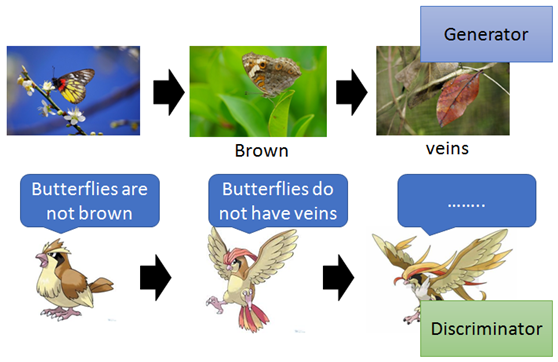
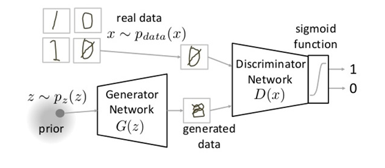
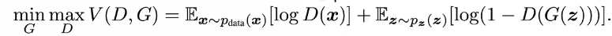
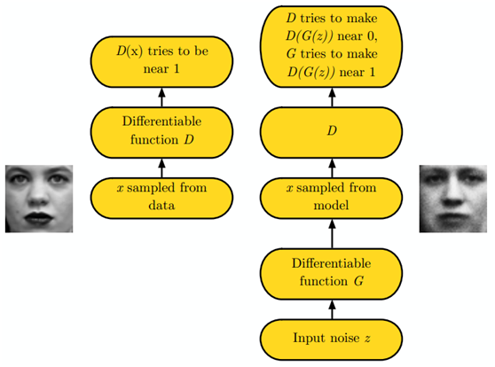

# GAN 论文阅读笔记

### 1. 什么是GAN？

​		生成式对抗网络（GAN, Generative Adversarial Networks）是一种近年来大热的深度学习模型，该模型由两个基础神经网络即**生成器神经网络**（Generator Neural Network）和**判别器神经网络**（Discriminator Neural Network）所组成，其中一个用于生成内容，另一个则用于判别生成的内容。

​		GAN受博弈论中的零和博弈启发，将生成问题视作判别器和生成器这两个网络的对抗和博弈：生成器从给定噪声中（一般是指均匀分布或者正态分布）产生合成数据，判别器分辨生成器的的输出和真实数据。

​		前者试图产生更接近真实的数据，相应地，后者试图更完美地分辨真实数据与生成数据。由此，两个网络在对抗中进步，在进步后继续对抗，由生成式网络得的数据也就越来越完美，逼近真实数据，从而可以生成想要得到的数据（图片、序列、视频等）。

### 2. 工作原理

​		我们将生成内容的网络称为G（Generator），将鉴别内容的网络称为D（Discriminator）。

**示例1.** 下图中枯叶蝶进化的例子可以很好的说明GAN的工作原理。

图中的枯叶蝶扮演Generator的角色，相应的其天敌之一的麻雀扮演Discriminator的角色。起初，枯叶蝶的翅膀与其他的蝴蝶别无二致，都是色彩斑斓；

- 第一阶段：麻雀为了识别并捕杀蝴蝶升级自己的判别标准为非棕色翅膀；
- 第二阶段：为了躲避麻雀，枯叶蝶的翅膀进化为棕色；
- 第三阶段：麻雀更加聪明，识别枯叶蝶的标准升级为所看到的物体是否具有纹路；
- 第四阶段：枯叶蝶的翅膀进化出纹路更像枯叶；
- ……

如此不断的进行下去，伴随着枯叶蝶的不断进化和麻雀判别标准的不断升级，二者不断地相互博弈，最终导致的结果就是枯叶蝶的翅膀（输出）无限接近于真实的枯叶（真实物体）。

**示例2.** 我们再以生成图片为例用数学语言进行描述。

- G是一个生成图片的网络，它接收一个随机的噪声z，通过这个噪声生成图片，记做G(z)。
- D是一个判别网络，判别一张图片是不是“真实的”。它的输入参数是x，x代表一张图片，输出D（x）代表x为真实图片的概率，如果为1，就代表100%是真实的图片，而输出为0，就代表不可能是真实的图片。

上图中的标记符号：

- Pdata(x) → 真实数据的分布
- X → pdata(x)的样本（真实图片）
- P(z) →生成器的分布
- Z → p(z)的样本（噪声）

### 3. 训练过程

在训练过程中，生成网络G的目标就是尽量生成真实的图片去欺骗判别网络D。而D的目标就是尽量把G生成的图片和真实的图片分别开来。这样，G和D构成了一个动态的“博弈过程”。
最后博弈的结果是什么？在最理想的状态下，G可以生成足以“以假乱真”的图片G(z)。对于D来说，它难以判定G生成的图片究竟是不是真实的，因此D(G(z)) = 0.5。

用公式表示如下：

整个式子由两项构成。X表示真实图片，Z表示输入G网络的噪声，而G(z)表示G网络生成的图片。D(x)表示D网络判断真实图片是否真实的概率（因为x就是真实的，所以对于D来说，这个值越接近1越好）。而D(G(z))是D网络判断G生成的图片的是否真实的概率。

G的目的：上面提到过，D(G(z))是D网络判断G生成的图片是否真实的概率，G应该希望自己生成的图片“越接近真实越好”。也就是说，G希望D(G(z))尽可能得大，这时V(D, G)会变小。因此我们看到式子的最前面的记号是（min_G）。
D的目的：D的能力越强，D(x)应该越大，D(G(x))应该越小。这时V(D,G)会变大。因此式子对于D来说是求最大(max_D)。

这个过程被下面这张图很好的描述了出来：

最终通过不断的训练，生成的图片会相当真实。

### 4. GAN的缺点

●  训练GAN需要达到**纳什均衡**,有时候可以用梯度下降法做到,有时候做不到.我们还没有找到很好的达到纳什均衡的方法,所以训练GAN相比VAE或者PixelRNN是不稳定的,但我认为在实践中它还是比训练玻尔兹曼机稳定的多

●  GAN不适合处理离散形式的数据，比如文本

●  GAN存在训练不稳定、梯度消失、模式崩溃的问题（目前已解决）
