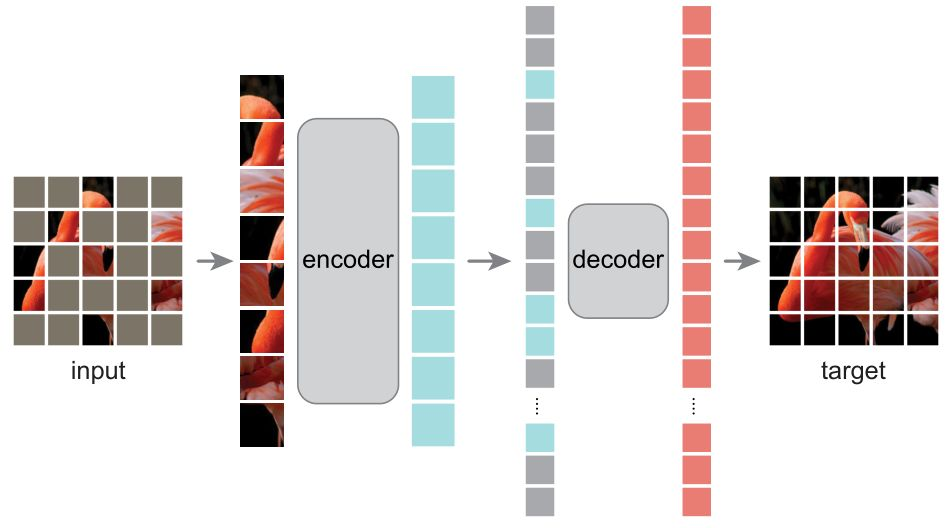

# MAE论文阅读

将bert应用与cv中

- **MAE Encoder：**

MAE Encoder 采用 ViT 架构，但只会作用于 unmasked images。和 ViT 思路一样，MAE Encoder 会先通过 Linear Projection 编码图片，再加上位置编码，随后送入一堆连续的 Transformer Block 里面。但是编码器只对整个图片 patches 集合的一个小子集 (例如25%)进行操作，而删除 masked patches。这里和 BERT 做法不一样，BERT 使用对于 mask 掉的部分使用特殊字符，而 MAE 不使用掩码标记。

- **MAE Decoder：**

MAE Decoder 采用 Transformer 架构，输入整个图片 patches 集合，不光是 unmasked tokens (图4中蓝色色块)，还有被 mask 掉的部分 (图4中灰色色块)。每个 mask tokens 都是一个共享的、学习的向量，它指示了这里有一个待预测的 tokens。作者还将位置嵌入添加到这个完整 image patch 集合中的所有 tokens 中，位置编码表示每个 patches 在图像中的位置的信息。

MAE Decoder 仅用于预训练期间执行图像重建任务。因为自监督学习的特点就是只用最后预训练好的 Encoder 完成分类任务。因此，可以灵活设计与编码器设计无关的解码器结构。作者用比编码器更窄更浅的很小的解码器做实验。 在这种非对称的设计下，tokens 就可以由轻量级解码器处理，这大大缩短了预训练的时间。

- **自监督学习目标函数 Reconstruction Target：**

Decoder 的最后一层是一个 Linear Projection 层，其输出的 channel 数等于图像的像素 (pixel) 数。所以 Decoder 的输出会进一步 reshape 成图像的形状。损失函数就是 MSE Loss，即直接让 reconstructed image 和 input image 的距离越接近越好。

作者还尝试了另外一种损失函数，就是先计算出每个 patch 的像素值的 mean 和 deviation，并使用它们去归一化这个 patch 的每个像素值。最后再使用归一化的像素值进行 MSE Loss 计算。但是发现这样做的效果比直接 MSE Loss 好。

- **具体实现方法：**

MAE 的具体实现方法是：

1. 首先通过 Linear Projection 和位置编码得到 image tokens。
2. 随机 shuffle 这些 tokens，按照 masking ratio 扔掉最后的一部分。
3. 把 unmasked patches 输出到 Encoder 中，得到这些 tokens 的表征。
4. 把 Encoder 的输出，结合 masked tokens (可学习的向量)，执行 unshuffle操作恢复顺序，再一起输入到 Decoder 中。
5. shuffle 和 unshuffle 操作的时间开销可忽略不计。

MAE 包含Encoder (ViT) 和Decoder (小ViT)，pre-train的时候都训练。pre-train完以后只保留Encoder，再加上分类头，在ImageNet上Fine-tuning。 