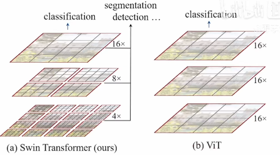
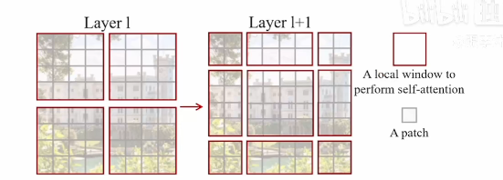
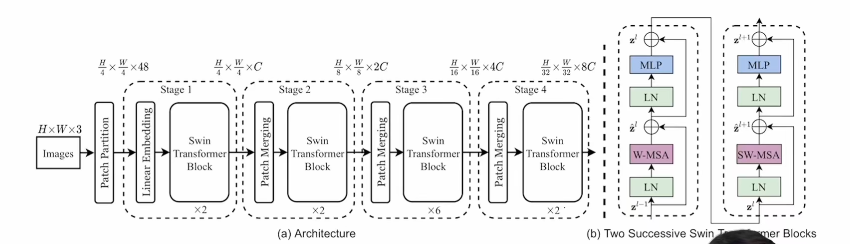
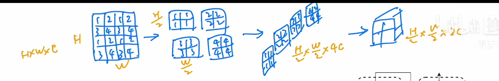
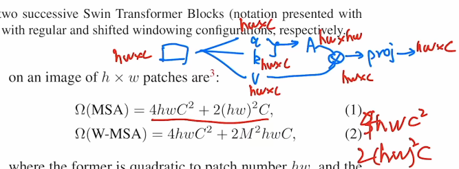
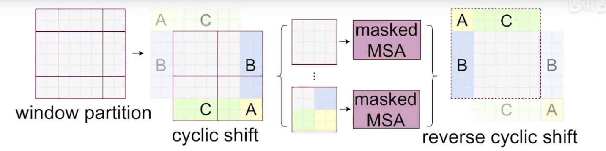
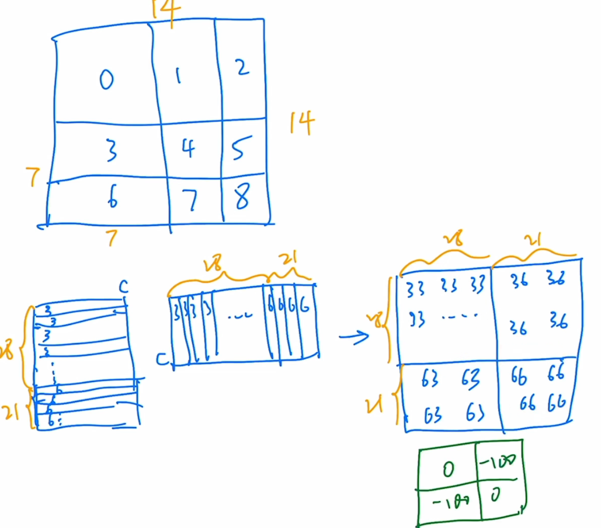
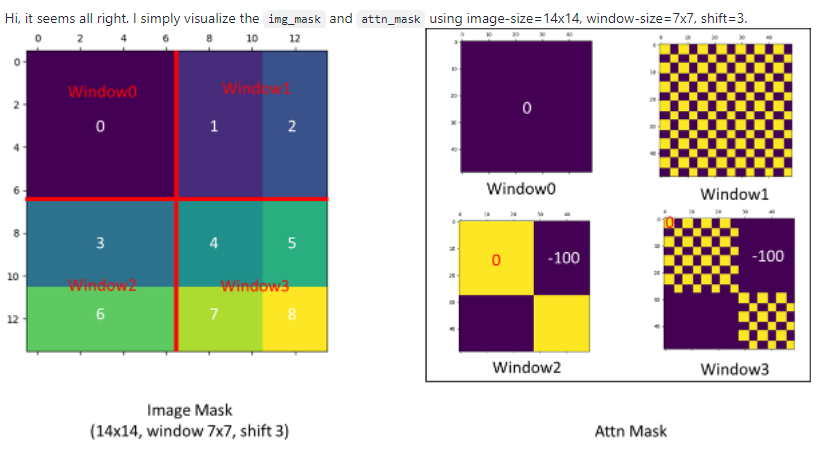

# Swin-Transformer 阅读随记

Swin --> Shifted Windows

图像领域用tranformer的挑战

- 高分辨率
- 多尺度（同样的语义信息，但其尺度不一致）

针对这两个挑战：本文采用 移动窗口（Shifted Windows）的方式提取特征

好处：带来高效率，同时使相邻的窗口具有了交互的作用，达到全局建模的能力

ViT问题：对特征始终是对单一的低分辨率特征进行处理，不适合处理密集预测任务。且自注意力始终是在整图上进行的，全局建模，复杂度大。

因此，Swin在小窗口内算自注意力，而不是整图，复杂度有关窗口大小。利用了CNN的局部性先验知识。而全局算自注意力是对视觉任务来说有些浪费资源。

A patch（4*4）

复杂度计算：

窗口大小不一致，如何快速计算自注意力：

掩码相加，再使用softmax搞成0

