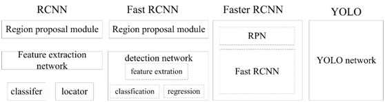
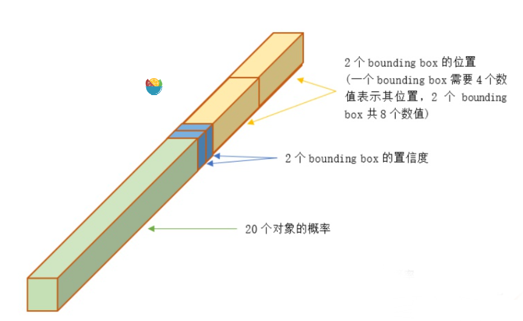
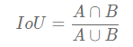

### 1. 说说卷积和全连接网络的区别？

​       卷积神经网络也是通过一层一层的节点组织起来的。和全连接神经网络一样，卷积神经网络中的每一个节点就是一个神经元。在全连接神经网络中，每相邻两层之间的节点都有边相连，于是会将每一层的全连接层中的节点组织成一列，这样方便显示连接结构。而对于卷积神经网络，相邻两层之间只有部分节点相连，为了展示每一层神经元的维度，一般会将每一层卷积层的节点组织成一个三维矩阵。
​    
​       除了结构相似，卷积神经网络的输入输出以及训练的流程和全连接神经网络也基本一致，以图像分类为列，卷积神经网络的输入层就是图像的原始图像，而输出层中的每一个节点代表了不同类别的可信度。这和全连接神经网络的输入输出是一致的。类似的，全连接神经网络的损失函数以及参数的优化过程也都适用于卷积神经网络。因此，全连接神经网络和卷积神经网络的唯一区别就是神经网络相邻两层的连接方式。

**补充：** 那为啥全连接层神经网络无法很好的处理图像数据？

​       使用全连接神经网络处理图像的最大问题就是：全连接层的参数太多，对于MNIST数据，每一张图片的大小是28 * 28 * 1，其中28 * 28代表的是图片的大小，1表示图像是黑白的，有一个色彩通道。假设第一层隐藏层的节点数为500个，那么一个全连接层的神经网络有28 * 28 * 500+500=392500个参数，而且有的图片会更大或者是彩色的图片，这时候参数将会更多。参数增多除了导致计算速度减慢，还很容易导致过拟合的问题。所以需要一个合理的神经网络结构来有效的减少神经网络中参数的个数。卷积神经网络就可以更好 的达到这个目的。

### 2. 什么是感受野呢？

​       感受野（Receptive Field）的定义：卷积神经网络每一层输出的特征图（feature map）上的像素点映射回输入图像上的区域大小。通俗点的解释是，特征图上一点，相对于原图的大小，也是卷积神经网络特征所能看到输入图像的区域。

### 3. 深度学习的“深度”，是不是一昧的增加深度就好了吗？网络是否越深越好？

在一定的程度上，网络越深越宽，性能越好。但是未必就是网络越深越越好，我们从 **性能提升和优化** 两个方面来看：

- **加深带来的优化问题**

ResNet为什么这么成功，就是因为它使得深层神经网络的训练成为可行。虽然好的初始化，BN层等技术也有助于更深层网络的训练，但是很少能突破30层。

VGGNet19层，GoogleNet22层，MobileNet28层，经典的网络超过30层的也就是ResNet系列常见的ResNet50，ResNet152了。虽然这跟后面ImageNet比赛的落幕，大家开始追求更加高效实用的模型有关系，另一方面也是训练的问题。

深层网络带来的**梯度不稳定，网络退化**的问题始终都是存在的，可以缓解，没法消除。这就有可能出现网络加深，性能反而开始下降。

- **网络加深带来的饱和**

**补充：** 为什么越深越差？

上述两个原因：1）加深会带来梯度不稳定，网络退化等问题；2）加深会带来饱和，即无论怎么加深，性能不再提高。

### 4. 减少过拟合的手段？

- 增加样本数据量
- 数据增强，人为扩展数据量
- 正则化
- Dropout
- early stopping
- batch normalization

### 5. 简单的说一下YOLO V1

 1.创新点

 （1）将整张图作为网络的输入，Anchor free方法直接在输出层回归bounding box的位置和类别
 2.Anchor-based缺点
 Anchor-based方法首先需要产生大量可能包含待检测物体的先验框, 然后用分类器判断每个先验框对应的边界框里是否包含待检测物体，以及物体所属类别的概率或者置信度，同时需要后处理修正边界框，最后基于一些准则过滤掉置信度不高和重叠度较高的边界框，进而得到检测结果。这种基于先产生候选区再检测的方法虽然有相对较高的检测准确率，但运行速度较慢。

​       YOLO创造性的将物体检测任务直接当作回归问题（regression problem）来处理，将候选区和检测两个阶段合二为一。下图展示了各物体检测系统的流程图对比。

 3.预测

 YOLO将输入图像分成7x7的网格，每个网格预测2个边界框，总共 49x2=98 个bounding box。若某物体的ground truth的中心落在该网格，则该网格中与这个ground truth IOU最大的边界框负责预测该物体。

 对每个边界框预测5个值，分别是边界框的中心x,y（相对于所属网格的边界），边界框的宽高w,h（相对于原始输入图像的宽高的比例），以及这些边界框的confidencescores（边界框与ground truth box的IOU值）。同时每个网格还需要预测c个类条件概率 （是一个c维向量，表示某个物体object在这个网格中，且该object分别属于各个类别的概率，这里的c类物体不包含背景）。论文中的c=20，则每个网格需要预测2x5+20=30个值，这些值被映射到一个30维的向量。总共 7x7=49个30维的向量。如图所示。

### 6. MobileNet 用到的模型压缩手段是什么？

MobileNet 使用的Depthwise Separable Convolution是模型压缩的一个最为经典的策略，它是通过将跨通道的 3 X 3 卷积换成单通道的 3 X 3 卷积+跨通道的 1 X 1 卷积来达到此目的的。

### 7. 简单的说一下注意力机制

attention机制：又称为注意力机制，其借鉴了人类的注意力机制。它是**一种能让模型对重要信息重点关注并充分学习吸收的技术**，它不算是一个完整的模型，应当是一种技术，能够作用于任何模型中。

利用有限的注意力资源从大量信息中快速筛选出高价值信息的手段。

### 8. 分割和分类的主要区别是什么？

图像分割是对图像中的每个像素做分类，实现像素级别的分类。

拓展：

##### **8.1 什么是目标识别、目标检测、目标分割、目标跟踪**

**目标识别**：对整张图片中的多个目标进行分类，将图片信息结构化为类别信息。例如在动物识别中，如果一张图片中有多只猫和多只鸟，则会被分类为猫和鸟的多类别。

**目标检测**：在目标识别的基础上，不但要知道每个目标是属于哪一类，还要知道在图像中的位置，即边框的坐标。而且图中的目标通常也比目标识别中的多

**目标分割**：目标分割是对目标进行像素级的目标检测，即不是用边框将目标框起来，而是需要知道哪个像素是不是属于目标的一部分。目标分割又分为语义分割和实例分割。

**语义分割**是指只需要知道分割出来的目标属于哪一类。例如在动物目标分割中，如果一张图片中有多只猫，则在进行目标分割后，只需要将它们分类为鸟即可。

**实例分割**是指需要知道分割出来的目标属于哪一个实例。例如在动物目标分割中，如果一张图片中有多只猫，则在进行目标分割后，需要将它们分别识别为猫1，猫2，猫3等等

目标跟踪：在视频流中，通过利用时序信息，不但要检测出目标，还要在后续的视频帧里连续检测出目标，而且还要适应目标的尺度变化

##### 8.2**目标识别、目标检测、目标分割、目标跟踪**之间的联系

① 目标识别是目标检测的基础

② 目标分割是像素级的目标检测

③ 目标检测是目标跟踪的基础

##### 8.3 **目标识别、目标检测、目标分割、目标跟踪**之间的区别

① 目标识别关注的是整张图片的整体信息，而目标检测则是只关注图片中特定的目标。例如行人检测中，只关注行人，不关注其他的物体

② 目标分割是像素级的，而目标检测则不是

③ 目标跟踪应用的场景是视频流，而其他的不是

### 9. U-NET连接交汇的主要作用是什么？

是为了实现**特征融合**。

**特征融合的目的**，是把从 图像中提取的特征 ， 合并 成一个 比输入特征更具有判别能力的特征 。

### 10. 对于CNN来说，底层网络提取的特征和深层网络提取的特征有什么区别吗？或者更倾向于提取哪些类型的特征?

观察CNN各层输出可看出，**浅层**（靠近输入）能提取到图像低层次特征（如：轮廓、边缘、颜色、纹理和形状特征），**深层**（靠近输出）往往能提取到图像高层次特征（指的是我们所能看的东西，比如对一张人脸提取低层特征我们可以提取到连的轮廓、鼻子、眼睛之类的，那么高层的特征就显示为一张人脸）。最后使用全连接层分析最深处的高层次特征并给出预测结果。

- 低层的特征语义信息比较少，但是目标位置准确；
- 高层的特征语义信息比较丰富，但是目标位置比较粗略。
- 愈深层特征包含的高层语义性愈强、分辨能力也愈强

### 11. NMS的原理，它是如何作用的？

- 根据置信度得分进行排序
- 选择置信度最高的边界框添加到最终输出列表中，将其从边界框列表中删除
- 计算所有边界框的面积
- 计算置信度最高的边界框与其它候选框的IoU。
- 删除IoU大于阈值的边界框
- 重复上述过程，直至边界框列表为空。

### 12. IOU是如何计算的？

IoU，即 intersection over Union，就是两个矩形框的交集面积与他们并集面积的比值。

# 算法题

超简单一道，合并两个有序数组！[88. 合并两个有序数组 - 力扣（LeetCode） (leetcode-cn.com)](https://leetcode-cn.com/problems/merge-sorted-array/)

描述，示例和力扣一模一样。但是，是ACM模式，空白代码页面。不知道如何写输入输出，直接把我整懵，和面试官沟通了下，让我直接写死一个示例【狗头】

-------
以上答案是我百度结果，如有错误，望指正！！！

### 个人总结

凉主要感觉有两方面原因：
- 自我原因：自我介绍部分没整好，coding因为懵了调了好几次才成，没竞赛没论文，个人偏CV（面试回答基本没啥大问题）
- 其它原因：HC没了（面试结束查官网该岗位已无）