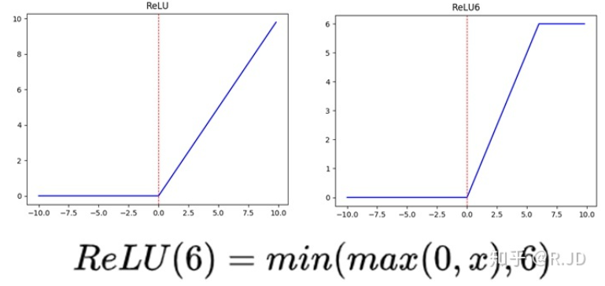
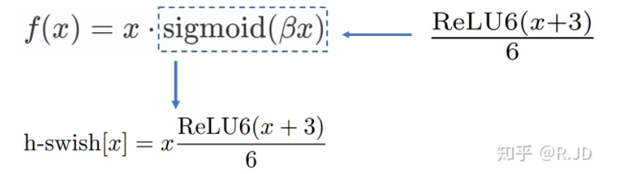
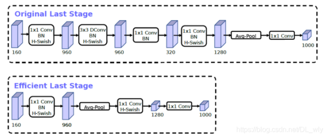

# 简历项目汇总

## **高频元件识别项目：**

### 一、目的

针对智能精密加工工序流中，热处理后的工件因脱离托盘（射频芯片与托盘关联），导致无法完成后续的智能加工问题。开发出一款智能匹配系统；

### 二、参与内容

1. 基于PyQt5设计人机交互界面
   - 主要是在原有的基础上新增匹配后的热处理前界面

2. 基于Mysql、Navicat搭建高频工件数据库
   - 创建数据库
   - 对数据库增查操作；

3. 基于OpenCV对图像进行预处理
   - 提取长宽信息

4. 利用PyTorch搭建MoblieNet-V3神经网络，对预处理后的图像进行模型训练，利用训练后的模型进行高频工件分类。

   - 采用长、宽、高当作一种对纹理特征相似的工件做辅助识别（Top5）

   - 采用MobileNet-V3 （为什么？）

### 三、易问点

1. 主要难点

   种类繁多，类间差异小。经大量理论研究和实验得出：传统算法（采用的是模板匹配）由于其局限性，不能有效地提取具有**细微**差异工件间的**细小**特征差异，虽然在研究过程中获得了较高准确率的新的纹理特征提取算法，但其鲁棒性差，不具备适应各种复杂工况的能力，因此传统算法更适合提取工件尺寸特征，用于辅助分类算法得出分类结果。

1. 如何获取长宽高信息？

   - 长宽：对顶面视图进行放射变换以及求出最小外接矩形。将获得工件图像最小外接矩长宽特征的像素值与实际长宽特征的真实值进行转换，从而提取工件实际的长宽特征。
   - 高：此处设置了两个大小的灰度阈值，分别用于求取工件的顶面轮廓 1 和侧面轮廓 2，然 后将轮廓 1 和轮廓 2 的边缘信息重构到与原图等大的高度特征图像中（如图 7.36 所示）。获取工件的高度特征图向后，首先对高度特征图**中线以下的部分进行检索**，获取工件侧面上边缘的位置信息 D1和下边缘的位置信息 D2；然后用 D1减去 D2，从而获得工件的高度信息 H。

顶面尺寸特征：通过视角矫正和目标区域分割，将工件旋转到标准位置，并计算工件区域的最小外接矩，从而通过最小外接矩计算工件的长宽特征；②侧面尺寸特征：侧面尺寸特征主要为高度特征，通过目标区域分割将 工件从复杂的背景信息中分割出来，然后对分割出来的工件图像进行两次不同阈值的凸运算，得到工件的边框特征图，最后利用得到的工件边框特征图来计算工件的高度特征。

1. 问点：v1、v2、v3的区别？

   1）**MobileNetV1就是把VGG中的标准卷积层换成深度可分离卷积 、relu6。**主要思路就是深度可分离卷积的堆叠。**（可大大减少模型的参数）**

   **深度可分离卷积**就是**将普通卷积拆分成为一个深度卷积和一个逐点卷积**。

   **ReLU6作为非线性激活函数，在低精度计算下具有更强的鲁棒性**。（有人说不是指的float16，而是指的定点运算）

   

   

   

   ==问题：== 深度卷积部分的卷积核比较容易训废掉：训完之后发现深度卷积训出来的卷积核有不少是空的;

   ==原因：== **对低维度做ReLU运算，很容易造成信息的丢失。而在高维度进行ReLU运算的话，信息的丢失则会很少。**

   2）**MobileNetV2** 

   - 引入了bottleneck结构。
   - 将bottleneck结构变成了纺锤型，即resnet是先缩小为原来的1/4，再放大，他是放大到原来的6倍，再缩小。
   - 并且去掉了Residual Block最后的ReLU6（**换成线性的**）

​     MobilenetV2的主要改进是Linear Bottleneck 和 Inverted Residuals. 在MobilenetV2的网络设计中，作者除了继续使用深度可分离卷积结构之外，还使用了Expansion layer和 Projection layer。

MobileNetV2 是 先升维 (6倍)、卷积、再降维

**为什么这么做？**我们知道，如果tensor维度越低，卷积层的乘法计算量就越小。那么如果整个网络都是低维的tensor，那么整体计算速度就会很快。然而，如果只是使用低维的tensor效果并不会好。如果卷积层的过滤器都是使用低维的tensor来提取特征的话，那么就没有办法提取到整体的足够多的信息。所以，如果提取特征数据的话，我们可能更希望有高维的tensor来做这个事情，V2就设计这样一个结构来达到平衡。先通过Expansion layer来扩展维度，之后在用深度可分离卷积来提取特征，之后使用Projection layer来压缩数据，让网络从新变小。因为Expansion layer 和 Projection layer都是有可以学习的参数，所以整个网络结构可以学习到如何更好的扩展数据和从新压缩数据。

3）MobileNetV3**神经结构搜索（NAS）出来的**

- 网络的架构基于NAS实现的MnasNet（效果比MobileNetV2好）
- 引入MobileNetV1的深度可分离卷积
- 引入MobileNetV2的具有线性瓶颈的倒残差结构
- 引入基于squeeze and excitation结构的轻量级注意力模型(SE)
- 使用了一种新的激活函数h-swish(x)
- 网络结构搜索中，结合两种技术：资源受限的NAS（platform-aware NAS）与NetAdapt
- 修改了MobileNetV2网络端部最后阶段 （因为引入了二外的计算开销与延时）

​    

2. 如何搭建的v3网络？

开始根据查阅论文，网络开源代码自己搭建网络，后面发现直接可以用torchvision.models (视觉模型库) 调用

3. large 和 small 的区别？

主要的区别是通道数的变化与bneck的次数。

## 花椒项目

### 一、目的

开发一套基于视觉的花椒智能采摘系统

### 二、参与内容

（1）基于YOLOv5实现近景花椒簇的目标检测，以及枝干分割；

（2）通过目标检测和枝干分割的结果估算采摘点；

（3）对改进的网络模型压缩以便轻量化部署；

（4）基于PyQt5设计人机交互界面。

### 三、易问点

1. 如何对近景花椒簇进行目标检测，以及枝干分割的？
2. 如何估算采摘点？
3. 模型压缩怎么做的？
4. 遇到的问题？

## 旺仔项目

### 一、目的

对旺仔牛奶包装上生产日期的**缺陷字符**检测

### 二、参与内容

（1）通过采集图像分割成单个点阵字符；

（2）对分割好的点阵字符进行分类；因字符分割不完整、墨点污染等缺陷导致分类准确率不高的问题，提出采用基于余弦相似度的分类算法提高分类准确率。。

### 三、易问点

1. 如何分割图像？
2. 为什么选择余弦相似度而不采用其它的分类算法？

## 工具集项目

### 一、目的

开发面向核电企业的智能决策网站

### 二、参与内容

（1）协作开发前端页面；

（2）基于Mysql、Navicat搭建数据库；

（3）基于SSM或Spring Boot开发后端业务；

（4）实现前后端交互。

### 三、易问点

无